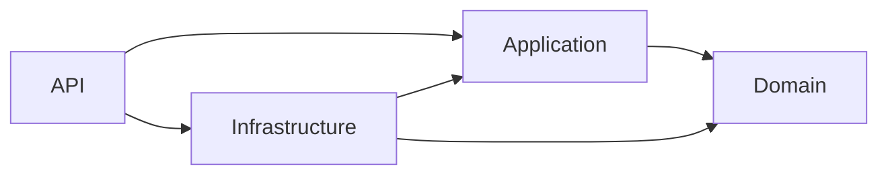
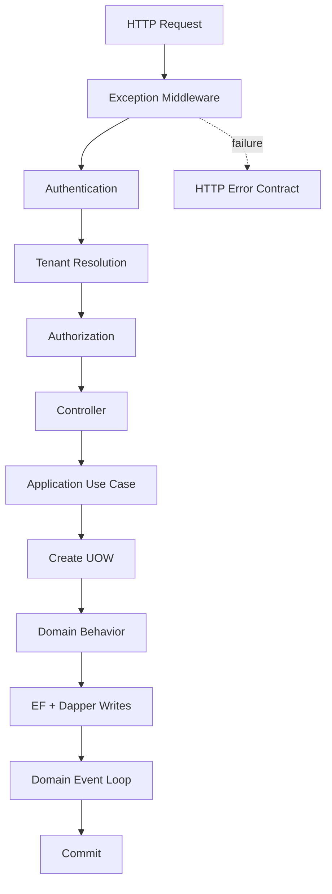

# Food Delivery Backend Foundation Design

Case study này thiết kế technical foundation cho một backend đặt món multi-tenant. Mục tiêu không phải implement toàn bộ nghiệp vụ `Shop`, `HangHoa` hay `DonHang`, mà tạo những boundaries có thể kiểm chứng để business modules được thêm sau mà không phải đảo lại dependency, transaction ownership và tenant isolation.

## Design constraints

Hệ thống dự kiến có các đặc điểm:

- Một `Tenant` sở hữu nhiều `Shop`.
- Catalog có dữ liệu dùng chung cấp Tenant và dữ liệu tùy chỉnh theo Shop.
- Đơn hàng thuộc một Shop nhưng vẫn phải isolate theo Tenant.
- Backend có thể dùng EF Core cho Aggregate writes và Dapper cho SQL cần kiểm soát rõ.
- Domain Events xử lý phản ứng nội bộ; external integration sẽ xuất hiện sau.
- Giai đoạn đầu dùng một application process và một MySQL database.

Các constraints này chưa đủ để tạo business entities đầy đủ. Chúng đủ để quyết định những foundation khó thay đổi về sau: dependency direction, tenant context, transaction ownership và concurrency contract.

## Decision 1 — Modular Monolith

### Vấn đề

Business có nhiều boundary dự kiến, nhưng chưa có số liệu chứng minh cần deploy hoặc scale độc lập.

### Quyết định

```text
ASP.NET Core API
├── Application use cases
├── Domain modules
├── Infrastructure adapters
└── một MySQL database
```

Module là code/business boundary trong cùng deployment. Local transaction giữ consistency mà không cần distributed protocol.

### Vì sao không dùng microservices ngay?

Microservices thêm network failure, message delivery, tracing, deployment và data consistency cost. Khi chưa có team ownership hoặc workload độc lập, chúng không giải quyết bottleneck đang tồn tại.

### Tín hiệu nâng cấp

Tách service khi một module có release cycle, team ownership, compliance boundary hoặc scale profile độc lập đủ lớn để bù chi phí distributed system.

## Decision 2 — Dependency hướng vào Domain



### Vấn đề

Nếu Domain biết EF Core hoặc Controller chứa business rule, thay transport/persistence làm rule bị sửa và duplicate.

### Quyết định

- Domain giữ state và invariant.
- Application điều phối use case và sở hữu ports cần thiết.
- Infrastructure implement database/external details.
- API map HTTP, authentication, middleware và DI.

### Business placement examples

| Logic | Layer | Lý do |
|---|---|---|
| `DonHang.XacNhan()` | Domain | Transition phải đúng với mọi caller |
| `TaoDonHangHandler` | Application | Điều phối Shop, menu, tồn và commit |
| Atomic SQL trừ tồn | Infrastructure | SQL/provider/index là persistence detail |
| Resolve Tenant từ subdomain | API | Host là HTTP concern |

## Decision 3 — Abstraction thuộc nơi cần capability

### Vấn đề

Application cần commit một use case nhưng không nên biết cách tạo `MySqlConnection` và EF options.

### Quyết định

`IUnitOfWorkFactory`, `IUnitOfWork`, `ITenantContext` và `IDomainEventDispatcher` nằm trong Application. Concrete implementation nằm ở Infrastructure/API.

```csharp
public interface IUnitOfWorkFactory
{
    Task<IUnitOfWork> CreateAsync(CancellationToken cancellationToken = default);
}
```

Interface không thuộc nơi có implementation; nó thuộc nơi định nghĩa capability cần dùng. Nếu interface đặt trong Infrastructure, Application phải reference low-level project và Dependency Inversion bị phá.

### Giới hạn

Không tạo interface cho mọi class. Factory chỉ có lý do vì creation gồm nhiều resource và failure cleanup. Một service chỉ cần `new` không cần Factory.

## Decision 4 — Một owner cho EF và Dapper transaction

### Business failure

Tạo đơn bằng EF, trừ tồn bằng Dapper. Nếu hai tool dùng hai connection:

```text
Dapper commit tồn
→ EF insert đơn lỗi
→ tồn giảm nhưng không có đơn
```

### Quyết định

Factory tạo đúng một connection, một transaction và một DbContext được enlist vào transaction đó:

```csharp
connection = new MySqlConnection(connectionString);
await connection.OpenAsync(cancellationToken);
transaction = await connection.BeginTransactionAsync(cancellationToken);

var options = new DbContextOptionsBuilder<ApplicationDbContext>()
    .UseMySql(connection, serverVersion)
    .Options;

var dbContext = new ApplicationDbContext(options);
await dbContext.Database.UseTransactionAsync(transaction, cancellationToken);
```

Dapper write nhận đúng hai object:

```csharp
var command = new CommandDefinition(
    sql,
    parameters,
    transaction: unitOfWork.Transaction,
    cancellationToken: cancellationToken);

await unitOfWork.Connection.ExecuteAsync(command);
```

### Vấn đề được giải quyết

EF, Dapper và handler writes cùng một local atomic boundary. UOW là owner duy nhất của commit, rollback và dispose.

### Phương án bị loại

- `TransactionScope`: boundary ẩn và chưa cần distributed enlistment.
- Generic Repository: không giải connection ownership.
- Dapper connection factory riêng trong write use case: tạo session thứ hai.
- Nested UOW: commit ownership không còn rõ.

## Decision 5 — Commit Domain Events trước database commit

### Vấn đề

Aggregate raise event; handler có thể ghi lịch sử hoặc thay đổi Aggregate khác trong cùng database. Những writes đó phải rollback cùng use case.

### Quyết định

```text
SaveChanges
→ dispatch pending Domain Events
→ SaveChanges handler changes
→ lặp nếu có nested events
→ commit transaction
→ clear events
```

Events chỉ clear sau commit. Nếu handler lỗi, transaction rollback và event vẫn còn trên tracked Aggregate.

### External side effect

Email, webhook và broker không rollback theo database. Không gọi chúng trong transaction. Khi có consumer thật, handler ghi Outbox row trong transaction; worker publish sau commit.

## Decision 6 — Tenant isolation là end-to-end boundary

### Request resolution

```text
Authentication
→ resolve Tenant từ trusted claim hoặc subdomain
→ set scoped TenantContext
→ Authorization
→ use case
```

Client-supplied `tenantId` không phải authorization proof.

### Data protection

```sql
SELECT *
FROM DonHangs
WHERE TenantId = @TenantId
  AND ShopId = @ShopId;
```

Tenant-owned row giữ `TenantId` trực tiếp khi cần filter/index. EF global filter là safety net; Dapper, cache và background jobs vẫn phải mang tenant scope.

### Business failures được ngăn

- Report Dapper quên Tenant predicate.
- Cache key `shop:10` collision giữa hai Tenant.
- `UNIQUE(MaHangHoa)` chặn mã giống nhau ở Tenant khác.
- Background job chỉ mang `DonHangId` và resolve nhầm Tenant.

### Database topology

Shared schema được chọn vì migration và transaction đơn giản. Database-per-tenant chỉ thêm khi compliance, backup isolation hoặc noisy-neighbor evidence yêu cầu.

## Decision 7 — Chọn concurrency mechanism theo invariant

Không có một “concurrency pattern” dùng cho mọi race.

| Failure | Invariant | Mechanism |
|---|---|---|
| Hai nhân viên ghi đè cùng đơn | Update phải dựa trên version đã đọc | Optimistic token |
| Hai khách đặt món cuối | Tồn không âm | Atomic conditional UPDATE |
| Workflow cần đọc rồi khóa row nóng | Quyết định dựa trên current state | `SELECT ... FOR UPDATE` |
| Subdomain không trùng | Global uniqueness | Unique constraint |
| Nhiều local writes | Cùng commit/rollback | Shared UOW transaction |

### Optimistic token

Mọi Aggregate Root có `ConcurrencyToken`. EF đưa old token vào `UPDATE WHERE`; affected rows bằng `0` tạo `DbUpdateConcurrencyException` và API trả `409`.

Token không sửa overselling khi hai request tạo hai đơn khác nhau. Tồn kho dùng atomic SQL:

```sql
UPDATE TonKho
SET SoLuong = SoLuong - @SoLuongDat
WHERE TenantId = @TenantId
  AND ShopId = @ShopId
  AND HangHoaId = @HangHoaId
  AND SoLuong >= @SoLuongDat;
```

## Decision 8 — Không override MySQL isolation khi chưa có evidence

InnoDB mặc định `REPEATABLE READ`. Base dùng server/session default và production phải kiểm tra configuration thực tế.

Đổi toàn hệ thống sang `SERIALIZABLE` không giải duplicate HTTP request, external side effect hoặc tenant leak; nó có thể tăng blocking. Isolation chỉ thay khi workload và invariant chứng minh cần behavior khác.

Index cũng là concurrency decision. `UPDATE` khóa index records được scan; thiếu composite index làm lock footprint rộng hơn và tăng contention.

## Runtime flow



Read-only query không mặc định mở write UOW transaction. Query dùng projection/`AsNoTracking` hoặc Dapper read model theo shape cần trả.

## Failure matrix

| Failure point | Expected result |
|---|---|
| Connection open | Không leak resource |
| Begin transaction | Dispose connection |
| Dapper write | Rollback khi scope kết thúc |
| EF SaveChanges | Rollback Dapper writes |
| Event handler | Rollback toàn bộ local writes |
| Commit | Không clear event nếu thất bại |
| Caller quên commit | Dispose tự rollback |
| Concurrent Aggregate edit | `409 Conflict` |
| External provider timeout | Không giữ database transaction; dùng durable workflow |

## Design discipline

Foundation chỉ thêm mechanism có invariant hoặc failure mode rõ:

```text
Không Generic Repository khi EF/query ports đã đủ.
Không message broker khi chưa có external consumer.
Không Outbox table/worker khi chưa có side effect cần durability.
Không automatic retry khi operation chưa idempotent.
Không cache khi chưa đo read bottleneck.
Không microservice khi chưa có scale/team boundary.
```

Đây không phải trì hoãn kiến trúc. Mỗi extension point đã có trigger rõ, nhưng implementation chỉ xuất hiện khi có consumer thật để kiểm chứng contract.

## Design review checklist

1. Business invariant nào không được sai?
2. Source of truth nằm ở đâu?
3. Hai request xen kẽ thế nào?
4. Transaction boundary bao những writes nào?
5. Có external side effect nằm trong transaction không?
6. Tenant scope đi qua request, SQL, cache và job thế nào?
7. Conflict cần token, atomic SQL, lock hay unique constraint?
8. Index có thu hẹp scan/lock footprint không?
9. Failure nào được trả cho caller và failure nào cần recovery?
10. Component mới giải quyết failure/bottleneck hiện hữu nào?
11. Phương án đơn giản hơn đã bị loại vì lý do gì?
12. Metric hoặc business signal nào buộc phải nâng cấp thiết kế?

Một design có thể bảo vệ được các câu trả lời này thì code thường ngắn hơn. Nếu chưa trả lời được, thêm pattern chỉ làm failure mode khó nhìn hơn.
