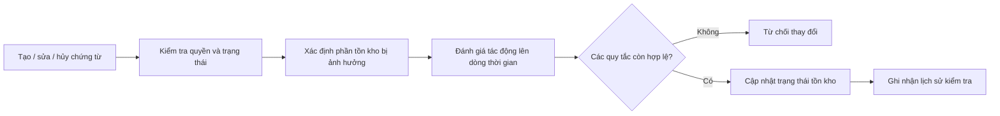
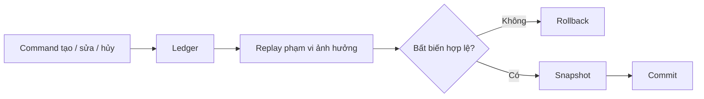
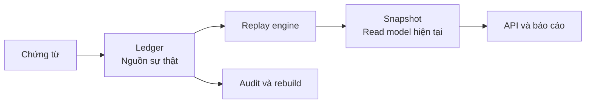
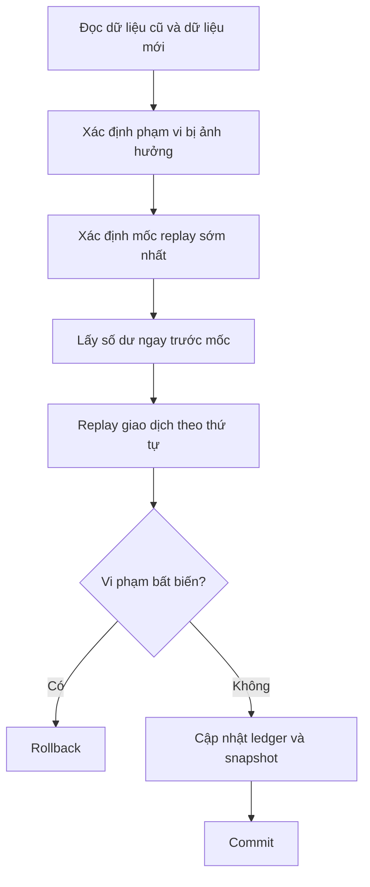

# Tính lại tồn kho khi giao dịch có thể sửa, hủy và ghi lùi ngày

- **Bối cảnh:** Nhân viên kho có thể bổ sung, sửa hoặc hủy chứng từ đã phát sinh trong quá khứ.
- **Rủi ro:** Một thay đổi trong lịch sử có thể làm sai số lượng tồn, giá vốn và các báo cáo phía sau.
- **Mục tiêu:** Bảo đảm số tồn có thể giải thích, kiểm tra và tính lại mà vẫn đáp ứng tốc độ đọc của hệ thống vận hành.
- **Quyết định chính:** Chọn cách duy trì số dư hiện tại khi timeline giao dịch không còn chỉ được bổ sung ở cuối.

---

## 1. Bối cảnh và phạm vi

### 1.1. Bối cảnh nghiệp vụ

Hệ thống quản lý kho thường phải trả lời hai nhóm câu hỏi.

**Trạng thái hiện tại**

- Một hàng hóa còn bao nhiêu trong từng kho?
- Số lượng khả dụng của từng lô là bao nhiêu?
- Giá vốn hiện tại của hàng hóa là bao nhiêu?

**Lịch sử và đối soát**

- Số tồn thay đổi từ chứng từ nào?
- Tại thời điểm cuối ngày hôm trước, số dư là bao nhiêu?
- Vì sao giá vốn hôm nay khác giá vốn trước khi sửa chứng từ?
- Snapshot hiện tại có khớp với toàn bộ lịch sử giao dịch không?

Nếu chứng từ chỉ được tạo theo đúng thứ tự thời gian và không bao giờ thay đổi sau khi hoàn tất, số tồn hiện tại có thể được duy trì bằng cách cộng hoặc trừ từng giao dịch mới.

Thực tế vận hành thường phức tạp hơn:

- Nhân viên nhập chứng từ hôm nay nhưng chọn ngày nghiệp vụ là hôm qua.
- Chứng từ hoàn tất bị sửa số lượng, đơn giá hoặc hàng hóa.
- Một dòng hàng hoặc lô bị xóa khỏi chứng từ.
- Chứng từ cũ bị hủy sau khi đã có nhiều giao dịch phía sau.
- Hai người đồng thời xử lý cùng một hàng hóa trong cùng kho.

Khi đó, số tồn hiện tại không còn là một giá trị độc lập. Nó là kết quả của toàn bộ chuỗi giao dịch theo thứ tự nghiệp vụ.

### 1.2. Actor và workflow

| Actor | Nhu cầu | Rủi ro cần kiểm soát |
|---|---|---|
| Nhân viên kho | Tạo, sửa, hủy chứng từ | Thay đổi lịch sử ngoài dự kiến |
| Kế toán | Theo dõi giá vốn và đối soát | Giá vốn thay đổi nhưng không giải thích được |
| Quản lý | Xem tồn hiện tại và báo cáo | Snapshot và lịch sử không khớp |
| Hệ thống bán hàng | Kiểm tra tồn trước khi xuất | Hai request cùng sử dụng một số dư |
| Vận hành hệ thống | Khôi phục khi dữ liệu lệch | Không có nguồn dữ liệu để rebuild |

Workflow được phân tích trong tài liệu:



Sơ đồ chưa mô tả database, transaction hoặc thuật toán. Nó chỉ xác định trách nhiệm nghiệp vụ của command.

### 1.3. Mục tiêu thiết kế

Giải pháp cần đáp ứng:

1. Tính đúng số lượng và giá vốn sau thao tác tạo, sửa hoặc hủy.
2. Phát hiện âm kho tại đúng thời điểm phát sinh.
3. Giữ được lịch sử để audit và đối soát.
4. Dựng lại trạng thái hiện tại từ lịch sử giao dịch.
5. Ngăn hai thao tác đồng thời làm mất hoặc ghi đè kết quả.
6. Trả tồn hiện tại đủ nhanh cho màn hình và API vận hành.
7. Có lộ trình tối ưu khi dữ liệu và tải tăng.

### 1.4. Ngoài phạm vi

Các nội dung sau không được giải quyết đầy đủ trong thiết kế chính:

- FIFO và quản lý cost layer.
- Giữ chỗ tồn kho.
- Điều chuyển hàng giữa nhiều hệ thống độc lập.
- Đồng bộ hai chiều với ERP.
- Khóa kỳ kế toán.
- Forecast và planning.

Chúng được phân tích ở phần giới hạn vì có thể làm thay đổi data model và consistency model.

### 1.5. Giả định nghiệp vụ

| Quyết định | Giả định |
|---|---|
| Phạm vi số lượng | Theo đơn vị, kho, hàng hóa và lô |
| Phạm vi giá vốn | Theo đơn vị, kho và hàng hóa |
| Thứ tự | Ngày nghiệp vụ, thời điểm tạo, mã giao dịch |
| Âm kho | Không cho phép tại bất kỳ điểm nào trong timeline |
| Giá vốn | Bình quân gia quyền liên hoàn |
| Sửa/hủy | Được phép và phải giữ audit |
| Kết quả command | Phải đúng ngay sau khi hoàn tất |
| Trạng thái đọc | Tồn hiện tại cần truy vấn nhanh |

Các giả định là input của quyết định kiến trúc. Một thay đổi về quy tắc giá vốn, âm kho hoặc độ trễ chấp nhận được có thể dẫn đến phương án khác.

---

## 2. Phân tích vấn đề

### 2.1. Sự thay đổi của mô hình

Với timeline chỉ được bổ sung ở cuối:

```text
Tồn mới = Tồn hiện tại + Biến động mới
```

Mọi giao dịch trước đó đã ổn định. Giao dịch mới không thay đổi kết quả lịch sử.

Khi một giao dịch được chèn vào quá khứ:

```text
Số dư tại giao dịch tiếp theo
-> thay đổi số dư đầu vào của giao dịch sau nữa
-> tiếp tục lan truyền tới hiện tại
```

Ảnh hưởng này đặc biệt rõ với giá vốn bình quân liên hoàn, vì giá vốn của mỗi lần nhập phụ thuộc vào số lượng và giá vốn ngay trước nó.

Do đó, bài toán chuyển từ:

> Cập nhật một giá trị hiện tại.

sang:

> Tính kết quả của một chuỗi biến động có thứ tự và có thể thay đổi ở bất kỳ vị trí nào.

### 2.2. Kịch bản tối thiểu

Timeline ban đầu:

| Thời điểm | Nghiệp vụ | Số lượng | Đơn giá | Tồn cuối | Giá vốn |
|---|---|---:|---:|---:|---:|
| 08:00 | Nhập | +100 | 10.000 | 100 | 10.000 |
| 10:00 | Xuất | -60 | — | 40 | 10.000 |
| 15:00 | Nhập | +60 | 16.000 | 100 | 13.600 |

Lúc 16:00, nhân viên bổ sung một giao dịch nhập đã xảy ra lúc 09:00:

```text
Nhập 100 đơn vị với đơn giá 14.000
```

Nếu giao dịch được cộng vào snapshot hiện tại:

```text
Số lượng cuối = 200
Giá vốn = 13.800
```

Nếu giao dịch được đặt vào đúng timeline:

| Thời điểm | Nghiệp vụ | Tồn cuối | Giá vốn |
|---|---|---:|---:|
| 08:00 | Nhập 100 × 10.000 | 100 | 10.000 |
| 09:00 | Nhập 100 × 14.000 | 200 | 12.000 |
| 10:00 | Xuất 60 | 140 | 12.000 |
| 15:00 | Nhập 60 × 16.000 | 200 | 13.200 |

Số lượng cuối giống nhau nhưng giá vốn khác nhau. Cập nhật snapshot bằng delta không thể tái tạo tác động lên các giao dịch phía sau.

### 2.3. Các failure scenario

| Scenario | Kết quả nếu chỉ cập nhật snapshot |
|---|---|
| Ghi lùi ngày | Giá vốn hoặc số dư lịch sử sai |
| Sửa số lượng giao dịch cũ | Các giao dịch phía sau giữ số dư cũ |
| Xóa một dòng khi sửa chứng từ | Ảnh hưởng cũ còn lại trong snapshot |
| Hủy giao dịch nhập cũ | Có thể làm một lần xuất phía sau âm kho |
| Hủy giao dịch cuối | Snapshot không có dòng tiếp theo để tự cập nhật |
| Hai request cùng xuất kho | Cả hai cùng kiểm tra trên một số dư cũ |
| Snapshot bị hỏng | Không có cách chứng minh hoặc dựng lại |

Ví dụ concurrent write:

```text
Tồn hiện tại: 10

Request A xuất 8 -> hợp lệ trên số dư 10
Request B xuất 7 -> hợp lệ trên số dư 10
```

Nếu hai request cùng commit, tổng lượng xuất là `15`. Vấn đề này vẫn tồn tại ngay cả khi không cho ghi lùi ngày; concurrency là một chiều phân tích riêng.

### 2.4. Các bất biến

Giải pháp phải bảo vệ các điều kiện sau sau mỗi lần commit:

| Bất biến | Ý nghĩa |
|---|---|
| Số dư không âm | Không có điểm nào trong timeline có tồn cuối nhỏ hơn 0 |
| Thứ tự xác định | Hai lần tính lại cùng dữ liệu tạo cùng kết quả |
| Snapshot khớp lịch sử | Snapshot bằng kết quả cuối của các giao dịch còn hiệu lực |
| Tổng và chi tiết khớp | Tồn hàng hóa bằng tổng tồn các lô |
| Không mất ghi | Hai command cùng phạm vi không ghi đè kết quả của nhau |
| Có thể khôi phục | Trạng thái hiện tại dựng lại được từ lịch sử |

Các bất biến là tiêu chí đánh giá solution. Chúng tách yêu cầu nghiệp vụ khỏi công nghệ triển khai.

### 2.5. Decision driver

Năm yếu tố chi phối lựa chọn kiến trúc:

1. **Khả năng thay đổi lịch sử:** Có sửa, hủy hoặc ghi lùi ngày.
2. **Consistency:** Command phải trả kết quả chính xác ngay.
3. **Auditability:** Số dư cần giải thích và dựng lại.
4. **Read latency:** Tồn hiện tại được đọc thường xuyên.
5. **Affected volume:** Một command thường chỉ tác động một nhóm kho, hàng hóa và lô.

Những driver này loại bỏ một số phương án và tạo lợi thế cho một số phương án khác.

---

## 3. Đánh giá và lựa chọn giải pháp

### 3.1. Các phương án

**Cập nhật trực tiếp snapshot**

Mỗi command cộng hoặc trừ biến động vào số tồn hiện tại. Khi sửa hoặc hủy, hệ thống hoàn tác biến động cũ rồi áp dụng biến động mới.

Phương án có latency thấp và data model đơn giản. Nó phù hợp với hệ thống append-only, không cần historical valuation và không cho sửa giao dịch đã hoàn tất. Với yêu cầu của case này, nó không bảo vệ được tác động lan truyền trên timeline.

**Tính lại toàn bộ lịch sử**

Sau mỗi thay đổi, hệ thống đọc toàn bộ ledger của phạm vi và tính lại từ đầu.

Phương án dễ chứng minh correctness và phù hợp làm reference implementation, rebuild tool hoặc oracle trong test. Chi phí tăng theo toàn bộ lịch sử, khiến transaction và lock kéo dài khi dữ liệu lớn.

**Replay theo phạm vi ảnh hưởng**

Hệ thống xác định phần dữ liệu bị thay đổi, tìm mốc sớm nhất, lấy số dư ngay trước mốc và chỉ tính lại đoạn timeline phía sau.

Phương án giữ được correctness của full rebuild nhưng giới hạn chi phí theo affected range. Độ phức tạp nằm ở việc xác định đầy đủ phạm vi cũ/mới, chọn mốc replay và kiểm soát writer đồng thời.

**Projection bất đồng bộ**

Command ghi lịch sử và phát job hoặc event. Worker cập nhật snapshot sau.

Phương án giảm latency tại API và cho phép batch nhiều lần replay. Đổi lại, snapshot tạm thời cũ và không thể được dùng để chặn âm kho nếu không có write model khác bảo vệ invariant.

### 3.2. So sánh trade-off

| Tiêu chí | Cập nhật trực tiếp | Tính lại toàn bộ | Replay theo phạm vi | Projection bất đồng bộ |
|---|---:|---:|---:|---:|
| Append-only | Tốt | Tốt | Tốt | Tốt sau khi xử lý |
| Ghi lùi ngày | Không đầy đủ | Tốt | Tốt | Tốt nhưng có độ trễ |
| Audit và rebuild | Yếu | Tốt | Tốt | Tốt |
| Write latency | Thấp | Tăng theo lịch sử | Tăng theo affected range | Thấp tại API |
| Read freshness | Ngay | Ngay | Ngay | Eventual |
| Độ phức tạp | Thấp ban đầu | Thấp | Trung bình | Cao |
| Yêu cầu vận hành | Thấp | Thấp | Trung bình | Cao |
| Phù hợp với case | Không | Chỉ khi dữ liệu nhỏ | **Có** | Không |

### 3.3. Quyết định

Thiết kế chọn **replay đồng bộ theo phạm vi ảnh hưởng**.

| Decision driver | Cách phương án đáp ứng |
|---|---|
| Lịch sử có thể thay đổi | Replay tính lại toàn bộ đoạn bị tác động |
| Strong consistency | Validation và cập nhật hoàn tất trong command |
| Auditability | Ledger giữ toàn bộ biến động |
| Read latency | Snapshot phục vụ truy vấn hiện tại |
| Affected volume | Chỉ replay kho, hàng hóa và lô liên quan |



Đây là quyết định theo context:

- Nếu lịch sử không thể thay đổi, cập nhật trực tiếp đơn giản hơn.
- Nếu snapshot được phép trễ, projection bất đồng bộ có thể phù hợp hơn.
- Nếu lịch sử luôn nhỏ, full rebuild có thể đủ tốt và dễ bảo trì hơn.

---

## 4. Thiết kế hệ thống

### 4.1. Kiến trúc khái niệm

Hệ thống tách hai vai trò dữ liệu:



**Ledger**

- Lưu mọi biến động có ảnh hưởng đến tồn kho.
- Giữ thứ tự nghiệp vụ.
- Không mất lịch sử khi chứng từ bị sửa hoặc hủy.
- Cho phép dựng lại số dư.

**Snapshot**

- Giữ tồn và giá vốn hiện tại.
- Tối ưu cho read path.
- Có thể xóa và dựng lại.
- Không phải nguồn sự thật thứ hai.

**Replay engine**

- Xác định số dư đầu vào.
- Xử lý giao dịch theo thứ tự.
- Kiểm tra bất biến.
- Tạo trạng thái snapshot mới.

### 4.2. Luồng xử lý command

Tạo, sửa và hủy sử dụng cùng một workflow.



**Dữ liệu trước và sau thay đổi**

| Command | Dữ liệu cũ | Dữ liệu mới |
|---|---|---|
| Tạo | Rỗng | Nội dung chứng từ mới |
| Sửa | Ledger hiện tại của chứng từ | Nội dung sau chỉnh sửa |
| Hủy | Ledger đang có hiệu lực | Trạng thái hủy hoặc giao dịch đảo |

Dữ liệu cũ là bắt buộc khi sửa. Một hàng hóa hoặc lô bị xóa khỏi phiên bản mới vẫn cần được đưa vào phạm vi replay để loại bỏ ảnh hưởng cũ.

**Phạm vi bị ảnh hưởng**

Phạm vi là hợp của dữ liệu cũ và dữ liệu mới. Nếu chứng từ đổi hàng hóa `A` thành `B`, cả `A` và `B` đều phải được replay.

**Mốc replay**

Mốc replay là giao dịch sớm nhất xuất hiện trong dữ liệu cũ hoặc dữ liệu mới. Nếu chứng từ đổi từ ngày 01/07 sang 10/07, replay bắt đầu từ 01/07.

**Số dư khởi tạo**

Replay không cần bắt đầu từ đầu lịch sử. Số dư của giao dịch ngay trước mốc được sử dụng làm seed. Nếu không có giao dịch trước mốc, seed bằng zero state.

**Kết thúc timeline**

Nếu không còn giao dịch hiệu lực sau khi hủy, snapshot phải về zero state hoặc bị xóa theo convention đã chọn. Empty timeline là một trạng thái nghiệp vụ hợp lệ, không phải trường hợp lỗi.

### 4.3. Mô hình dữ liệu

Các trường chính của ledger:

```text
id
donViId
khoId
hangHoaId
loId
chungTuId
dongChungTuId
loaiBienDong
soLuongThayDoi
donGia
thoiDiemNghiepVu
thoiDiemTao
trangThai
tonCuoi
giaVon
phienBan
```

Các trường chính của snapshot:

```text
donViId
khoId
hangHoaId
loId
soLuongTon
giaVon
thuTuGiaoDichCuoi
phienBan
```

Khóa sắp thứ tự:

```text
thoiDiemNghiepVu -> thoiDiemTao -> id
```

Mọi query lấy seed, lấy affected entries và replay phải sử dụng cùng một phép so sánh. Chỉ so sánh ngày nghiệp vụ là không đủ khi nhiều giao dịch có cùng thời điểm.

### 4.4. Transaction và concurrency

Trong cùng transaction:

1. Claim hoặc lock các phạm vi bị ảnh hưởng.
2. Ghi thay đổi ledger.
3. Replay từ mốc của từng phạm vi.
4. Kiểm tra bất biến.
5. Cập nhật số dư trên ledger.
6. Upsert snapshot.
7. Commit.

Ba chiến lược concurrency thường được cân nhắc:

| Chiến lược | Ưu điểm | Hạn chế | Phù hợp |
|---|---|---|---|
| Khóa bi quan theo phạm vi | Một writer tại một thời điểm; dễ giải thích | Lock wait; nguy cơ deadlock | Conflict cao, cần kết quả đồng bộ |
| Optimistic concurrency | Không giữ logic lock trong toàn bộ processing | Conflict phải replay lại | Conflict hiếm, affected range ngắn |
| Queue theo phạm vi | Giảm concurrent writer; có thể batch | Tăng latency và yêu cầu vận hành | Tải ghi lớn, chấp nhận async |

Case này ưu tiên khóa bi quan theo phạm vi. Khi một command chạm nhiều phạm vi, lock phải được lấy theo một canonical order để giảm deadlock.

### 4.5. Vị trí thực thi replay

Logical design không yêu cầu replay phải nằm trong C# hoặc SQL.

| Vị trí | Ưu điểm | Hạn chế | Phù hợp |
|---|---|---|---|
| Application | Rule dễ đọc, test và thay đổi | Chuyển nhiều row; cần bulk write | Phạm vi nhỏ, rule thay đổi thường xuyên |
| Database | Sort, join và update tại nơi lưu dữ liệu | SQL nghiệp vụ khó bảo trì hơn | Phạm vi lớn, rule ổn định |
| Kết hợp | Database đọc/bulk write; application tính tuần tự | Coordination phức tạp hơn | Cần cân bằng maintainability và throughput |

Quyết định cần dựa trên:

- Số phạm vi trong một command.
- Số ledger row từ mốc replay.
- Payload qua network.
- Transaction duration và lock wait.
- p95/p99 command latency.
- Tần suất thay đổi phương pháp giá vốn.

---

## 5. Kiểm chứng và phát triển thiết kế

### 5.1. Test strategy

Reference implementation replay toàn bộ ledger được dùng làm oracle cho scoped replay.

**Kiểm thử theo kịch bản**

- Nhập và xuất ở cuối timeline.
- Giao dịch ghi lùi ngày.
- Sửa số lượng, đơn giá hoặc ngày nghiệp vụ.
- Xóa một dòng khỏi chứng từ.
- Hủy giao dịch trong lịch sử.
- Hủy giao dịch cuối timeline.
- Hủy giao dịch làm âm một điểm phía sau.
- Nhiều giao dịch có cùng thời điểm nghiệp vụ.

**Kiểm thử bất biến**

- Không có tồn cuối âm.
- Thứ tự replay xác định.
- Snapshot bằng giao dịch hiệu lực cuối cùng.
- Tổng tồn theo lô bằng tồn hàng hóa.
- Full rebuild và scoped replay tạo cùng kết quả.

**Property-based test**

1. Sinh một chuỗi nhập/xuất hợp lệ.
2. Thực hiện ngẫu nhiên thao tác tạo, sửa và hủy.
3. Chạy scoped replay.
4. Chạy full rebuild.
5. So sánh toàn bộ số dư và snapshot.

**Kiểm thử đồng thời**

- Hai request cùng xuất một phạm vi.
- Sửa và hủy cùng một chứng từ.
- Hai command chạm nhiều phạm vi theo thứ tự khác nhau.
- Conflict, deadlock và retry có giới hạn.

Concurrency test phải chạy trên database thật; mock không tái tạo được lock và isolation behavior.

### 5.2. Failure model

| Điểm lỗi | Trạng thái mong đợi |
|---|---|
| Validation thất bại | Ledger và snapshot không thay đổi |
| Ghi ledger thất bại | Transaction rollback |
| Replay phát hiện âm kho | Rollback và trả business error |
| Cập nhật snapshot thất bại | Ledger rollback cùng transaction |
| Deadlock | Rollback và retry có giới hạn |
| Client ngắt kết nối trước commit | Nhận cancellation và rollback |
| Client timeout sau commit | Retry được bảo vệ bằng idempotency |
| Process crash giữa transaction | Database rollback |
| Rebuild dừng giữa chừng | Có thể chạy lại từ ledger |

Client không nhận response không đồng nghĩa transaction chưa commit. Command cần idempotency nếu client, gateway hoặc SDK có thể retry.

### 5.3. Lộ trình tối ưu

Thiết kế được tối ưu theo từng bước, trong khi full rebuild tiếp tục làm chuẩn đối chiếu:

1. **Giới hạn phạm vi:** Chỉ đọc kho, hàng hóa và lô bị tác động.
2. **Seed trước mốc:** Chỉ replay đoạn timeline từ thay đổi sớm nhất.
3. **Append-only fast path:** Cập nhật incremental khi giao dịch chắc chắn nằm cuối.
4. **Checkpoint định kỳ:** Bắt đầu từ closing balance gần nhất.
5. **Projection bất đồng bộ:** Chỉ áp dụng khi consistency contract cho phép.

Các chỉ số cần theo dõi:

- Số ledger row được replay.
- Transaction duration.
- Lock wait và deadlock rate.
- p50/p95/p99 command latency.
- Database CPU và I/O.
- Conflict và retry rate.

### 5.4. Giới hạn

| Trường hợp | Phần cần mở rộng |
|---|---|
| FIFO | Cost layer và liên kết lần xuất với layer được tiêu thụ |
| Giữ chỗ tồn kho | Tách tồn thực tế, giữ chỗ và khả dụng |
| Điều chuyển kho | Bảo vệ hai phạm vi và trạng thái đang vận chuyển |
| Đóng kỳ | Cấm sửa lịch sử hoặc tạo adjustment ở kỳ hiện tại |
| Tích hợp ERP | System of record, ordering, duplicate và reconciliation |
| Lịch sử rất lớn | Partition, checkpoint hoặc giới hạn thời gian được sửa |
| Hàng hóa có tải cao | Giảm lock contention hoặc serialize theo partition |

Scoped replay giải quyết timeline trong một phạm vi có thể kiểm soát. Nó không tự giải quyết reservation lifecycle, distributed transaction hoặc ordering giữa nhiều hệ thống.

### 5.5. Checklist quyết định

**Bối cảnh**

- [ ] Actor và workflow đã được xác định.
- [ ] Mục tiêu và ngoài phạm vi đã rõ.
- [ ] Chính sách sửa, hủy và ghi lùi đã được xác nhận.
- [ ] Consistency requirement đã được thống nhất.

**Nghiệp vụ**

- [ ] Nguồn sự thật và snapshot được phân biệt.
- [ ] Phạm vi số dư được xác định.
- [ ] Thứ tự giao dịch có tie-breaker.
- [ ] Bất biến được mô tả bằng business language.
- [ ] Phương pháp giá vốn được xác nhận.

**Kiến trúc**

- [ ] Các phương án đã được so sánh bằng cùng decision driver.
- [ ] Dữ liệu cũ và mới cùng được đưa vào phạm vi ảnh hưởng.
- [ ] Mốc replay là mốc sớm nhất.
- [ ] Concurrent writer được kiểm soát.
- [ ] Snapshot có thể rebuild.

**Vận hành**

- [ ] Command retry có idempotency.
- [ ] Replay duration và row count được đo.
- [ ] Lock wait, deadlock và conflict được quan sát.
- [ ] Có runbook khi ledger và snapshot lệch.

### 5.6. Kết luận

Khi giao dịch chỉ được thêm ở cuối timeline, cập nhật trực tiếp snapshot là phương án có chi phí thấp và dễ duy trì.

Khi lịch sử có thể thay đổi, số tồn trở thành kết quả của một chuỗi giao dịch có thứ tự. Với yêu cầu strong consistency của case này, replay đồng bộ theo phạm vi ảnh hưởng giữ được tính đúng đắn của full rebuild mà không phải xử lý toàn bộ lịch sử sau mỗi command.

Quyết định được hình thành từ bối cảnh nghiệp vụ, failure scenario, bất biến và consistency requirement. Data model và thuật toán là kết quả của quá trình phân tích đó.
