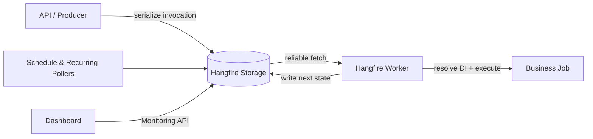
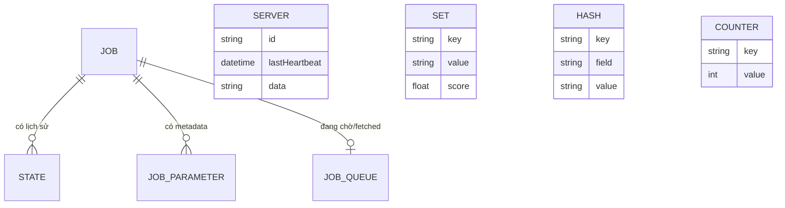
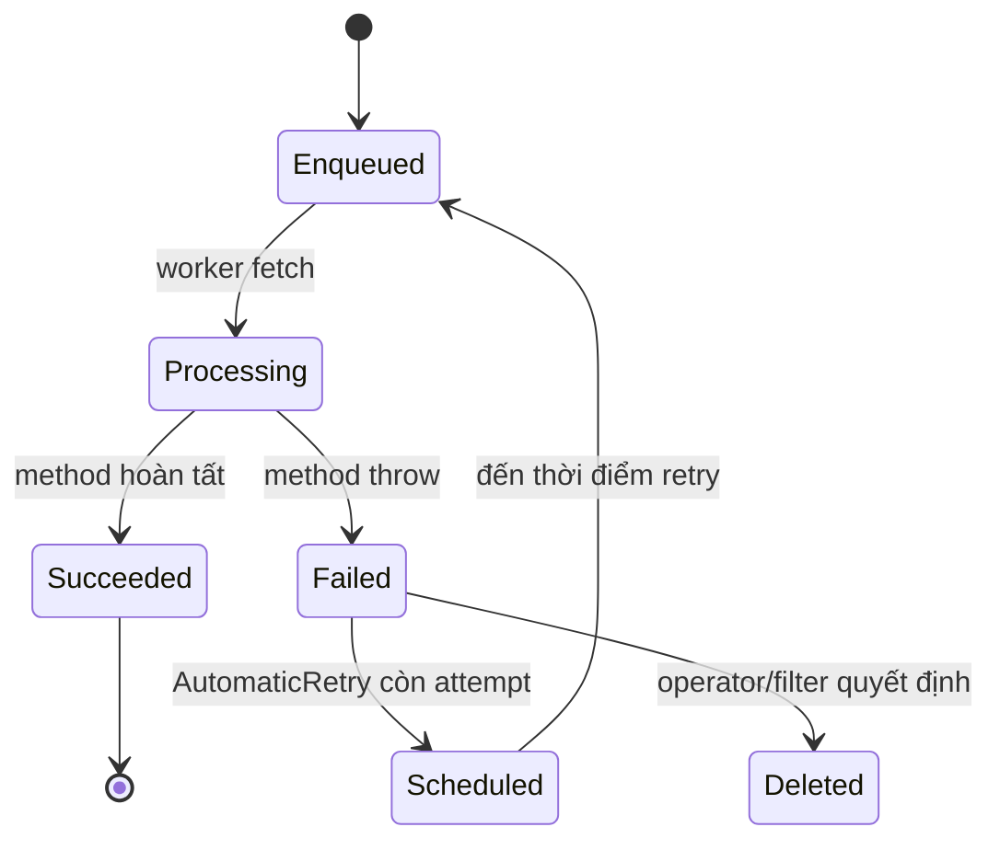
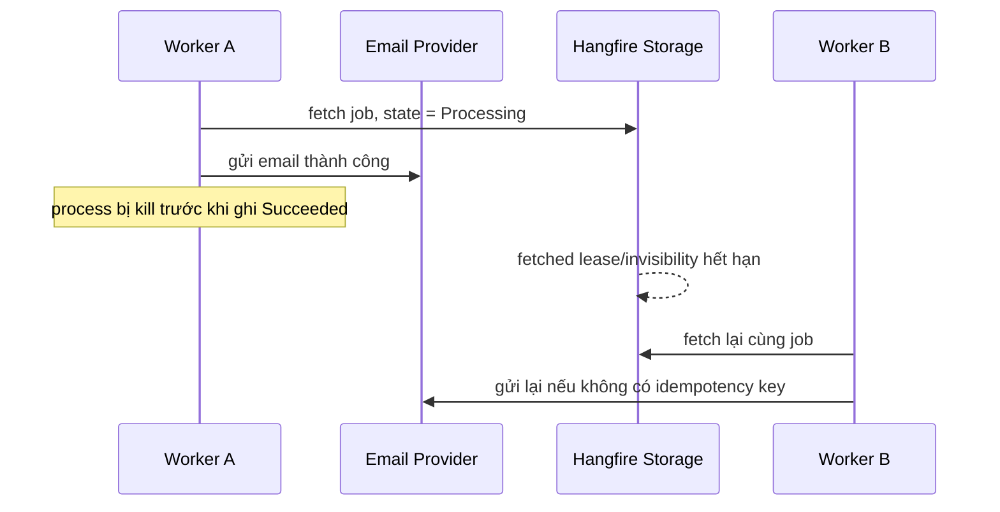
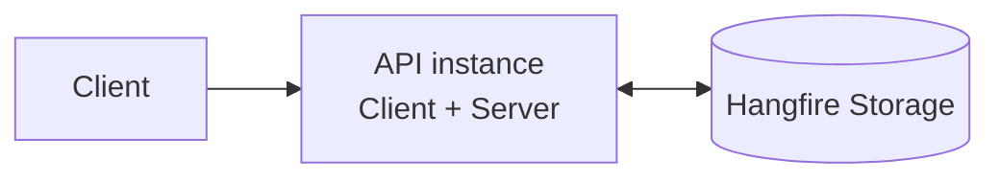
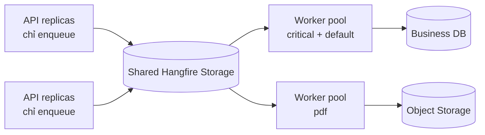
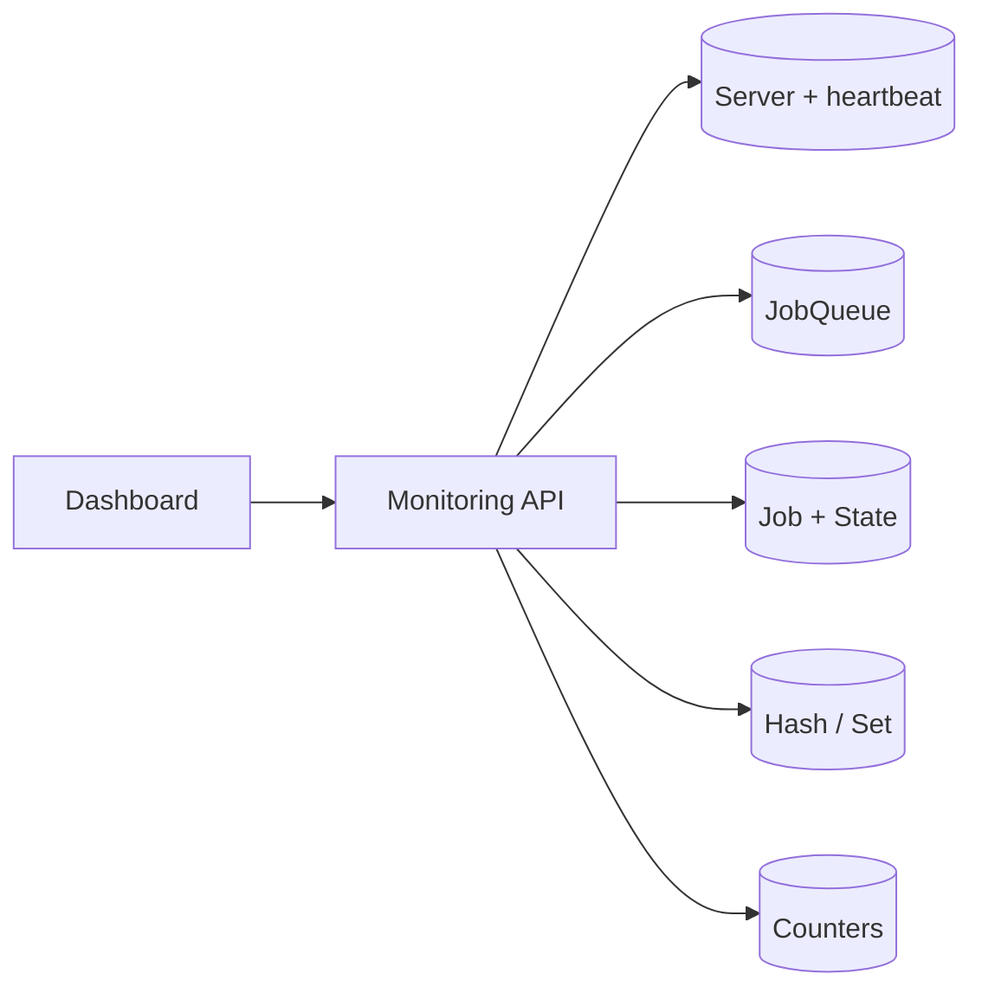
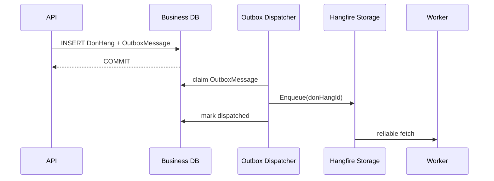
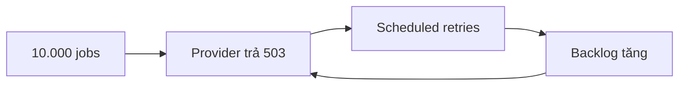

# Hangfire trong ASP.NET Core

**Hangfire** là thư viện thực thi các method .NET ở chế độ nền và lưu thông tin thực thi vào một storage bền vững. Một method được đưa vào Hangfire được gọi là **background job**. Job có thể tiếp tục được xử lý sau khi HTTP request kết thúc, ứng dụng khởi động lại hoặc một worker khác thay thế worker đã dừng.

Bài viết sử dụng một luồng xuyên suốt: xác nhận hồ sơ, sinh PDF và gửi email thông báo. Từ luồng này, bạn sẽ lần lượt cấu hình job đầu tiên, quan sát vòng đời, xử lý retry và đưa hệ thống lên production.

## Phạm vi và phiên bản

Các ví dụ giả định:

- ASP.NET Core trên .NET 6.
- Hangfire 1.8.
- MySQL làm job storage qua community provider `Hangfire.MySqlStorage`.
- Ứng dụng đã sử dụng dependency injection và `async`/`await`.

Các khái niệm về job, retry và idempotency thuộc Hangfire Core. Cơ chế dequeue, distributed lock, queue polling và schema database trong bài được mô tả theo `Hangfire.MySqlStorage`; không mặc định áp dụng option của provider khác.

## Bài toán xử lý nền

Giả sử API xác nhận hồ sơ phải sinh PDF, upload file và gửi email trước khi trả response:

```text
HTTP request
    ↓
Xác nhận hồ sơ
    ↓
Sinh PDF
    ↓
Upload file
    ↓
Gửi email
    ↓
HTTP response
```

Nếu toàn bộ luồng chạy trong request, thời gian phản hồi phụ thuộc vào mọi dịch vụ phía sau. Một lần timeout khi upload hoặc gửi email có thể làm request thất bại dù hồ sơ đã được xác nhận.

Hangfire tách công việc có thể xử lý sau khỏi request:

```text
HTTP request                         Hangfire Server
    ↓                                      ↓
Xác nhận hồ sơ                        Lấy job từ storage
    ↓                                      ↓
Tạo background job                   Sinh PDF và gửi email
    ↓                                      ↓
HTTP response                         Cập nhật trạng thái job
```

Việc tạo job không đồng nghĩa với việc nghiệp vụ chắc chắn hoàn thành đúng một lần. Hangfire cung cấp lưu trữ, điều phối và retry; business method vẫn phải chịu được việc bị gọi lại.

## Kiến trúc Hangfire

Hangfire có ba thành phần xử lý chính:

```text
┌───────────────────┐
│ Client            │
│ Tạo job           │
└─────────┬─────────┘
          │ serialize method và arguments
          ▼
┌───────────────────┐
│ Storage           │
│ Lưu job và state  │
└─────────┬─────────┘
          │ dequeue
          ▼
┌───────────────────┐
│ Server            │
│ Thực thi job      │
└───────────────────┘
```

**Client** nhận một expression mô tả type, method và arguments cần gọi. Client serialize mô tả này rồi ghi job vào storage; nó không gọi business method ngay tại thời điểm enqueue.

**Storage** lưu payload, queue, state, lịch retry, recurring job và thông tin server. Storage bền vững là điểm khác biệt quan trọng giữa Hangfire và một task chỉ tồn tại trong process.

**Server** chứa worker và các background process. Worker lấy job từ storage, resolve dependency, gọi method và ghi state mới. Các process khác chuyển delayed job đến queue, tạo lần chạy cho recurring job, cập nhật heartbeat và dọn dữ liệu hết hạn.

**Dashboard** là giao diện quan sát và quản trị, không phải một thành phần bắt buộc để job chạy.



## Mô hình bên trong: Hangfire không lưu một delegate đang chạy

Lệnh sau nhìn giống như truyền một delegate cho thread khác:

```csharp
var jobId = BackgroundJob.Enqueue<IGuiXacNhanDonHangJob>(
    job => job.ExecuteAsync(donHangId, CancellationToken.None));
```

Thực tế lambda được biểu diễn bằng một **expression tree**. Hangfire đọc expression để lấy mô tả lời gọi rồi serialize các thành phần có thể lưu trữ:

```text
Type      = IGuiXacNhanDonHangJob
Method    = ExecuteAsync
Arguments = ["donHangId", "CancellationToken placeholder"]
Queue     = default
CreatedAt = thời điểm enqueue
```

Hangfire không lưu object `job`, DI scope, `HttpContext`, connection hay transaction của request. Khi worker thực thi, nó deserialize mô tả, tạo scope mới, resolve `IGuiXacNhanDonHangJob` từ DI rồi mới gọi method.

Hệ quả thiết kế:

- Argument phải serialize được và nên nhỏ, ổn định. Truyền `donHangId`, không truyền toàn bộ `DonHangEntity`.
- Worker có thể chạy ở process, máy hoặc thời điểm khác nên không được dựa vào state trong memory của API.
- Đổi namespace, assembly, type, method signature hoặc DTO argument có thể làm job cũ không deserialize được.
- Job phải tự tải dữ liệu mới nhất và tự kiểm tra trạng thái nghiệp vụ trước khi tạo side effect.

### Transaction khi enqueue

Về mặt logic, tạo fire-and-forget job là một transaction storage:

```text
BEGIN
  INSERT Job(payload, arguments, createdAt, ...)
  INSERT State(jobId, name = 'Enqueued', data, ...)
  UPDATE Job SET stateName = 'Enqueued', stateId = ...
  INSERT JobQueue(jobId, queue = 'default')
COMMIT
```

Tên cột và câu lệnh cụ thể là implementation detail của storage provider. Điều cần hiểu là payload, state hiện tại, lịch sử state và queue item là các record khác vai trò nhưng được tạo nhất quán. `Enqueue` trả `jobId` sau khi storage chấp nhận transaction; điều đó chỉ xác nhận **ý định xử lý đã được lưu**, không xác nhận business method đã chạy.

Transaction trên database nghiệp vụ và transaction tạo Hangfire job mặc định là hai transaction khác nhau:

```text
COMMIT DonHang thành công
process chết
chưa kịp Enqueue GuiXacNhanDonHang
```

Hangfire storage bền vững không tự sửa được khoảng trống này. Nếu không được phép mất ý định xử lý, lưu `OutboxMessage` cùng transaction với `DonHang`, sau đó dispatcher mới enqueue job.

## Từ bảng storage đến một lần thực thi

Phần này mô tả schema logic của `Hangfire.MySqlStorage`. Tên bảng thật có thể có prefix theo `TablesPrefix`; code nghiệp vụ không được phụ thuộc trực tiếp vào schema này.

### Bản đồ schema MySQL



Các field trong sơ đồ chỉ biểu diễn ý nghĩa cần học, không phải schema migration để copy. Schema thật thuộc package và version của storage provider.

```text
Job 1 ─────── n State
 │               └─ lịch sử Enqueued/Processing/Succeeded/Failed/Scheduled
 ├────────── n JobParameter
 └────────── 0..1 JobQueue tại một thời điểm chờ worker

Server
 └─ heartbeat + queues + worker count của từng Hangfire Server

Set / Hash / List
 ├─ scheduled jobs
 ├─ recurring job definitions
 └─ dữ liệu coordination/monitoring theo abstraction của Hangfire

Counter / AggregatedCounter
 └─ số liệu phục vụ monitoring và Dashboard
```

| Object | Dữ liệu mang ý nghĩa gì | Khi nào thay đổi | Cách đọc khi điều tra |
| --- | --- | --- | --- |
| `Job` | Invocation payload, arguments, creation time và state hiện tại | Khi tạo job và mỗi lần đổi state | Trả lời “job nào, gọi method gì, state hiện tại là gì”. |
| `State` | Một bản ghi cho mỗi lần chuyển state cùng reason/data | Enqueue, fetch, success, failure, retry | Trả lời “job đã đi qua những bước nào và exception ở attempt nào”. |
| `JobQueue` | Queue item và thông tin worker đã fetch | Khi enqueue, fetch, complete hoặc recovery | Trả lời “job có đang chờ worker hay đã được một worker lấy”. |
| `JobParameter` | Metadata phụ gắn với job, ví dụ dữ liệu filter/retry | Khi filter hoặc component cập nhật parameter | Không dùng làm bảng business tùy ý. |
| `Server` | Server identity, heartbeat và cấu hình worker/queue | Khi server start và định kỳ heartbeat | Trả lời “instance nào còn sống, đang nghe queue nào”. |
| `Set` | Tập có score, phù hợp cho dữ liệu cần sắp theo thời điểm | Delayed/scheduled/recurring coordination | Scheduler tìm item đến hạn từ đây theo abstraction storage. |
| `Hash` | Key-value metadata, thường dùng cho recurring definition | Khi `AddOrUpdate` hoặc component cập nhật metadata | Dashboard đọc cấu hình recurring job từ dữ liệu này. |
| `List` | Danh sách có thứ tự theo abstraction storage | Tùy component/filter/extension | Không giả định vai trò cụ thể giống nhau ở mọi provider/version. |
| `Counter`, `AggregatedCounter` | Counter thô và counter đã tổng hợp | Khi state đổi và aggregator chạy | Dashboard dùng cho các con số tổng quan; không phải business metric. |
| `Schema` | Phiên bản schema của MySQL storage provider | Khi install/upgrade schema | Dùng cho compatibility của provider, không phải version ứng dụng. |

Ví dụ logic sau khi enqueue job `8412`:

```text
Job
  Id=8412, StateName=Enqueued, InvocationData=..., Arguments=["DH-2026-001"]

State
  JobId=8412, Name=Enqueued, Reason=null, Data={ EnqueuedAt, Queue }

JobQueue
  JobId=8412, Queue=default, FetchedAt=null
```

Khi worker lấy job, Hangfire không xóa mất mọi dấu vết rồi giữ job chỉ trong RAM. Queue item được đánh dấu đã fetch theo cơ chế reliable dequeue của provider và job nhận state `Processing`. Nếu worker hoàn tất, state chuyển `Succeeded`; nếu worker biến mất, cơ chế recovery làm job có thể được fetch lại.

### State hiện tại và lịch sử state



`Job.StateName` là giá trị denormalized để đọc state hiện tại nhanh. `State` giữ lịch sử. Một job retry có thể có chuỗi:

```text
State #1 Enqueued
State #2 Processing  ServerId=worker-a
State #3 Failed      Exception=TimeoutException
State #4 Scheduled   RetryAttempt=1
State #5 Enqueued
State #6 Processing  ServerId=worker-b
State #7 Succeeded   Result=null
```

Dashboard hiển thị state hiện tại từ job và dùng lịch sử để cho biết exception, reason, server xử lý và các lần retry. Vì vậy `Failed` xuất hiện trong lịch sử không nhất thiết nghĩa là job hiện tại đang failed; filter retry có thể đã chuyển nó sang `Scheduled`.

### Worker loop và recovery

Mô hình đơn giản của một worker:

```text
while server còn chạy
  fetch một job từ queue đã đăng ký
  chuyển job sang Processing
  deserialize invocation
  tạo DI scope và activate job type
  gọi method
  success -> Succeeded
  exception -> Failed được đề xuất -> filter có thể Schedule retry
```

Hangfire Server còn chạy các background process khác: heartbeat, schedule poller, recurring scheduler, expiration manager và counter aggregator. `WorkerCount` chỉ nói số worker thực thi job; nó không biến toàn bộ server thành đúng từng đó thread/process.

**Heartbeat** chứng minh một Hangfire Server còn cập nhật storage. **Sliding invisibility timeout** ngăn worker khác lấy ngay queue item mà worker hiện tại vừa fetch. Chúng giải quyết hai câu hỏi khác nhau: server còn sống hay không, và queue item đã fetch bao lâu chưa hoàn tất.

Nếu process bị kill sau khi gửi email nhưng trước khi ghi `Succeeded`:



```text
Email provider đã nhận request
worker chết
storage vẫn chưa có Succeeded
job được fetch lại
job gửi email lần hai
```

Reliable dequeue giúp job không mất; nó không tạo exactly-once side effect. Cần idempotency key ổn định như `gui-xac-nhan:{donHangId}` ở email provider hoặc một bảng execution có unique constraint.

### Distributed lock không phải transaction nghiệp vụ

Hangfire dùng coordination/lock của storage cho các hoạt động nội bộ và cung cấp một số cơ chế giới hạn concurrency. Điều đó không tự khóa row `DonHang`, không chống oversell và không làm hai external calls trở thành atomic.

Ví dụ hai job cùng trừ tồn kho phải được bảo vệ bằng database transaction, optimistic concurrency hoặc atomic SQL trên database nghiệp vụ. Không dựa vào `[DisableConcurrentExecution]` như correctness guarantee duy nhất: connection/lease có thể mất và distributed coordination luôn có failure mode.

## Cấu hình job đầu tiên

Phần này tạo một API nhỏ để enqueue job xử lý hồ sơ. Infrastructure như repository, PDF service và email service được thay bằng log để ví dụ có thể chạy độc lập.

### Cài đặt package

```bash
dotnet add package Hangfire.AspNetCore --version 1.8.23
dotnet add package Hangfire.MySqlStorage --version 2.0.3
```

`Hangfire.MySqlStorage` là community provider, không phải package storage do Hangfire Core phát hành. Trước khi dùng production, phải pin version và kiểm tra compatibility với Hangfire Core, MySQL version, connector, known issues và trạng thái maintenance của repository.

Tạo database trước khi chạy:

```sql
CREATE DATABASE food_jobs
    CHARACTER SET utf8mb4
    COLLATE utf8mb4_unicode_ci;
```

Provider có thể tạo các bảng khi khởi động nếu `PrepareSchemaIfNecessary = true` và account có quyền DDL. Chỉ dùng cách này trong development; production nên cài schema bằng deployment step rồi bỏ quyền DDL khỏi runtime account.

### Cấu hình ứng dụng

```csharp
using Hangfire;
using Hangfire.MySql;
using System.Data;

var builder = WebApplication.CreateBuilder(args);

builder.Services.AddControllers();

builder.Services.AddHangfire(configuration =>
{
    var connectionString = builder.Configuration
        .GetConnectionString("Hangfire")
        ?? throw new InvalidOperationException("Missing Hangfire connection string.");

    configuration
        .SetDataCompatibilityLevel(CompatibilityLevel.Version_180)
        .UseSimpleAssemblyNameTypeSerializer()
        .UseRecommendedSerializerSettings()
        .UseStorage(new MySqlStorage(
            connectionString,
            new MySqlStorageOptions
            {
                TransactionIsolationLevel = IsolationLevel.ReadCommitted,
                QueuePollInterval = TimeSpan.FromSeconds(5),
                PrepareSchemaIfNecessary = true,
                TablesPrefix = "Hangfire"
            }));
});

builder.Services.AddHangfireServer();
builder.Services.AddScoped<IHealthRecordJob, HealthRecordJob>();

var app = builder.Build();

app.UseRouting();
app.UseHangfireDashboard("/hangfire");
app.MapControllers();

app.Run();
```

`AddHangfire` cấu hình client và storage. `AddHangfireServer` đăng ký server dưới dạng hosted service để process hiện tại có thể thực thi job. Một ứng dụng chỉ tạo job nhưng không xử lý job có thể bỏ `AddHangfireServer`; khi đó phải có process khác dùng cùng storage để chạy server.

Connection string phát triển cục bộ:

```json
{
  "ConnectionStrings": {
    "Hangfire": "Server=localhost;Port=3306;Database=food_jobs;User Id=hangfire_app;Password=your_password;Allow User Variables=True"
  }
}
```

`Allow User Variables=True` là yêu cầu được provider này công bố. Thiếu option có thể làm các câu lệnh nội bộ dùng user variables thất bại khi chạy, dù ứng dụng vẫn compile.

Không commit password thật vào source control. Ở production, lấy secret từ secret store hoặc biến môi trường của nền tảng triển khai.

### Khai báo job

```csharp
public interface IHealthRecordJob
{
    Task ProcessAsync(
        long healthRecordId,
        CancellationToken cancellationToken);
}
```

Job nhận `healthRecordId` thay vì nhận toàn bộ hồ sơ. Worker có thể dùng ID này để đọc trạng thái mới nhất khi thực thi.

```csharp
public sealed class HealthRecordJob : IHealthRecordJob
{
    private readonly ILogger<HealthRecordJob> _logger;

    public HealthRecordJob(ILogger<HealthRecordJob> logger)
    {
        _logger = logger;
    }

    public async Task ProcessAsync(
        long healthRecordId,
        CancellationToken cancellationToken)
    {
        _logger.LogInformation(
            "Bắt đầu xử lý hồ sơ {HealthRecordId}",
            healthRecordId);

        await Task.Delay(TimeSpan.FromSeconds(2), cancellationToken);

        _logger.LogInformation(
            "Đã xử lý hồ sơ {HealthRecordId}",
            healthRecordId);
    }
}
```

Hangfire tạo một DI scope cho mỗi lần thực thi. Vì vậy job có thể nhận scoped service như `DbContext` hoặc repository qua constructor. Scope được dispose sau khi job kết thúc.

### Enqueue từ API

```csharp
using Hangfire;
using Microsoft.AspNetCore.Mvc;

[ApiController]
[Route("api/health-records")]
public sealed class HealthRecordsController : ControllerBase
{
    private readonly IBackgroundJobClient _backgroundJobClient;

    public HealthRecordsController(
        IBackgroundJobClient backgroundJobClient)
    {
        _backgroundJobClient = backgroundJobClient;
    }

    [HttpPost("{healthRecordId:long}/process")]
    public IActionResult Process(long healthRecordId)
    {
        var jobId = _backgroundJobClient.Enqueue<IHealthRecordJob>(
            job => job.ProcessAsync(
                healthRecordId,
                CancellationToken.None));

        return Accepted(new
        {
            healthRecordId,
            jobId,
            trangThai = "Đang xử lý"
        });
    }
}
```

`CancellationToken.None` chỉ là placeholder trong expression. Trước khi gọi method, Hangfire thay nó bằng token gắn với lần thực thi hiện tại.

Quick start giữ authorization mặc định của Dashboard, chỉ cho phép request cục bộ. Phần production sẽ cấu hình authentication và role riêng.

Sau khi gọi API, mở `/hangfire` trên cùng máy và kiểm tra job lần lượt xuất hiện ở `Enqueued`, `Processing` và `Succeeded`. Log của ứng dụng phải chứa cùng `healthRecordId` đã gửi vào API.

## Vòng đời job

Một fire-and-forget job thành công đi qua luồng cơ bản:

```text
Client tạo job
    ↓
Enqueued
    ↓
Worker dequeue job
    ↓
Processing
    ↓
Succeeded
```

Khi business method ném exception, Hangfire tạo `FailedState`. Filter retry mặc định có thể thay state này bằng `ScheduledState`, khiến job quay lại queue sau một khoảng chờ:

```text
Processing
    ↓ exception
FailedState được đề xuất
    ↓ AutomaticRetry filter
Scheduled
    ↓ đến hạn
Enqueued
    ↓
Processing
```

Bảng `Job` lưu state hiện tại để truy vấn nhanh. Bảng `State` lưu lịch sử chuyển state, nên Dashboard có thể hiển thị exception và các lần thực thi trước.

## Các loại job

### Fire-and-forget job

Fire-and-forget job chạy một lần, sớm nhất khi có worker rảnh:

```csharp
var jobId = _backgroundJobClient.Enqueue<IHealthRecordJob>(
    job => job.ProcessAsync(
        healthRecordId,
        CancellationToken.None));
```

API trả về `jobId` ngay sau khi job được ghi thành công vào storage. `jobId` dùng để tra cứu trạng thái kỹ thuật, không nên thay thế định danh nghiệp vụ của hồ sơ.

### Delayed job

Delayed job chạy một lần sau một khoảng thời gian hoặc tại một thời điểm trong tương lai:

```csharp
var jobId = _backgroundJobClient.Schedule<IHealthRecordJob>(
    job => job.ProcessAsync(
        healthRecordId,
        CancellationToken.None),
    TimeSpan.FromMinutes(30));
```

Job ban đầu nằm trong tập scheduled. Schedule poller kiểm tra các job đến hạn, chuyển chúng sang queue, rồi worker mới có thể thực thi. `SchedulePollingInterval` vì vậy có thể tạo thêm một khoảng trễ nhỏ.

### Recurring job

Recurring job là một định nghĩa lịch được lưu trong storage. Khi lịch đến hạn, recurring scheduler tạo một fire-and-forget job mới; scheduler không trực tiếp gọi business method.

Job tổng hợp dùng một method không cần ID cụ thể:

```csharp
public interface IHealthRecordMaintenanceJob
{
    Task ProcessPendingAsync(CancellationToken cancellationToken);
}
```

Đăng ký lịch bằng một ID ổn định và timezone tường minh:

```csharp
RecurringJob.AddOrUpdate<IHealthRecordMaintenanceJob>(
    "process-pending-health-records",
    job => job.ProcessPendingAsync(CancellationToken.None),
    "0 1 * * *",
    new RecurringJobOptions
    {
        TimeZone = TimeZoneInfo.Utc
    });
```

Ví dụ chạy lúc 01:00 UTC. Khi thực thi, job tự truy vấn một batch hồ sơ đang chờ để giới hạn thời gian chạy và lượng tài nguyên sử dụng.

Recurring scheduler kiểm tra lịch theo phút. Do đó recurring job không phù hợp với lịch yêu cầu độ chính xác theo giây. Server phải luôn hoạt động để tạo lần chạy đúng hạn.

ID `process-pending-health-records` định danh lịch, không định danh một lần chạy. Gọi lại `AddOrUpdate` với cùng ID sẽ cập nhật lịch. ID có thể phân biệt hoa thường tùy storage provider, vì vậy nên dùng một quy ước lowercase ổn định.

Timezone phải được khai báo chủ động. Với lịch theo giờ địa phương, cần kiểm thử thêm thời điểm chuyển daylight saving time; UTC tránh được phần lớn trường hợp giờ bị lặp hoặc bị bỏ qua.

### Continuation job

Continuation tạo một job phụ thuộc vào state cuối của job cha:

```csharp
var processJobId = _backgroundJobClient.Enqueue<IHealthRecordJob>(
    job => job.ProcessAsync(
        healthRecordId,
        CancellationToken.None));

_backgroundJobClient.ContinueJobWith<IHealthRecordNotificationJob>(
    processJobId,
    job => job.NotifyAsync(
        healthRecordId,
        CancellationToken.None),
    JobContinuationOptions.OnlyOnSucceededState);
```

`OnlyOnSucceededState` phù hợp khi email chỉ được gửi sau khi xử lý thành công. `OnAnyFinishedState` phù hợp với cleanup hoặc thông báo kết quả bất kể job cha thành công hay thất bại.

Continuation phù hợp với chuỗi ngắn. Workflow nhiều nhánh, cần compensation hoặc có state nghiệp vụ dài hạn nên lưu state workflow trong database hoặc dùng một orchestrator chuyên biệt.

## Job arguments và dependency injection

Hangfire serialize type, method và arguments khi tạo job. Worker có thể chạy vài phút hoặc vài ngày sau đó, trên một process khác với process đã enqueue.

Truyền ID thay vì toàn bộ entity để payload nhỏ và worker có thể đọc dữ liệu mới nhất:

```csharp
_backgroundJobClient.Enqueue<IHealthRecordJob>(
    job => job.ProcessAsync(
        healthRecord.Id,
        CancellationToken.None));
```

Không đưa các giá trị sau vào arguments:

- `DbContext`, repository hoặc service instance.
- `HttpContext` hoặc thông tin chỉ tồn tại trong request.
- Stream, database connection hoặc transaction đang mở.
- Access token ngắn hạn và secret.
- Object graph lớn hoặc chứa dữ liệu nhạy cảm.

Khi chỉ truyền ID, job phải xử lý được trường hợp dữ liệu đã bị xóa hoặc state nghiệp vụ đã thay đổi. Đây là hành vi bình thường của xử lý bất đồng bộ, không phải lỗi serialization.

## Cancellation và graceful shutdown

Cancellation trong Hangfire là cơ chế **hợp tác**. Hangfire phát tín hiệu yêu cầu dừng qua `CancellationToken`; business method phải quan sát token và tự kết thúc ở một điểm an toàn. Hangfire không dùng `Thread.Abort` và không thể cưỡng bức dừng một database command, HTTP request hoặc SDK đang bỏ qua token.

Job dài nên nhận `CancellationToken` và truyền token xuống mọi API hỗ trợ cancellation:

```csharp
public async Task ProcessAsync(
    long healthRecordId,
    CancellationToken cancellationToken)
{
    var healthRecord = await _repository.GetAsync(
        healthRecordId,
        cancellationToken);

    await _pdfService.GenerateAsync(
        healthRecord,
        cancellationToken);

    cancellationToken.ThrowIfCancellationRequested();

    await _emailService.SendAsync(
        healthRecord,
        cancellationToken);
}
```

`CancellationToken.None` trong expression enqueue không phải token thật của request. Trước khi thực thi, Hangfire thay argument này bằng token gắn với lần chạy hiện tại.

### Nguồn phát tín hiệu cancellation

Hangfire hủy token trong hai nhóm tình huống:

- Host bắt đầu graceful shutdown. Job hợp tác với cancellation dừng sớm hơn và job bị gián đoạn có thể được đưa trở lại queue để một server khác xử lý.
- Job đang chạy không còn ở state `Processing`, chẳng hạn quản trị viên chuyển nó sang `Deleted`. Cancellation watcher phát hiện state đã đổi và hủy token của lần chạy tương ứng.

Việc bấm `Delete` trên Dashboard đối với job đang chạy vì vậy không giết thread ngay lập tức. Luồng thực tế là:

```text
Job đang Processing
    ↓
Dashboard/API chuyển job sang Deleted
    ↓
Cancellation watcher phát hiện state thay đổi
    ↓
CancellationToken được hủy
    ↓
Business method quan sát token
    ↓
OperationCanceledException kết thúc lần chạy
```

Nếu method không nhận token, không truyền token xuống dependency hoặc đang mắc trong một API không hỗ trợ cancellation, code có thể tiếp tục chạy dù Dashboard đã hiển thị `Deleted`.

### Cancel job bằng code

`BackgroundJob.Delete` chuyển job sang `Deleted`. Với job chưa chạy, state mới ngăn worker xử lý job theo luồng bình thường. Với job đang chạy, state mới đồng thời tạo điều kiện để cancellation watcher hủy token:

```csharp
var changed = BackgroundJob.Delete(jobId);

if (!changed)
{
    // Job không tồn tại hoặc state đã thay đổi trong lúc xử lý request.
}
```

Giá trị trả về chỉ cho biết state transition có được áp dụng hay không; nó không chứng minh business method đã dừng. API quản trị nên trả về trạng thái kiểu `Cancellation requested` và tiếp tục quan sát state nghiệp vụ thay vì trả về `Cancelled successfully` ngay lập tức.

Nếu chỉ muốn hủy khi job vẫn đang `Processing`, truyền expected state để tránh xóa nhầm một job vừa hoàn thành do race condition:

```csharp
var changed = BackgroundJob.Delete(
    jobId,
    fromState: ProcessingState.StateName);
```

Đoạn code trên cần `using Hangfire.States;`.

### Cancellation polling interval

Hangfire Server dùng một background process để kiểm tra state của các job có `CancellationToken`. Khoảng kiểm tra mặc định là 5 giây và có thể cấu hình:

```csharp
builder.Services.AddHangfireServer(options =>
{
    options.CancellationCheckInterval = TimeSpan.FromSeconds(2);
});
```

Khoảng ngắn giúp job nhận tín hiệu nhanh hơn nhưng tăng số lần đọc storage. Đây không phải timeout cưỡng bức; sau khi token bị hủy, thời gian dừng vẫn phụ thuộc vào điểm tiếp theo mà business method hoặc dependency quan sát token.

### Xử lý OperationCanceledException

Job có thể log thêm context trước khi kết thúc, nhưng phải ném lại exception thay vì nuốt cancellation và tiếp tục sang bước kế tiếp:

```csharp
public async Task ProcessAsync(
    long healthRecordId,
    CancellationToken cancellationToken)
{
    try
    {
        await _pdfService.GenerateAsync(
            healthRecordId,
            cancellationToken);

        cancellationToken.ThrowIfCancellationRequested();

        await _emailService.SendAsync(
            healthRecordId,
            cancellationToken);
    }
    catch (OperationCanceledException)
        when (cancellationToken.IsCancellationRequested)
    {
        _logger.LogInformation(
            "Đã nhận yêu cầu dừng job của hồ sơ {HealthRecordId}",
            healthRecordId);

        throw;
    }
}
```

`finally` phù hợp để dispose stream hoặc xóa file tạm. Không dùng `finally` để đánh dấu nghiệp vụ `Completed`, vì block này cũng chạy khi job bị cancel hoặc thất bại.

### Trạng thái cancellation của nghiệp vụ

State `Deleted` của Hangfire là trạng thái kỹ thuật và có thể bị dọn theo retention. Với thao tác người dùng như “hủy sinh báo cáo”, ứng dụng nên lưu yêu cầu hủy trong business database:

```text
HealthRecordProcessing
────────────────────────────────────
healthRecordId      123
trangThai           CancelRequested
cancelRequestedAt   ...
cancelRequestedBy   ...
```

Job kiểm tra `CancelRequested` trước mỗi side effect lớn. Cách này cho phép audit, reconciliation và tiếp tục hoạt động ngay cả khi job đã chuyển worker hoặc Hangfire state không còn được lưu.

Xóa một recurring job bằng `RecurringJob.RemoveIfExists` chỉ ngăn scheduler tạo các lần chạy trong tương lai. Nó không tự dừng fire-and-forget job đã được recurring scheduler tạo trước đó; muốn dừng lần chạy hiện tại, cần tìm đúng `jobId` của lần chạy và áp dụng quy trình cancellation riêng.

### Side effect và cleanup

Cancellation không rollback side effect đã hoàn thành. Nếu PDF đã upload trước khi token bị hủy, lần chạy sau vẫn phải nhận biết và xử lý an toàn trạng thái đó.

Mỗi stage nên có ranh giới rõ ràng:

```text
Kiểm tra cancellation
    ↓
Tạo file tạm
    ↓
Kiểm tra cancellation
    ↓
Upload với idempotency key
    ↓
Ghi state nghiệp vụ
    ↓
Kiểm tra cancellation
    ↓
Gửi email với idempotency key
```

Nếu SDK ngoài không hỗ trợ `CancellationToken`, cấu hình timeout của chính SDK và dùng cancellation API của provider nếu có. Không bọc một blocking call bằng `Task.Run` rồi coi đó là cancel an toàn; code bên trong vẫn có thể tiếp tục tạo side effect sau khi task phía ngoài đã dừng chờ.

## Retry và at-least-once processing

`AutomaticRetryAttribute` điều khiển số lần retry tự động sau lần chạy ban đầu. Khi enqueue qua interface, đặt filter trên method của interface để expression và filter metadata cùng tham chiếu một method:

```csharp
public interface IHealthRecordJob
{
    [AutomaticRetry(
        Attempts = 3,
        OnAttemptsExceeded = AttemptsExceededAction.Fail)]
    Task ProcessAsync(
        long healthRecordId,
        CancellationToken cancellationToken);
}
```

`Attempts = 3` tạo tối đa bốn lần thực thi:

```text
Lần chạy ban đầu
    ↓ lỗi
Retry 1
    ↓ lỗi
Retry 2
    ↓ lỗi
Retry 3
    ↓ lỗi
Failed
```

Nếu không cấu hình lại, filter toàn cục của Hangfire cho phép 10 lần retry tự động với delay tăng dần. Không nên retry giống nhau cho mọi exception:

- Timeout, lỗi mạng tạm thời và HTTP `429` thường có thể retry.
- Validation error, dữ liệu không tồn tại theo nghiệp vụ hoặc cấu hình sai thường cần dừng và cảnh báo.
- Retry với API ngoài phải tôn trọng rate limit và nên có backoff phù hợp.

Ngay cả khi đặt `Attempts = 0`, job vẫn có thể chạy lại do worker shutdown hoặc compensation logic của storage. Mô hình an toàn là **at-least-once processing**: hệ thống cố gắng xử lý job ít nhất một lần, nhưng một lần xử lý có thể bị lặp.

Ví dụ điển hình:

```text
Worker gửi email thành công
    ↓
Process crash trước khi ghi Succeeded
    ↓
Storage phục hồi job
    ↓
Worker khác gọi lại method
    ↓
Email có nguy cơ được gửi lần hai
```

## Idempotency

Một operation idempotent có thể được gọi lại với cùng business key mà không tạo thêm kết quả nghiệp vụ ngoài ý muốn.

Kiểm tra một cột trạng thái trước khi xử lý chỉ là lớp bảo vệ cơ bản:

```csharp
if (healthRecord.pdfStatus == PdfStatus.Completed)
{
    return;
}
```

Đoạn kiểm tra này không đủ khi hai worker cùng đọc state cũ, hoặc process crash sau khi tạo PDF nhưng trước khi lưu `Completed`.

### Ràng buộc duy nhất và compare-and-set

Với side effect nằm hoàn toàn trong database, dùng unique constraint hoặc một câu lệnh compare-and-set trong transaction:

```sql
UPDATE health_record
SET pdfStatus = 'Processing'
WHERE id = @healthRecordId
  AND pdfStatus = 'Pending';
```

Chỉ worker nhận `rowsAffected = 1` được quyền tiếp tục. Thiết kế phải có chiến lược phục hồi state `Processing` khi worker chết, chẳng hạn lease có `expiresAt` hoặc một reconciliation job.

### Idempotency key cho hệ thống ngoài

Nếu email provider, payment gateway hoặc API đích hỗ trợ idempotency key, dùng business key ổn định:

```csharp
var idempotencyKey = $"health-record-email:{healthRecordId}";

await _emailGateway.SendAsync(
    recipient: healthRecord.email,
    template: "health-record-completed",
    idempotencyKey,
    cancellationToken);
```

Lần retry sử dụng lại cùng key. Provider có thể trả về kết quả cũ thay vì tạo thêm một lần gửi.

### Bảng execution

Khi tự quản lý idempotency, bảng execution cần tối thiểu:

```text
JobExecution
────────────────────────────────────────
businessKey      health-record:123
operation        generate-pdf
status           Processing
attempt          2
leaseExpiresAt   ...
completedAt      ...
```

Tạo unique constraint trên `(businessKey, operation)`. Việc acquire phải là một thao tác atomic; chỉ kiểm tra bằng `SELECT` rồi `INSERT` không đủ để chống race condition.

## Giới hạn chạy đồng thời

Reliable dequeue ngăn nhiều worker bình thường cùng nhận một queue item tại cùng thời điểm. Cơ chế cụ thể thuộc về storage provider, không nên mô hình hóa thành một distributed lock riêng cho từng `JobId`.

Hai request vẫn có thể enqueue hai job khác nhau cho cùng một hồ sơ. `[DisableConcurrentExecution]` giảm khả năng hai job gọi cùng method chạy song song. Với cách enqueue qua interface đang dùng, filter được đặt trên interface method:

```csharp
public interface IHealthRecordJob
{
    [DisableConcurrentExecution(timeoutInSeconds: 30)]
    Task ProcessAsync(
        long healthRecordId,
        CancellationToken cancellationToken);
}
```

Filter này dùng distributed lock gắn với resource của method và phụ thuộc vào connection tới storage. Nếu connection bị ngắt, lock có thể mất trong khi business method chưa dừng. Đây là cơ chế best effort, không thay thế unique constraint, transaction, compare-and-set hoặc idempotency key.

Nếu cần giới hạn theo từng hồ sơ thay vì khóa toàn bộ method, business resource phải tham gia vào cơ chế concurrency control. Hangfire.Throttling có mutex động theo argument nhưng thuộc gói thương mại và vẫn không thay thế idempotency.

## Transaction boundary và Outbox Pattern

Business database và Hangfire storage thường là hai transaction độc lập:

```text
Business transaction commit
            ≠
Hangfire storage transaction commit
```

Enqueue trước khi business transaction commit có thể tạo job tham chiếu đến dữ liệu đã rollback. Commit trước rồi enqueue vẫn có một cửa sổ mà process có thể crash khiến job không được tạo.

Outbox Pattern ghi business data và ý định xử lý nền trong cùng transaction:

```text
Business transaction
├── INSERT healthRecord
└── INSERT outboxMessage
        ↓
      COMMIT

Outbox dispatcher
    ↓
Đọc message chưa dispatch
    ↓
Enqueue Hangfire job
    ↓
Đánh dấu message đã dispatch
```

Dispatcher có thể crash sau khi enqueue nhưng trước khi đánh dấu message. Khi chạy lại, nó có thể enqueue thêm một job. Vì vậy Outbox ngăn mất ý định xử lý nhưng vẫn phải kết hợp với idempotency ở consumer.

Với hệ thống nhỏ và nghiệp vụ có thể reconciliation, commit trước rồi enqueue có thể là trade-off hợp lý. Với thanh toán, hóa đơn, xuất kho hoặc tích hợp liên hệ thống, nên dùng Outbox và reconciliation job.

## Queue và worker

Queue tách các nhóm workload để chúng không tranh toàn bộ worker:

```csharp
[Queue("critical")]
public Task ConfirmAsync(
    long healthRecordId,
    CancellationToken cancellationToken)
{
    // ...
}

[Queue("pdf")]
public Task GeneratePdfAsync(
    long healthRecordId,
    CancellationToken cancellationToken)
{
    // ...
}
```

Một server có thể chỉ nghe một số queue:

```csharp
builder.Services.AddHangfireServer(options =>
{
    options.Queues = new[] { "critical", "default" };
    options.WorkerCount = 8;
});
```

Một Worker Service riêng có thể nghe queue PDF:

```csharp
builder.Services.AddHangfireServer(options =>
{
    options.Queues = new[] { "pdf" };
    options.WorkerCount = 2;
});
```

Thứ tự xử lý queue phụ thuộc storage provider. Không dùng vị trí trong `options.Queues` như một correctness guarantee nếu `Hangfire.MySqlStorage` version đang dùng không cam kết thứ tự đó. Queue phù hợp để cô lập workload và scale độc lập hơn là biểu diễn priority tuyệt đối.

`WorkerCount` là số job tối đa mà một server có thể xử lý đồng thời. Tăng worker chỉ giúp khi dependency phía sau còn capacity:

- Job I/O-bound bị giới hạn bởi connection pool, rate limit và network throughput.
- Job CPU-bound bị giới hạn bởi CPU, RAM và GC.
- Mỗi job đang `await` vẫn giữ một worker slot của Hangfire cho đến khi method hoàn thành.

Điều chỉnh worker dựa trên queue latency, throughput và saturation của dependency, không dựa riêng vào CPU của process.

## Storage và reliable dequeue

`JobStorage` là abstraction. Mỗi provider tự triển khai enqueue, dequeue, lock, visibility timeout và compensation.

### MySQL

`Hangfire.MySqlStorage` dùng polling: worker định kỳ truy vấn storage để tìm queue item. `QueuePollInterval` tạo trade-off trực tiếp giữa latency và tải truy vấn lên MySQL.

Provider lưu trạng thái fetch và có recovery cho job bị worker bỏ dở. Không hard-code thời gian recovery theo kiến thức của provider khác; kiểm tra source và release của đúng package version khi tuning job dài.

```csharp
builder.Services.AddHangfire(configuration =>
{
    configuration.UseStorage(
        new MySqlStorage(
            builder.Configuration.GetConnectionString("Hangfire")!,
            new MySqlStorageOptions
            {
                TransactionIsolationLevel = IsolationLevel.ReadCommitted,
                QueuePollInterval = TimeSpan.FromSeconds(5),
                JobExpirationCheckInterval = TimeSpan.FromHours(1),
                CountersAggregateInterval = TimeSpan.FromMinutes(5),
                PrepareSchemaIfNecessary = false,
                DashboardJobListLimit = 50_000,
                TransactionTimeout = TimeSpan.FromMinutes(1),
                TablesPrefix = "Hangfire"
            }));
});
```

| Option | Bản chất | Cách chọn ban đầu |
| --- | --- | --- |
| `TransactionIsolationLevel` | Isolation cho transaction nội bộ của provider | Giữ `ReadCommitted` theo default của provider nếu chưa có bằng chứng cần đổi. |
| `QueuePollInterval` | Khoảng chờ giữa các lần tìm job | 5–15 giây cho workload không realtime; giảm khi SLO yêu cầu và MySQL còn capacity. |
| `JobExpirationCheckInterval` | Chu kỳ dọn record hết hạn | Không đặt quá ngắn làm cleanup cạnh tranh với dequeue. |
| `CountersAggregateInterval` | Chu kỳ gom counter cho monitoring | Tác động độ mới Dashboard, không tác động correctness job. |
| `PrepareSchemaIfNecessary` | Cho runtime tự tạo bảng | `true` ở local; `false` ở production sau deployment migration. |
| `DashboardJobListLimit` | Giới hạn số job Dashboard query/list | Giảm nếu Dashboard query gây memory hoặc database pressure. |
| `TransactionTimeout` | Timeout transaction storage nội bộ | Không nhầm với timeout của business job. |
| `TablesPrefix` | Prefix cho toàn bộ bảng Hangfire | Chốt từ đầu và giữ giống nhau giữa mọi instance. |

Ví dụ bốn API replicas, mỗi replica 8 workers, tạo tối đa khoảng 32 execution slots và nhiều connection tới MySQL. Khi connection pool cạn, giảm worker hoặc tách worker pool trước khi tăng `MaximumPoolSize` mù quáng.

```text
queue latency cao + MySQL nhàn
  -> có thể giảm QueuePollInterval hoặc tăng worker có kiểm soát

MySQL CPU/connection cao + queue vẫn tăng
  -> tăng worker sẽ làm tình hình xấu hơn
  -> profile provider/query, tách workload, giảm polling hoặc concurrency
```

### Schema và table prefix

Với `TablesPrefix = "Hangfire"`, provider tạo nhóm bảng mang prefix này cho job, state, queue, server, set/hash/list và counter. Tên và casing chính xác phụ thuộc package version và filesystem setting của MySQL; không tự viết query nghiệp vụ dựa vào tên bảng.

Mọi producer và worker dùng chung storage phải có cùng:

- Connection string trỏ tới cùng database.
- `TablesPrefix`.
- Provider/schema version tương thích.
- Serialization compatibility.

Nếu API dùng prefix `Hangfire` nhưng Worker dùng `FoodJobs`, hai bên nhìn hai tập bảng khác nhau: API enqueue thành công nhưng worker không bao giờ thấy job.

### MySQL isolation và lock

`Hangfire.MySqlStorage` công bố default `TransactionIsolationLevel = ReadCommitted`. Đây là option cho transaction storage nội bộ; nó không đổi isolation của business `DbContext` nếu hai bên dùng connection/transaction riêng.

MySQL mặc định thường là `REPEATABLE READ`, nhưng provider có thể mở transaction với isolation được cấu hình. Khi debug lock wait hoặc deadlock, phải xác định transaction thuộc Hangfire storage hay business database thay vì quy mọi lock cho cùng một UoW.

Các instance phối hợp qua shared MySQL storage và distributed lock của provider. Lock này phục vụ scheduler/storage coordination; không thay unique constraint hoặc transaction trên bảng `DonHang`, `TonKho`.

## Topology triển khai

### Một API instance vừa enqueue vừa xử lý

Chạy `AddHangfireServer` trong API là lựa chọn đơn giản khi workload nhẹ, thời gian job ngắn và nền tảng bảo đảm ứng dụng luôn hoạt động.

Nhược điểm là job chia sẻ CPU, RAM, connection pool và lifecycle deploy với API. Scale API cũng đồng thời thay đổi số worker nếu mỗi instance đều khởi động Hangfire Server.



Đây là cấu hình tối thiểu phù hợp cho một service nhỏ:

```csharp
builder.Services.AddHangfire(config =>
    config.UseStorage(new MySqlStorage(hangfireConnectionString)));

builder.Services.AddHangfireServer(options =>
{
    options.Queues = new[] { "default" };
    options.WorkerCount = 4;
});
```

Không lấy `WorkerCount = Environment.ProcessorCount * 5` như một chân lý. Bắt đầu bằng capacity nhỏ mà database và external dependency chịu được, sau đó đo queue latency, connection pool và rate limit.

### Nhiều API instance cùng chạy Hangfire Server

Nhiều process có thể dùng cùng một Hangfire storage mà không cần một “master node” tự viết. Mỗi `AddHangfireServer` tạo một server identity riêng; storage và distributed coordination phân chia job cho các worker.


Với ba instance và `WorkerCount = 4`, toàn cụm có thể chạy khoảng 12 job đồng thời. Scale API từ 3 lên 10 replicas làm worker capacity tăng từ 12 lên 40 dù mục tiêu autoscale chỉ là HTTP traffic. Đây là lý do cần tính capacity theo **toàn cụm**, không theo một process.

Những gì Hangfire tự làm:

- Gán server identity và heartbeat cho từng Hangfire Server.
- Cho nhiều worker cạnh tranh fetch trên shared storage.
- Giữ queue item đã fetch tạm thời không cho worker khác lấy ngay.
- Recovery job khi worker/server không hoàn tất theo cơ chế của provider.
- Phối hợp recurring scheduler để không cố ý tạo một lần chạy trên mỗi replica.

Những gì ứng dụng vẫn phải làm:

- Dùng chung đúng một storage nếu các instance phải chia cùng workload.
- Deploy code tương thích với payload còn tồn tại.
- Đảm bảo side effect idempotent vì crash/retry vẫn có thể chạy lại.
- Giới hạn tổng concurrency theo capacity của database và API ngoài.
- Không để tenant chỉ tồn tại trong `HttpContext`; đưa `tenantId` đáng tin vào job argument hoặc business record rồi thiết lập scope khi thực thi.

Ví dụ cấu hình giống nhau trên mọi API replica:

```csharp
builder.Services.AddHangfire(config => config
    .SetDataCompatibilityLevel(CompatibilityLevel.Version_180)
    .UseSimpleAssemblyNameTypeSerializer()
    .UseRecommendedSerializerSettings()
    .UseStorage(new MySqlStorage(hangfireConnectionString)));

builder.Services.AddHangfireServer(options =>
{
    options.Queues = new[] { "critical", "default" };
    options.WorkerCount = 4;
    options.ShutdownTimeout = TimeSpan.FromSeconds(30);
});
```

Không cần tự tạo leader election hoặc gán `ServerName` để “tránh hai instance lấy cùng job” trên Hangfire hiện đại. Chỉ custom server name khi vận hành cần tên dễ nhận biết; uniqueness đã được Hangfire xử lý.

### Worker process riêng

Tách worker khi job dùng nhiều CPU/RAM, chạy dài, cần scale độc lập hoặc không nên bị gián đoạn theo nhịp deploy của API:



API chỉ enqueue nên đăng ký `AddHangfire` nhưng không gọi `AddHangfireServer`. Worker Service dùng cùng storage và gọi `AddHangfireServer`:

```csharp
// API
builder.Services.AddHangfire(config =>
    config.UseStorage(new MySqlStorage(hangfireConnectionString)));

// Không AddHangfireServer trong API.
```

```csharp
// Worker Service
builder.Services.AddHangfire(config =>
    config.UseStorage(new MySqlStorage(hangfireConnectionString)));

builder.Services.AddHangfireServer(options =>
{
    options.Queues = new[] { "critical", "default" };
    options.WorkerCount = 8;
});
```

Tách worker không mặc định “tốt hơn”. Nó thêm một deployable, health check, autoscaling policy và compatibility concern. Chỉ tách khi cần cô lập tài nguyên, scale độc lập hoặc API lifecycle làm job bị gián đoạn quá nhiều.

### Phân vùng queue theo workload

Một worker pool chạy job gửi thông báo nhanh; pool khác chạy export PDF nặng:

| Pool | Queue | Worker count ban đầu | Dependency chính |
| --- | --- | ---: | --- |
| `notification-worker` | `critical`, `default` | 8 | Email/SMS provider, business DB |
| `document-worker` | `pdf` | 2 | CPU, object storage, business DB |

Nếu enqueue vào `pdf` nhưng không server nào đăng ký queue `pdf`, job không mất và cũng không failed; nó nằm `Enqueued` vô thời hạn. Dashboard Queues cho thấy queue length tăng nhưng Workers bằng `0` cho queue đó.

Client và server dùng chung storage phải có code tương thích với các job còn tồn tại. Đổi namespace, assembly, type, method signature hoặc argument DTO có thể khiến job cũ không deserialize hoặc không tìm được method.

Với rolling deployment:

1. Giữ method cũ trong thời gian job cũ còn tồn tại.
2. Thêm method/version mới thay vì đổi signature tại chỗ.
3. Deploy worker hiểu cả payload cũ và mới trước khi producer enqueue định dạng mới.
4. Chỉ xóa code cũ sau khi queue, scheduled job và retry cũ đã được xử lý hoặc migrate.

## Observability và vận hành

Dashboard giúp điều tra từng job nhưng không thay thế monitoring. Hệ thống production nên thu thập:

- Queue length và tuổi của job cũ nhất.
- Thời gian từ `CreatedAt` đến lúc bắt đầu xử lý.
- Processing duration và throughput theo job type.
- Failed rate, retry rate và số job hết retry.
- Worker heartbeat, CPU, RAM và GC.
- Database connection usage và latency của API ngoài.

Log mỗi lần thực thi nên có:

- `jobId` của Hangfire.
- Business key như `healthRecordId`.
- Job type và retry attempt.
- Correlation/trace ID nếu job tiếp tục một request hoặc workflow.

Alert nên dựa trên tác động vận hành, chẳng hạn tuổi backlog vượt SLO hoặc failed rate tăng liên tục. Chỉ alert khi tồn tại một job `Failed` thường tạo quá nhiều nhiễu.

Runbook tối thiểu cần mô tả:

1. Cách xác định lỗi transient hay permanent.
2. Điều kiện được retry hoặc requeue thủ công.
3. Cách sửa poison job hoặc dữ liệu đầu vào sai.
4. Cách xử lý worker mất heartbeat và queue không được lắng nghe.
5. Cách reconciliation các business record không có kết quả tương ứng.

## Dashboard và bảo mật

Dashboard hiển thị method, arguments, exception, stack trace và cung cấp thao tác retry/delete. Không public Dashboard mà không có authorization. Ví dụ dưới đây giả định ứng dụng đã đăng ký authentication và authorization services.

### Dashboard đọc gì từ storage



Dashboard là một projection của storage, không query business database và không biết đơn hàng đã thật sự đạt trạng thái nghiệp vụ nào.

| Khu vực | Thông tin thể hiện | Cách diễn giải |
| --- | --- | --- |
| Overview | Tổng quan state và graph/counter gần đây | Dùng nhận diện xu hướng; không thay metrics/SLO riêng. |
| Servers | Server identity, heartbeat, worker count, queues | Heartbeat cũ hoặc server biến mất cho biết worker process không còn cập nhật storage. |
| Queues | Queue name, job đang chờ, server/worker nghe queue | Queue tăng liên tục nghĩa là arrival rate lớn hơn processing rate hoặc không có worker phù hợp. |
| Enqueued | Job đang chờ được fetch | Xem tuổi job cũ nhất, không chỉ nhìn số lượng. |
| Processing | Job đang được worker giữ và thực thi | Job processing quá lâu có thể là job nặng, dependency treo hoặc worker đã chết nhưng chưa recovery. |
| Scheduled | Delayed job và retry chưa đến hạn | Số lượng tăng mạnh có thể do retry storm. |
| Succeeded | Job hoàn tất theo góc nhìn method execution | Không tự chứng minh external side effect chỉ xảy ra một lần. |
| Failed | Job đang ở failed state sau filter/retry | Đọc exception, arguments, state history rồi mới quyết định retry. |
| Retries | Các job/lần chạy liên quan retry | Tìm transient dependency và poison job lặp lại. |
| Recurring Jobs | ID, cron, timezone, next/last execution | Scheduler tạo fire-and-forget job; dòng recurring không phải một worker đang chạy thường trực. |

### Đọc Dashboard theo triệu chứng

```text
Đơn hàng không nhận được email
  -> tìm bằng jobId hoặc business key trong log
  -> không có job: kiểm tra producer/outbox
  -> job Enqueued lâu: kiểm tra queue có server lắng nghe
  -> job Scheduled: đọc exception và thời điểm retry tiếp theo
  -> job Failed: phân loại transient/permanent trước khi retry
  -> job Succeeded: kiểm tra business log/provider/idempotency record
```

Một job `Succeeded` chỉ có nghĩa method trả về không ném exception. Nếu code catch exception của email provider rồi không throw, Hangfire vẫn ghi `Succeeded`. Error classification trong business job vì vậy trực tiếp quyết định độ tin cậy của Dashboard.

### Thao tác quản trị

- **Retry/Requeue** làm method có thể chạy lại; chỉ thực hiện khi side effect idempotent hoặc đã reconciliation.
- **Delete** xóa job khỏi luồng xử lý kỹ thuật, không rollback dữ liệu nghiệp vụ đã ghi.
- **Trigger recurring job** tạo một lần chạy ngay, không thay lịch định kỳ.
- **Read-only Dashboard** phù hợp cho nhóm chỉ cần quan sát và giảm thao tác nhầm.

```csharp
using Hangfire.Dashboard;

public sealed class HangfireAuthorizationFilter
    : IDashboardAuthorizationFilter
{
    public bool Authorize(DashboardContext context)
    {
        var httpContext = context.GetHttpContext();

        return httpContext.User.Identity?.IsAuthenticated == true
            && httpContext.User.IsInRole("HangfireAdmin");
    }
}
```

```csharp
app.UseAuthentication();
app.UseAuthorization();

app.UseHangfireDashboard(
    "/hangfire",
    new DashboardOptions
    {
        Authorization = new IDashboardAuthorizationFilter[]
        {
            new HangfireAuthorizationFilter()
        },
        IsReadOnlyFunc = context =>
            !context.GetHttpContext().User.IsInRole("HangfireOperator")
    });
```

Ngoài role authorization, nên giới hạn bằng private network, VPN hoặc reverse proxy. Không truyền token, password, dữ liệu y tế hoặc dữ liệu cá nhân vào arguments vì payload có thể xuất hiện trên Dashboard và trong storage.

Mọi thao tác retry, delete hoặc requeue thủ công cần audit theo người thực hiện, thời điểm và lý do.

## Schema migration và retention

`Hangfire.MySqlStorage` có thể tự chuẩn bị schema khi khởi động qua `PrepareSchemaIfNecessary`. Cách này thuận tiện cho development nhưng runtime account ở production không nên mặc định có quyền DDL.

Quy trình production nên:

1. Pin version package thay vì dùng version trôi nổi.
2. Đọc upgrade guide của Hangfire và storage provider.
3. Chạy migration bằng deployment step có quyền riêng.
4. Kiểm tra backward/forward compatibility trước rolling deployment.
5. Theo dõi lock, thời gian migration và kích thước bảng.

Job thành công và dữ liệu monitoring có thời hạn lưu. Retention dài làm storage tăng nhanh; retention quá ngắn làm mất dữ liệu điều tra. Chọn thời hạn theo nhu cầu audit và quan sát, sau đó theo dõi tốc độ tăng của database.

## Tự cấu hình một dự án mới

Quy trình dưới đây buộc các quyết định quan trọng xuất hiện trước khi hệ thống có job production.

### Bước 1: phân loại công việc

Không bắt đầu bằng `BackgroundJob.Enqueue`. Viết contract vận hành trước:

```text
Job: GuiXacNhanDonHang
Business key: donHangId
Queue: notification
Trigger: sau khi DonHang commit
SLO: bắt đầu trong 30 giây
Retryable: timeout, 429, 5xx
Permanent failure: email sai format, đơn không tồn tại
Idempotency key: gui-xac-nhan:{donHangId}
Tenant source: tenantId lưu trên DonHang, không lấy từ current HTTP request
Reconciliation: tìm đơn DaTao nhưng chưa có GuiXacNhanThanhCong
```

Nếu chưa trả lời được retry và idempotency, chưa nên đưa side effect quan trọng vào worker.

### Bước 2: chọn storage và quyền database

Baseline của bài là `Hangfire.MySqlStorage`. Đây là community provider nên việc chọn package phải bao gồm kiểm tra compatibility và maintenance, không chỉ kiểm tra tên database.

```json
{
  "ConnectionStrings": {
    "Hangfire": "Server=mysql;Port=3306;Database=food_jobs;User Id=hangfire_app;Password=...;Allow User Variables=True"
  }
}
```

Development có thể để provider tự tạo schema. Production nên chạy schema install/upgrade trong deployment step và cấu hình runtime không tự DDL:

```csharp
new MySqlStorageOptions
{
    PrepareSchemaIfNecessary = false
}
```

Tách database Hangfire khỏi business database giúp cô lập growth và permission nhưng làm Outbox-to-Hangfire không thể dùng chung local transaction. Dùng chung database đơn giản hơn nhưng job polling/cleanup chia sẻ tài nguyên với OLTP. Không có lựa chọn luôn đúng; quyết định theo failure isolation và khả năng vận hành.

### Bước 3: cấu hình Client, Server và Dashboard có chủ đích

```csharp
var hangfireConnectionString = builder.Configuration
    .GetConnectionString("Hangfire")
    ?? throw new InvalidOperationException("Missing Hangfire connection string.");

builder.Services.AddHangfire(config => config
    .SetDataCompatibilityLevel(CompatibilityLevel.Version_180)
    .UseSimpleAssemblyNameTypeSerializer()
    .UseRecommendedSerializerSettings()
    .UseStorage(
        new MySqlStorage(
            hangfireConnectionString,
            new MySqlStorageOptions
            {
                PrepareSchemaIfNecessary = false,
                TransactionIsolationLevel = IsolationLevel.ReadCommitted,
                QueuePollInterval = TimeSpan.FromSeconds(5),
                JobExpirationCheckInterval = TimeSpan.FromHours(1),
                CountersAggregateInterval = TimeSpan.FromMinutes(5),
                DashboardJobListLimit = 50_000,
                TransactionTimeout = TimeSpan.FromMinutes(1),
                TablesPrefix = "Hangfire"
            })));

builder.Services.AddHangfireServer(options =>
{
    options.Queues = new[] { "critical", "notification", "default" };
    options.WorkerCount = 4;
});
```

Mọi API và Worker instance phải dùng cùng `TablesPrefix` và provider version. Đổi prefix trong một process không phải migration; nó làm process đó nhìn sang một tập bảng khác.

### Bước 4: viết job như một application entry point

```csharp
public sealed class GuiXacNhanDonHangJob
{
    private readonly IDonHangRepository _donHangRepository;
    private readonly IEmailClient _emailClient;

    public GuiXacNhanDonHangJob(
        IDonHangRepository donHangRepository,
        IEmailClient emailClient)
    {
        _donHangRepository = donHangRepository;
        _emailClient = emailClient;
    }

    [Queue("notification")]
    [AutomaticRetry(Attempts = 5)]
    public async Task ExecuteAsync(Guid donHangId, CancellationToken cancellationToken)
    {
        var donHang = await _donHangRepository.GetRequiredAsync(
            donHangId,
            cancellationToken);

        if (donHang.DaGuiXacNhan)
            return;

        await _emailClient.SendOrderConfirmationAsync(
            donHang.Email,
            donHang,
            $"gui-xac-nhan:{donHang.Id}",
            cancellationToken);

        donHang.DanhDauDaGuiXacNhan();
        await _donHangRepository.SaveChangesAsync(cancellationToken);
    }
}
```

Check `DaGuiXacNhan` giảm duplicate nhưng vẫn có khoảng crash sau email và trước `SaveChanges`. Idempotency key ở provider mới bảo vệ đúng khoảng đó. Nếu provider không hỗ trợ, cần bảng execution/outbox delivery hoặc reconciliation phù hợp.

### Bước 5: enqueue sau business transaction bằng Outbox khi cần



Dispatcher có thể enqueue xong rồi chết trước khi đánh dấu dispatched, nên duplicate vẫn có thể xảy ra. Outbox bảo vệ khỏi **lost intent**; idempotency bảo vệ khỏi **duplicate execution**.

### Bước 6: readiness checklist

- Storage schema được cài bởi deployment step và version đã kiểm chứng.
- Mỗi queue được enqueue đều có ít nhất một server lắng nghe.
- Tổng `WorkerCount` của mọi replica không vượt capacity dependency.
- Job argument không chứa secret, token hoặc object graph lớn.
- Job type/signature có strategy tương thích khi rolling deploy.
- Retry phân biệt transient và permanent failure.
- Side effect có idempotency hoặc reconciliation.
- Dashboard có authorization, private network và read-only role.
- Alert dùng queue age, failed rate và heartbeat; không chỉ nhìn job count.
- Graceful shutdown timeout phù hợp với thời gian job, nhưng job vẫn chịu được kill đột ngột.

## Keyword catalogue

| Keyword | Bản chất | Dễ hiểu sai |
| --- | --- | --- |
| Background job | Mô tả một method invocation được lưu để thực thi sau | Không phải object đang chạy trong memory. |
| Client | Thành phần serialize và ghi job vào storage | Client không thực thi business method. |
| Storage | Nguồn sự thật kỹ thuật cho job, state, queue và server | Không thay business database. |
| Hangfire Server | Tập background process phối hợp qua storage | Không đồng nghĩa với một máy vật lý. |
| Worker | Execution slot fetch và chạy một job tại một thời điểm | Một server thường chứa nhiều worker. |
| Queue | Kênh logic để phân workload cho worker pool | Không mặc định là priority tuyệt đối trên mọi provider. |
| State | Trạng thái bất biến trong lịch sử một job | `Job.StateName` chỉ là state hiện tại được đọc nhanh. |
| State transition | Việc tạo state mới và đổi state hiện tại | Retry là chuỗi transition, không phải loop bí mật trong method. |
| Filter | Hook quanh creation/execution/state election | Không nên nhét business invariant vào global filter. |
| Automatic retry | Filter đổi failed proposal thành scheduled retry | Tạo at-least-once execution, không exactly-once. |
| Scheduled job | Job một lần chưa đến thời điểm enqueue | Chưa có worker chạy trong lúc chờ. |
| Recurring job | Định nghĩa lịch tạo các fire-and-forget jobs | Không phải một job sống mãi. |
| Continuation | Job được tạo/phát hành theo state của job cha | Không thay workflow engine cho flow dài nhiều nhánh. |
| Fetch/dequeue | Worker nhận quyền xử lý queue item | Worker chết có thể làm item được fetch lại. |
| Heartbeat | Tín hiệu định kỳ server còn cập nhật storage | Không chứng minh từng business job còn progress. |
| Sliding invisibility timeout | Khoảng queue item đã fetch tạm ẩn khỏi worker khác | Không phải timeout business method. |
| Distributed lock | Coordination qua shared storage giữa processes | Không thay transaction, unique constraint hoặc idempotency. |
| Job activator | Thành phần tạo instance job và DI scope | `HttpContext` của request cũ không được phục hồi. |
| Dashboard | UI đọc Monitoring API/storage và gửi lệnh quản trị | Không phải hệ thống business audit hay alerting đầy đủ. |
| Poison job | Job luôn fail vì input/code permanent | Retry nhiều hơn chỉ tăng load và nhiễu. |
| Outbox | Lưu ý định phát job/message cùng business transaction | Không loại duplicate; consumer vẫn idempotent. |

## Failure cases thực tế

### Recurring job trên năm replicas

Năm API replicas cùng đăng ký `RecurringJob.AddOrUpdate` với cùng ID và dùng chung storage. Kết quả mong muốn là một recurring definition chung; scheduler phối hợp qua storage để tạo lần chạy, không phải năm bản nghiệp vụ chỉ vì có năm replicas.

Nếu mỗi tenant dùng recurring ID cố định `sync-menu`, tenant sau sẽ ghi đè tenant trước. Scope ID phải chứa tenant:

```csharp
var recurringJobId = $"sync-menu:{tenantId:N}";
```

ID đúng scope giải quyết collision của definition; job method vẫn phải thiết lập `TenantContext` từ `tenantId` đáng tin và mọi query vẫn cần tenant predicate.

### Retry storm khi external API lỗi diện rộng



Exponential backoff mặc định giúp giãn attempt nhưng không thay circuit breaker/rate limit và không bảo vệ provider khỏi toàn bộ backlog. Tách queue, giới hạn worker, theo dõi queue age và dừng retry permanent error.

### Job nằm Enqueued mãi

Điều tra theo thứ tự:

1. Dashboard Queues có queue tương ứng không?
2. Servers có instance còn heartbeat và đăng ký queue đó không?
3. Worker count có bằng `0` hoặc toàn bộ worker đang giữ job dài không?
4. Storage có lock, connection pool hoặc latency bất thường không?
5. Queue name có hợp lệ và giống nhau giữa producer/consumer không?

### Rolling deploy làm job cũ vỡ

Producer v2 enqueue method mới trong khi worker v1 chưa có type/method đó. Hoặc worker v2 đã xóa signature mà queue còn payload v1. Cách triển khai an toàn:

```text
1. Deploy worker có thể đọc cả V1 và V2.
2. Sau đó deploy producer bắt đầu tạo V2.
3. Chờ V1 queue/scheduled/retry drain hoặc migrate.
4. Cuối cùng mới xóa V1.
```

### Manual retry tạo side effect lần hai

Operator thấy job `Failed` sau timeout và bấm Retry. Timeout chỉ nói client không nhận response; provider có thể đã xử lý. Trước khi retry payment/email, kiểm tra idempotency record hoặc query trạng thái provider. Dashboard cung cấp nút thao tác, không cung cấp quyết định business thay operator.

## Kiểm thử job

Business method nên có thể unit test như một service bình thường. Inject `IBackgroundJobClient` giúp test producer mà không phụ thuộc static global state:

```csharp
public sealed class HealthRecordService
{
    private readonly IBackgroundJobClient _backgroundJobClient;

    public HealthRecordService(
        IBackgroundJobClient backgroundJobClient)
    {
        _backgroundJobClient = backgroundJobClient;
    }

    // Producer methods...
}
```

Unit test kiểm tra business branch, idempotency và exception classification. Integration test với storage thật kiểm tra thêm serialization, DI activation, queue routing, retry filter và schema compatibility.

Các kịch bản quan trọng:

- Gọi cùng business key hai lần.
- Crash sau external side effect nhưng trước khi lưu state.
- Cancellation khi job đang xử lý.
- Dữ liệu bị xóa sau khi enqueue.
- Worker cũ nhận payload do producer phiên bản mới tạo.
- Outbox dispatcher enqueue trùng sau khi restart.

## So sánh với Task.Run

```csharp
Task.Run(() => GeneratePdf());
```

Task trên chỉ tồn tại trong process hiện tại. Khi process dừng, ứng dụng không có persistent record để worker khác tiếp tục.

| Khả năng | `Task.Run` | Hangfire |
| --- | --- | --- |
| Persistent storage | Không | Có |
| Retry | Tự xây dựng | Có filter mặc định |
| Scheduled và recurring job | Không có sẵn | Có |
| Multi-server coordination | Không có sẵn | Do storage provider hỗ trợ |
| Dashboard và job history | Không | Có |
| Queue isolation | Không có sẵn | Có |
| Bảo đảm exactly-once | Không | Không |

`Task.Run` phù hợp với parallel work gắn với lifetime của operation hiện tại. Không dùng nó để thay thế một hệ thống background processing khi công việc phải tồn tại sau HTTP response hoặc process restart.

## Tổng kết

- Hangfire lưu lời gọi method vào persistent storage và để server thực thi ngoài HTTP request.
- Client, storage và server là ba thành phần xử lý chính; Dashboard phục vụ quan sát và quản trị.
- Job phải nhận arguments nhỏ, resolve dependency qua DI và hỗ trợ cancellation khi chạy dài.
- Retry và worker recovery tạo mô hình at-least-once; idempotency thuộc trách nhiệm của business operation.
- `DisableConcurrentExecution` và distributed lock chỉ là lớp bảo vệ best effort, không thay thế transaction hoặc unique constraint.
- Outbox ngăn mất ý định xử lý nhưng vẫn có thể tạo duplicate, vì vậy consumer vẫn phải idempotent.
- Production cần queue isolation, topology phù hợp, schema migration có kiểm soát, observability, bảo mật và runbook phục hồi.

## Tài liệu tham khảo

- [Hangfire documentation](https://docs.hangfire.io/en/latest/)
- [ASP.NET Core applications](https://docs.hangfire.io/en/latest/getting-started/aspnet-core-applications.html)
- [Calling methods in background](https://docs.hangfire.io/en/latest/background-methods/calling-methods-in-background.html)
- [Dealing with exceptions](https://docs.hangfire.io/en/latest/background-processing/dealing-with-exceptions.html)
- [Using cancellation tokens](https://docs.hangfire.io/en/latest/background-methods/using-cancellation-tokens.html)
- [Configuring job queues](https://docs.hangfire.io/en/latest/background-processing/configuring-queues.html)
- [Processing background jobs](https://docs.hangfire.io/en/latest/background-processing/processing-background-jobs.html)
- [Running multiple server instances](https://docs.hangfire.io/en/latest/background-processing/running-multiple-server-instances.html)
- [Hangfire.MySqlStorage repository](https://github.com/arnoldasgudas/Hangfire.MySqlStorage)
- [Hangfire.MySqlStorage package](https://www.nuget.org/packages/Hangfire.MySqlStorage/)
- [Using Dashboard UI](https://docs.hangfire.io/en/latest/configuration/using-dashboard.html)
- [Concurrency and rate limiting](https://docs.hangfire.io/en/latest/background-processing/throttling.html)
