# Hangfire trong ASP.NET Core

Hangfire là framework dùng để lập lịch và thực thi các tác vụ nền trong ứng dụng .NET. Mỗi tác vụ được lưu dưới dạng một background job, gồm thông tin về method cần gọi, các arguments và metadata phục vụ quá trình thực thi.

Background job không phải thread đang chạy hoặc object được giữ trong bộ nhớ. Hangfire chỉ lưu thông tin cần thiết để có thể gọi lại method, gồm:

- Tên đầy đủ của class hoặc interface chứa method cần gọi.
- Tên method và danh sách kiểu tham số.
- Giá trị các đối số sau khi được serialize.
- Queue tiếp nhận job, thời điểm tạo và metadata phục vụ quá trình thực thi.

Tập thông tin trên được gọi là **method invocation**. Worker đọc invocation, tạo DI scope, khôi phục các đối số và gọi method tương ứng.

Invocation được lưu bền vững nên job không phụ thuộc vào process đã tạo ra nó. Nếu API dừng sau khi lưu job, worker trong process khác vẫn có thể tiếp tục xử lý.

Các ví dụ trong chương sử dụng nền tảng sau:

- ASP.NET Core trên .NET 6.
- MySQL làm nơi lưu trữ bền vững cho dữ liệu của Hangfire.
- `Hangfire.MySqlStorage` kết nối Hangfire với MySQL.

Business case xuyên suốt là hệ thống đặt đồ ăn multi-tenant. Sau khi transaction tạo `DonHang` commit, ứng dụng tạo job gửi xác nhận cho khách hàng và đồng bộ dữ liệu của shop.

Hangfire Core định nghĩa contract cho storage provider nhưng không triển khai MySQL storage. `Hangfire.MySqlStorage` ánh xạ thao tác lưu job, chuyển trạng thái và điều phối worker sang bảng và transaction của MySQL.

`Hangfire.MySqlStorage` do cộng đồng duy trì và phát hành độc lập với Hangfire Core. Production phải cố định phiên bản của Hangfire Core, storage provider, MySQL connector và MySQL server. Mỗi lần nâng cấp cần kiểm tra lại compatibility và storage migration.

## Background processing boundary

HTTP request chỉ nên chờ các tác vụ cần thiết để tạo response. Email, tài liệu, đồng bộ hệ thống ngoài và báo cáo thường có thời gian xử lý cùng failure mode riêng. Chạy chúng trong request làm endpoint phụ thuộc vào toàn bộ các hệ thống phía sau.

Luồng đồng bộ giữ toàn bộ công việc trong request:

```text
POST /api/don-hang
  -> ghi DonHang
  -> gọi email provider
  -> đồng bộ menu
  -> trả response
```

Latency của endpoint bằng tổng latency của mọi dependency. Một timeout từ email provider có thể làm client nhận lỗi dù `DonHang` đã được ghi thành công.

Background processing tách acceptance khỏi execution:

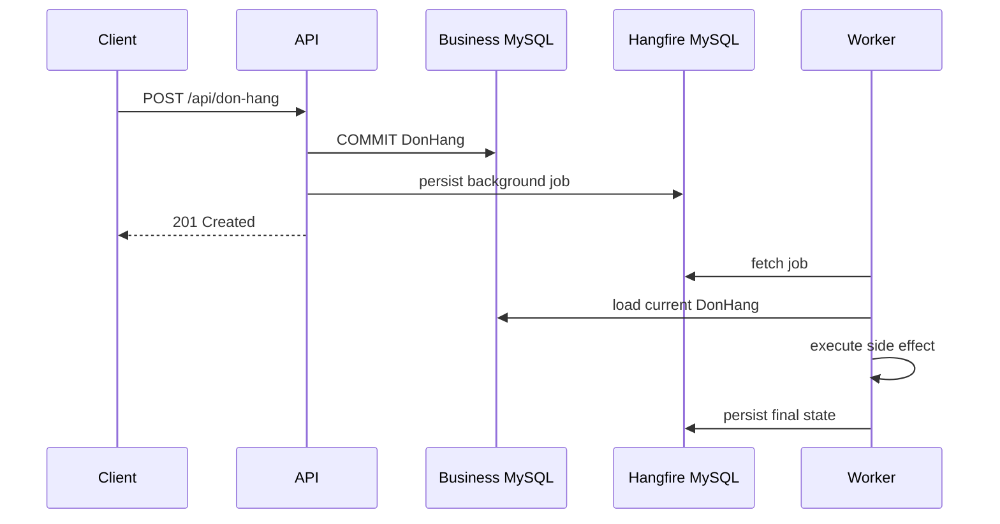

Việc tách nền thay đổi failure model. Hệ thống phải xử lý duplicate execution, retry, process crash, deploy compatibility và reconciliation.

## Runtime architecture

Hangfire gồm bốn vai trò: Client, Storage, Server và Dashboard.

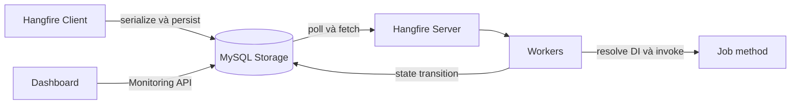

### Client

Client nhận expression mô tả lời gọi method, serialize invocation và ghi job vào storage. Client không thực thi business method.

```csharp
var jobId = backgroundJobClient.Enqueue<IGuiXacNhanDonHangJob>(
    job => job.ExecuteAsync(donHangId, CancellationToken.None));
```

Expression trên tạo logical payload:

```text
Type      = IGuiXacNhanDonHangJob
Method    = ExecuteAsync
Arguments = [donHangId, CancellationToken placeholder]
Queue     = default
CreatedAt = enqueue time
```

DI scope, `HttpContext`, connection và transaction của HTTP request không được serialize. Worker tạo execution scope mới tại thời điểm chạy.

### Storage

Storage là nguồn sự thật kỹ thuật cho payload, state history, queue, recurring schedule, server heartbeat và monitoring counters. Persistence cho phép job tồn tại sau process restart.

Storage không thay thế business database. State `Succeeded` mô tả method execution của Hangfire; trạng thái nghiệp vụ của `DonHang` vẫn thuộc database nghiệp vụ.

### Server và worker

Hangfire Server là tập background process chạy trong một .NET process.

| Thành phần | Trách nhiệm |
| --- | --- |
| Worker | Fetch và thực thi job từ queue. |
| Schedule poller | Chuyển delayed hoặc retry job đã đến hạn sang queue. |
| Recurring scheduler | Tạo fire-and-forget job từ recurring definition. |
| Heartbeat process | Cập nhật trạng thái sống của server trong storage. |
| Expiration manager | Dọn dữ liệu hết retention. |
| Counter aggregator | Tổng hợp counter phục vụ monitoring. |

`WorkerCount` là số execution slot của một server, không phải tổng số background process.

### Dashboard

Dashboard là projection vận hành đọc qua Monitoring API của storage. Dashboard không tham gia execution path và không bắt buộc để job chạy.

## Persistence model trên MySQL

Hangfire Core định nghĩa storage abstraction; `Hangfire.MySqlStorage` hiện thực abstraction đó bằng bảng, transaction, polling và distributed coordination trên MySQL.

### Logical schema

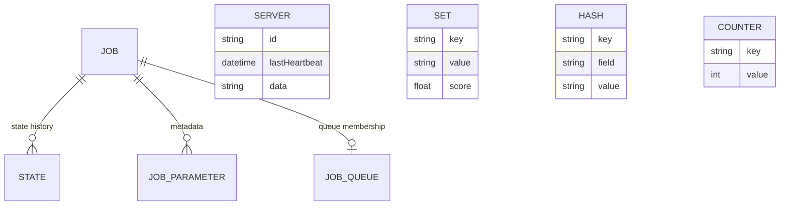

Sơ đồ mô tả logical schema và quan hệ trách nhiệm. Physical schema được xác định bởi storage provider, package version và `TablesPrefix`.

| Nhóm bảng | Nội dung | Vai trò vận hành |
| --- | --- | --- |
| `Job` | Invocation payload, arguments, creation time, current state | Truy xuất job và state hiện tại. |
| `State` | State history, reason và state data | Phân tích attempt, exception và retry. |
| `JobParameter` | Metadata phụ gắn với job | Phục vụ filter và internal component. |
| `JobQueue` | Queue item và fetch metadata | Điều phối worker nhận job. |
| `Server` | Identity, heartbeat, queues và worker metadata | Phát hiện server đang hoạt động. |
| `Set`, `Hash`, `List` | Cấu trúc dữ liệu tổng quát | Scheduled set, recurring definition và coordination data. |
| `Counter`, `AggregatedCounter` | Monitoring counters | Cung cấp số liệu cho Dashboard. |
| `Schema` | Storage schema version | Kiểm soát compatibility của provider. |

Business code không truy vấn hoặc cập nhật trực tiếp các bảng này. Thao tác job đi qua Hangfire Client, Monitoring API hoặc Dashboard để giữ compatibility với provider.

### Enqueue transaction

Fire-and-forget job được tạo bằng một storage transaction logic:

```text
BEGIN
  INSERT Job
  INSERT State(Name = Enqueued)
  UPDATE Job(CurrentState = Enqueued)
  INSERT JobQueue(Queue = default)
COMMIT
```

`Enqueue` trả `jobId` sau khi storage chấp nhận transaction. Kết quả này xác nhận job đã được lưu, không xác nhận business method đã hoàn thành.

### State model

Current state phục vụ truy vấn nhanh; state history bảo toàn diễn tiến của job.

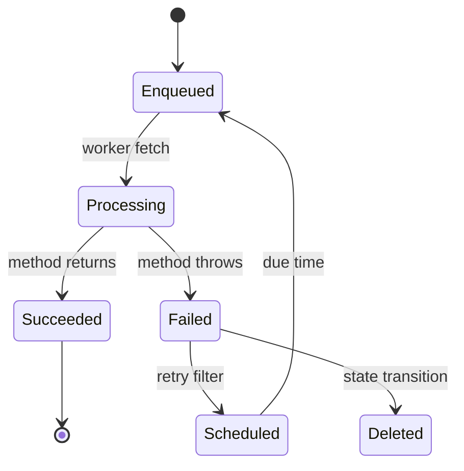

Một job retry có thể có history:

```text
Enqueued
Processing  server=worker-a
Failed      TimeoutException
Scheduled   attempt=1
Enqueued
Processing  server=worker-b
Succeeded
```

`Failed` trong history không đồng nghĩa current state là `Failed`; retry filter có thể đã chuyển job sang `Scheduled`.

### State election và apply state

State transition trong Hangfire không chỉ là phép gán một chuỗi. Component xử lý đề xuất một candidate state; filter có thể thay candidate trước khi storage commit transition.

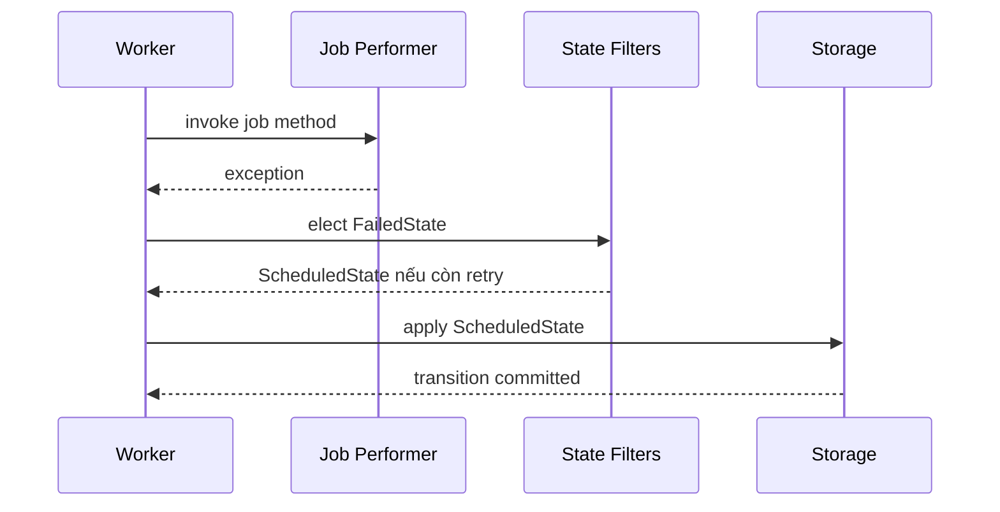

`AutomaticRetryAttribute` tham gia state election.

Exception tạo một `FailedState` candidate. Khi vẫn còn retry attempt, filter thay candidate này bằng `ScheduledState`. Vì vậy current state sau transaction có thể là `Scheduled` thay vì `Failed`.

Cơ chế này giải thích ba hiện tượng vận hành:

- Dashboard có failed entry trong history trong khi current state là scheduled.
- Retry delay không giữ worker thread ở trạng thái sleep; worker slot được giải phóng sau khi scheduled state được ghi.
- Process restart không làm mất retry schedule vì due time nằm trong storage.

State filter là infrastructure extension point. Nó điều khiển technical state transition của job.

Business invariant như “đơn đã hủy không được gửi xác nhận” vẫn thuộc job, application hoặc domain logic. Invariant đó phải đúng cả khi use case được gọi ngoài Hangfire pipeline.

### Worker fetch loop

Worker thực hiện một vòng lặp logic:

```text
poll configured queues
  -> fetch queue item
  -> create Processing state
  -> deserialize invocation
  -> create DI scope
  -> activate job type
  -> invoke method
  -> elect and persist final state
  -> dispose scope
```

Fetch và `Processing` phục vụ hai mục tiêu khác nhau.

Fetch cấp quyền tạm thời trên queue item cho một worker. State `Processing` ghi nhận execution attempt trong state history của job.

Process có thể dừng sau khi fetch nhưng trước khi ghi `Processing`.

Process cũng có thể dừng sau khi tạo side effect nhưng trước khi ghi final state.

Trong cả hai trường hợp, storage chỉ biết execution chưa hoàn tất. Storage không có đủ dữ liệu để kết luận side effect đã xảy ra hay chưa.

### Server heartbeat và abandoned execution

Mỗi Hangfire Server định kỳ ghi heartbeat vào storage. Heartbeat age cho biết process còn giao tiếp với storage, không cho biết từng business method vẫn progress.

```text
Server heartbeat mới + job Processing lâu
  -> job thực sự dài
  -> dependency bị treo
  -> code không quan sát cancellation

Server heartbeat cũ + nhiều job Processing
  -> process chết hoặc mất kết nối storage
  -> chờ recovery theo provider
```

Recovery tạo khả năng redelivery vì storage không có đủ bằng chứng để kết luận execution đã `Succeeded` hoặc `Failed`. Đây là nguồn gốc của at-least-once semantics.

### MySQL transaction và distributed coordination

Storage provider dùng MySQL transaction để giữ consistency giữa queue, job và state. Distributed coordination dùng shared database thay vì memory lock trong từng process.

Một in-memory `lock` chỉ serialize threads trong một replica:

```text
API A: lock object A
API B: lock object B
```

Hai object không có quan hệ với nhau. Multi-instance coordination phải dựa trên resource chung như row/transaction/lock primitive của MySQL provider.

Lock của Hangfire chỉ bảo vệ Hangfire resource. Business row có transaction và lock lifecycle riêng:

```text
Hangfire storage transaction
  -> fetch JobQueue
  -> write State

Business transaction
  -> update DonHang
  -> reserve TonKho
```

Hai transaction không atomic chỉ vì chúng cùng chạy trên MySQL hoặc cùng một physical server.

## Cấu hình .NET 6 và MySQL

### Package và database

```bash
dotnet add package Hangfire.AspNetCore --version 1.8.23
dotnet add package Hangfire.MySqlStorage --version 2.0.3
```

Version được pin để deployment có dependency graph xác định. Nâng version bao gồm release-note review, storage migration và rolling-deploy compatibility.

```sql
CREATE DATABASE food_jobs
    CHARACTER SET utf8mb4
    COLLATE utf8mb4_unicode_ci;
```

```json
{
  "ConnectionStrings": {
    "Hangfire": "Server=localhost;Port=3306;Database=food_jobs;User Id=hangfire_app;Password=secret;Allow User Variables=True"
  }
}
```

`Allow User Variables=True` là requirement của provider. Production secret thuộc secret store hoặc environment configuration.

### Service registration

```csharp
using System.Data;
using Hangfire;
using Hangfire.MySql;

var builder = WebApplication.CreateBuilder(args);

var connectionString = builder.Configuration
    .GetConnectionString("Hangfire")
    ?? throw new InvalidOperationException("Missing Hangfire connection string.");

builder.Services.AddHangfire(configuration => configuration
    .SetDataCompatibilityLevel(CompatibilityLevel.Version_180)
    .UseSimpleAssemblyNameTypeSerializer()
    .UseRecommendedSerializerSettings()
    .UseStorage(new MySqlStorage(
        connectionString,
        new MySqlStorageOptions
        {
            TransactionIsolationLevel = IsolationLevel.ReadCommitted,
            QueuePollInterval = TimeSpan.FromSeconds(5),
            JobExpirationCheckInterval = TimeSpan.FromHours(1),
            CountersAggregateInterval = TimeSpan.FromMinutes(5),
            PrepareSchemaIfNecessary = false,
            DashboardJobListLimit = 50_000,
            TransactionTimeout = TimeSpan.FromMinutes(1),
            TablesPrefix = "Hangfire"
        })));

builder.Services.AddHangfireServer(options =>
{
    options.Queues = new[] { "critical", "notification", "default" };
    options.WorkerCount = 4;
});
```

`PrepareSchemaIfNecessary = true` phù hợp local development. Production schema được cài bằng deployment step; runtime account chỉ giữ quyền DML cần thiết.

### Storage options

| Option | Cơ chế | Tác động cấu hình |
| --- | --- | --- |
| `TransactionIsolationLevel` | Isolation của transaction nội bộ provider | `ReadCommitted` là default được provider công bố. |
| `QueuePollInterval` | Chu kỳ tìm queue item | Khoảng ngắn giảm queue latency và tăng query rate. |
| `JobExpirationCheckInterval` | Chu kỳ dọn record hết hạn | Khoảng quá ngắn tạo cleanup pressure. |
| `CountersAggregateInterval` | Chu kỳ tổng hợp counter | Quyết định độ mới của số liệu Dashboard. |
| `PrepareSchemaIfNecessary` | Tự cài physical schema | Liên quan trực tiếp tới quyền DDL runtime. |
| `DashboardJobListLimit` | Giới hạn danh sách job | Giới hạn memory và query volume của Dashboard. |
| `TransactionTimeout` | Timeout storage transaction | Độc lập với timeout business job. |
| `TablesPrefix` | Namespace vật lý của bảng | Phải thống nhất giữa producer và worker. |

MySQL mặc định thường sử dụng `REPEATABLE READ`. Storage provider có thể mở transaction với isolation level được cấu hình riêng, chẳng hạn `ReadCommitted` trong ví dụ trên.

Storage transaction và business `DbContext` transaction là hai transaction độc lập.

Hai phía chỉ chia sẻ atomic boundary khi cùng sử dụng một database connection và một transaction object. Cấu hình Hangfire mặc định không tạo quan hệ này.

## Job contract và execution

### Job method

```csharp
public interface IGuiXacNhanDonHangJob
{
    Task ExecuteAsync(Guid donHangId, CancellationToken cancellationToken);
}
```

Argument chứa business identifier thay vì entity snapshot. Worker đọc trạng thái mới nhất tại execution time và xử lý record đã xóa hoặc state đã thay đổi.

```csharp
public sealed class GuiXacNhanDonHangJob : IGuiXacNhanDonHangJob
{
    private readonly IDonHangRepository _repository;
    private readonly IEmailClient _emailClient;

    public GuiXacNhanDonHangJob(
        IDonHangRepository repository,
        IEmailClient emailClient)
    {
        _repository = repository;
        _emailClient = emailClient;
    }

    [Queue("notification")]
    [AutomaticRetry(Attempts = 5)]
    public async Task ExecuteAsync(
        Guid donHangId,
        CancellationToken cancellationToken)
    {
        var donHang = await _repository.GetRequiredAsync(
            donHangId,
            cancellationToken);

        if (donHang.DaGuiXacNhan)
            return;

        await _emailClient.SendOrderConfirmationAsync(
            donHang.Email,
            donHang,
            $"gui-xac-nhan:{donHang.Id}",
            cancellationToken);

        donHang.DanhDauDaGuiXacNhan();
        await _repository.SaveChangesAsync(cancellationToken);
    }
}
```

Hangfire tạo DI scope cho mỗi execution. Scoped dependency như `DbContext` được resolve trong scope của job và dispose sau execution.

### Job types

| Loại | Cơ chế | Use case |
| --- | --- | --- |
| Fire-and-forget | Enqueue một lần khi có worker | Gửi xác nhận đơn hàng. |
| Delayed | Chờ due time trong scheduled set | Hủy reservation hết hạn. |
| Recurring | Cron definition tạo fire-and-forget job | Đồng bộ menu định kỳ. |
| Continuation | Phụ thuộc state cuối của job cha | Gửi notification sau khi PDF hoàn tất. |

```csharp
var jobId = backgroundJobClient.Enqueue<IGuiXacNhanDonHangJob>(
    job => job.ExecuteAsync(donHangId, CancellationToken.None));

backgroundJobClient.Schedule<IHuyGiuChoJob>(
    job => job.ExecuteAsync(donHangId, CancellationToken.None),
    TimeSpan.FromMinutes(15));

RecurringJob.AddOrUpdate<IDongBoMenuJob>(
    $"sync-menu:{tenantId:N}:{shopId:N}",
    job => job.ExecuteAsync(tenantId, shopId, CancellationToken.None),
    "*/10 * * * *",
    new RecurringJobOptions { TimeZone = TimeZoneInfo.Utc });
```

`CancellationToken.None` là placeholder trong expression. Hangfire thay argument này bằng execution token khi method được gọi.

Recurring ID chứa cả tenant và shop scope. Cấu trúc này ngăn recurring definition của một shop ghi đè definition của shop khác.

### Fire-and-forget lifecycle

Fire-and-forget yêu cầu job được thực thi sớm nhất khi worker có capacity. Loại job này không cung cấp exactly-once guarantee.

Producer nhận `jobId` ngay sau storage commit. Worker có thể bắt đầu trước hoặc sau HTTP response, tùy thời điểm fetch và worker availability.

```text
t0  producer persist Job + Enqueued state
t1  Enqueue trả jobId
t2  worker fetch
t3  method bắt đầu
t4  method kết thúc
t5  Succeeded được persist
```

Client chỉ quan sát được mốc `t1`. Business API cần endpoint trạng thái riêng nếu client phải theo dõi kết quả nghiệp vụ; `jobId` không thay business identifier.

### Delayed job internals

Delayed job chưa nằm trong executable queue. Storage giữ job trong scheduled structure với score/due time. Schedule poller chuyển job đến hạn sang `Enqueued`.

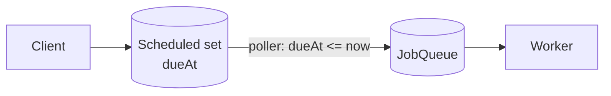

Độ trễ thực tế gồm scheduling interval, queue wait và worker availability:

```text
actualStartAt - requestedDueAt
  = schedulePollingDelay
  + queueDelay
  + workerContention
```

Delayed job không phù hợp với hard realtime deadline. Business deadline cần persistence, late-execution policy và reconciliation riêng.

### Recurring job internals

Recurring job là một schedule definition, không phải execution record.

Definition chứa recurring ID, cron expression, timezone, queue và invocation metadata. Tại mỗi due time, scheduler tạo một fire-and-forget job độc lập với `jobId` riêng.

```text
Recurring definition: sync-menu:T1:S1
  -> execution job 1001 at 10:00
  -> execution job 1048 at 10:10
  -> execution job 1102 at 10:20
```

`AddOrUpdate` là upsert theo recurring ID. ID scope sai tạo configuration collision:

```text
sync-menu              -> tenant sau ghi đè tenant trước
sync-menu:{tenantId}   -> tách tenant, chưa tách shop
sync-menu:{tenantId}:{shopId} -> đúng scope tenant và shop
```

Timezone là một phần của schedule contract. UTC tránh ambiguity do daylight-saving transition. Local business time cần policy cho giờ bị lặp và giờ không tồn tại.

Nhiều replicas có thể cùng chạy recurring scheduler. Các schedulers phối hợp qua shared storage để xử lý recurring definition ở cấp cluster; mục tiêu là không tạo một execution riêng chỉ vì có thêm replica.

Coordination của scheduler không loại bỏ duplicate execution do worker crash hoặc retry. Job method vẫn cần idempotency để bảo vệ business side effect.

### Continuation semantics

Continuation liên kết creation của job con với final state của job cha.

```csharp
var taoPdfJobId = backgroundJobClient.Enqueue<ITaoHoaDonPdfJob>(
    job => job.ExecuteAsync(donHangId, CancellationToken.None));

backgroundJobClient.ContinueJobWith<IGuiHoaDonJob>(
    taoPdfJobId,
    job => job.ExecuteAsync(donHangId, CancellationToken.None),
    JobContinuationOptions.OnlyOnSucceededState);
```

`OnlyOnSucceededState` phù hợp khi job con yêu cầu output hợp lệ từ job cha. `OnAnyFinishedState` phù hợp cho cleanup hoặc notification tổng quát.

Continuation biểu diễn dependency ngắn giữa hai jobs.

Workflow nhiều nhánh, có compensation, manual approval hoặc state tồn tại nhiều ngày cần business workflow state. Chuỗi continuation trong technical storage không biểu diễn đầy đủ các yêu cầu đó.

## Serialization và Job Activator

### Invocation compatibility

Hangfire serialize type identity, method identity, parameter types và argument values. Payload đang chờ tạo một compatibility contract giữa producer version và worker version.

Các thay đổi có blast radius tới queued jobs:

- Đổi namespace hoặc assembly của job type.
- Đổi interface implementation registration.
- Đổi method name hoặc parameter list.
- Đổi argument DTO làm JSON cũ không deserialize.
- Xóa constructor dependency khỏi DI hoặc thiếu registration mới.

Rolling deployment an toàn dùng expand-and-contract:

```text
worker V2 hiểu payload V1 và V2
  -> producer bắt đầu ghi V2
  -> V1 queue, scheduled jobs và retries drain
  -> worker loại support V1
```

### Argument design

Argument là durable message contract, không phải tiện ích truyền object giữa hai method.

| Argument | Đặc tính |
| --- | --- |
| `donHangId` | Nhỏ, ổn định, worker đọc state mới nhất. |
| `tenantId`, `shopId` | Khôi phục execution scope khi không thể suy ra an toàn từ aggregate ID. |
| Entity graph | Payload lớn, stale state, dễ vỡ serialization. |
| Access token | Secret bị persist và hết hạn trước execution. |
| Stream/connection/DbContext | Không serialize được và gắn với process cũ. |

Payload size ảnh hưởng storage growth, lượng dữ liệu xuất hiện trên Dashboard và serialization latency.

Business snapshot chỉ được truyền khi immutable snapshot là requirement của use case. Contract khi đó sử dụng DTO có version thay vì domain entity.

### DI scope

Job Activator tạo scope cho từng execution. Job instance và scoped dependencies sống trong scope đó:

```text
Execution attempt
  -> IServiceScope
      -> Job instance
      -> DbContext
      -> repositories
      -> scoped tenant context
  -> dispose scope
```

Retry attempt mới tạo scope mới. Change tracker, transaction và scoped cache từ attempt trước không tồn tại. Singleton không được giữ scoped dependency hoặc mutable tenant state.

## Retry mechanics

### Failure classification

Retry policy bắt đầu từ error taxonomy:

| Failure | Ví dụ | Policy |
| --- | --- | --- |
| Transient | timeout, connection reset, HTTP 429, temporary 5xx | Retry với backoff và giới hạn attempts. |
| Permanent input | email sai format, shop không tồn tại | Fail ngay; sửa dữ liệu hoặc bỏ job. |
| Permanent configuration | thiếu API key, route cấu hình sai | Fail và alert; retry tự động chỉ tạo noise. |
| Concurrency conflict | optimistic conflict, duplicate claim | Reload/re-evaluate hoặc coi operation đã hoàn tất. |
| Unknown outcome | timeout sau external request | Query provider/idempotency record trước retry. |

```csharp
[AutomaticRetry(
    Attempts = 5,
    DelaysInSeconds = new[] { 10, 30, 120, 300, 900 },
    OnAttemptsExceeded = AttemptsExceededAction.Fail)]
public Task ExecuteAsync(Guid donHangId, CancellationToken cancellationToken)
{
    // ...
}
```

Backoff giảm request amplification khi dependency lỗi diện rộng. Jitter cần được bổ sung ở layer phù hợp nếu nhiều jobs có cùng failure time và provider/filter hiện tại không tạo jitter.

### Retry boundary

Retry toàn method lặp lại mọi bước trước điểm lỗi:

```text
Attempt 1
  reserve stock        success
  create invoice       success
  send email           timeout

Attempt 2
  reserve stock        duplicate risk
  create invoice       duplicate risk
  send email           retry
```

Mỗi stage cần idempotency riêng hoặc workflow state ghi nhận stage đã hoàn tất.

Job chứa quá nhiều stages tạo retry boundary lớn: lỗi ở bước cuối khiến mọi bước trước được gọi lại. Ngược lại, tách mỗi câu lệnh thành một job riêng làm orchestration và state management phức tạp.

Job boundary phù hợp thường trùng với một business operation có outcome và idempotency key rõ ràng.

### Poison job

Poison job lặp lại permanent failure trên mọi attempt. Dấu hiệu gồm cùng exception type/message, duration ngắn và attempts tăng đều.

Operational handling gồm:

1. Dừng automatic retry khi đã phân loại permanent.
2. Bảo toàn job ID, business key và failure reason.
3. Sửa configuration, code hoặc input source.
4. Retry có kiểm soát sau khi precondition đã thay đổi.
5. Reconciliation business state sau execution.

Delete technical job không rollback side effect hoặc thay đổi business state.

## Concurrency control

### Worker concurrency

Tổng execution concurrency bằng tổng worker count của mọi active servers nghe cùng queues.

```text
3 replicas × 8 workers = tối đa 24 concurrent executions
```

Capacity model cho I/O-bound jobs:

```text
requiredConcurrency ≈ arrivalRate × averageDuration
```

Little's Law cho baseline sizing không thay load test. Connection pool, external rate limit, MySQL lock time và tail latency tạo giới hạn thấp hơn công thức CPU mặc định.

### Method-level exclusion

`DisableConcurrentExecution` giảm concurrent invocation của cùng method qua distributed coordination. Cơ chế này hữu ích cho maintenance task nhưng không tạo exactly-once guarantee.

Các giới hạn:

- Lock lifetime phụ thuộc storage connection/lease.
- Process hoặc network failure làm ownership trở nên không chắc chắn.
- Method-level key có thể serialize toàn bộ tenants và shops không cần thiết.
- Side effect ngoài storage không trở thành atomic.

Resource-level concurrency thuộc business storage. Ví dụ unique constraint, optimistic version hoặc atomic conditional update bảo vệ đúng aggregate/resource scope.

### Tenant-scoped concurrency

Một global recurring job đồng bộ menu có thể tạo contention giữa tenants. Phân scope theo tenant/shop cho phép isolation và capacity control:

```text
queue: menu-sync
business key: {tenantId}:{shopId}:{menuVersion}
unique execution key: sync-menu:{tenantId}:{shopId}:{menuVersion}
```

Queue vẫn là shared execution channel; unique key và query predicate mới bảo vệ business scope.

## Cancellation mechanics

### Cancellation sources

Execution token có thể được signal bởi server shutdown, job deletion, state change hoặc cancellation request mà Hangfire quan sát qua storage.

Token này thuộc execution attempt hiện tại. Nó không phải `RequestAborted` của HTTP request đã enqueue job.

Cancellation delivery có polling latency. Khoảng polling ngắn tăng responsiveness và storage reads; khoảng dài giảm storage load và kéo dài shutdown/cancel reaction.

### Safe cancellation points

```csharp
public async Task ExecuteAsync(Guid donHangId, CancellationToken cancellationToken)
{
    var donHang = await _repository.GetAsync(donHangId, cancellationToken);

    cancellationToken.ThrowIfCancellationRequested();
    await _documentStore.UploadAsync(donHangId, cancellationToken);

    cancellationToken.ThrowIfCancellationRequested();
    await _repository.MarkDocumentReadyAsync(donHangId, cancellationToken);
}
```

Safe point nằm giữa các stage có outcome bền vững. Cancellation giữa external side effect và persistence tạo unknown outcome giống process crash.

`OperationCanceledException` phải đi ra khỏi job method để execution pipeline ghi nhận cancellation/failure semantics phù hợp. Catch để thêm context log vẫn cần rethrow:

```csharp
try
{
    await ExecuteCoreAsync(cancellationToken);
}
catch (OperationCanceledException) when (cancellationToken.IsCancellationRequested)
{
    _logger.LogInformation("Job cancellation observed");
    throw;
}
```

### Business cancellation

Hangfire technical state có retention và không phải business audit. Yêu cầu “hủy xuất báo cáo” cần business state:

```text
Pending -> CancellationRequested -> Cancelled
Pending -> Processing -> Completed
Processing -> CancellationRequested -> Cancelled | Completed
```

Race giữa completion và cancellation được giải quyết bằng atomic state transition hoặc optimistic concurrency trên business record.

## Multiple instances

### Shared-storage topology

Nhiều Hangfire Server dùng chung MySQL storage. Mỗi server có identity và heartbeat riêng; worker cạnh tranh fetch thông qua provider.

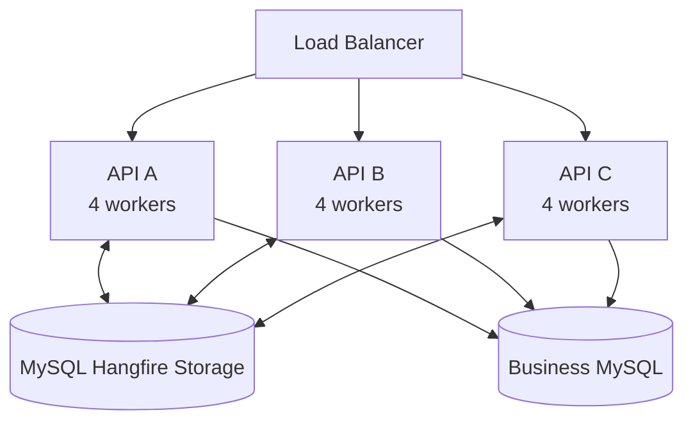

Ba replicas với `WorkerCount = 4` tạo tối đa 12 execution slots. Autoscaling HTTP replicas đồng thời thay đổi background concurrency nếu mỗi API process chạy `AddHangfireServer`.

`WorkerCount` được xác định từ capacity toàn cụm: MySQL connection pool, external rate limit, CPU, memory và job duration. CPU-based formula không phản ánh các giới hạn I/O này.

### Worker Service topology

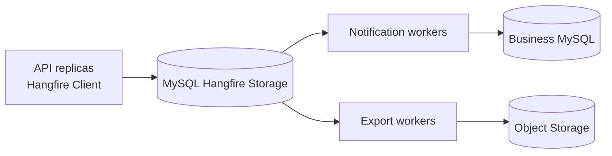

API đăng ký `AddHangfire` để tạo job nhưng không đăng ký `AddHangfireServer`, vì API không thực thi job.

Worker Service đăng ký cả storage và `AddHangfireServer`. API và Worker Service phải dùng cùng connection string, `TablesPrefix`, provider version, queue names, serializer settings và job contract.

Worker riêng phù hợp với workload cần scale độc lập hoặc cô lập CPU/RAM. In-process server giữ topology đơn giản hơn cho workload nhỏ.

### Queue isolation và polling

Queue cô lập workload và cho phép scale từng worker pool. Queue không tạo priority guarantee nếu provider không cam kết processing order tương ứng với vị trí trong `options.Queues`.

Job trong queue không có worker giữ state `Enqueued`. Dashboard biểu diễn queue length và oldest-job age tăng trong khi server coverage bằng không.

`QueuePollInterval` kiểm soát trade-off giữa queue latency và MySQL query rate:

```text
Queue latency cao, MySQL còn capacity
  -> giảm polling interval hoặc tăng worker có kiểm soát

MySQL CPU/connection cao, queue tiếp tục tăng
  -> tăng worker làm tăng contention
  -> giảm concurrency, profile storage query hoặc tách workload
```

## Delivery semantics và correctness

### At-least-once execution

Reliable dequeue ưu tiên không làm mất job. Job có thể chạy lại khi worker chết hoặc state cuối chưa được ghi.

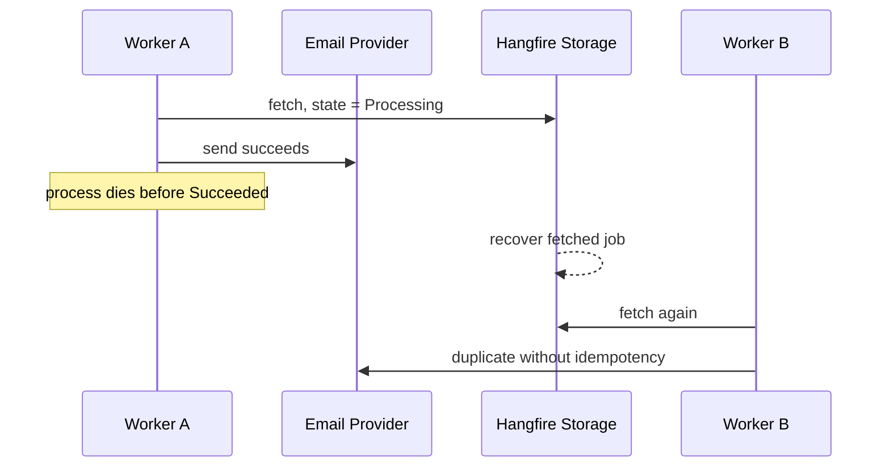

Hangfire không cung cấp exactly-once side effect. Correctness boundary nằm tại business database hoặc external provider.

### Idempotency và retry

Idempotency key cho email xác nhận:

```text
gui-xac-nhan:{donHangId}
```

Provider hỗ trợ idempotency key trả cùng logical result cho các request trùng key. Nếu provider không hỗ trợ, adapter sử dụng execution record với unique constraint trên `(tenantId, businessKey, operation)`.

```sql
CREATE TABLE JobExecution (
    id CHAR(36) NOT NULL,
    tenantId CHAR(36) NOT NULL,
    businessKey VARCHAR(100) NOT NULL,
    operation VARCHAR(100) NOT NULL,
    status VARCHAR(30) NOT NULL,
    updatedAt DATETIME(6) NOT NULL,
    PRIMARY KEY (id),
    UNIQUE KEY uq_job_execution_scope
        (tenantId, businessKey, operation)
);
```

Retry phù hợp với transient failure như timeout, connection reset, HTTP 429 hoặc một số HTTP 5xx. Những lỗi này có khả năng biến mất mà không cần sửa input hoặc deploy code mới.

Validation error, missing configuration và malformed recipient là permanent failure. Lặp lại cùng input trong cùng điều kiện không làm kết quả thay đổi.

Retry làm business method có thể chạy nhiều lần. Vì vậy mọi mutation nằm trong retry boundary cần idempotency trước khi tăng số attempts.

### Distributed lock và business concurrency

Distributed lock của storage phối hợp scheduler và server processes. Nó không khóa row `DonHang`, không chống oversell và không kết hợp business database với external API thành atomic transaction.

Stock reservation thuộc business database:

```sql
UPDATE TonKho
SET soLuong = soLuong - @soLuongDat
WHERE tenantId = @tenantId
  AND shopId = @shopId
  AND hangHoaId = @hangHoaId
  AND soLuong >= @soLuongDat;
```

`rowsAffected = 1` xác nhận reservation thành công. `rowsAffected = 0` biểu diễn conflict hoặc không đủ tồn theo use-case contract.

### Outbox

Business transaction và Hangfire storage transaction độc lập tạo lost-intent window:

```text
COMMIT DonHang
process crash
chưa enqueue GuiXacNhanDonHang
```

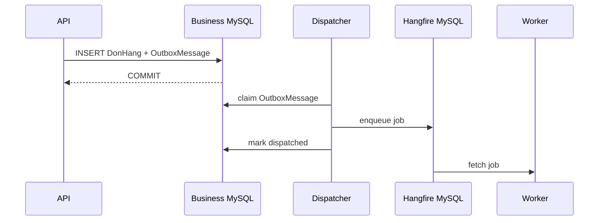

Outbox loại lost intent nhưng không loại duplicate: dispatcher có thể crash sau enqueue và trước `mark dispatched`. Consumer idempotency vẫn là requirement độc lập.

## Multi-tenancy

Background job không có HTTP host, request header hoặc authenticated user của request ban đầu. Tenant context được khôi phục từ dữ liệu bền vững.

Job contract có thể chứa tenant scope:

```csharp
Task ExecuteAsync(
    Guid tenantId,
    Guid shopId,
    CancellationToken cancellationToken);
```

Một contract khác chỉ nhận `donHangId`, sau đó repository tải `tenantId` từ business record bằng lookup không phụ thuộc current tenant filter.

Sau khi tenant được xác định, execution scope thiết lập `TenantContext` trước tenant-scoped query. Dapper query vẫn có explicit tenant predicate:

```sql
SELECT id, trangThai
FROM DonHang
WHERE id = @donHangId
  AND tenantId = @tenantId;
```

## Cancellation và shutdown

Cancellation trong Hangfire là cooperative cancellation. Hangfire phát tín hiệu qua `CancellationToken`; business method kết thúc tại safe point và truyền token xuống I/O API.

```csharp
public async Task ExecuteAsync(Guid donHangId, CancellationToken cancellationToken)
{
    var donHang = await _repository.GetAsync(donHangId, cancellationToken);
    cancellationToken.ThrowIfCancellationRequested();
    await _emailClient.SendAsync(donHang, cancellationToken);
}
```

Cancellation không rollback side effect đã hoàn tất. Sau khi provider nhận request, execution tiếp theo dựa trên idempotency hoặc reconciliation.

Graceful shutdown cho worker thời gian quan sát cancellation và trả job về trạng thái có thể recovery. Kill đột ngột vẫn thuộc failure model.

## Dashboard

### Information model

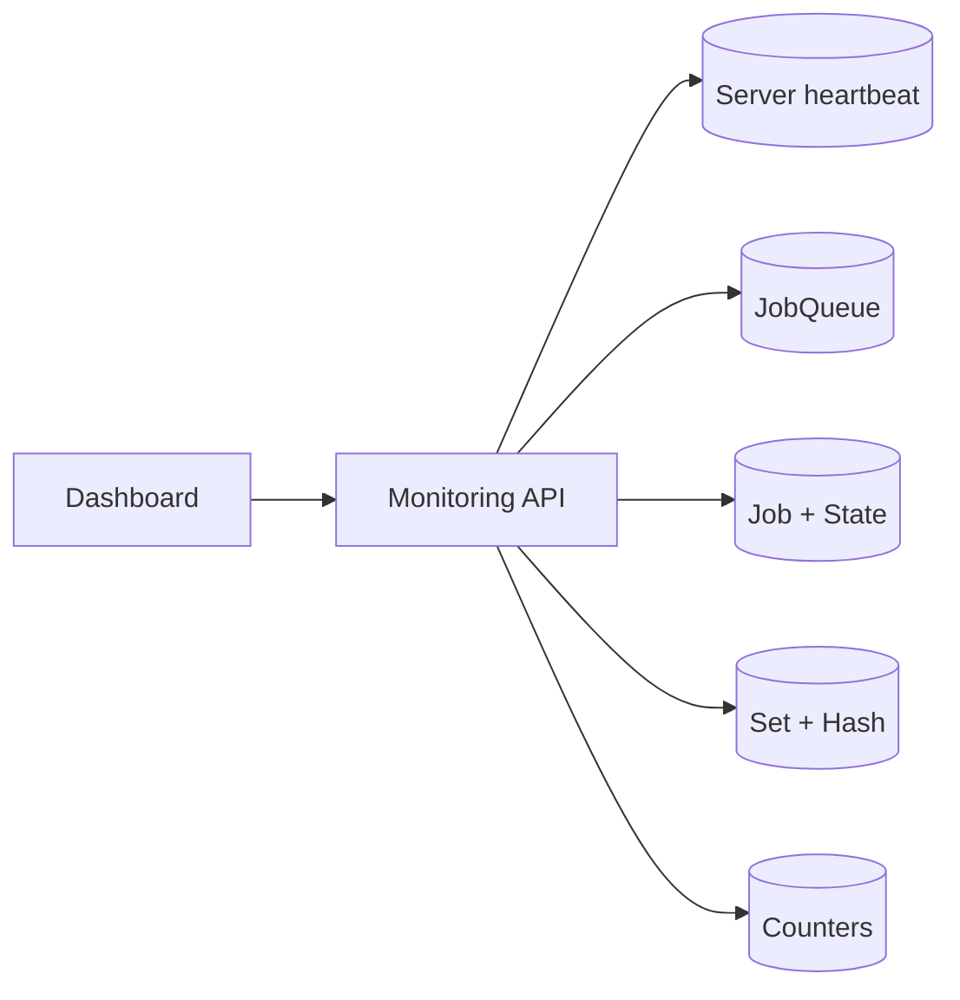

| Khu vực | Dữ liệu | Ý nghĩa vận hành |
| --- | --- | --- |
| Overview | State counters và history graph | Processing trend tổng quát. |
| Servers | Identity, heartbeat, workers, queues | Trạng thái worker processes. |
| Queues | Queue length và server coverage | Backlog và queue không có consumer. |
| Enqueued | Job chờ fetch | Queue latency và oldest-job age. |
| Processing | Job đang được worker giữ | Long-running hoặc stalled execution. |
| Scheduled | Delayed job và retry | Retry storm hoặc scheduled backlog. |
| Succeeded | Method execution hoàn tất | Không chứng minh side effect exactly-once. |
| Failed | Current failed jobs và exception | Permanent failure hoặc exhausted retry. |
| Recurring Jobs | Cron, timezone, next/last execution | Trạng thái recurring definitions. |

Failure diagnosis:

```text
Không có email xác nhận
  -> không có job: producer hoặc Outbox dispatcher
  -> Enqueued lâu: queue coverage và worker capacity
  -> Scheduled: exception và next retry
  -> Processing lâu: dependency, duration, heartbeat
  -> Failed: transient/permanent classification
  -> Succeeded: provider log, business state, idempotency record
```

State `Succeeded` chỉ xác nhận method trả về không ném exception. Code catch exception rồi tiếp tục làm technical state lệch khỏi business result.

### Security

Dashboard hiển thị method, serialized arguments, exception và stack trace; đồng thời cung cấp retry, delete và trigger operations. Endpoint cần authentication, role authorization và network restriction.

```csharp
public sealed class HangfireAuthorizationFilter : IDashboardAuthorizationFilter
{
    public bool Authorize(DashboardContext context)
    {
        var httpContext = context.GetHttpContext();
        return httpContext.User.Identity?.IsAuthenticated == true
            && httpContext.User.IsInRole("HangfireAdmin");
    }
}
```

```csharp
app.UseAuthentication();
app.UseAuthorization();
app.UseHangfireDashboard("/hangfire", new DashboardOptions
{
    Authorization = new[] { new HangfireAuthorizationFilter() },
    IsReadOnlyFunc = context =>
        !context.GetHttpContext().User.IsInRole("HangfireOperator")
});
```

Job arguments không chứa password, access token hoặc dữ liệu cá nhân không cần thiết. Retry, delete và manual trigger thuộc audit trail vận hành.

## Production operation

### Deployment compatibility

Schema installation thuộc deployment pipeline; runtime account chỉ có DML permission. Rolling deployment giữ compatibility với queued payload:

```text
deploy worker đọc được V1 và V2
  -> deploy producer bắt đầu tạo V2
  -> V1 queue, schedule và retry drain
  -> loại V1 khỏi worker
```

Đổi namespace, assembly, type, method signature hoặc argument DTO trước khi job cũ drain có thể làm worker không deserialize được payload.

### Observability

Dashboard phục vụ điều tra từng job; monitoring system chịu trách nhiệm alert và historical metrics.

- Queue length và oldest-job age theo queue.
- Enqueue-to-start latency.
- Execution duration và throughput theo job type.
- Failed rate, retry rate và exhausted retries.
- Server heartbeat age.
- MySQL connection utilization, query latency và lock wait.
- External dependency latency, rate limit và error rate.

Structured log của mỗi execution gồm `jobId`, `tenantId`, business key, job type, attempt và trace context.

### Operational failure cases

#### Queue không có worker

Job giữ state `Enqueued` khi không có worker fetch nó. Theo thời gian, queue length và oldest-job age cùng tăng.

Server view trong Dashboard không hiển thị instance nào đăng ký queue tương ứng. Hai nguyên nhân phổ biến là queue name khác nhau giữa producer và worker, hoặc worker deployment thiếu queue configuration.

#### Retry storm

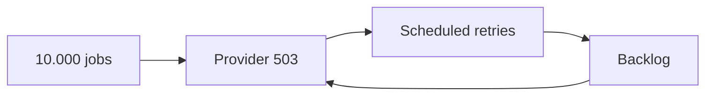

Worker limit, queue isolation, backoff và circuit/rate policy giới hạn amplification. Permanent error không đi vào cùng retry policy với transient error.

#### Manual retry sau timeout

Timeout không chứng minh provider chưa xử lý request. Manual retry payment hoặc notification dựa trên provider status và idempotency record, không chỉ technical state của Hangfire.

## Schema lifecycle và retention

### Schema installation

Storage provider cần physical tables và indexes trước khi Client hoặc Server hoạt động. Hai execution modes có mục tiêu khác nhau:

| Mode | `PrepareSchemaIfNecessary` | Database identity |
| --- | --- | --- |
| Local development | `true` | Có quyền tạo/thay đổi object. |
| Production runtime | `false` | Chỉ có quyền DML cần cho Hangfire. |
| Deployment migration | Không chạy application server | Identity riêng có quyền DDL. |

Auto schema creation làm startup của mỗi production replica phụ thuộc vào DDL permission và trạng thái schema tại thời điểm khởi động.

Deployment migration tách schema change khỏi runtime startup. Migration được review và chạy bằng deployment identity trước khi application replicas nhận traffic; runtime identity chỉ giữ các DML permissions cần thiết.

### Table prefix consistency

`TablesPrefix` là physical namespace. Producer và worker dùng prefix khác nhau hoạt động như hai Hangfire systems độc lập dù cùng connection string:

```text
API prefix     = Hangfire
Worker prefix  = FoodJobs

API enqueue vào HangfireJob...
Worker poll FoodJobsJob...
Kết quả: enqueue thành công, không job nào được xử lý
```

Prefix là immutable deployment contract trừ khi có data migration đầy đủ.

### Retention model

Succeeded jobs và monitoring data không tồn tại vô hạn. Expiration manager xóa record theo expiration metadata và provider interval.

Retention tạo trade-off:

```text
retention dài
  -> điều tra lịch sử tốt hơn
  -> storage, index và cleanup cost lớn hơn

retention ngắn
  -> storage nhỏ hơn
  -> mất technical evidence sớm hơn
```

Business audit không phụ thuộc retention của Hangfire. Thông tin pháp lý, thanh toán, lịch sử trạng thái đơn hàng và operator action nằm trong business audit store.

### Index và storage growth

Growth rate phụ thuộc enqueue throughput, state transitions trên mỗi job, retries, argument size và retention:

```text
rowsPerDay ≈ jobsPerDay × (job row + state rows + queue/parameter/counter rows)
```

Retry-heavy workload tăng `State` nhanh hơn số business operations. Dashboard query chậm có thể xuất phát từ storage size, index statistics, counter aggregation hoặc list limit; tăng web timeout không xử lý nguyên nhân.

## Dashboard operation model

### Server view

Server view trả lời ba câu hỏi:

1. Process nào còn heartbeat?
2. Mỗi process có bao nhiêu workers?
3. Process lắng nghe queues nào?

Server heartbeat cũ không tự động chứng minh machine chết; network partition hoặc MySQL connectivity failure tạo cùng biểu hiện. Application log và infrastructure health hoàn thiện chẩn đoán.

### Queue view

Queue length là snapshot backlog. Oldest-job age biểu diễn user impact tốt hơn khi arrival rate thay đổi.

```text
Queue length = 10.000, throughput = 5.000/minute
  -> backlog có thể được giải phóng trong khoảng 2 phút

Queue length = 100, oldest age = 2 giờ
  -> queue có thể thiếu worker hoặc chứa poison/blocked workload
```

Dashboard không mặc định cung cấp đầy đủ SLO calculation. Metrics pipeline cần record enqueue time, start time và final state để tính percentile.

### Processing view

Processing duration được đối chiếu với job-specific expectation. Một export 20 phút có thể bình thường; một notification 20 phút là stalled dependency hoặc timeout policy thiếu.

Processing job trên server không còn heartbeat có khả năng chờ provider recovery. Manual requeue trước recovery có thể tạo concurrent duplicate execution.

### Failed và retry view

Investigation record tối thiểu:

```text
Hangfire jobId
tenantId / shopId
business key
job type
current state
state history
attempt number
exception type
external request/idempotency key
worker serverId
```

Exception message không đủ để phân loại unknown outcome. Timeout sau external call cần provider lookup hoặc reconciliation.

### Operator actions

| Action | Technical effect | Business consequence |
| --- | --- | --- |
| Retry/Requeue | Tạo execution attempt mới | Side effect có thể lặp. |
| Delete | Chuyển hoặc loại job khỏi processing flow | Không rollback business data. |
| Trigger recurring | Tạo execution ngoài schedule thông thường | Có thể chạy song song execution đang tồn tại. |
| Change queue/config | Thay worker routing | Không migrate job nếu provider/API không thực hiện transition tương ứng. |

Operator identity, reason, timestamp, job ID và business key thuộc audit record. Dashboard button không thay approval policy cho payment, refund hoặc document issuance.

## Configuration derivation

Một production configuration được suy ra từ workload contract thay vì sao chép default:

```text
Job type: GuiXacNhanDonHang
arrival rate: 20 jobs/s peak
average duration: 300 ms
p95 duration: 1.2 s
external limit: 50 requests/s
start SLO: 30 s
retry: 10s, 30s, 2m, 5m
idempotency: gui-xac-nhan:{donHangId}
queue: notification
```

Baseline concurrency từ average workload:

```text
20 jobs/s × 0.3 s = 6 concurrent executions
```

P95 burst, retry traffic và headroom có thể đưa baseline lên 10–12 workers toàn cluster, vẫn thấp hơn external limit 50 requests/s. Nếu có ba replicas, `WorkerCount = 4` tạo tổng 12 slots.

Polling interval xuất phát từ start SLO. SLO 30 giây không yêu cầu polling 100 ms; 5 giây để lại phần lớn budget cho queue wait và execution while giảm MySQL polling pressure.

Queue separation xuất phát từ resource profile:

| Queue | Workload | Constraint |
| --- | --- | --- |
| `critical` | cập nhật deadline ngắn | latency và business priority |
| `notification` | email/SMS | provider rate limit |
| `export` | PDF/Excel | CPU, memory, object storage |

Worker pool cho `export` có concurrency thấp để export không chiếm connection/CPU của notification.

## Verification strategy

### Business method tests

Job class được kiểm thử như application service, không cần Hangfire runtime cho domain branches:

```text
DonHang tồn tại, chưa gửi
  -> provider được gọi với idempotency key đúng
  -> business state được cập nhật

DonHang đã gửi
  -> method return
  -> provider không được gọi

Provider transient failure
  -> exception đi ra execution boundary
  -> state không được đánh dấu hoàn tất
```

### Storage integration tests

Integration test với MySQL storage thật xác nhận các phần không thể chứng minh bằng mock:

- Invocation serialize và deserialize qua đúng package versions.
- DI activator resolve job và scoped dependencies.
- Queue attribute route tới đúng worker pool.
- Retry filter tạo scheduled transition.
- Recurring definition dùng tenant/shop-scoped ID.
- Hai workers không cùng claim normal queue item trong happy path.
- Process interruption dẫn tới redelivery theo provider recovery.
- Dashboard authorization từ chối identity không đủ role.

### Failure injection

Các điểm crash cần được mô phỏng độc lập:

```text
before business transaction commit
after business commit, before enqueue
after enqueue, before Outbox mark-dispatched
after external side effect, before business state update
after business state update, before Hangfire Succeeded
```

Mỗi điểm xác nhận một mechanism khác nhau: transaction rollback, Outbox, duplicate enqueue, external idempotency và redelivery handling.

### Multi-instance verification

Test topology chạy tối thiểu hai worker processes trên cùng MySQL storage:

1. Enqueue batch có business keys duy nhất.
2. Xác nhận workload được phân phối qua hai server identities.
3. Kill một process giữa execution.
4. Xác nhận abandoned job được recovery.
5. Xác nhận business side effect không duplicate nhờ idempotency.
6. Restart process và xác nhận heartbeat/server view phục hồi.

## Keyword reference

| Keyword | Định nghĩa |
| --- | --- |
| Background job | Method invocation được serialize và lưu để thực thi ngoài request hiện tại. |
| Client | Thành phần tạo và persist job. |
| Storage | Nguồn sự thật kỹ thuật cho job, state, queue và server. |
| Hangfire Server | Tập background process điều phối qua storage. |
| Worker | Execution slot fetch và chạy một job tại một thời điểm. |
| Queue | Kênh logic phân workload tới worker pool. |
| State | Một trạng thái trong history của job. |
| State transition | Việc tạo state mới và cập nhật current state. |
| Filter | Hook quanh job creation, execution hoặc state election. |
| Automatic retry | Filter chuyển failed attempt thành scheduled attempt mới. |
| Scheduled job | Job một lần chờ due time. |
| Recurring job | Cron definition tạo các fire-and-forget job. |
| Continuation | Job phụ thuộc state cuối của job cha. |
| Heartbeat | Tín hiệu định kỳ của Hangfire Server trong storage. |
| Distributed lock | Coordination giữa processes qua shared storage. |
| Job activator | Thành phần tạo job instance và DI scope. |
| Poison job | Job luôn thất bại vì input hoặc permanent error. |
| Outbox | Processing intent được lưu cùng business transaction. |
| Idempotency | Cùng operation key được áp dụng nhiều lần nhưng chỉ tạo một logical effect. |

## Verification checklist

- Client và worker dùng cùng database, `TablesPrefix` và provider version.
- Mỗi queue có ít nhất một worker pool.
- Tổng worker count phù hợp MySQL và external dependency capacity.
- Job argument nhỏ, ổn định và không chứa secret.
- Tenant context được khôi phục từ dữ liệu bền vững.
- Retry policy phân biệt transient và permanent error.
- Side effect có idempotency key, unique constraint hoặc reconciliation.
- Outbox bảo vệ business operation không chấp nhận lost intent.
- Dashboard có authorization, network restriction và read-only role.
- Rolling deployment giữ compatibility với queued payload.
- Monitoring sử dụng queue age, failure rate và heartbeat.

## Tài liệu tham khảo

- [Hangfire documentation](https://docs.hangfire.io/en/latest/)
- [ASP.NET Core applications](https://docs.hangfire.io/en/latest/getting-started/aspnet-core-applications.html)
- [Processing background jobs](https://docs.hangfire.io/en/latest/background-processing/processing-background-jobs.html)
- [Running multiple server instances](https://docs.hangfire.io/en/latest/background-processing/running-multiple-server-instances.html)
- [Configuring job queues](https://docs.hangfire.io/en/latest/background-processing/configuring-queues.html)
- [Using Dashboard UI](https://docs.hangfire.io/en/latest/configuration/using-dashboard.html)
- [Hangfire.MySqlStorage repository](https://github.com/arnoldasgudas/Hangfire.MySqlStorage)
- [Hangfire.MySqlStorage package](https://www.nuget.org/packages/Hangfire.MySqlStorage/)
