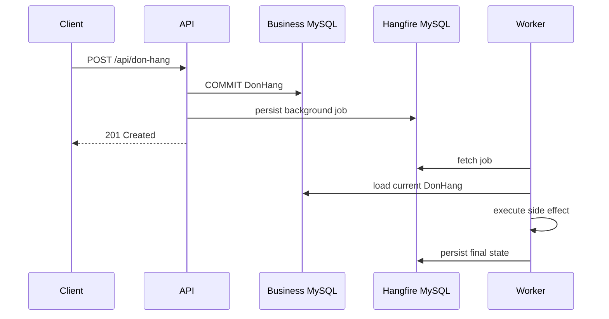
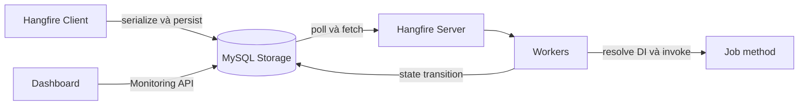
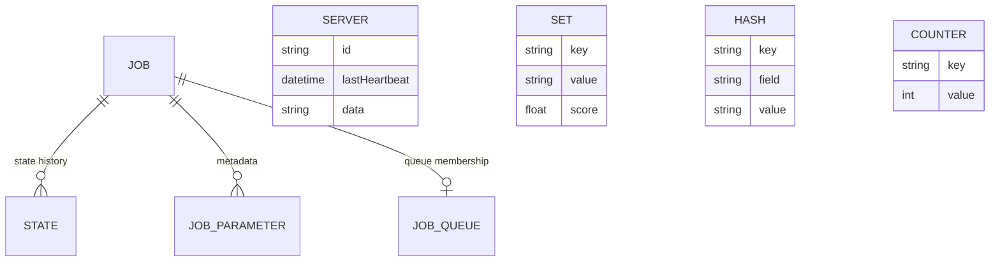
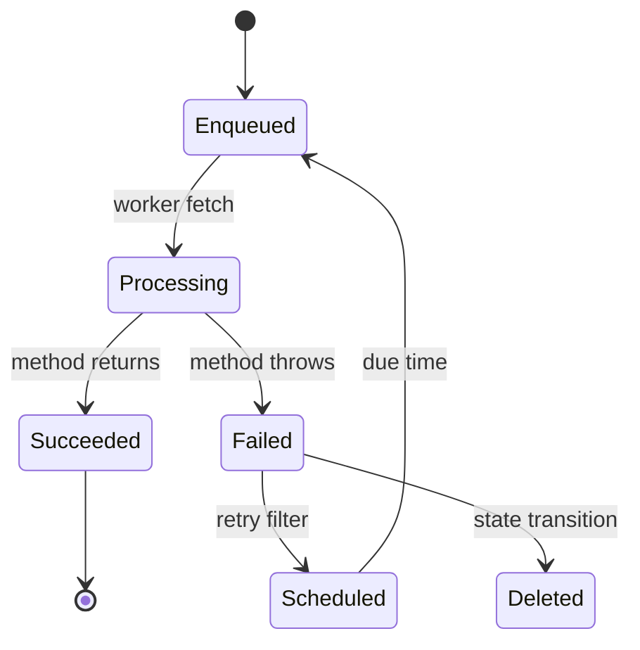
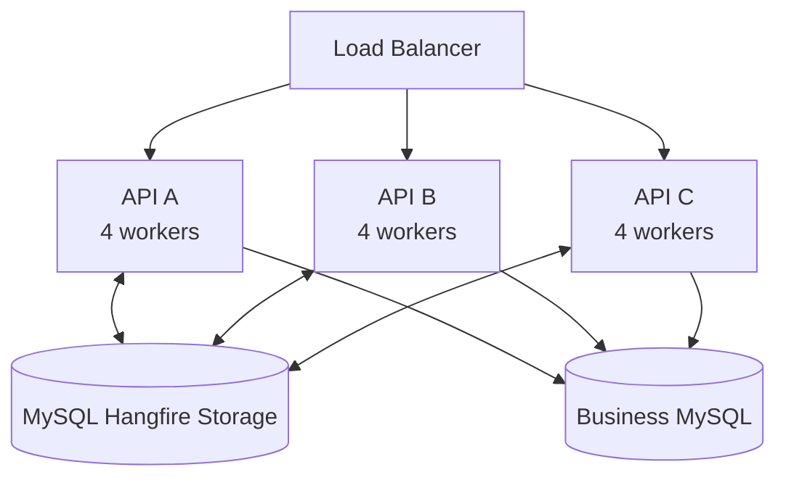
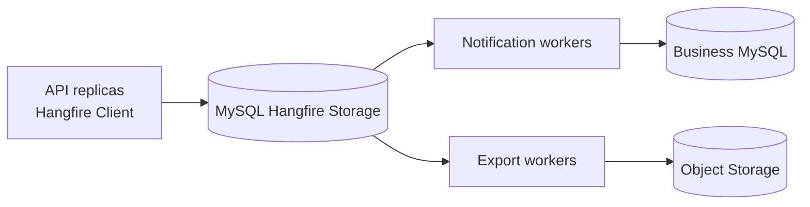
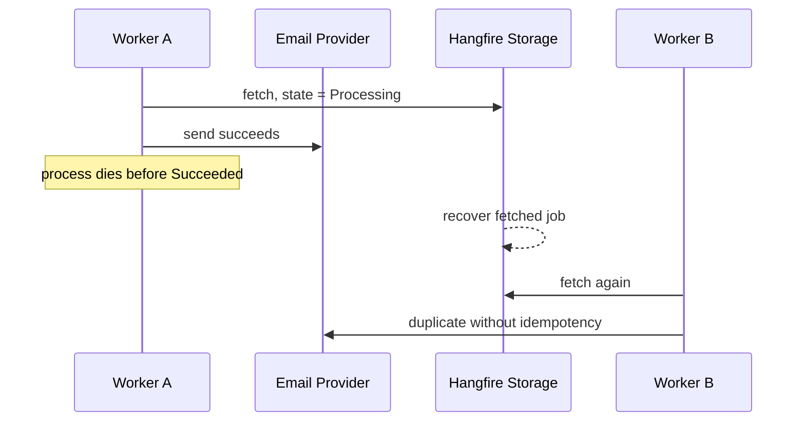
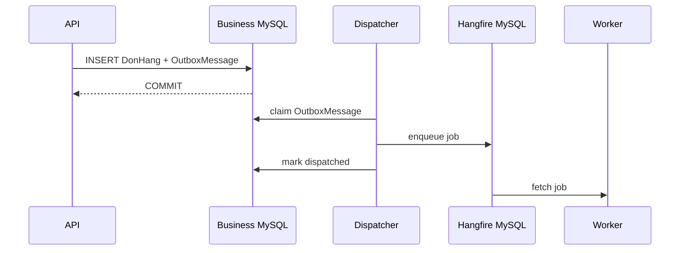
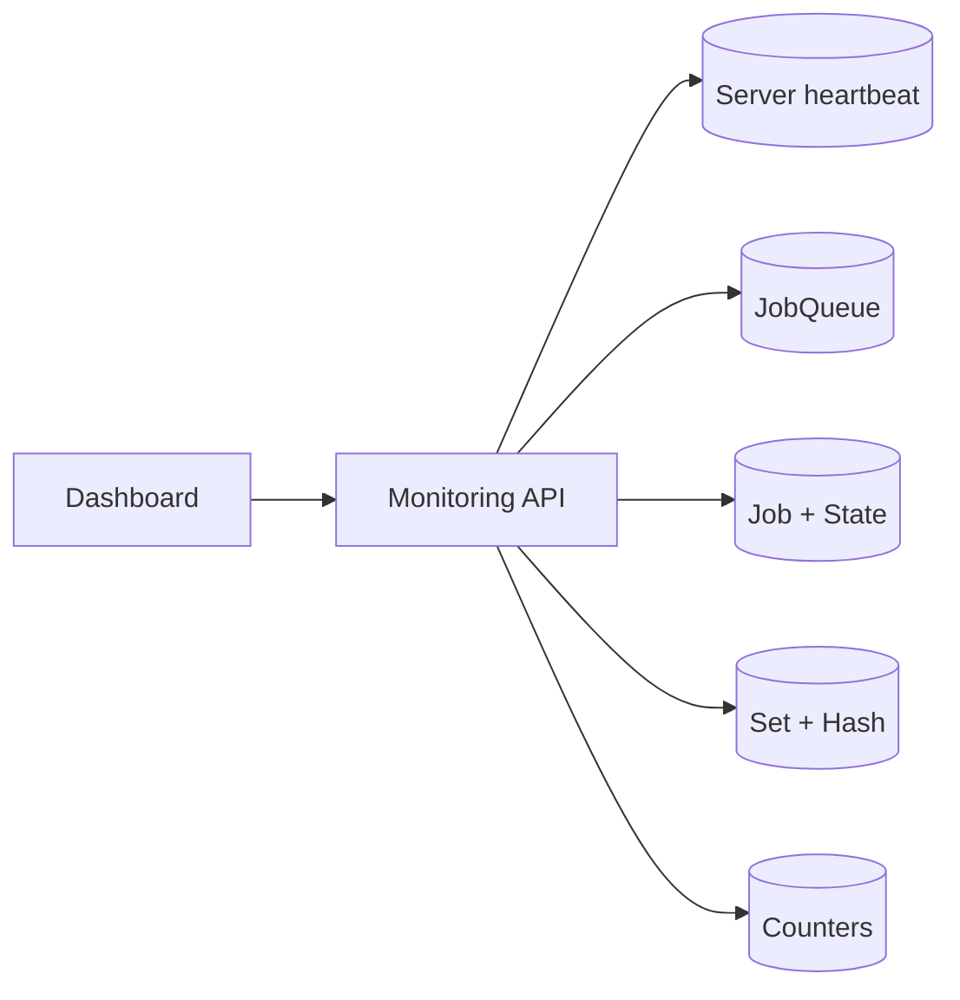
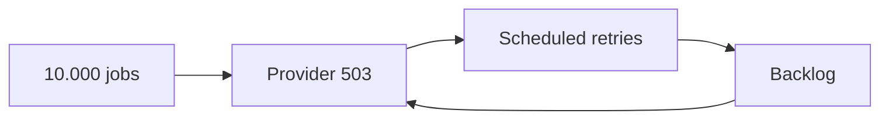

# Hangfire trong ASP.NET Core

Hangfire là framework thực thi background job cho .NET. Một background job là mô tả bền vững của một method invocation: type, method, arguments và execution metadata được lưu trong storage trước khi worker thực thi.

Chương này sử dụng ASP.NET Core trên .NET 6, MySQL và `Hangfire.MySqlStorage`. Business case xuyên suốt là hệ thống đặt đồ ăn multi-tenant: sau khi đơn hàng được tạo, background job gửi xác nhận cho khách hàng và đồng bộ dữ liệu liên quan tới shop.

`Hangfire.MySqlStorage` là community storage provider. Compatibility giữa Hangfire Core, provider, MySQL connector và MySQL server thuộc dependency evaluation trước khi triển khai production.

## Background processing boundary

HTTP request không phải execution boundary phù hợp cho mọi công việc. Tác vụ gửi email, sinh tài liệu, đồng bộ hệ thống ngoài hoặc tổng hợp báo cáo có latency và failure mode độc lập với request tạo ra chúng.

Luồng đồng bộ giữ toàn bộ công việc trong request:

```text
POST /api/don-hang
  -> ghi DonHang
  -> gọi email provider
  -> đồng bộ menu
  -> trả response
```

Latency của endpoint bằng tổng latency của mọi dependency. Một timeout từ email provider có thể làm client nhận lỗi dù `DonHang` đã được ghi thành công.

Background processing tách acceptance khỏi execution:



Việc tách nền thay đổi failure model. Hệ thống phải xử lý duplicate execution, retry, process crash, deploy compatibility và reconciliation.

## Runtime architecture

Hangfire gồm bốn vai trò: Client, Storage, Server và Dashboard.



### Client

Client nhận expression mô tả lời gọi method, serialize invocation và ghi job vào storage. Client không thực thi business method.

```csharp
var jobId = backgroundJobClient.Enqueue<IGuiXacNhanDonHangJob>(
    job => job.ExecuteAsync(donHangId, CancellationToken.None));
```

Expression trên tạo logical payload:

```text
Type      = IGuiXacNhanDonHangJob
Method    = ExecuteAsync
Arguments = [donHangId, CancellationToken placeholder]
Queue     = default
CreatedAt = enqueue time
```

DI scope, `HttpContext`, connection và transaction của HTTP request không được serialize. Worker tạo execution scope mới tại thời điểm chạy.

### Storage

Storage là nguồn sự thật kỹ thuật cho payload, state history, queue, recurring schedule, server heartbeat và monitoring counters. Persistence cho phép job tồn tại sau process restart.

Storage không thay thế business database. State `Succeeded` mô tả method execution của Hangfire; trạng thái nghiệp vụ của `DonHang` vẫn thuộc database nghiệp vụ.

### Server và worker

Hangfire Server là tập background process chạy trong một .NET process.

| Thành phần | Trách nhiệm |
| --- | --- |
| Worker | Fetch và thực thi job từ queue. |
| Schedule poller | Chuyển delayed hoặc retry job đã đến hạn sang queue. |
| Recurring scheduler | Tạo fire-and-forget job từ recurring definition. |
| Heartbeat process | Cập nhật trạng thái sống của server trong storage. |
| Expiration manager | Dọn dữ liệu hết retention. |
| Counter aggregator | Tổng hợp counter phục vụ monitoring. |

`WorkerCount` là số execution slot của một server, không phải tổng số background process.

### Dashboard

Dashboard là projection vận hành đọc qua Monitoring API của storage. Dashboard không tham gia execution path và không bắt buộc để job chạy.

## Persistence model trên MySQL

Hangfire Core định nghĩa storage abstraction; `Hangfire.MySqlStorage` hiện thực abstraction đó bằng bảng, transaction, polling và distributed coordination trên MySQL.

### Logical schema



Sơ đồ mô tả logical schema và quan hệ trách nhiệm. Physical schema được xác định bởi storage provider, package version và `TablesPrefix`.

| Nhóm bảng | Nội dung | Vai trò vận hành |
| --- | --- | --- |
| `Job` | Invocation payload, arguments, creation time, current state | Truy xuất job và state hiện tại. |
| `State` | State history, reason và state data | Phân tích attempt, exception và retry. |
| `JobParameter` | Metadata phụ gắn với job | Phục vụ filter và internal component. |
| `JobQueue` | Queue item và fetch metadata | Điều phối worker nhận job. |
| `Server` | Identity, heartbeat, queues và worker metadata | Phát hiện server đang hoạt động. |
| `Set`, `Hash`, `List` | Cấu trúc dữ liệu tổng quát | Scheduled set, recurring definition và coordination data. |
| `Counter`, `AggregatedCounter` | Monitoring counters | Cung cấp số liệu cho Dashboard. |
| `Schema` | Storage schema version | Kiểm soát compatibility của provider. |

Business code không truy vấn hoặc cập nhật trực tiếp các bảng này. Thao tác job đi qua Hangfire Client, Monitoring API hoặc Dashboard để giữ compatibility với provider.

### Enqueue transaction

Fire-and-forget job được tạo bằng một storage transaction logic:

```text
BEGIN
  INSERT Job
  INSERT State(Name = Enqueued)
  UPDATE Job(CurrentState = Enqueued)
  INSERT JobQueue(Queue = default)
COMMIT
```

`Enqueue` trả `jobId` sau khi storage chấp nhận transaction. Kết quả này xác nhận job đã được lưu, không xác nhận business method đã hoàn thành.

### State model

Current state phục vụ truy vấn nhanh; state history bảo toàn diễn tiến của job.



Một job retry có thể có history:

```text
Enqueued
Processing  server=worker-a
Failed      TimeoutException
Scheduled   attempt=1
Enqueued
Processing  server=worker-b
Succeeded
```

`Failed` trong history không đồng nghĩa current state là `Failed`; retry filter có thể đã chuyển job sang `Scheduled`.

## Cấu hình .NET 6 và MySQL

### Package và database

```bash
dotnet add package Hangfire.AspNetCore --version 1.8.23
dotnet add package Hangfire.MySqlStorage --version 2.0.3
```

Version được pin để deployment có dependency graph xác định. Nâng version bao gồm release-note review, storage migration và rolling-deploy compatibility.

```sql
CREATE DATABASE food_jobs
    CHARACTER SET utf8mb4
    COLLATE utf8mb4_unicode_ci;
```

```json
{
  "ConnectionStrings": {
    "Hangfire": "Server=localhost;Port=3306;Database=food_jobs;User Id=hangfire_app;Password=secret;Allow User Variables=True"
  }
}
```

`Allow User Variables=True` là requirement của provider. Production secret thuộc secret store hoặc environment configuration.

### Service registration

```csharp
using System.Data;
using Hangfire;
using Hangfire.MySql;

var builder = WebApplication.CreateBuilder(args);

var connectionString = builder.Configuration
    .GetConnectionString("Hangfire")
    ?? throw new InvalidOperationException("Missing Hangfire connection string.");

builder.Services.AddHangfire(configuration => configuration
    .SetDataCompatibilityLevel(CompatibilityLevel.Version_180)
    .UseSimpleAssemblyNameTypeSerializer()
    .UseRecommendedSerializerSettings()
    .UseStorage(new MySqlStorage(
        connectionString,
        new MySqlStorageOptions
        {
            TransactionIsolationLevel = IsolationLevel.ReadCommitted,
            QueuePollInterval = TimeSpan.FromSeconds(5),
            JobExpirationCheckInterval = TimeSpan.FromHours(1),
            CountersAggregateInterval = TimeSpan.FromMinutes(5),
            PrepareSchemaIfNecessary = false,
            DashboardJobListLimit = 50_000,
            TransactionTimeout = TimeSpan.FromMinutes(1),
            TablesPrefix = "Hangfire"
        })));

builder.Services.AddHangfireServer(options =>
{
    options.Queues = new[] { "critical", "notification", "default" };
    options.WorkerCount = 4;
});
```

`PrepareSchemaIfNecessary = true` phù hợp local development. Production schema được cài bằng deployment step; runtime account chỉ giữ quyền DML cần thiết.

### Storage options

| Option | Cơ chế | Tác động cấu hình |
| --- | --- | --- |
| `TransactionIsolationLevel` | Isolation của transaction nội bộ provider | `ReadCommitted` là default được provider công bố. |
| `QueuePollInterval` | Chu kỳ tìm queue item | Khoảng ngắn giảm queue latency và tăng query rate. |
| `JobExpirationCheckInterval` | Chu kỳ dọn record hết hạn | Khoảng quá ngắn tạo cleanup pressure. |
| `CountersAggregateInterval` | Chu kỳ tổng hợp counter | Quyết định độ mới của số liệu Dashboard. |
| `PrepareSchemaIfNecessary` | Tự cài physical schema | Liên quan trực tiếp tới quyền DDL runtime. |
| `DashboardJobListLimit` | Giới hạn danh sách job | Giới hạn memory và query volume của Dashboard. |
| `TransactionTimeout` | Timeout storage transaction | Độc lập với timeout business job. |
| `TablesPrefix` | Namespace vật lý của bảng | Phải thống nhất giữa producer và worker. |

MySQL mặc định thường sử dụng `REPEATABLE READ`; provider có thể mở transaction với isolation được cấu hình riêng. Storage transaction và business `DbContext` transaction vẫn độc lập nếu không dùng chung connection và transaction.

## Job contract và execution

### Job method

```csharp
public interface IGuiXacNhanDonHangJob
{
    Task ExecuteAsync(Guid donHangId, CancellationToken cancellationToken);
}
```

Argument chứa business identifier thay vì entity snapshot. Worker đọc trạng thái mới nhất tại execution time và xử lý record đã xóa hoặc state đã thay đổi.

```csharp
public sealed class GuiXacNhanDonHangJob : IGuiXacNhanDonHangJob
{
    private readonly IDonHangRepository _repository;
    private readonly IEmailClient _emailClient;

    public GuiXacNhanDonHangJob(
        IDonHangRepository repository,
        IEmailClient emailClient)
    {
        _repository = repository;
        _emailClient = emailClient;
    }

    [Queue("notification")]
    [AutomaticRetry(Attempts = 5)]
    public async Task ExecuteAsync(
        Guid donHangId,
        CancellationToken cancellationToken)
    {
        var donHang = await _repository.GetRequiredAsync(
            donHangId,
            cancellationToken);

        if (donHang.DaGuiXacNhan)
            return;

        await _emailClient.SendOrderConfirmationAsync(
            donHang.Email,
            donHang,
            $"gui-xac-nhan:{donHang.Id}",
            cancellationToken);

        donHang.DanhDauDaGuiXacNhan();
        await _repository.SaveChangesAsync(cancellationToken);
    }
}
```

Hangfire tạo DI scope cho mỗi execution. Scoped dependency như `DbContext` được resolve trong scope của job và dispose sau execution.

### Job types

| Loại | Cơ chế | Use case |
| --- | --- | --- |
| Fire-and-forget | Enqueue một lần khi có worker | Gửi xác nhận đơn hàng. |
| Delayed | Chờ due time trong scheduled set | Hủy reservation hết hạn. |
| Recurring | Cron definition tạo fire-and-forget job | Đồng bộ menu định kỳ. |
| Continuation | Phụ thuộc state cuối của job cha | Gửi notification sau khi PDF hoàn tất. |

```csharp
var jobId = backgroundJobClient.Enqueue<IGuiXacNhanDonHangJob>(
    job => job.ExecuteAsync(donHangId, CancellationToken.None));

backgroundJobClient.Schedule<IHuyGiuChoJob>(
    job => job.ExecuteAsync(donHangId, CancellationToken.None),
    TimeSpan.FromMinutes(15));

RecurringJob.AddOrUpdate<IDongBoMenuJob>(
    $"sync-menu:{tenantId:N}:{shopId:N}",
    job => job.ExecuteAsync(tenantId, shopId, CancellationToken.None),
    "*/10 * * * *",
    new RecurringJobOptions { TimeZone = TimeZoneInfo.Utc });
```

`CancellationToken.None` là placeholder trong expression. Hangfire thay argument này bằng execution token. Recurring ID chứa tenant và shop scope để các definitions không ghi đè lẫn nhau.

## Multiple instances

### Shared-storage topology

Nhiều Hangfire Server dùng chung MySQL storage. Mỗi server có identity và heartbeat riêng; worker cạnh tranh fetch thông qua provider.



Ba replicas với `WorkerCount = 4` tạo tối đa 12 execution slots. Autoscaling HTTP replicas đồng thời thay đổi background concurrency nếu mỗi API process chạy `AddHangfireServer`.

`WorkerCount` được xác định từ capacity toàn cụm: MySQL connection pool, external rate limit, CPU, memory và job duration. CPU-based formula không phản ánh các giới hạn I/O này.

### Worker Service topology



API đăng ký `AddHangfire` nhưng không đăng ký `AddHangfireServer`. Worker Service đăng ký cả storage và server. Các process thống nhất connection string, `TablesPrefix`, provider version, queue names, serializer và job contract.

Worker riêng phù hợp với workload cần scale độc lập hoặc cô lập CPU/RAM. In-process server giữ topology đơn giản hơn cho workload nhỏ.

### Queue isolation và polling

Queue cô lập workload và cho phép scale từng worker pool. Queue không tạo priority guarantee nếu provider không cam kết processing order tương ứng với vị trí trong `options.Queues`.

Job trong queue không có worker giữ state `Enqueued`. Dashboard biểu diễn queue length và oldest-job age tăng trong khi server coverage bằng không.

`QueuePollInterval` kiểm soát trade-off giữa queue latency và MySQL query rate:

```text
Queue latency cao, MySQL còn capacity
  -> giảm polling interval hoặc tăng worker có kiểm soát

MySQL CPU/connection cao, queue tiếp tục tăng
  -> tăng worker làm tăng contention
  -> giảm concurrency, profile storage query hoặc tách workload
```

## Delivery semantics và correctness

### At-least-once execution

Reliable dequeue ưu tiên không làm mất job. Job có thể chạy lại khi worker chết hoặc state cuối chưa được ghi.



Hangfire không cung cấp exactly-once side effect. Correctness boundary nằm tại business database hoặc external provider.

### Idempotency và retry

Idempotency key cho email xác nhận:

```text
gui-xac-nhan:{donHangId}
```

Provider hỗ trợ idempotency key trả cùng logical result cho các request trùng key. Nếu provider không hỗ trợ, adapter sử dụng execution record với unique constraint trên `(tenantId, businessKey, operation)`.

```sql
CREATE TABLE JobExecution (
    id CHAR(36) NOT NULL,
    tenantId CHAR(36) NOT NULL,
    businessKey VARCHAR(100) NOT NULL,
    operation VARCHAR(100) NOT NULL,
    status VARCHAR(30) NOT NULL,
    updatedAt DATETIME(6) NOT NULL,
    PRIMARY KEY (id),
    UNIQUE KEY uq_job_execution_scope
        (tenantId, businessKey, operation)
);
```

Retry phù hợp với transient failure như timeout, connection reset, HTTP 429 hoặc một số HTTP 5xx. Validation error, missing configuration và malformed recipient là permanent failure. Mọi mutation nằm sau retry boundary cần idempotency trước khi tăng attempts.

### Distributed lock và business concurrency

Distributed lock của storage phối hợp scheduler và server processes. Nó không khóa row `DonHang`, không chống oversell và không kết hợp business database với external API thành atomic transaction.

Stock reservation thuộc business database:

```sql
UPDATE TonKho
SET soLuong = soLuong - @soLuongDat
WHERE tenantId = @tenantId
  AND shopId = @shopId
  AND hangHoaId = @hangHoaId
  AND soLuong >= @soLuongDat;
```

`rowsAffected = 1` xác nhận reservation thành công. `rowsAffected = 0` biểu diễn conflict hoặc không đủ tồn theo use-case contract.

### Outbox

Business transaction và Hangfire storage transaction độc lập tạo lost-intent window:

```text
COMMIT DonHang
process crash
chưa enqueue GuiXacNhanDonHang
```



Outbox loại lost intent nhưng không loại duplicate: dispatcher có thể crash sau enqueue và trước `mark dispatched`. Consumer idempotency vẫn là requirement độc lập.

## Multi-tenancy

Background job không có HTTP host, request header hoặc authenticated user của request ban đầu. Tenant context được khôi phục từ dữ liệu bền vững.

Job contract có thể chứa tenant scope:

```csharp
Task ExecuteAsync(
    Guid tenantId,
    Guid shopId,
    CancellationToken cancellationToken);
```

Một contract khác chỉ nhận `donHangId`, sau đó repository tải `tenantId` từ business record bằng lookup không phụ thuộc current tenant filter.

Sau khi tenant được xác định, execution scope thiết lập `TenantContext` trước tenant-scoped query. Dapper query vẫn có explicit tenant predicate:

```sql
SELECT id, trangThai
FROM DonHang
WHERE id = @donHangId
  AND tenantId = @tenantId;
```

## Cancellation và shutdown

Cancellation trong Hangfire là cooperative cancellation. Hangfire phát tín hiệu qua `CancellationToken`; business method kết thúc tại safe point và truyền token xuống I/O API.

```csharp
public async Task ExecuteAsync(Guid donHangId, CancellationToken cancellationToken)
{
    var donHang = await _repository.GetAsync(donHangId, cancellationToken);
    cancellationToken.ThrowIfCancellationRequested();
    await _emailClient.SendAsync(donHang, cancellationToken);
}
```

Cancellation không rollback side effect đã hoàn tất. Sau khi provider nhận request, execution tiếp theo dựa trên idempotency hoặc reconciliation.

Graceful shutdown cho worker thời gian quan sát cancellation và trả job về trạng thái có thể recovery. Kill đột ngột vẫn thuộc failure model.

## Dashboard

### Information model



| Khu vực | Dữ liệu | Ý nghĩa vận hành |
| --- | --- | --- |
| Overview | State counters và history graph | Processing trend tổng quát. |
| Servers | Identity, heartbeat, workers, queues | Trạng thái worker processes. |
| Queues | Queue length và server coverage | Backlog và queue không có consumer. |
| Enqueued | Job chờ fetch | Queue latency và oldest-job age. |
| Processing | Job đang được worker giữ | Long-running hoặc stalled execution. |
| Scheduled | Delayed job và retry | Retry storm hoặc scheduled backlog. |
| Succeeded | Method execution hoàn tất | Không chứng minh side effect exactly-once. |
| Failed | Current failed jobs và exception | Permanent failure hoặc exhausted retry. |
| Recurring Jobs | Cron, timezone, next/last execution | Trạng thái recurring definitions. |

Failure diagnosis:

```text
Không có email xác nhận
  -> không có job: producer hoặc Outbox dispatcher
  -> Enqueued lâu: queue coverage và worker capacity
  -> Scheduled: exception và next retry
  -> Processing lâu: dependency, duration, heartbeat
  -> Failed: transient/permanent classification
  -> Succeeded: provider log, business state, idempotency record
```

State `Succeeded` chỉ xác nhận method trả về không ném exception. Code catch exception rồi tiếp tục làm technical state lệch khỏi business result.

### Security

Dashboard hiển thị method, serialized arguments, exception và stack trace; đồng thời cung cấp retry, delete và trigger operations. Endpoint cần authentication, role authorization và network restriction.

```csharp
public sealed class HangfireAuthorizationFilter : IDashboardAuthorizationFilter
{
    public bool Authorize(DashboardContext context)
    {
        var httpContext = context.GetHttpContext();
        return httpContext.User.Identity?.IsAuthenticated == true
            && httpContext.User.IsInRole("HangfireAdmin");
    }
}
```

```csharp
app.UseAuthentication();
app.UseAuthorization();
app.UseHangfireDashboard("/hangfire", new DashboardOptions
{
    Authorization = new[] { new HangfireAuthorizationFilter() },
    IsReadOnlyFunc = context =>
        !context.GetHttpContext().User.IsInRole("HangfireOperator")
});
```

Job arguments không chứa password, access token hoặc dữ liệu cá nhân không cần thiết. Retry, delete và manual trigger thuộc audit trail vận hành.

## Production operation

### Deployment compatibility

Schema installation thuộc deployment pipeline; runtime account chỉ có DML permission. Rolling deployment giữ compatibility với queued payload:

```text
deploy worker đọc được V1 và V2
  -> deploy producer bắt đầu tạo V2
  -> V1 queue, schedule và retry drain
  -> loại V1 khỏi worker
```

Đổi namespace, assembly, type, method signature hoặc argument DTO trước khi job cũ drain có thể làm worker không deserialize được payload.

### Observability

Dashboard phục vụ điều tra từng job; monitoring system chịu trách nhiệm alert và historical metrics.

- Queue length và oldest-job age theo queue.
- Enqueue-to-start latency.
- Execution duration và throughput theo job type.
- Failed rate, retry rate và exhausted retries.
- Server heartbeat age.
- MySQL connection utilization, query latency và lock wait.
- External dependency latency, rate limit và error rate.

Structured log của mỗi execution gồm `jobId`, `tenantId`, business key, job type, attempt và trace context.

### Operational failure cases

#### Queue không có worker

Job giữ state `Enqueued`; queue length và oldest-job age tăng. Server view không có instance đăng ký queue tương ứng. Nguyên nhân thường là queue name khác giữa producer và worker hoặc worker deployment thiếu queue configuration.

#### Retry storm



Worker limit, queue isolation, backoff và circuit/rate policy giới hạn amplification. Permanent error không đi vào cùng retry policy với transient error.

#### Manual retry sau timeout

Timeout không chứng minh provider chưa xử lý request. Manual retry payment hoặc notification dựa trên provider status và idempotency record, không chỉ technical state của Hangfire.

## Keyword reference

| Keyword | Định nghĩa |
| --- | --- |
| Background job | Method invocation được serialize và lưu để thực thi ngoài request hiện tại. |
| Client | Thành phần tạo và persist job. |
| Storage | Nguồn sự thật kỹ thuật cho job, state, queue và server. |
| Hangfire Server | Tập background process điều phối qua storage. |
| Worker | Execution slot fetch và chạy một job tại một thời điểm. |
| Queue | Kênh logic phân workload tới worker pool. |
| State | Một trạng thái trong history của job. |
| State transition | Việc tạo state mới và cập nhật current state. |
| Filter | Hook quanh job creation, execution hoặc state election. |
| Automatic retry | Filter chuyển failed attempt thành scheduled attempt mới. |
| Scheduled job | Job một lần chờ due time. |
| Recurring job | Cron definition tạo các fire-and-forget job. |
| Continuation | Job phụ thuộc state cuối của job cha. |
| Heartbeat | Tín hiệu định kỳ của Hangfire Server trong storage. |
| Distributed lock | Coordination giữa processes qua shared storage. |
| Job activator | Thành phần tạo job instance và DI scope. |
| Poison job | Job luôn thất bại vì input hoặc permanent error. |
| Outbox | Processing intent được lưu cùng business transaction. |
| Idempotency | Cùng operation key được áp dụng nhiều lần nhưng chỉ tạo một logical effect. |

## Verification checklist

- Client và worker dùng cùng database, `TablesPrefix` và provider version.
- Mỗi queue có ít nhất một worker pool.
- Tổng worker count phù hợp MySQL và external dependency capacity.
- Job argument nhỏ, ổn định và không chứa secret.
- Tenant context được khôi phục từ dữ liệu bền vững.
- Retry policy phân biệt transient và permanent error.
- Side effect có idempotency key, unique constraint hoặc reconciliation.
- Outbox bảo vệ business operation không chấp nhận lost intent.
- Dashboard có authorization, network restriction và read-only role.
- Rolling deployment giữ compatibility với queued payload.
- Monitoring sử dụng queue age, failure rate và heartbeat.

## Tài liệu tham khảo

- [Hangfire documentation](https://docs.hangfire.io/en/latest/)
- [ASP.NET Core applications](https://docs.hangfire.io/en/latest/getting-started/aspnet-core-applications.html)
- [Processing background jobs](https://docs.hangfire.io/en/latest/background-processing/processing-background-jobs.html)
- [Running multiple server instances](https://docs.hangfire.io/en/latest/background-processing/running-multiple-server-instances.html)
- [Configuring job queues](https://docs.hangfire.io/en/latest/background-processing/configuring-queues.html)
- [Using Dashboard UI](https://docs.hangfire.io/en/latest/configuration/using-dashboard.html)
- [Hangfire.MySqlStorage repository](https://github.com/arnoldasgudas/Hangfire.MySqlStorage)
- [Hangfire.MySqlStorage package](https://www.nuget.org/packages/Hangfire.MySqlStorage/)
