# RabbitMQ và kiến trúc Message Queue trong .NET

Khi khách hàng xác nhận đặt món, đơn hàng phải được lưu trước khi server trả kết quả.

Sau khi đơn hàng được tạo, hệ thống còn ba công việc:

- Thông báo cho shop.
- Gửi email xác nhận cho khách hàng.
- Chuyển dữ liệu bán hàng sang hệ thống báo cáo.

Nếu ba công việc cùng nằm trong HTTP request, thời gian phản hồi phụ thuộc vào mọi hệ thống tham gia.

Một email provider phản hồi chậm có thể kéo dài thao tác đặt món, dù đơn hàng đã được lưu. Nếu provider lỗi sau khi transaction commit, server còn phải quyết định kết quả của request dựa trên một tác vụ phụ.

Business case xuyên suốt là một nền tảng đặt đồ ăn multi-tenant.

- Đơn hàng được quản lý theo shop.
- Menu có thể dùng chung trong tenant hoặc được đồng bộ xuống chi nhánh.
- Tồn kho tương lai có thể được theo dõi theo nhiều lô.

Production base hiện chỉ triển khai phần kết nối và publish trên .NET 6. Consumer nghiệp vụ, Outbox, Inbox và FEFO vẫn là reference model đã được kiểm chứng bằng integration test.

## 1. Luồng xử lý đồng bộ

### 1.1 Giao dịch đặt món

Giả sử khách hàng xác nhận đơn. API cần lưu đơn, gửi email cho khách, thông báo cho shop và cập nhật một hệ thống báo cáo.

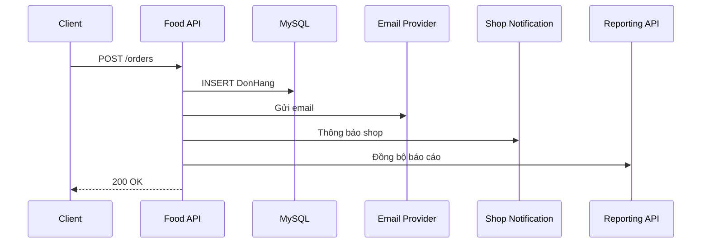

Mọi bước trong sơ đồ chạy tuần tự. Một lần xử lý có thể gồm:

| Công việc | Thời gian giả định |
|---|---:|
| Ghi MySQL | 80 ms |
| Gửi email | 600 ms |
| Thông báo shop | 300 ms |
| Đồng bộ báo cáo | 400 ms |

Tổng thời gian đã đạt khoảng 1,38 giây, chưa tính network fluctuation.

Khi tải tăng, vấn đề không chỉ là API phản hồi chậm hơn. Thread và database connection bị giữ trong suốt thời gian chờ email provider, shop notification và reporting API phản hồi, nên tài nguyên đó không được giải phóng để phục vụ request khác.

Vấn đề khó hơn latency xuất hiện khi một tác vụ phụ thất bại sau khi transaction đã commit. Nếu `DonHang` đã được lưu thành công nhưng gửi email bị timeout, API phải chọn một trong hai kết quả để trả về:

- **Trả thất bại** — client có thể hiểu là đơn chưa được tạo và gửi lại request, dẫn tới hai đơn hàng cho cùng một lần đặt món.
- **Trả thành công** — đúng với thực tế là đơn đã được lưu, nhưng hệ thống cần một cơ chế tiếp tục gửi email sau khi request đã kết thúc.

Sự lựa chọn này cho thấy luồng xử lý có hai nhóm công việc với lifecycle khác nhau:

- Nhóm quyết định kết quả của request: validate, kiểm tra invariant, tạo đơn và commit.
- Nhóm có thể hoàn thành sau: gửi xác nhận, cập nhật read model, phát event cho service khác.

Chỉ nhóm thứ hai là ứng viên của background processing.

### 1.2 Chạy nền trong cùng process

Gửi email không quyết định kết quả của request, nên có thể tách khỏi luồng xử lý chính và chạy nền. Có vài cách tiếp cận phổ biến cho việc này:

- `_ = Task.Run(() => ...)` — fire-and-forget ngay trong action.
- `ThreadPool.QueueUserWorkItem(...)` — bản chất tương tự `Task.Run`, chỉ khác API.
- Một `BackgroundService` đọc từ `Channel<T>` in-memory mà request ghi vào.

```csharp
await donHangService.CreateAsync(request, cancellationToken);

_ = Task.Run(() => emailService.SendAsync(request.Email));

return Ok();
```

API trả response ngay sau khi tạo đơn, không đợi `SendAsync` chạy xong. Nhưng dù chọn `Task.Run`, `ThreadPool.QueueUserWorkItem` hay `Channel` in-memory, cả ba đều có chung một điểm yếu — công việc chỉ tồn tại trong memory của process hiện tại, không được ghi lại ở bất kỳ đâu khác.

Điểm yếu đó thể hiện rõ ngay khi `SendAsync` throw exception:

```csharp
_ = Task.Run(async () =>
{
    await emailService.SendAsync(request.Email); // throw exception
});

return Ok(); // vẫn trả 200 OK
```

Khi dùng `Task.Run` nhưng bỏ qua `await`, mọi exception phát sinh từ `SendAsync` sẽ bị cô lập hoàn toàn bên trong `Task` đó và trở thành một unobserved exception. Kể từ .NET Core, các unobserved exception này không còn làm crash process mà chỉ lặng lẽ biến mất. Kết quả là hệ thống không ghi log, không bắn alert, và không còn dấu vết nào của những email gửi thất bại.

Ngay cả khi `SendAsync` không lỗi, công việc vẫn phụ thuộc vào việc process có sống đủ lâu để chạy xong hay không. Nếu process dừng giữa chừng, công việc cũng biến mất không dấu vết, hệt như trường hợp exception ở trên. Nguyên nhân dừng có thể đến từ:

- **Redeployment** — ứng dụng bị khởi động lại để cập nhật phiên bản mới.
- **Process crash** — tiến trình tự sập do một lỗi hệ thống khác.
- **Autoscaling scale-in** — hạ tầng tự động hủy bớt instance khi giảm tải.

Dù tiến trình có may mắn sống sót, giải pháp chắp vá này vẫn bộc lộ ba điểm yếu chí mạng của một kiến trúc xử lý nền (background processing):

- Thiếu nơi quản lý exception tập trung.
- Thiếu cơ chế retry khi đối tác (provider) lỗi tạm thời.
- Không thể bàn giao công việc sang instance khác nếu instance hiện tại gặp sự cố.

Suy cho cùng, gốc rễ vấn đề không nằm ở cú pháp `Task.Run` hay cách gọi API, mà nằm ở việc chọn sai tầng trừu tượng (abstraction):

- `Task`, `ThreadPool` hay `Channel` in-memory chỉ là công cụ xử lý bất đồng bộ (asynchronous work) — chúng sinh ra và chết đi cùng vòng đời của một process.
- **Gửi email** lại là một tác vụ bền vững (durable job) — nó bắt buộc phải tồn tại độc lập với process khởi tạo, sẵn sàng sống sót qua các đợt deploy, crash hay scale-in.

### 1.3 Một bảng công việc ngoài process

Mục 1.2 đã chỉ ra gốc rễ vấn đề: `Task`, `ThreadPool` hay `Channel` in-memory chỉ mô tả công việc sống trong memory của một process, trong khi gửi email cần là một durable job. Muốn công việc sống sót qua deploy, crash hay scale-in, nó phải được ghi lại ở một nơi tồn tại độc lập với process — và bất kỳ process nào, kể cả một process khác với process đã tạo ra nó, cũng phải đọc được.

Nơi lưu trữ đó có thể là bất cứ đâu ngoài memory của process — file, cache bền vững, hay đơn giản nhất là chính database mà hệ thống đang dùng để lưu business data.

Nối tiếp luồng "Giao dịch đặt món" ở mục 1.1, ghi `PendingJob` vào cùng transaction tạo `DonHang`: hai thao tác cùng commit hoặc cùng rollback, không thể có đơn mà thiếu job gửi email.

```text
HTTP request → INSERT PendingJob → COMMIT
worker       → SELECT pending rows → execute → mark completed
```

```csharp
await using var transaction = await db.Database.BeginTransactionAsync(cancellationToken);

var donHang = new DonHang(request);
db.DonHang.Add(donHang);

db.PendingJob.Add(new PendingJob
{
    JobType = "SendEmail",
    Payload = JsonSerializer.Serialize(new { donHang.Id, request.Email }),
    Status = "Pending",
    CreatedAtUtc = DateTimeOffset.UtcNow
});

await db.SaveChangesAsync(cancellationToken);
await transaction.CommitAsync(cancellationToken);

return Ok();
```

Một worker chạy riêng, định kỳ đọc các job đang chờ và xử lý:

```csharp
var jobs = await db.PendingJob
    .Where(j => j.Status == "Pending")
    .OrderBy(j => j.CreatedAtUtc)
    .Take(50)
    .ToListAsync(cancellationToken);

foreach (var job in jobs)
{
    await emailService.SendAsync(job.Payload);
    job.Status = "Completed";
}

await db.SaveChangesAsync(cancellationToken);
```

Cách này chỉ ổn với một worker và tác vụ đơn giản. Khi hệ thống lớn hơn, bốn bài toán hóc búa sẽ xuất hiện:

- **Xử lý trùng** — nhiều worker cùng nhảy vào lấy một việc, dẫn đến gửi trùng email cho khách. Phải tự viết code để "khóa" và "nhả" việc (claim, lease).
- **Gây nghẽn khi lỗi** — khi nhà cung cấp email bị sập, hệ thống thử lại liên tục sẽ tốn tài nguyên và chặn đường các công việc khác.
- **Dẫm chân lên nhau** — nhiều loại việc (email, báo cáo, đồng bộ) trộn chung một bảng khiến worker khó phân chia và nhận đúng việc.
- **Phình to dữ liệu** — bảng phình lên rất nhanh, mất kiểm soát lượng việc tồn đọng và phải tự viết code để dọn rác dữ liệu.

Bản thân một bảng database không sai, nhưng cố vá víu nó để giải quyết các vấn đề trên sẽ khiến nó dần trở thành một **Message Broker** tự viết — đó chính là lúc hệ thống cần được bàn giao cho một hạ tầng vận chuyển message chuyên dụng.

## 2. Message Queue và Message Broker

Mục 1.3 kết luận rằng gửi email cần một hạ tầng chuyên vận chuyển message, thay vì tiếp tục vá víu một bảng database. Trước khi tìm hiểu hạ tầng đó, cần phân biệt rõ hai khái niệm hay bị nhầm lẫn với nhau:

- **Message Queue** — Là **hàng đợi (queue)** giữa producer và consumer: producer đưa message vào queue rồi xong việc → consumer xử lý độc lập riêng.
- **Message Broker** — Là **hệ thống trung tâm** hiện thực hóa mô hình đó: nhận từ producer → lưu trong queue → giao cho consumer. Một broker có thể chứa nhiều queue.

Ba vai trò tham gia vào mô hình này:

- **Producer (Bên phát tin)** — tạo ra message, ví dụ API vừa tạo xong đơn hàng.
- **Message Broker (Hệ thống điều phối)** — nhận, lưu trữ và giao message.
- **Consumer (Bên xử lý)** — đọc message từ broker và thực hiện công việc, ví dụ worker gửi email.

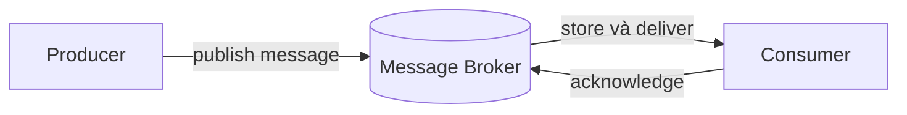

Sự xuất hiện của Message Broker mang lại hai bước ngoặt lớn về mặt kiến trúc cho hệ thống:

- **Decoupling** — producer không cần chờ consumer xử lý xong: client nhận phản hồi ngay, còn consumer có thể scale-out độc lập để tăng tốc khi tải tăng.
- **Resilience** — nếu consumer gặp sự cố hoặc tạm dừng, message vẫn nằm chờ an toàn trong queue thay vì mất cùng vòng đời của process. Broker điều phối redelivery và chỉ xóa message sau khi nhận được acknowledge từ consumer.

Việc tách producer khỏi consumer cũng không tránh khỏ những rủi ro, cụ thể như:

- Producer có thể không biết publish đã tới broker chưa.
- Broker có thể nhận message nhưng chưa có queue phù hợp.
- Consumer có thể xử lý xong rồi chết trước khi ACK.
- MySQL và broker không cùng một transaction.
- Message có thể được giao nhiều lần hoặc đến khác thứ tự mong muốn.

Một hệ thống reliable không né các tình huống đó. Nó chọn invariant rõ ràng và thiết kế recovery cho từng cửa sổ lỗi.

RabbitMQ, Kafka, AWS SQS hay BullMQ đều là những cách hiện thực khác nhau của Message Broker. Phần còn lại của bài tập trung vào RabbitMQ — hạ tầng đang được dùng trong production base.

## 3. Kiến trúc RabbitMQ

RabbitMQ chính là kiến trúc hiện thực mô hình ba bên (producer - broker - consumer) đã thảo luận ở mục 2. Nhưng khi áp dụng vào thực tế, mô hình cơ bản đó lộ ra một lỗ hổng lớn:

- Nó mặc định mỗi message chỉ đi vào một queue duy nhất.
- `order.created` — tên gọi cho sự kiện tạo đơn ở mục 1.1 — cần gửi đến hai hàng đợi độc lập (email và báo cáo). Nếu bắt bên gửi tự nhét tin nhắn vào từng nơi, nó buộc phải biết trước tên của tất cả các hàng đợi, dẫn đến việc phải sửa lại code liên tục mỗi khi hệ thống có thêm tính năng mới.
- Điều này xóa mất ý nghĩa decoupling (tách rời hệ thống) mà mô hình ban đầu hướng tới.

RabbitMQ giải quyết bài toán này bằng cách chèn thêm một "bộ phận phân loại thư" ở giữa, gọi là **Exchange**:

- **Producer** (người gửi) — không cần biết có bao nhiêu queue đang tồn tại. Nó chỉ gửi message vào exchange, kèm một nhãn mô tả nội dung gọi là **Routing Key**, ví dụ `order.created` (đã tạo đơn hàng).
- **Exchange** (bộ phận phân loại) — giống một bác bưu tá thông minh: dựa vào quy tắc thiết lập sẵn gọi là **Binding**, nó tự động sao chép message và chuyển vào mọi queue đã đăng ký nhận nhãn `order.created`.
- **Consumer** (người xử lý) — mỗi bên (email worker, report worker) chỉ cần đứng chờ ở đúng queue của mình để nhận message, hoàn toàn độc lập với nhau.

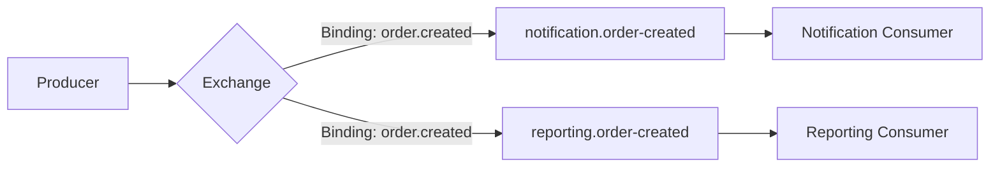

Nhờ vậy, producer chỉ cần phát đúng một fact `order.created`, không cần biết ai đang lắng nghe. Muốn thêm một consumer thứ ba, chỉ cần tạo thêm một queue mới và bind nó vào exchange với đúng routing key — producer không phải đổi một dòng code nào.

### 3.1 Các thành phần bên trong RabbitMQ

Hình dung RabbitMQ như một trung tâm bưu chính số: để một bức thư đi từ producer (người gửi) đến consumer (người nhận), nó phải đi qua bốn chặng.

#### Chặng 1 — Connection và Channel: đường cao tốc và làn đường logic

Trước khi gửi thư, cần có một con đường dẫn tới bưu điện.

- **Connection** (kết nối TCP) — giống một đường cao tốc vật lý nối từ ứng dụng tới RabbitMQ. Xây đường cao tốc tốn kém và mất thời gian, nên hệ thống chỉ xây một đường duy nhất rồi giữ nó luôn mở, thay vì làm lại mỗi lần gửi thư.
- **Channel** (kênh logic) — để tránh tắc nghẽn, đường cao tốc đó được chia thành nhiều làn nhỏ. Mỗi luồng xử lý trong ứng dụng chạy trên một làn riêng — mở thêm làn mới rất nhanh, không tốn kém như xây thêm đường cao tốc.

#### Chặng 2 — Exchange: bác bưu tá phân loại thư

Bưu điện không bắt người gửi tự đi tìm đúng hòm thư. Người gửi chỉ ném thư vào một cái máy phân loại tự động gọi là **Exchange**, kèm theo một cái nhãn (**Routing Key**, ví dụ `order.created`). Exchange nhìn nhãn đó và áp dụng luật phân loại (**Binding**) để ném thư vào đúng những hòm thư đang chờ:

- **Direct** (khớp chính xác) — nhãn ghi gì, ném đúng vào hòm thư ghi đúng chữ đó. Nhãn `order.created` chỉ vào hòm thư `order.created`.
- **Topic** (khớp theo nhóm) — phân loại theo cụm từ: thư dán nhãn `order.shipping` hay `order.success` đều gom vào một chỗ nếu luật ghi `order.*`.
- **Fanout** (phát tờ rơi) — bất kể nhãn ghi gì, Exchange nhân bản bức thư và phát đều vào mọi hòm thư đang có.

RabbitMQ còn một kiểu thứ tư là `headers`, phân loại theo metadata thay vì nhãn, nhưng ít dùng nên không đi sâu ở đây.

#### Chặng 3 — Queue: hòm thư chứa tin nhắn

Queue là những hòm thư vật lý, nơi thư nằm xếp hàng chờ người đến lấy. Hai quy tắc cần nhớ:

- **Chia việc** (competing consumers) — nếu ba nhân viên cùng đến lấy thư ở một hòm thư duy nhất, bưu điện chia đều cho từng người để xử lý nhanh hơn (scale-out). Một bức thư chỉ có đúng một người xử lý.
- **Tách biệt hệ thống** — nếu hai phòng ban khác nhau (email và báo cáo) cùng muốn nhận thư `order.created`, chúng không được dùng chung một hòm thư. Mỗi phòng phải có hòm thư riêng, cùng nối (bind) vào Exchange ở trên.

#### Chặng 4 — Virtual Host: các tầng tòa nhà độc lập

Khi nhiều môi trường (dev, staging, production) cùng dùng chung một cụm RabbitMQ, cần một cách để hòm thư của môi trường này không lẫn với môi trường khác.

**Virtual Host** giống như chia tòa nhà bưu điện thành các tầng biệt lập — tầng cho dev, tầng cho production. Đứng ở tầng này, không thể nhìn thấy hay ảnh hưởng tới cấu hình, hòm thư của tầng khác. Vhost là ranh giới hạ tầng, không thay thế tenant isolation trong business data.

## 4. Cài đặt RabbitMQ

Project sử dụng RabbitMQ Management image. Management plugin cung cấp HTTP API và giao diện quan sát exchange, queue, connection, channel và message rates.

```yaml
services:
  rabbitmq:
    image: rabbitmq:4.1.8-management-alpine
    container_name: food-delivery-rabbitmq
    restart: unless-stopped
    environment:
      RABBITMQ_DEFAULT_USER: food_app
      RABBITMQ_DEFAULT_PASS: food_dev
      RABBITMQ_DEFAULT_VHOST: food
    ports:
      - "5673:5672"
      - "15673:15672"
    volumes:
      - rabbitmq_data:/var/lib/rabbitmq
    healthcheck:
      test: ["CMD", "rabbitmq-diagnostics", "-q", "ping"]
      interval: 5s
      timeout: 5s
      retries: 12

volumes:
  rabbitmq_data:
```

Khởi động broker từ thư mục `backend`:

```powershell
docker compose up -d rabbitmq
docker compose ps rabbitmq
```

Hai port có hai vai trò khác nhau:

- `localhost:5673`: AMQP endpoint mà .NET client kết nối.
- `http://localhost:15673`: Management UI, đăng nhập bằng `food_app / food_dev` trong local environment.

Management UI chỉ hiển thị `Connections` sau khi application thực sự mở connection.

Foundation tạo connection theo cơ chế lazy. Khởi động API chưa làm connection xuất hiện — readiness check hoặc lần publish đầu tiên sẽ kích hoạt kết nối.

## 5. RabbitMQ Client trong .NET 6

Từ mục 1 đến 4, bài đã đi từ việc phát hiện vấn đề  (gửi email cần chạy nền và cần bền vững) đến giải pháp kiến trúc (RabbitMQ, Exchange, Queue, Binding). Mục này hiện thực kiến trúc đó trong .NET 6 với luồng tạo đơn hàng.

Solution này chia code thành ba tầng theo một chiều phụ thuộc duy nhất:

- **Domain** — business rule thuần, không phụ thuộc gì khác.
- **Application** — nơi định nghĩa nghiệp vụ cần làm gì (gọi là **use case**), thông qua các interface.
- **Infrastructure** — chi tiết kỹ thuật cụ thể: database, RabbitMQ, email provider... implement các interface đó.

Project ở lớp ngoài được phép reference lớp trong, nhưng chiều ngược lại thì không — Application không được reference Infrastructure.

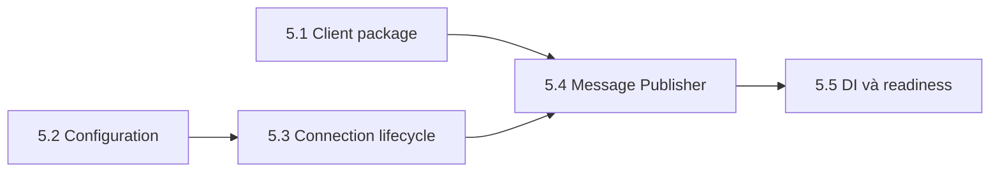

### 5.1 Client package

RabbitMQ chạy như một service riêng biệt (xem mục 4) — application giao tiếp với nó qua mạng, không gọi hàm trực tiếp. Vì vậy application cần một thư viện client để gửi/nhận message đúng cách RabbitMQ hiểu, thay vì tự viết lại giao thức đó từ đầu:

```powershell
dotnet add FoodDelivery.Infrastructure package RabbitMQ.Client --version 7.2.2
```

`RabbitMQ.Client` nằm ở Infrastructure vì đây là chi tiết I/O — cách byte được gửi qua mạng tới RabbitMQ.

#### Thiết kế "phong thư" chuẩn cho mọi event

Trước khi gửi một message ra ngoài, cần một chuẩn chung cho mọi loại event — giống như quy định thông tin bắt buộc phải ghi ngoài vỏ phong thư, bất kể bên trong là thư gì:

```csharp
public interface IIntegrationEvent
{
    Guid MessageId { get; } // định danh logic, không đổi qua các lần retry
    string EventName { get; } // tên sự kiện, ví dụ "order.created"
    int ContractVersion { get; } // version schema, cho phép rolling deployment
    DateTimeOffset OccurredAtUtc { get; } // thời điểm sự kiện xảy ra
    string? CorrelationId { get; } // nối request, outbox, broker và consumer logs
    Guid? TenantId { get; } // scope theo tenant trong hệ thống multi-tenant
}
```

#### Nơi phong thư được gửi đi

Use case (ví dụ: vừa tạo xong đơn hàng) không tự tay mang phong thư đi giao — nó chỉ ném phong thư vào một lối đi trung gian gọi là `IIntegrationEventPublisher`:

```csharp
public interface IIntegrationEventPublisher
{
    Task PublishAsync<TEvent>(
        TEvent integrationEvent,
        string routingKey, // nhãn để exchange định tuyến message
        CancellationToken cancellationToken = default)
        where TEvent : IIntegrationEvent;
}
```

#### Tại sao phải sinh ra Interface này

Nếu hệ thống chỉ dùng đúng một mình RabbitMQ, tại sao không gọi thẳng class RabbitMqPublisher cho nhanh mà phải tạo interface làm gì cho rườm rà?

Câu trả lời nằm ở **Ràng buộc bảo mật của kiến trúc**:

- **Quy tắc**: Tầng nghiệp vụ (Application) tuyệt đối không được biết và không được kết nối trực tiếp (Reference) tới tầng công nghệ (Infrastructure)
- **Lý do**: Tầng Application chỉ cần biết "Tôi muốn phát một sự kiện", nó không cần và không nên quan tâm bên dưới đang dùng RabbitMQ, Kafka, AWS SQS, hay đang mã hóa dữ liệu thành Byte như thế nào
- **Giải pháp**: Interface này chính là một "giao kèo". Application sẽ giữ giao kèo này để gọi hàm. Còn class thực tế cài đặt giao kèo đó (RabbitMqPublisher) sẽ nằm ẩn mình phía sau tầng Infrastructure.

`IIntegrationEventPublisher` chính là một "giao kèo"— Application giữ giao kèo này để gọi hàm, còn class thật sự thực hiện giao kèo đó. `RabbitMqPublisher` — nằm ẩn phía sau Infrastructure, được nối vào lúc chạy qua dependency injection. 

Nhờ vậy, nếu sau này đổi từ RabbitMQ sang Kafka, chỉ cần viết lại Infrastructure, toàn bộ code nghiệp vụ ở Application không phải sửa dòng nào.

### 5.2 Configuration

```json
"RabbitMq": {
  "HostName": "localhost", // host của RabbitMQ node
  "Port": 5673, // port AMQP client kết nối tới, khác port 15673 của Management UI
  "UserName": "food_app", // user đăng nhập
  "Password": "food_dev", // password, chỉ để plain text ở local
  "VirtualHost": "food", // vhost cô lập cấu hình, xem mục 3.1
  "ConnectionName": "food-delivery-api", // tên hiển thị trên Management UI, giúp nhận diện connection
  "ExchangeName": "food.events", // exchange mà publisher sẽ declare và publish vào
  "NetworkRecoverySeconds": 5, // thời gian chờ trước khi client tự thử reconnect sau khi mất kết nối
  "RequestedHeartbeatSeconds": 30 // chu kỳ heartbeat để phát hiện sớm một connection đã chết
}
```

> **Lưu ý:**
> - Credential trong ví dụ chỉ dành cho local Docker. Production lấy secret từ secret manager hoặc environment, bật TLS và cấp quyền tối thiểu theo vhost.
> - Nên validate các giá trị bắt buộc (host, credential, vhost, exchange) ngay lúc ứng dụng khởi động — gọi là fail fast. Ví dụ thiếu `UserName`:
>   - Không validate sớm => Lỗi chỉ lộ ra khi có request thật gọi, và rất khó đoán là do thiếu config.
>   - Validate lúc khởi động => App báo ngay "RabbitMq:UserName is required" rồi dừng lại.

### 5.3 Connection lifecycle

Mở một connection TCP mới cho mỗi lần gửi nghĩa là phải bắt tay lại từ đầu — thiết lập kết nối mạng rồi xác thực với RabbitMQ — việc này tạo ra hàng loạt connection ngắn hạn (socket churn), làm tốc độ gửi tin chậm đi.

`RabbitMqConnectionManager` giải quyết bằng cách giữ đúng một connection dài hạn, tái sử dụng cho mọi lần gửi:

```csharp
public sealed class RabbitMqConnectionManager : IAsyncDisposable
{
    private readonly ConnectionFactory _factory; // bộ cấu hình thông tin kết nối
    private readonly SemaphoreSlim _gate = new(1, 1); // "chốt cửa" chỉ cho một người qua một lúc
    private IConnection? _connection;

    public RabbitMqConnectionManager(RabbitMqOptions options)
    {
        _factory = new ConnectionFactory
        {
            HostName = options.HostName,
            Port = options.Port,
            UserName = options.UserName,
            Password = options.Password,
            VirtualHost = options.VirtualHost,
            AutomaticRecoveryEnabled = true, // tự nối lại khi rớt mạng
            TopologyRecoveryEnabled = true, // tự dựng lại exchange/queue sau khi có mạng lại
            NetworkRecoveryInterval = TimeSpan.FromSeconds(options.NetworkRecoverySeconds),
            RequestedHeartbeat = TimeSpan.FromSeconds(options.RequestedHeartbeatSeconds)
        };
    }

    public async Task<IConnection> GetConnectionAsync(
        CancellationToken cancellationToken = default)
    {
        // 1. Kết nối đang mở sẵn thì dùng luôn, không cần qua chốt
        if (_connection?.IsOpen == true) return _connection;

        // 2. Chưa có kết nối sống, phải xếp hàng qua chốt
        await _gate.WaitAsync(cancellationToken);
        try
        {
            // 3. Kiểm tra lại sau khi qua chốt, tránh tạo trùng
            if (_connection?.IsOpen == true) return _connection;
            if (_connection is not null) await _connection.DisposeAsync();

            // 4. Chỉ người đầu tiên qua chốt mới thật sự tạo kết nối mới
            _connection = await _factory.CreateConnectionAsync(
                "food-delivery-api",
                cancellationToken);
            return _connection;
        }
        finally
        {
            _gate.Release(); // mở chốt cho người tiếp theo
        }
    }
}
```

- **Chốt cửa `SemaphoreSlim`:**
  - Lúc application vừa khởi động, `_connection` đang null.
  - Nếu 100 request cùng gọi `GetConnectionAsync` một lúc mà không có chốt, cả 100 request sẽ cùng tạo 100 connection riêng — phá sản hoàn toàn ý tưởng **Tái sử dụng**.
  - `lock` thường của C# không dùng được vì bên trong có `await`, nên phải dùng `SemaphoreSlim` làm khóa bất đồng bộ thay thế.
- **Kỹ thuật kiểm tra (Double-checked locking):**
  - Lần 1 (trước chốt) là làn ưu tiên: hệ thống đã ổn định thì chỉ cần thấy connection còn sống là dùng ngay, không phải xếp hàng qua chốt.
  - Lần 2 (sau chốt) chỉ cần thiết lúc khởi động: ngăn trường hợp hai request cùng thấy `_connection` là null ở lần 1, rồi request tới sau lại tạo thêm một connection thừa sau khi request tới trước đã tạo xong.
- **Tự động phục hồi (Automatic Recovery):**
  - Giúp client tự nối lại khi mạng chập chờn.
  - Không giải quyết được trường hợp mạng đứt đúng lúc đang gửi — message đó có thể đã tới broker hoặc chưa, ứng dụng không có cách nào biết chắc.

### 5.4 Message Publisher

Sau khi đã có đường cao tốc (Connection) và các làn đường (Channel), đây là lúc thực hiện hành động quan trọng nhất: **Phát tin nhắn (Publish Message)**.

Để gửi một tin nhắn đi một cách an toàn và không bị thất lạc, phải trải qua 3 bước tuần tự, mỗi bước đều có một nhiệm vụ bảo vệ riêng biệt:

```csharp
// Bước 1: mở channel, bật xác nhận từ broker
_channel = await connection.CreateChannelAsync(
    new CreateChannelOptions(
        publisherConfirmationsEnabled: true, // broker phải báo lại đã nhận message (mục 12)
        publisherConfirmationTrackingEnabled: true), // client tự theo dõi confirm nào ứng với publish nào
    cancellationToken);

// Bước 2: đảm bảo exchange đã tồn tại trước khi publish
await _channel.ExchangeDeclareAsync(
    "food.events",
    ExchangeType.Direct, // khớp chính xác routing key
    durable: true, // exchange sống sót qua restart của RabbitMQ
    autoDelete: false, // không tự xóa dù không còn queue nào bind
    cancellationToken: cancellationToken);

// Bước 3: publish, yêu cầu broker báo lại nếu không route được
await _channel.BasicPublishAsync(
    exchange: "food.events",
    routingKey,
    mandatory: true,
    basicProperties: properties,
    body,
    cancellationToken);
```

- **Bước 1 — Bật Publisher Confirm**
  - Gửi thư thông thường — thả thư xong coi như xong, không biết thư có đến nơi không. Bật `publisherConfirmationsEnabled` giống gửi thư bảo đảm — RabbitMQ nhận được phải gửi lại một tín hiệu xác nhận riêng.
- **Bước 2 — Khai báo Exchange**
  - RabbitMQ không tự động sinh ra máy phân loại thư (Exchange) — ném thư vào một exchange chưa tồn tại, cod sẽ báo lỗi ngay. Do đó, hệ thống sử dụng lệnh `ExchangeDeclareAsync` lúc khởi động để tự động tạo Exchange — nếu chưa có thì tạo mới, nếu có rồi sẽ tự bỏ qua mà không gây lỗi, giúp hệ thống luôn sẵn sàng gửi tin nhắn một cách an toàn.
- **Bước 3 — Cờ `mandatory: true`**
  - Đây là chốt chặn cuối — nếu dán sai nhãn (routing key) khiến exchange không biết ném thư vào hòm thư (queue) nào, mặc định RabbitMQ sẽ âm thầm hủy thư đó. Cờ `mandatory: true` ép RabbitMQ trả ngược thư lỗi về cho ứng dụng để biết đường xử lý (mục 6).

Channel không an toàn khi dùng chung giữa nhiều thread cùng lúc, nên `SemaphoreSlim(1, 1)` được dùng để xếp hàng các lệnh publish qua cùng một channel — đổi lấy sự đơn giản trong ownership và lifecycle. Reference load đo khoảng 449 confirmed publish/giây với cách làm này — chỉ cần nâng cấp lên channel pool khi tải thực tế cao hơn nhiều và profiler xác nhận publisher là bottleneck.

Mỗi message publish đi kèm một số property, đóng vai trò như thông tin ghi ngoài vỏ phong thư:

| Property | Giá trị | Vai trò |
|---|---|---|
| `MessageId` | `event.MessageId` | Định danh logic, không đổi kể cả khi phải gửi lại (retry) |
| `Type` | `event.EventName` | Tên sự kiện, ví dụ `order.created` |
| `ContentType` | `application/json` | Định dạng của phần thân message |
| `DeliveryMode` | `persistent` | Yêu cầu broker ghi message xuống đĩa, sống sót qua việc RabbitMQ restart |
| `CorrelationId` | `event.CorrelationId` | Mã vết nối HTTP request, Outbox, broker và consumer logs |
| `x-event-version` | `event.ContractVersion` | Version schema, cho phép producer/consumer rolling deployment mà không đoán cấu trúc dữ liệu |
| `x-tenant-id` | `event.TenantId` | Scope theo tenant trong hệ thống multi-tenant |

### 5.5 Dependency Injection và readiness

Sau khi đã hoàn thiện quản lý kết nối **Connection Manager** và bộ gửi tin **Publisher**, bước tiếp theo là đăng ký chúng vào **DI container** của .NET để ứng dụng có thể đem ra sử dụng, đồng thời thiết lập cơ chế **Health Check** để giám sát RabbitMQ khi chạy thật:

```csharp
// đăng ký các thành phần sở hữu resource dài hạn
services.AddSingleton(rabbitMqOptions);
services.AddSingleton<RabbitMqConnectionManager>();
services.AddSingleton<RabbitMqPublisher>();

// map interface publish event sang implementation, để use case chỉ biết interface
services.AddSingleton<IIntegrationEventPublisher>(provider =>
    provider.GetRequiredService<RabbitMqPublisher>());

// health check để readiness probe biết RabbitMQ còn sống hay không
services.AddHealthChecks()
    .AddCheck<RabbitMqHealthCheck>("rabbitmq", tags: new[] { "ready" });
```

```csharp
app.MapHealthChecks("/health/ready", new HealthCheckOptions
{
    Predicate = registration => registration.Tags.Contains("ready")
});
```

#### Tại sao toàn bộ các lớp RabbitMQ phải đăng ký dạng Singleton?

`RabbitMqConnectionManager` và `RabbitMqPublisher` phải là Singleton — sống suốt vòng đời ứng dụng — vì chúng giữ tài nguyên dài hạn: connection và channel dùng chung cho mọi lần publish.

Đăng ký Scoped (tạo mới theo mỗi request) sẽ khiến ứng dụng liên tục mở và đóng connection sau mỗi request, vừa tốn tài nguyên vừa làm automatic recovery gần như vô nghĩa — vì chẳng còn connection nào đủ lâu để nó phục hồi.

#### Phân biệt Liveness và Readiness: tránh cái bẫy "bão khởi động lại"

**Độ sẵn sàng (Readiness Probe)** — probe báo instance đã sẵn sàng nhận traffic — nên phụ thuộc vào RabbitMQ: broker lỗi thì instance không publish được, nên cần báo "chưa sẵn sàng" để orchestrator tạm ngắt traffic vào nó.

**Độ sống sót (Liveness Probe)** — probe báo process còn sống, quyết định có nên restart hay không — thì không nên phụ thuộc vào RabbitMQ. Nếu liveness cũng check broker, một lần RabbitMQ lỗi tạm thời sẽ khiến orchestrator tưởng mọi instance đã chết và đồng loạt restart — tạo ra một "bão khởi động lại" (restart storm) dồn thêm tải đúng lúc hạ tầng đang gặp sự cố.

## 6. Message Publishing và Dashboard

Exchange chỉ định tuyến, không lưu trữ — publish vào exchange không tự động tạo ra chỗ chứa message. Nếu chưa có queue nào bind vào exchange, message publish ra sẽ không có nơi để đi vào và biến mất, không thể thấy trên Dashboard.

Vì vậy trước khi publish, cần tạo sẵn một queue và bind nó vào exchange. Trong Management UI:

1. Mở `Queues and Streams`, tạo durable queue `notification.order-created`.
2. Mở exchange `food.events`.
3. Thêm binding từ exchange tới queue với routing key `order.created`.
4. Gọi publisher với routing key `order.created`.
5. Quay lại queue và quan sát `Ready = 1` nếu chưa có consumer.

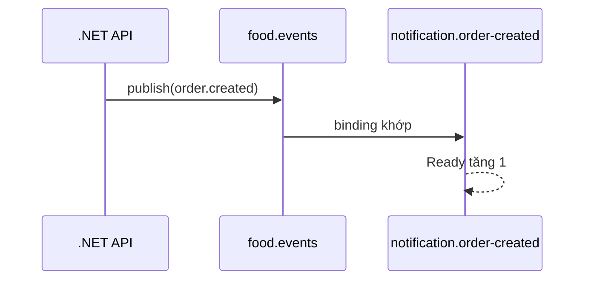

Nếu routing key không có binding, `mandatory = true` làm broker return message với `NO_ROUTE`.

Nếu bỏ `mandatory`, broker vẫn chấp nhận publish bình thường rồi âm thầm loại message vì không tìm được đích — và Publisher Confirm không phát hiện được điều đó, vì hai cơ chế này trả lời hai câu hỏi khác nhau:

- **Confirm** — broker đã nhận trách nhiệm cho publish chưa?
- **Mandatory** — message có thực sự được route vào ít nhất một queue không?

Một publish hoàn toàn có thể được Confirm nhưng vẫn bị mất, nếu không bật `mandatory`.

## 7. Work Queue và competing consumers

Ở mục 6, mỗi message trong `notification.order-created` chỉ có đúng một consumer đọc. Nhưng nếu traffic tăng và một consumer instance xử lý không kịp, câu hỏi tự nhiên là — có thể chạy nhiều instance cùng đọc chung queue đó để chia việc không?

RabbitMQ gọi mô hình này là Work Queue — nhiều consumer instance cùng subscribe một queue trở thành **Competing Consumers**. — chúng "cạnh tranh" nhau để nhận message, và mỗi message chỉ rơi vào tay đúng một instance, không phát cho tất cả. Nhiều instance vật lý này thực chất đóng vai trò như một logical consumer duy nhất — tất cả cùng làm một việc (gửi email) và chia nhau xử lý cùng một hàng đợi.

Ba instance A, B, C cùng subscribe `notification.order-created` sẽ chia nhau các message trong queue đó:

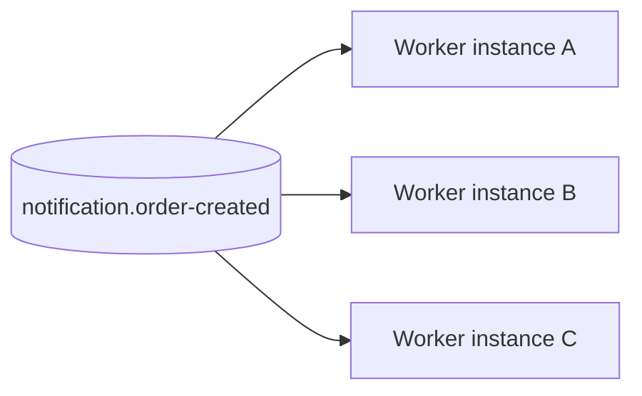

Ba instance A, B, C không nhận ba bản sao của cùng một message — chúng chia nhau xử lý, mỗi message chỉ đi vào đúng một instance. Điều này chỉ đúng vì cả ba đều là bản sao của cùng một logical consumer (cả ba cùng làm một việc là gửi email).

Cơ chế chia nhau đó cũng là lý do reporting không thể chỉ đọc chung queue `notification.order-created` — nó cần một queue riêng của chính mình, bind cùng exchange (như đã nói ở mục 3), để nhận một bản sao riêng của message.

Ví dụ dễ hình dung — coi queue như một băng chuyền hành lý ở sân bay.

- Hễ một người nhặt một món đồ, món đó biến mất khỏi băng chuyền — người khác không còn thấy nó nữa.
- Nếu nhân viên Email và nhân viên Báo cáo cùng đứng quanh một băng chuyền, đơn nào bị nhặt trước chỉ tới được đúng một phòng, phòng còn lại mất trắng đơn đó.
- Lâu dài, mỗi phòng chỉ nhận được khoảng một nửa dữ liệu.
- Mỗi phòng cần một băng chuyền riêng: mỗi đơn hàng đi qua exchange được sao thành nhiều bản, mỗi bản vào đúng một queue, để cả hai phòng đều nhận đủ 100% dữ liệu.

Nói cách khác, queue mới là thứ đại diện cho một subscription bền vững, tồn tại độc lập với việc có bao nhiêu consumer instance đang đọc nó. Consumer instance chỉ là năng lực xử lý (capacity) gắn vào subscription đó — thêm hay bớt instance không làm thay đổi bản thân subscription.

## 8. Message Acknowledgement

Khi RabbitMQ đẩy một message cho consumer xử lý, câu hỏi sống còn đặt ra là — lúc nào broker được phép xóa message đó khỏi hàng đợi?

Nếu broker vừa gửi message đi đã lập tức xóa ngay, trong khi consumer lại bất ngờ crash trước khi kịp thực hiện, message đó sẽ biến mất vĩnh viễn. Không ai gửi lại, không ai biết công việc đã thất bại.

Để giải quyết lỗ hổng này, RabbitMQ sử dụng cơ chế **ACK** (acknowledgement) — một tín hiệu phản hồi do consumer chủ động gửi ngược lại để báo: "Tôi đã xử lý xong việc rồi, broker xóa message này đi ".

RabbitMQ cung cấp hai chế độ xác nhận:

- **Automatic ACK** — broker coi message đã xong ngay khi gửi đi, không cần đợi phản hồi từ consumer. Đây chính là kiểu "xóa ngay khi vừa gửi message" nguy hiểm ở trên.
- **Manual ACK** — consumer tự gọi ACK khi nó thực sự xử lý xong, cho phép application tự quyết định lúc nào effect đã đủ bền vững mới báo cho broker.

Nhưng chọn Manual ACK vẫn chưa đủ — còn phải quyết định gửi ACK trước hay sau khi commit xuống database.

Thiết kế sai lầm (ACK trước rồi mới commit) — để tránh nhận trùng message (duplicate):

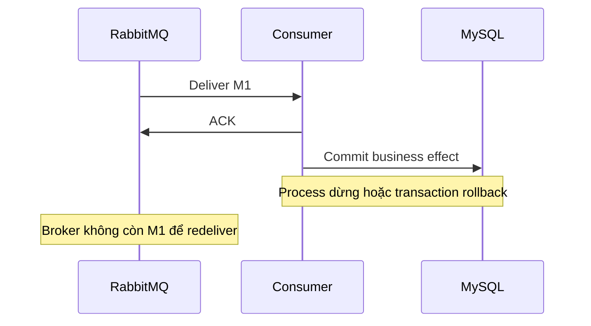

Thiết kế an toàn (Commit trước, ACK sau) — chỉ khi nào dữ liệu đã ghi xuống Database, consumer mới gửi tín hiệu ACK về cho RabbitMQ.

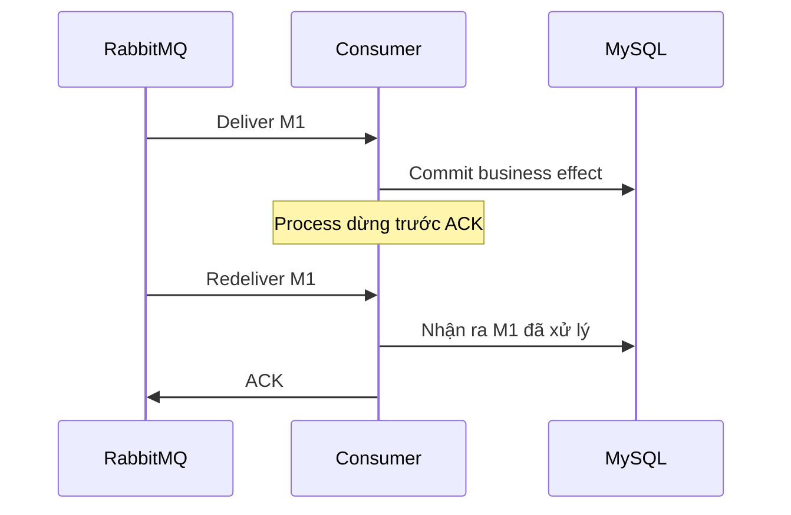

Thà chấp nhận hệ thống xử lý trùng tin nhắn (Duplicate) còn hơn là làm mất dữ liệu (Data loss). Chính vì vậy, Consumer bắt buộc phải được thiết kế để có khả năng **nhận diện và bỏ qua các tin nhắn đã từng xử lý trước đó (Idempotent Consumer)**.

## 9. Idempotency và Inbox

Mục 8 đã đưa ra một kết luận xương máu: Để đảm bảo an toàn dữ liệu, bắt buộc phải chọn cơ chế **Commit trước, ACK sau**. Sự đánh đổi của lựa chọn này là hệ thống phải chấp nhận rủi ro nhận trùng tin nhắn **(Duplicate)**.

Để sống sót qua những lần tin nhắn bị gửi lặp lại đó, Consumer bắt buộc phải có tính chất **Idempotent** (Tính đồng nhất) — nghĩa là dù có nhận và xử lý cùng một tin nhắn bao nhiêu lần đi nữa, kết quả cuối cùng lưu trong hệ thống vẫn duy nhất và không bị sai lệch.

**Hiện thực hóa tính đồng nhất bằng giải pháp Inbox Pattern**

Đối với các Consumer làm nhiệm vụ ghi dữ liệu vào Database, cách làm phổ biến và triệt để nhất là sử dụng một bảng ghi nhớ **Inbox** — lưu lại `MessageId` đã xử lý. 

Việc kiểm tra/ghi nhận tin nhắn và việc cập nhật dữ liệu nghiệp vụ phải được đảm bảo trong cùng một **Transaction (Tính nguyên tử - Atomicity)**.

```text
BEGIN
  -- 1. Lưu ID của tin nhắn vào bảng Inbox để "đánh dấu chủ quyền"
  INSERT Inbox(consumerName, tenantId, shopId, messageId)

   -- 2. Thực hiện cập nhật dữ liệu nghiệp vụ (ví dụ: tạo đơn hàng)
  UPDATE business state
COMMIT

-- 3. Chỉ khi Transaction trên thành công hoàn toàn, mới bấm nút gửi ACK
ACK
```

Nếu Inbox và mutation nằm ở hai transaction riêng, crash giữa chúng làm Inbox nói "đã xử lý" trong khi effect chưa tồn tại, hoặc effect tồn tại nhưng Inbox chưa ghi. **Ranh giới nguyên tử (Atomic Boundary) mới là thứ quyết định sự sống còn.**

**Thiết kế Khóa duy nhất (Unique Key)**

Trong môi trường thực tế, đặc biệt là hệ thống chạy nhiều dịch vụ song song và chia theo tenant, **tuyệt đối không được dùng một mình MessageId làm Khóa chính (Unique Key) cho bảng Inbox.** Khóa tham chiếu an toàn bắt buộc phải là một cụm gồm 4 yếu tố:

```text
(consumerName, tenantId, shopId, messageId)
```

Lý do:

- **Nhiều consumer cùng nhận một message** — sự kiện `order.created` được nhân bản gửi cho cả consumer gửi email và consumer đồng bộ báo cáo. Nếu Inbox chỉ khóa bằng `MessageId`, consumer nào xử lý xong trước sẽ ghi vào Inbox — consumer còn lại đến sau thấy `MessageId` đã tồn tại sẽ tưởng nhầm mình đã xử lý và bỏ qua, gây mất dữ liệu.
- **Cô lập theo tenant/shop** — mỗi tenant và mỗi shop cần được phân vùng độc lập trong Inbox, để đảm bảo an toàn dữ liệu và dễ tra cứu log, giống cách mọi dữ liệu nghiệp vụ khác đã được thiết kế.

> **Lưu ý:** Tenant trong message header chỉ hỗ trợ truyền context và tracing — nó không thay cho authorization. Consumer vẫn phải tự kiểm tra tenant/shop scope trong EF query, Dapper predicate, cache key và database constraint.

**Giới hạn của Inbox Pattern: Bài toán Bên thứ ba (Side Effect)**

Inbox chỉ bảo vệ được state trong MySQL. Gửi email hay gọi payment là side effect nằm ngoài database — một khi request đó đã rời process, Inbox không có cách nào rollback nó, nên idempotency ở nhóm side effect này phải được xử lý tại chính provider.

Nếu provider hỗ trợ idempotency key, consumer dùng logical `MessageId` hoặc business operation key làm key đó. Nếu provider không hỗ trợ, hệ thống cần tự xây một state machine và cơ chế reconciliation để phát hiện và dọn dẹp side effect bị lặp.

## 10. Prefetch và backpressure

**Idempotency** giải quyết việc consumer nhận trùng message, nhưng không giới hạn broker có thể đẩy bao nhiêu message cùng lúc cho một consumer trước khi nó kịp ACK. Không giới hạn, broker sẵn sàng dồn hàng nghìn message chưa ACK vào một consumer đang xử lý chậm — chất đầy memory phía consumer và dồn tải xuống MySQL cùng lúc khi tất cả bắt đầu xử lý.

`prefetch` chính là cơ chế **Backpressure (Kiểm soát dòng chảy)** cho vấn đề đó: nó giới hạn số delivery chưa ACK mà broker được phép gửi cho mỗi consumer channel tại một thời điểm. 

**Bài toán cân não khi cấu hình Prefetch**

- **Nếu đặt quá thấp (ví dụ bằng 1):** Worker cứ làm xong một việc lại phải ngồichờ tín hiệu mạng truyền tin nhắn tiếp theo từ Broker sang. Hệ thống bị lãng phí thời gian chết do độ trễ mạng (Network Round-trip).

- Nếu đặt quá cao: Quá nhiều tin nhắn bị chất đống trong bộ nhớ của Consumer, vô tình tạo ra một trận "lũ quét" áp lực (Burst) nén thẳng xuống Database MySQL ngay khi cả loạt tác vụ cùng lúc khởi động.

**Công thức tính toán lượng tin nhắn tồn đọng tối đa**

Vì prefetch áp dụng trên từng consumer channel, tổng số message chưa ACK toàn hệ thống có thể tính được từ số consumer đang chạy:

```text
globalConsumers = instanceCount × consumersPerInstance
maximumUnacked  = globalConsumers × prefetch
```

Với 4 instance, mỗi instance 8 consumer, prefetch 32:

```text
globalConsumers = 4 × 8 = 32
maximumUnacked  = 32 × 32 = 1.024
```

Reference load ghi nhận `Unacked = 1.024`, đúng như công thức tính trước — nghĩa là prefetch đang hoạt động đúng như thiết kế, chứ không chứng minh 32 là cấu hình tối ưu.

**Điểm nghẽn tiếp theo: Giới hạn của Database**

Việc cố tình tăng số lượng Worker hay nâng cao chỉ số Prefetch chỉ làm kéo dài thời gian xử lý một transaction (latency) và tăng tỷ lệ tranh chấp khóa dữ liệu (lock contention), khiến hệ thống càng dễ lâm vào cảnh bế tắc.

## 11. Retry và Dead Letter Queue (DLQ)

Các mục từ 8 đến 10 giả định rằng Consumer luôn xử lý thành công, hệ thống chỉ đối mặt với nguy cơ trùng lặp hoặc nghẽn mạch. Tuy nhiên trong thực tế, Consumer hoàn toàn có thể bị lỗi thật sự. Lúc này, hệ thống phải đứng trước một quyết định cân não: **Thử lại (Retry) hay vứt bỏ luôn?**

Chiến lược xử lý lỗi bắt buộc phải phân loại chính xác bản chất của lỗi:

**Lỗi tạm thời (Transient Failure):** Thường tự biến mất sau một khoảng thời gian ngắn — nhóm này rất phù hợp để Retry.

- Network timeout.
- Downstream `503`.
- Deadlock hoặc lock wait timeout.

**Lỗi vĩnh viễn (Permanent Failure):** Thử lại bao nhiêu lần cũng vô ích — việc cố chấp Retry nhóm này vô hạn sẽ biến tin nhắn thành một "viên thuốc độc" (Poison Message) làm nghẽn chết toàn bộ hàng đợi.

- Contract version không được hỗ trợ.
- Validation failure.
- Business resource không tồn tại.

**Mô hình Retry Topology: Tránh cái bẫy Vòng lặp vô hạn (Hot Loop)**

Nếu Consumer xử lý lỗi rồi phát tín hiệu từ chối **(NACK)** và yêu cầu RabbitMQ nhét ngay tin nhắn đó ngược lại hàng đợi cũ **(requeue)**, bạn sẽ vô tình tạo ra một vòng lặp chết chóc **(Hot Loop)** — Máy vừa nhả thư lỗi ra lại lập tức nhặt chính nó vào để xử lý tiếp, tiêu tốn sạch tài nguyên và chặn đường của các tin nhắn tốt khác.

Hướng xử lý —  xây dựng một hạ tầng điều phối lỗi thông minh (Retry Topology) sử dụng thời gian sống của tin nhắn (TTL - Time To Live):

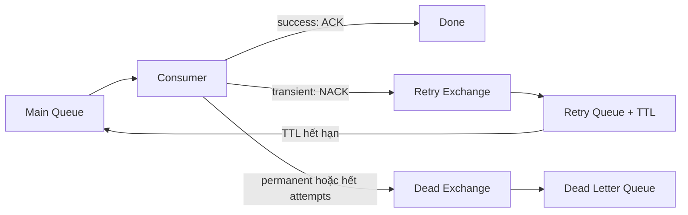

Khai báo topology trên gồm hai cặp exchange/queue phụ, cộng thêm main queue đã có từ mục 6:

```csharp
// Retry: giữ message TTL giây rồi tự động đẩy ngược lại main queue qua x-dead-letter-exchange
await _channel.ExchangeDeclareAsync("notification.retry", ExchangeType.Direct, durable: true);
await _channel.QueueDeclareAsync(
    "notification.order-created.retry",
    durable: true,
    exclusive: false,
    autoDelete: false,
    arguments: new Dictionary<string, object>
    {
        ["x-message-ttl"] = 30_000, // 30s chờ trước khi thử lại
        ["x-dead-letter-exchange"] = "food.events", // hết TTL, quay lại đúng exchange gốc
        ["x-dead-letter-routing-key"] = "order.created"
    });
await _channel.QueueBindAsync("notification.order-created.retry", "notification.retry", routingKey: "order.created");

// Dead: điểm dừng cuối cho permanent failure hoặc hết maxAttempts
await _channel.ExchangeDeclareAsync("notification.dead", ExchangeType.Fanout, durable: true);
await _channel.QueueDeclareAsync("notification.order-created.dlq", durable: true, exclusive: false, autoDelete: false);
await _channel.QueueBindAsync("notification.order-created.dlq", "notification.dead", routingKey: "");
```

Phía consumer, retry policy cần ba tham số để quyết định publish message sang exchange nào:

```csharp
try
{
    await handler.HandleAsync(message, cancellationToken);
    await _channel.BasicAckAsync(deliveryTag, multiple: false);
}
catch (TransientFailureException) when (attemptCount < maxAttempts) // maxAttempts: số lần thử tối đa
{
    // publish sang retry exchange, đợi Publisher Confirm rồi mới ACK bản gốc (như mục 11 đã nói)
    await _channel.BasicPublishAsync("notification.retry", "order.created", body: originalBody);
    await _channel.WaitForConfirmsOrDieAsync(cancellationToken);
    await _channel.BasicAckAsync(deliveryTag, multiple: false);
}
catch (Exception) // permanent failure hoặc đã hết maxAttempts: terminal state là DLQ
{
    await _channel.BasicPublishAsync("notification.dead", "", body: originalBody);
    await _channel.WaitForConfirmsOrDieAsync(cancellationToken);
    await _channel.BasicAckAsync(deliveryTag, multiple: false);
}
```

`delay/backoff` (thời gian giãn cách giữa các lần thử) nằm ở chính `x-message-ttl` của retry queue — TTL càng dài, thời gian chờ trước khi thử lại càng lâu.

Ví dụ dễ hình dung — một retry policy giống cách công ty chuyển phát xử lý một món hàng giao lỗi (nhà không có người nhận, địa chỉ mờ không đọc được) — không thể đứng đợi mãi, nhưng cũng không thể vứt hàng ngay.

- **Số lần thử tối đa (`maxAttempts` - ví dụ: 3 lần)** — giống việc shipper chỉ quay lại giao tối đa vài lần — quá số đó thì dừng.
- **Thời gian giãn cách (`delay/backoff` - ví dụ: 2 tiếng)** — giống việc hẹn vài tiếng sau mới quay lại lần kế, thay vì bấm chuông liên tục làm phiền.
- **Điểm dừng cuối cùng (DLQ - Hòm thư lỗi)** — hàng thất bại đủ số lần được đưa vào đây để xử lý riêng, giải phóng chỗ cho các đơn hàng tốt khác.

Khi một message bị đưa vào DLQ, RabbitMQ tự dán một "nhãn biên bản" tên `x-death`, ghi lại —  message lỗi ở queue nào, lý do bị loại (`expired`, `rejected`...), và đã thử lại bao nhiêu lần trước khi bỏ cuộc. 

Đây là dữ liệu quý để debug — khi khách hàng khiếu nại "sao không nhận được email xác nhận", chỉ cần mở DLQ và đọc `x-death` là biết ngay nguyên nhân, không cần lục hàng triệu dòng log để đoán mò.

Integration test quan sát được ba kết quả:

| Case | Kết quả |
|---|---|
| Transient failure hai lần | Thành công với `rejected=2`, `expired=2` |
| Permanent failure | Vào DLQ ở attempt đầu |
| Poison message | Vào DLQ sau attempt thứ ba |

Khi ứng dụng chủ động phát tin nhắn lỗi sang Dead Letter Queue (DLQ) để bổ sung metadata, tiến trình bắt buộc phải nhận được tín hiệu Publisher Confirm từ DLQ thành công trước khi thực hiện ACK tin nhắn gốc trên main queue. 

Việc đảo ngược thứ tự bằng cách ACK trước khi nhận confirm từ DLQ sẽ tạo ra rủi ro mất mát dữ liệu chí mạng nếu hành động phát tin nhắn lỗi gặp sự cố rớt mạng hoặc nghẽn mạch (broker timeout), khiến tin nhắn bị xóa bỏ hoàn toàn ở cả hai đầu hàng đợi.

Ví dụ dễ hình dung — giống một nhân viên bưu tá xử lý thư lỗi.

- **Đúng** — cất thư lỗi vào tủ lưu trữ trước, đợi tủ khóa an toàn (Publisher Confirm), rồi mới về bàn ký sổ xóa thư gốc (ACK).
- **Sai** — ký sổ xóa thư gốc trước, rồi mới đi cất thư lỗi vào tủ — nếu tủ kẹt khóa giữa chừng (mất kết nối, broker bận), thư gốc đã bị xóa mà thư lỗi cũng chưa kịp cất, mất trắng cả hai.

## 12. Dual-write và Publisher Confirm

Mục 11 giả định publish RabbitMQ luôn thành công, chỉ consumer mới có nguy cơ xử lý lỗi. Nhưng bản thân publish cũng có thể "thất bại" theo một cách khác — không phải vì RabbitMQ từ chối message, mà vì ghi business data và publish message là hai thao tác tách rời, trên hai hệ thống độc lập không chia sẻ transaction.

Publisher Confirm chỉ cho biết broker đã nhận message — nó không giải quyết được vấn đề khi use case tạo đơn phải làm cả hai việc: ghi `DonHang` vào MySQL, rồi publish `DonHangDaTao` sang RabbitMQ. Giả sử ghi MySQL trước, publish sau:

```text
COMMIT DonHang
publish DonHangDaTao
```

Process có thể dừng giữa hai dòng — `DonHang` đã tồn tại trong MySQL nhưng consumer không bao giờ nhận được event tương ứng. Đổi thứ tự không giúp được:

```text
publish DonHangDaTao
ROLLBACK DonHang
```

Consumer nhận event cho một đơn chưa từng tồn tại. MySQL transaction không thể tự động bao trùm RabbitMQ publish. Đây là dual-write problem.

#### Cái bẫy của việc lồng publish vào trong database transaction

Một cách sửa trực giác là đưa dòng publish vào giữa transaction, trước khi commit:

```csharp
using var transaction = await dbContext.Database.BeginTransactionAsync();

await dbContext.DonHangs.AddAsync(donHang);
await dbContext.SaveChangesAsync(); // chỉ mới ghi tạm vào DB, chưa COMMIT

// cố tình publish RabbitMQ khi transaction vẫn đang mở
await _integrationEventPublisher.PublishAsync(new DonHangDaTaoEvent(...));

await transaction.CommitAsync(); // chính thức chốt dữ liệu xuống DB
```

Cách này trông có vẻ an toàn nhưng mở ra hai vấn đề:

- **Lỗi logic dữ liệu** — dù `PublishAsync` nằm trước `CommitAsync`, bản thân `CommitAsync` vẫn có thể thất bại (nghẽn mạng với DB, xung đột khóa, DB hết tài nguyên). Kết quả là database bị rollback nhưng message thì đã bay đi mất — consumer vẫn nhận được event của một đơn hàng chưa từng tồn tại.
- **Nghẽn connection pool** — như đã nói ở mục 5.4, publish lên RabbitMQ cần chờ Publisher Confirm, tức là chờ một round-trip mạng. Giữ database transaction mở trong lúc chờ I/O mạng bên ngoài sẽ giữ chặt connection lâu hơn gấp nhiều lần bình thường. Dưới tải cao, điều này làm cạn kiệt connection pool của MySQL, kéo tê liệt cả ứng dụng.

Cả hai vấn đề đều xuất phát từ cùng một nguyên nhân — publish RabbitMQ vẫn là một lời gọi mạng độc lập, đặt nó vào trong transaction không biến nó thành một phần của transaction đó. **Outbox** sẽ giải quyết đúng vấn đề này mà không cần giữ transaction mở chờ mạng.

## 13. Transactional Outbox

Mô hình Outbox giải quyết bài toán dual-write bằng cách gộp hành động lưu trạng thái nghiệp vụ (business state) và mục đích phát tán sự kiện (intent) vào chung một database transaction duy nhất:

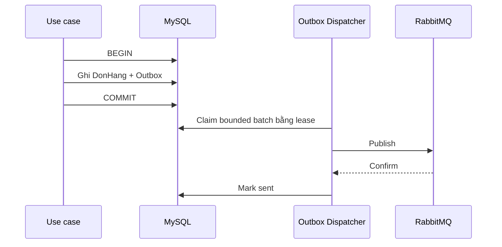

**Đánh đổi kiến trúc — Chấp nhận trùng để không mất dữ liệu**

Outbox không tạo exactly-once (xử lý đúng một lần). Để phân phối công việc cho nhiều luồng chạy ngầm xử lý, bộ điều phối **(Outbox Dispatcher)** sẽ nhặt một nhóm giới hạn các tin nhắn tại một thời điểm (bounded batch) bằng cơ chế cho thuê **(Lease)**. Cơ chế này tự động đánh dấu: Ai đang giữ hàng dữ liệu này **(lockedBy)** và giữ trong bao lâu **(lockedUntilUtc)**.

Nếu một Dispatcher bị đột tử (crash) ngay sau khi RabbitMQ đã báo nhận thư thành công (Publisher Confirm) nhưng chưa kịp quay lại MySQL để đánh dấu đã gửi (mark sent), thời hạn Lease sẽ hết hạn.

Một Dispatcher khác sẽ nhảy vào thuê lại chính nhóm dữ liệu đó và thực hiện bắn lại sang RabbitMQ lần hai.

> **Lưu ý:** Đây là đánh đổi có chủ đích — Outbox thà gửi trùng event còn hơn làm mất nó. Gửi trùng không gây hại gì, vì Inbox (mục 9) đã kiểm tra `messageId` và tự bỏ qua bản đã xử lý.

Ví dụ dễ hình dung — bảng Outbox giống như một kho hàng, với hai dispatcher (A và B) cùng vào nhặt gói hàng mang đi giao cho RabbitMQ.

- Dispatcher A vào kho nhặt một gói hàng (Đơn hàng số #99). Hệ thống ghi chú vào sổ: "Gói hàng #99 đã giao cho Dispatcher A **(lockedBy)**, thời hạn giữ là đến 10h05 **(lockedUntilUtc)**". Trong khoảng thời gian này, Dispatcher B vào kho sẽ bị cấm không được đụng vào gói #99.
- Dispatcher A mang gói hàng #99 bắn sang RabbitMQ thành công. RabbitMQ đã nhận hàng an toàn và gửi lại biên nhận **(Publisher Confirm)**.
- Đúng lúc Dispatcher A đang quay xe đi về kho để gạch tên gói #99 khỏi sổ (mark sent) thì xe anh ta bị hỏng máy giữa đường (Tiến trình Consumer bị crash đột ngột).
- Đồng hồ điểm 10h06, thời hạn giữ hàng đã hết *(lockedUntilUtc)*. Hệ thống thấy gói #99 vẫn chưa được gạch tên, liền mở khóa nó ra. 
- Anh Dispatcher B vào kho, thấy gói #99 đang trống liền lập tức nhặt lên và mang đi bắn sang RabbitMQ một lần nữa.

**Kết quả:** RabbitMQ nhận hai bản sao của cùng đơn hàng #99 — nhưng vẫn tốt hơn nhiều so với việc gói hàng kẹt vĩnh viễn trên xe hỏng của A, khiến khách hàng mất đơn mãi mãi.

Cơ chế claim dùng `FOR UPDATE SKIP LOCKED`: mỗi dispatcher chỉ khóa và lấy những row chưa bị dispatcher khác khóa, bỏ qua row đang bị giữ thay vì phải đợi. Cách này phù hợp với Outbox vì các row độc lập với nhau và không yêu cầu thứ tự tuyệt đối.

Reference test từng phát hiện index claim sai làm bốn worker nhận batch `[25, 0, 0, 0]`. Index chứa `lockedUntil` trước các cột order, khiến MySQL không phân phối query như dự tính.

Index sau đó được đổi theo filter và stable order:

```text
(runId, sentAt, occurredAt, messageId)
```

Bốn worker sau thay đổi claim đủ 100 intent. `SKIP LOCKED` chỉ tạo concurrency tốt khi execution plan và batch distribution cũng phù hợp.

Schema tối thiểu cho bảng Outbox:

```sql
CREATE TABLE OutboxMessage (
    Id BIGINT AUTO_INCREMENT PRIMARY KEY,
    MessageId CHAR(36) NOT NULL,
    RoutingKey VARCHAR(200) NOT NULL,
    Payload JSON NOT NULL,
    OccurredAtUtc DATETIME(6) NOT NULL,
    SentAtUtc DATETIME(6) NULL,
    LockedBy VARCHAR(100) NULL,
    LockedUntilUtc DATETIME(6) NULL,
    -- filter column (SentAtUtc, LockedUntilUtc) đứng trước order column (OccurredAtUtc, Id),
    -- đúng bài học từ war story ở trên
    INDEX idx_claim (SentAtUtc, LockedUntilUtc, OccurredAtUtc, Id)
);
```

Use case ghi business state và Outbox trong cùng transaction, đúng sơ đồ ở đầu mục:

```csharp
await using var transaction = await db.Database.BeginTransactionAsync(cancellationToken);

var donHang = new DonHang(request);
db.DonHang.Add(donHang);

db.OutboxMessage.Add(new OutboxMessage
{
    MessageId = Guid.NewGuid(),
    RoutingKey = "order.created",
    Payload = JsonSerializer.Serialize(new DonHangDaTaoEvent(donHang.Id, request.Email)),
    OccurredAtUtc = DateTimeOffset.UtcNow
});

await db.SaveChangesAsync(cancellationToken);
await transaction.CommitAsync(cancellationToken);
```

Dispatcher claim một bounded batch bằng lease, publish, rồi mark sent:

```csharp
var dispatcherId = Environment.MachineName;
var now = DateTimeOffset.UtcNow;
var leaseUntil = now.AddSeconds(30);

var batch = await db.OutboxMessage
    .FromSqlInterpolated($@"
        SELECT * FROM OutboxMessage
        WHERE SentAtUtc IS NULL
          AND (LockedUntilUtc IS NULL OR LockedUntilUtc < {now})
        ORDER BY OccurredAtUtc, Id
        LIMIT 50
        FOR UPDATE SKIP LOCKED")
    .ToListAsync(cancellationToken);

foreach (var message in batch)
{
    message.LockedBy = dispatcherId;
    message.LockedUntilUtc = leaseUntil;
}
await db.SaveChangesAsync(cancellationToken); // chốt lease trước khi publish

foreach (var message in batch)
{
    await publisher.PublishAsync(message.RoutingKey, message.Payload, cancellationToken); // chờ Publisher Confirm
    message.SentAtUtc = DateTimeOffset.UtcNow;
    await db.SaveChangesAsync(cancellationToken); // mark sent ngay sau khi confirm, đúng từng message một
}
```

Production base hiện chưa thêm schema và dispatcher này vào production thật, vì chưa có business write nào sở hữu event cần phát. Tạo schema và worker chung chung từ trước sẽ buộc business sau này thích nghi với một contract chưa được xác định — code trên là reference implementation, đã kiểm chứng bằng integration test.

## 14. Ordering trong hệ thống đa instance

Khi hệ thống dịch chuyển sang mô hình phân tán, các cơ chế như thử lại tin nhắn lỗi (Retry ở Mục 11) hay gửi lặp từ hòm thư đi (Outbox Duplicate ở Mục 13) sẽ trực tiếp phá vỡ một giả định trực giác: **Tin nhắn nào phát đi trước thì phải được xử lý xong trước**.

**Sự thật về hạ tầng — RabbitMQ chỉ bảo toàn tuyệt đối thứ tự tin nhắn trong một phạm vi cực kỳ nghẽn mạch: Một Queue duy nhất, chỉ có đúng một Consumer duy nhất đọc việc, không cấu hình Retry, và không cho phép Requeue.**

Chỉ cần bạn kích hoạt cơ chế chia tải cho nhiều máy vật lý **(Competing Consumers ở Mục 7)**, hoặc cho phép gửi lại tin nhắn sau sự cố sập nguồn, thứ tự hoàn thành tác vụ **(completion order)** chắc chắn sẽ bị đảo lộn so với thứ tự phát tán ban đầu **publish order)**.

#### Hệ quả: state bị ghi đè sai nếu chỉ dựa vào thứ tự đến

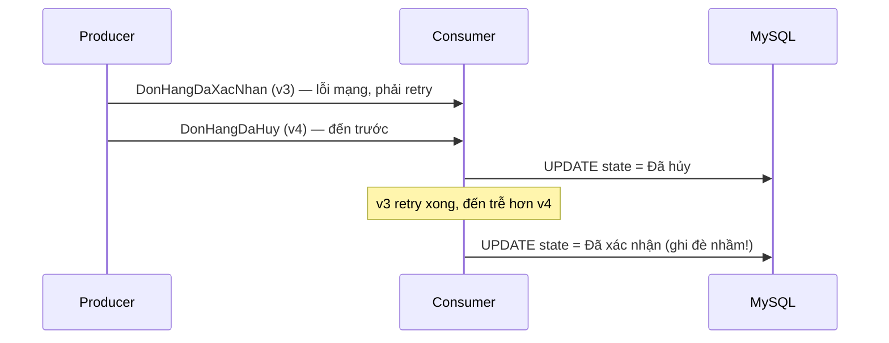

**Hậu quả** —  Một đơn hàng đáng lẽ đã bị khách hàng hủy bỏ (v4), nhưng vì tin nhắn xác nhận (v3) bị trễ mạng và đến sau, Consumer ngây thơ ghi đè dữ liệu cũ lên dữ liệu mới, khiến đơn hàng bị **"cải tử hoàn sinh"** một cách phi lý trên hệ thống.

#### Giải pháp: Số phiên bản thực thể (Aggregate Version)

Mỗi event làm thay đổi state của một **aggregate** (thực thể nghiệp vụ gốc mà event tác động, ví dụ `DonHang`) cần mang theo **aggregate version** — một số đếm tăng dần mỗi lần aggregate đổi state:

- Consumer chỉ áp dụng event nếu version của nó mới hơn version đang lưu trong database.
- Event có version bằng hoặc nhỏ hơn là stale event — bỏ qua (no-op), bất kể thứ tự đến thực tế.

Cách hiện thực đơn giản nhất là một conditional update —  `UPDATE` chỉ thành công khi version mới lớn hơn version đang lưu, còn lại tự thất bại (0 row affected) mà không cần đọc trước để so sánh:

```sql
UPDATE DonHang
SET State = @newState, Version = @newVersion
WHERE Id = @id AND Version < @newVersion;
```

```csharp
var rowsAffected = await db.Database.ExecuteSqlInterpolatedAsync($@"
    UPDATE DonHang
    SET State = {newState}, Version = {newVersion}
    WHERE Id = {donHangId} AND Version < {newVersion}",
    cancellationToken);

if (rowsAffected == 0)
{
    // Version hiện tại đã mới hơn hoặc bằng — đây là stale event, coi như đã xử lý xong
    await _channel.BasicAckAsync(deliveryTag, multiple: false);
    return;
}
```

#### Khi business bắt buộc xử lý tuần tự tuyệt đối

Nếu mọi event của cùng một `DonHang` phải xử lý đúng thứ tự thời gian, có hai hướng:

- **Partition topology** — định tuyến mọi event cùng một key (ví dụ `DonHangId`) luôn vào một queue/consumer cố định, ví dụ qua **Consistent Hash Exchange** của RabbitMQ hay partition của Kafka.
- **Database coordination** — dùng row lock hoặc khóa cứng ở tầng lưu trữ để ép các worker xếp hàng chờ nhau.

Consistent Hash Exchange cần bật plugin đi kèm RabbitMQ (`rabbitmq-plugins enable rabbitmq_consistent_hash_exchange`), sau đó publish bằng chính `DonHangId` làm routing key — exchange sẽ luôn hash cùng một `DonHangId` về đúng một queue, bất kể thứ tự publish:

```csharp
await _channel.ExchangeDeclareAsync("food.events.partitioned", "x-consistent-hash", durable: true);

// mỗi queue nhận một "trọng số" (weight) qua binding key dạng số, quyết định tỉ lệ chia tải
await _channel.QueueBindAsync("order-worker-1", "food.events.partitioned", routingKey: "10");
await _channel.QueueBindAsync("order-worker-2", "food.events.partitioned", routingKey: "10");

// publish dùng DonHangId làm routing key: cùng một DonHangId luôn hash về cùng một queue,
// nên mọi event của một đơn hàng luôn được đúng một worker xử lý tuần tự
await _channel.BasicPublishAsync(
    exchange: "food.events.partitioned",
    routingKey: donHang.Id.ToString(),
    mandatory: true,
    basicProperties: properties,
    body,
    cancellationToken);
```

> **Lưu ý:** Cả hai hướng đều triệt tiêu khả năng xử lý song song và tăng chi phí vận hành. Global ordering không cần thiết khi invariant chỉ yêu cầu per-aggregate ordering — bảo toàn thứ tự trong phạm vi từng aggregate là đủ.

#### Correctness đa instance không đến từ lock trong process

Một lỗi sơ đẳng là dùng `lock` hay `SemaphoreSlim` của C# để bảo vệ dữ liệu — các cơ chế này chỉ hoạt động trong một process, không thể chia sẻ trạng thái giữa nhiều instance vật lý độc lập.

Tính chính xác của dữ liệu trong môi trường đa tiến trình bắt buộc phải dựa vào các chốt chặn hạ tầng:

- Ràng buộc phía ở database **(Database constraint)**.
- Cơ chế cập nhật có điều kiện **(Conditional update / Optimistic Concurrency)**.
- Khóa dòng trực tiếp **(Row lock)**.
- Hoặc các hệ thống quản lý khóa phân tán chuyên dụng **(Distributed Coordinator)** có mô hình xử lý lỗi rõ ràng.

## 15. Tính nhất quán của tồn kho nhiều lô

Mục 14 giải quyết bài toán thứ tự xử lý trên một thực thể độc lập (Aggregate). Tuy nhiên, hệ thống phân tán còn đối mặt với một loại xung đột dữ liệu (Race Condition) nguy hiểm khác không phụ thuộc vào thứ tự **— Nhiều Consumer cùng lúc đọc và ghi trên một tài nguyên dùng chung.**

Giả sử tồn còn 10, hai đơn đồng thời mỗi đơn đặt 7. Hai consumer cùng đọc 10 rồi cùng ghi 3 tạo lost update: hệ thống đã chấp nhận 14 nhưng số dư chỉ giảm 7. **RabbitMQ hoàn toàn bất lực trước lỗi này** — nó nằm ở tầng dữ liệu, không phải tầng messaging.

#### Chiến lược FEFO nghiêm ngặt và giải pháp Khóa dòng (FOR UPDATE)

Với nhiều lô, strict FEFO (xuất lô hết hạn sớm trước) yêu cầu chọn đúng lô hết hạn sớm nhất, dù bao nhiêu consumer cùng tranh chấp:

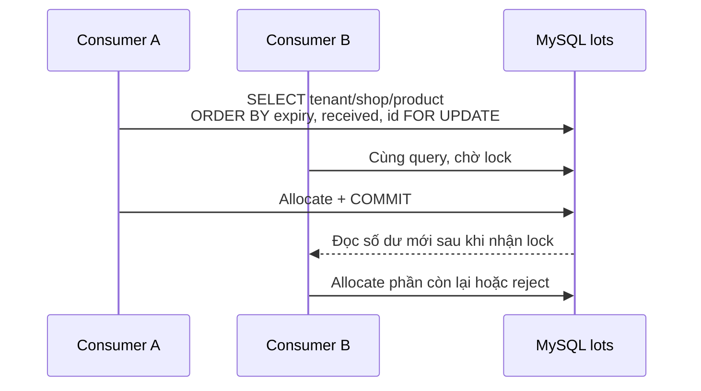

#### Tránh deadlock bằng Thứ tự khóa cố định

Mọi transaction phải lock candidate lots theo cùng một thứ tự cố định — nếu transaction A lock lô 1 rồi lô 2, còn transaction B lock lô 2 rồi lô 1, hai bên có thể chờ chéo nhau vô thời hạn (deadlock). Khóa nhất quán theo cùng thứ tự loại bỏ khả năng đó:

```text
expiresAt → receivedAt → id
```

#### Vì sao không dùng SKIP LOCKED ở đây

Mục 13 dùng `SKIP LOCKED` để tăng throughput cho Outbox, vì các row ở đó độc lập và thứ tự xử lý không quan trọng. Ở đây thì ngược lại: `SKIP LOCKED` sẽ bỏ qua lô sớm nhất đang bị transaction khác khóa và chọn lô muộn hơn — tăng throughput nhưng phá vỡ đúng thứ tự FEFO, nên không phù hợp.

#### Index cho truy vấn FEFO ở quy mô lớn

Với 100 shop và 100.000 thẻ kho, câu lệnh truy vấn tìm lô hàng rất dễ gây chậm hệ thống nếu phải quét toàn bộ bảng dữ liệu (table scan). 

Để tối ưu, cần xây dựng một Chỉ mục hỗn hợp **(Composite Index)** kết hợp giữa bộ lọc điều kiện và khóa sắp xếp:

```sql
-- Nhóm bộ lọc (Tenant + Shop + Product) đứng trước, nhóm sắp xếp đứng sau
CREATE INDEX IX_Inventory_FEFO
ON WarehouseLots (tenantId, shopId, productId, expiresAt, receivedAt, id);
```
**Kết quả đo lường thực tế:** Reference run dùng một hot `shop + product` chứa 500 lô. Query lấy 10 lô ứng viên mất khoảng `0,21 ms` và không scan toàn bộ 100.000 row. Con số này mô tả môi trường test, không phải production SLA.

## 16. Quorum Queue và RabbitMQ Cluster

Các mục trước xử lý race condition ở tầng dữ liệu, giả định RabbitMQ luôn sẵn sàng. Nhưng bản thân broker cũng có thể chết — không phải do bug trong code, mà do hạ tầng: node bị mất điện, ổ đĩa hỏng, máy chủ ngừng hoạt động.

`durable: true` (đã dùng từ mục 5.4) chỉ đảm bảo message sống sót qua việc RabbitMQ process khởi động lại trên cùng node — nó không giúp gì nếu chính node đó chết hẳn, vì message vẫn chỉ nằm trên một đĩa duy nhất. Quorum queue giải quyết đúng lỗ hổng này bằng thuật toán đồng thuận Raft: nó duy trì nhiều bản sao của mỗi message trên một số lẻ node (thường là 3 hoặc 5 — số lẻ để majority luôn ra một kết quả rõ ràng, không thể chia phiếu 50/50).

#### Cơ chế sống sót qua sự cố hạ tầng

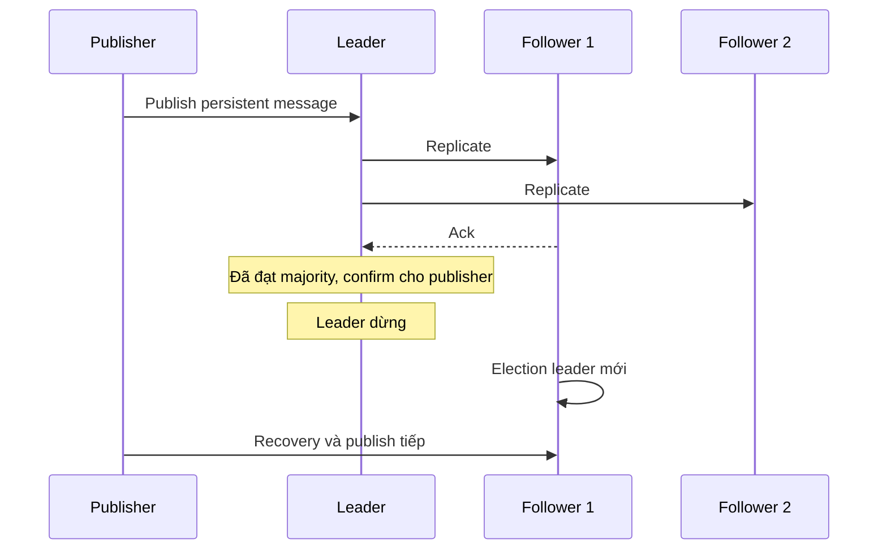

- **Xác nhận theo đa số** — khi publish một persistent message, leader không confirm ngay cho publisher. Nó phải chờ replicate thành công tới đủ majority node (với cluster 3 node là leader + ít nhất 1 follower) rồi mới confirm — đây chính là ý nghĩa của "quorum".
- **Tự động bầu lại leader** — nếu leader chết đột ngột, các follower còn lại tự bầu ra leader mới và tiếp tục nhận publish, không cần can thiệp thủ công.

#### Kết quả đo lường thực tế

Reference test dùng cluster ba node, dừng leader trong lúc publish 2.000 logical message:

| Kết quả | Giá trị |
|---|---:|
| Thời gian bầu leader mới | khoảng 1,41 giây |
| Logical message | 2.000 |
| Message thiếu | 0 |
| Message trùng | 0 |

Kết quả chỉ chứng minh fault đã mô phỏng — một node chết đơn lẻ. Network partition, disk exhaustion và lỗi rolling upgrade phức tạp hơn nhiều và cần các profile riêng.

#### Lưu ý khi triển khai production

- Production quorum topology thường cần tối thiểu ba node, trải trên các failure domain riêng biệt (khác rack, khác availability zone) để một sự cố mất điện không kéo sập cả cụm.
- Replication phải đi cùng disk/memory alarm, partition monitoring, capacity và runbook.

> **Lưu ý:** Cluster không thay thế backup. Replication chỉ nhân bản trạng thái hiện tại sang mọi node gần như ngay lập tức — nếu một thao tác xóa nhầm hoặc dữ liệu sai được ghi vào, nó cũng được replicate đi ngay, và không có điểm khôi phục nào trước đó để quay lại.

## 17. Load Testing và Business Invariant

Các mục trước kiểm chứng từng cơ chế riêng lẻ — mục này chạy tất cả cùng lúc dưới tải. Mục tiêu không phải đo throughput, mà xem business invariant có đứng vững dưới tranh chấp tài nguyên hay không — thứ mà messages/second một mình không nói lên được, phải đặt cạnh transaction latency, lock contention và trạng thái cuối cùng trong database.

#### Cấu hình kịch bản kiểm thử

Reference reliability profile cố tình tiêm vào đúng những failure mode đã phân tích ở các mục trước:

- Duplicate publish từ Outbox (mục 13).
- Transient failure cần retry (mục 11).
- Crash giữa business commit và ACK (mục 8).

Prefetch được tính theo công thức ở mục 10:

```text
100 shop
100.000 logical message
3 publisher
32 consumer
prefetch 32
5% duplicate publish
2% transient failure
1% crash sau business commit, trước ACK
```

#### Kết quả đo lường

| Metric | Kết quả | Ý nghĩa |
|---|---:|---|
| Physical messages | 105.000 | Tổng số tin nhắn thực tế chạy qua RabbitMQ (bao gồm cả tin nhắn trùng). |
| Inbox rows | 100.000 | Inbox chặn đúng 100.000 message gốc, không đếm trùng |
| Business effects | 100.000 | Số đơn hàng thực tế tạo thành công trong MySQL |
| Duplicate business effects | 0 | Không đơn nào bị tạo trùng |
| Missing logical messages | 0 | Không đơn nào bị mất |
| Transient failures | 2.000 | Số lần retry được kích hoạt |
| Post-commit crashes | 1.000 | Số lần crash giữa commit và ACK, được cứu nhờ thứ tự commit trước ACK (mục 8) |
| Redeliveries | 3.000 | Số message được RabbitMQ giao lại |
| Publish duration / Consume duration | 242,40 / 113,19   | Thời gian bắn tin nhắn và thời gian dọn sạch hàng đợi. | 
| Tổng thời gian | ~ 5 phút 57 giây | |

Physical messages (105.000) vượt logical message (100.000) đúng bằng 5% duplicate publish đã tiêm vào. Nhưng Inbox vẫn hội tụ về đúng 100.000 business effect, 0 duplicate, 0 missing — đúng invariant mà toàn bộ Outbox, Inbox và retry được thiết kế để bảo vệ.

#### Bài học xương máu về "Điểm nghẽn Cửa hàng Hot" (Hot Shop Bottleneck)

Trong thiết kế ban đầu, hệ thống giả lập một kịch bản thực tế: Có một cửa hàng siêu hot nhận tới **50% tổng lượng đơn hàng** của toàn hệ thống. Để đếm số đơn, code ban đầu thực hiện tăng một bộ đếm (counter row) duy nhất cho mỗi shop dưới MySQL.

**Thất bại ở thiết kế cũ** — Khi chạy thử nghiệm nhỏ (Smoke test) chỉ với 1.000 tin nhắn, hệ thống đã mất tới 33.4 giây để xử lý.

##### Vì sao thiết kế cũ chậm: hot row

Thiết kế cũ gom toàn bộ tồn kho của một shop vào một dòng duy nhất, ví dụ cột `TotalStock` của bảng `ShopInventory`. Khi 1.000 đơn hàng đổ vào cùng lúc cho shop đó, 32 worker cùng gửi `UPDATE` xuống đúng một dòng để trừ kho. MySQL phải khóa dòng đó (row lock) để tránh trừ kho âm — worker đầu tiên vào làm, 31 worker còn lại đứng xếp hàng chờ. Xử lý song song biến thành tuần tự, và phần lớn 33,4 giây đó là thời gian chờ nhả khóa (lock wait), không phải thời gian xử lý thật.

**Tối ưu hóa thiết kế mới** — Sau khi dữ liệu được phân rã nhỏ ra theo cơ chế Shop + Inventory Bucket (chia nhỏ dòng đếm tổng thành nhiều ô nhớ độc lập để giảm tranh chấp khóa), thời gian xử lý cùng một kịch bản lập tức giảm xuống chỉ còn từ 4 đến 10 giây.

##### Cách sửa: chia tồn kho thành nhiều bucket độc lập

Thay vì một dòng lưu tổng tồn kho, tồn kho được băm thành nhiều bucket, mỗi bucket là một dòng độc lập. Ví dụ shop hot có 100 đơn vị tồn kho, chia thành 4 bucket 25 đơn vị mỗi bucket:

```text
Bucket 1: 25
Bucket 2: 25
Bucket 3: 25
Bucket 4: 25
```

Mỗi lần trừ kho, worker chọn ngẫu nhiên (hoặc round-robin) một bucket còn hàng để trừ, thay vì luôn nhắm vào một dòng cố định. Tranh chấp khóa chia đều ra 4 dòng thay vì dồn hết vào một dòng, nên nhiều worker có thể làm việc song song trên các bucket khác nhau cùng lúc.

##### Đánh đổi: trừ kho nhanh hơn, đọc tổng kho phải cộng lại

Tổng tồn kho thực tế bằng tổng các bucket cộng lại:

```text
Tổng tồn kho = Bucket 1 + Bucket 2 + Bucket 3 + Bucket 4
```

- Trừ kho: worker chỉ cần tìm một bucket còn hàng bất kỳ để trừ — tranh chấp khóa giảm tối đa.
- Xem tổng tồn: cần chạy `SUM(Quantity)` trên toàn bộ bucket của shop đó để ra con số cuối cùng.

Đây là đánh đổi "chia để trị": tách một điểm nghẽn khóa thành nhiều điểm nhỏ hơn, đổi lấy việc đọc tổng phải tính toán thêm.

Sự bứt phá về tốc độ này **hoàn toàn không đến từ việc tinh chỉnh (tuning) cấu hình của RabbitMQ**. Điểm nghẽn chí mạng của thiết kế cũ nằm ở chỗ — Việc bắt tất cả các luồng cùng vào cập nhật một dòng dữ liệu duy nhất của Shop Hot đã biến dòng đó thành một Hot Row, ép các máy Worker dù có khỏe đến mấy cũng phải đứng xếp hàng dài chờ đợi khóa dòng *(lock wait)*.

Thiết kế Database tốt hay xấu mới là thứ quyết định vận mệnh của hệ thống phân tán, chứ không phải do công nghệ Message Broker nhanh hay chậm.

## 18. RabbitMQ Management UI

Mục 17 đo các chỉ số đó qua integration test, chạy một lần rồi đọc kết quả. Trong vận hành thực tế, cùng loại chỉ số này cần được theo dõi liên tục — đó là việc của Management UI.

#### Bản đồ chỉ số trên dashboard

Dashboard biểu diễn technical state của broker:

| Giá trị | Cách đọc |
|---|---|
| `Ready` | Message trong queue chưa được giao |
| `Unacked` | Message đã giao nhưng chưa ACK |
| `Total` | `Ready + Unacked` |
| `Consumers` | Số consumer đang subscribe |
| Publish rate | Tốc độ message đi vào exchange |
| Deliver rate | Tốc độ broker giao message |
| ACK rate | Tốc độ consumer xác nhận |
| Redelivered | Delivery đã được giao lại |

#### Đọc dashboard để tìm đúng bottleneck

Phản xạ phổ biến khi hệ thống chậm là tăng ngay số worker hoặc nâng cấu hình. Nhưng từng chỉ số ở trên trỏ tới một nguyên nhân khác nhau — tăng nhầm chỗ chỉ tốn thêm tài nguyên mà không giải quyết được gì:

- **`Ready` tăng liên tục** nghĩa là arrival rate lớn hơn completion rate. Trước khi tăng worker, kiểm tra ACK rate, handler duration, MySQL pool và downstream latency — worker mới không giúp được nếu nút thắt nằm ở downstream.
- **`Unacked` chạm đúng trần** `consumer × prefetch` đã tính ở mục 10 — nghĩa là điểm nghẽn không nằm ở RabbitMQ, mà ở chính consumer hoặc downstream đang xử lý không kịp. Tăng prefetch lúc này thường chỉ tăng memory và thời gian message nằm ngoài queue, không tăng throughput thật.
- **Redelivery tăng vọt** có thể đến từ process restart, connection recovery, NACK hoặc crash sau commit (mục 8). Con số này chỉ báo hiệu sự cố hạ tầng — nó không tự nói business effect bị duplicate — cần đối chiếu Inbox deduplication metrics (mục 9) để biết chắc.
- **DLQ tăng cao** cần phân loại failure trước khi requeue (mục 11). Bulk requeue poison message khi code chưa sửa chỉ đưa sự cố quay lại main queue.

> **Lưu ý:** Management UI chỉ quản lý technical state, không phải business audit. `ACK` chỉ chứng minh RabbitMQ đã hoàn thành việc giao message — nó không chứng minh email đã tới người nhận, tiền đã thu đủ, hay tồn kho dưới database đã đúng. Business state luôn nằm ở database và kết quả phản hồi thực tế từ external provider.

## 19. Capacity planning

Mục 18 đọc dashboard để chẩn đoán bottleneck sau khi nó đã xảy ra. Mục này làm ngược lại — tính trước số consumer và prefetch cần thiết dựa trên traffic dự kiến, trước khi hệ thống chạy thật.

#### Tham số đầu vào và công thức

Hai tham số đầu vào phải lấy từ traffic thực tế hoặc kỳ vọng kinh doanh, không phải đoán — `peakArrivalRate` (tốc độ message đổ vào lúc cao điểm) và `headroom` (biên an toàn cộng thêm, để hệ thống không chạy sát 100% công suất ngay tại đỉnh tải). Từ đó suy ra target throughput cần đạt, rồi tính lại `globalConsumers` và `maximumUnacked` theo đúng công thức đã dùng ở mục 10:

```text
messageCount       = peakArrivalRate × testDuration
requiredThroughput = peakArrivalRate × headroom
globalConsumers    = instanceCount × consumersPerInstance
maximumUnacked     = globalConsumers × prefetch
```

Peak 500 message/giây trong 10 phút tạo 300.000 message. Với headroom 40%, target drain rate là 700 message/giây (500 × 1,4).

#### Ràng buộc cứng khi lên production

Con số lý thuyết ở trên chỉ là điểm khởi đầu, không phải cấu hình cuối. Nó còn phải nằm trong đúng ceiling đã thấy ở mục 17 (connection pool) và mục 10 (downstream safe concurrency):

```text
globalConsumers ≤ DB connections dành cho worker
globalConsumers ≤ downstream safe concurrency
```

Target throughput là đầu vào để thử số consumer thật, không phải kết quả cuối cùng. Một cấu hình lấy từ môi trường khác không thể trở thành production default nếu chưa được đo lại trên chính hệ thống này.

#### Chuẩn hoá load profile để so sánh được

Để hai con số throughput có thể so sánh có ý nghĩa, mỗi profile cần ghi lại:

- Environment và CPU/RAM.
- Broker topology và MySQL configuration.
- Payload size và persistence mode.
- Confirm mode, consumer count và prefetch.
- Failure injection.

Thiếu bất kỳ dữ kiện nào ở trên, hai con số throughput đo được từ hai lần chạy khác nhau không còn cùng ý nghĩa để so sánh.

## 20. Production Checklist

Mục 19 tính ra con số hạ tầng cần thiết. Trước khi phát event nghiệp vụ đầu tiên, mọi invariant đã phân tích xuyên suốt bài cần được xác nhận lại một lần, ở một chỗ:

#### Contract và kết nối

- Contract có `MessageId`, stable event name, version, timestamp, correlation và tenant context (mục 5.1).
- Connection được tái sử dụng theo process, channel có owner rõ ràng (mục 5.3).

#### Hạ tầng và độ tin cậy

- Exchange và queue durable, message persistent nếu yêu cầu survive restart (mục 3.1, 5.4).
- Publisher Confirm và mandatory routing được xử lý thành failure quan sát được (mục 6, 12).
- Manual ACK chỉ xảy ra sau durable business outcome (mục 8).

#### Chống trùng và xử lý lỗi

- Consumer idempotency được kiểm chứng bằng duplicate delivery thật (mục 9).
- Retry phân biệt transient/permanent, có giới hạn và DLQ (mục 11).
- Business write bắt buộc phát event dùng Outbox (mục 13).
- Inbox và mutation dùng cùng MySQL transaction (mục 9).

#### Cô lập và giới hạn tải

- Tenant/shop scope có mặt trong query, cache key và unique constraint (mục 9, 15).
- Global concurrency không vượt DB/downstream ceiling (mục 10, 19).
- Metrics, alert và runbook đã tồn tại trước khi tăng instance (mục 18).

#### Bảo mật và triển khai

- Secret không nằm trong source control — production dùng TLS và least privilege (mục 5.2).
- Producer/consumer hỗ trợ contract compatibility trong rolling deployment (mục 14).

Foundation hiện chạy trên .NET 6 và `RabbitMQ.Client 7.2.2`.

.NET 6 đã hết vòng đời hỗ trợ. Dự án vẫn giữ target đã chốt, nhưng production roadmap cần kế hoạch nâng lên một bản LTS mới hơn (ví dụ .NET 8) để tiếp tục nhận bản vá bảo mật.

Việc nâng runtime không làm thay đổi các invariant về ACK, idempotency, Outbox hoặc concurrency.

## 21. Phạm vi của Production Foundation

Đối chiếu với `FoodDelivery.Infrastructure`, đây là trạng thái hiện tại của từng hạng mục đã phân tích xuyên suốt bài:

- Validated `RabbitMqOptions` -- đã làm (mục 5.2).
- Một long-lived connection manager trên mỗi process -- đã làm (mục 5.3).
- Confirmed persistent publisher với mandatory routing -- đã làm (mục 5.4, 12).
- Integration-event wire metadata -- đã làm (mục 5.1).
- Automatic connection/topology recovery -- đã làm (mục 5.3).
- Readiness health check -- đã làm (mục 5.5).
- Integration tests chạy với RabbitMQ thật -- đã làm.
- Business queue và consumer -- chưa làm (mục 3, 7).
- Outbox/Inbox schema cùng dispatcher -- chưa làm (mục 9, 13).
- Retry/DLQ topology -- chưa làm (mục 11).
- Aggregate version handler -- chưa làm (mục 14).
- Inventory allocator và strict FEFO -- chưa làm (mục 15).
- Quorum queue / cluster topology cho production -- chưa làm (mục 16).
- Metrics, alert và runbook cho RabbitMQ -- chưa làm (mục 18, 20).
- Secret management, TLS và least-privilege cho credential -- chưa làm (mục 5.2, 20).
- Capacity plan đo trên traffic production thật -- chưa làm (mục 19).

Những phần "chưa làm" không bị bỏ quên. Chúng đang ở test-only reference implementation để chứng minh failure model trước khi business module thật xác định transaction, table ownership và contract.

## 22. Thuật ngữ

| Keyword | Ý nghĩa |
|---|---|
| Message broker | Hạ tầng nhận, định tuyến, lưu và giao message |
| Producer | Thành phần publish message |
| Consumer | Thành phần xử lý delivery |
| Connection | TCP connection dài hạn tới RabbitMQ node |
| Channel | Phiên AMQP logical trên connection |
| Exchange | Thành phần định tuyến message |
| Queue | Durable subscription và nơi giữ message |
| Binding | Rule nối exchange với queue |
| Routing Key | Giá trị dùng cho routing |
| Publisher Confirm | Phản hồi broker đã nhận trách nhiệm publish |
| ACK/NACK | Xác nhận thành công hoặc từ chối delivery |
| Prefetch | Giới hạn số delivery chưa ACK |
| Redelivery | Message được giao lại |
| DLQ | Queue giữ message không thể xử lý tự động |
| Outbox | Intent publish được ghi cùng business transaction |
| Inbox | Idempotency record của consumer |
| Quorum queue | Queue replicated theo majority |
| FEFO | Xuất lô hết hạn sớm trước |
| Poison message | Message luôn thất bại với handler hiện tại |

## 23. Tài liệu tham khảo

- [RabbitMQ Tutorials](https://www.rabbitmq.com/tutorials) — học topology theo thứ tự Hello World, Work Queue, Publish/Subscribe và Routing.
- [AMQP 0-9-1 Model Explained](https://www.rabbitmq.com/tutorials/amqp-concepts) — bản chất exchange, queue, binding, ACK và prefetch.
- [RabbitMQ .NET Client Guide](https://www.rabbitmq.com/client-libraries/dotnet-api-guide) — connection, channel, recovery và concurrency của .NET client.
- [Consumer Acknowledgements and Publisher Confirms](https://www.rabbitmq.com/docs/confirms) — hai chiều reliability độc lập.
- [Quorum Queues](https://www.rabbitmq.com/docs/quorum-queues) — replication, majority và failure behavior.

## 24. Hướng mở rộng tiếp theo

Toàn bộ bài chỉ xoay quanh RabbitMQ trong phạm vi một service. Khi hệ thống lớn lên và tách thành nhiều service độc lập, bốn nhóm chủ đề dưới đây là hướng mở rộng tự nhiên tiếp theo.

#### Kiến trúc lưu trữ nâng cao

Worker chạy nhanh hay chậm phần lớn phụ thuộc vào database, không phải broker (đã thấy rõ ở mục 17):

- **Database sharding và partitioning** — khi bảng `DonHang` hay `OutboxMessage` phình tới hàng trăm triệu dòng, chia nhỏ ra nhiều phân vùng hoặc nhiều server vật lý mà code vẫn chạy được.
- **Read/write splitting** — một DB master chuyên ghi, một cụm DB slave chuyên đọc (báo cáo, tìm kiếm), giảm áp lực cho node ghi chính.
- **Các loại lock trong MySQL/PostgreSQL** — shared lock, exclusive lock, intention lock, gap lock (chống phantom read) — đào sâu hơn phần row lock đã dùng ở mục 15.

#### Phân rã hệ thống và distributed systems

Khi tách một hệ thống monolith thành nhiều service nói chuyện qua RabbitMQ:

- **Saga pattern** — nối tiếp tự nhiên của Outbox/Inbox (mục 9, 13): khi một luồng nghiệp vụ trải dài qua nhiều service (trừ tiền → trừ kho → giao hàng), cần một cơ chế compensating transaction để hoàn tác nếu một bước giữa chừng thất bại.
- **API Gateway và service mesh** (Envoy, Istio) — định tuyến traffic, bảo mật giữa các service nội bộ, circuit breaker để tránh sập dây chuyền.
- **Distributed tracing** (OpenTelemetry, Jaeger/Zipkin) — nối `CorrelationId` đã có từ mục 5.4 xuyên suốt Web API → RabbitMQ → Worker → database thành một trace duy nhất, để thấy ngay latency đang nghẽn ở bước nào.

#### Resilience engineering

Thiết kế theo giả định "mọi thứ rồi sẽ sập":

- **Rate limiting và throttling** — token bucket hoặc leaky bucket kết hợp Redis, giới hạn request theo từng khách hàng thay vì để một client spam làm nghẽn cả hệ thống.
- **Idempotent API design** — không chỉ consumer của RabbitMQ cần chống trùng (Inbox ở mục 9) — public API cũng cần chống trùng khi client bấm nút đặt đơn hai lần do lag mạng.
- **Graceful shutdown** — khi deploy phiên bản mới, worker cũ ngừng nhận message mới, xử lý nốt các message đang cầm (`Unacked`, đã nói ở mục 18) rồi mới đóng tiến trình, thay vì bị kill đột ngột.

#### Cloud-native và hạ tầng tự động

- **Kubernetes và autoscaling theo message** — dùng KEDA để tự tăng/giảm số worker dựa trên `Ready` rate của RabbitMQ (mục 18) thay vì chỉ dựa vào CPU/RAM.
- **Infrastructure as code** (Terraform, Pulumi) — định nghĩa RabbitMQ cluster, MySQL, network bằng code, dựng lại một môi trường giống hệt production trong vài phút.

## 25. Backdated Inventory và Cost Recalculation

`Backdated Inventory` là trường hợp một giao dịch kho được tạo, sửa hoặc hủy ở hiện tại nhưng có ngày hiệu lực nằm trong quá khứ. Thao tác này không chỉ thay đổi tồn kho tại ngày của chứng từ. Với phương pháp giá vốn phụ thuộc vào trạng thái trước đó, nó còn có thể làm thay đổi kết quả của mọi giao dịch đứng phía sau.

Giả sử một hóa đơn xuất kho ngày `10/10/2025` bị hủy vào `31/08/2026`. Nếu hệ thống yêu cầu thẻ kho năm 2025 phải hiển thị như lần xuất đó không còn hiệu lực, chuỗi tính toán từ `10/10/2025` đến hiện tại đã bị thay đổi.

```text
10/10/2025: xuất 10 sản phẩm theo hóa đơn A
       ↓
Các lần nhập và xuất sau đó dùng tồn, giá vốn trước đó làm đầu vào
       ↓
31/08/2026: hóa đơn A bị hủy
```

Tồn hiện tại có thể điều chỉnh bằng cách cộng lại 10 sản phẩm. Giá vốn lịch sử khó hơn: kết quả của dòng sau phụ thuộc kết quả dòng trước, nên thay đổi một dòng cũ có thể tạo hiệu ứng dây chuyền tới cuối lịch sử.

### Phụ thuộc tuần tự của giá vốn bình quân

Với giá vốn bình quân sau mỗi lần nhập, giá vốn mới được tính từ tồn và giá vốn ngay trước giao dịch:

```text
giaVonMoi =
    (giaVonCu × tonTruoc + thanhTienNhap)
    / (tonTruoc + soLuongNhap)
```

Nếu một giao dịch quá khứ làm thay đổi `tonTruoc` hoặc `giaVonCu`, đầu vào của phép tính kế tiếp cũng thay đổi. Vì thế, các phép tính phía sau không thể được chia tùy ý cho nhiều worker chạy song song.

Snapshot chỉ cung cấp một trạng thái xuất phát gần hơn. Chunk chỉ giới hạn memory và kích thước mỗi lần ghi. RabbitMQ chỉ vận chuyển yêu cầu tính lại. Không cơ chế nào trong số đó loại bỏ được phần lịch sử thực sự đã bị invalid.

Giới hạn này có thể biểu diễn bằng độ phức tạp `O(N)`, trong đó `N` là số giao dịch từ mốc bị ảnh hưởng đến cuối chuỗi. Khi nghiệp vụ yêu cầu sửa đúng lịch sử, hệ thống vẫn phải đọc và tính lại các giao dịch thuộc đoạn này.

### BusinessDate, PostingDate và CostingDate

Các hệ thống quản trị lớn giới hạn backdate trước khi tối ưu thuật toán. Một chứng từ thường có nhiều mốc thời gian với ý nghĩa khác nhau:

| Mốc thời gian | Ý nghĩa |
|---|---|
| `businessDate` | Ngày nghiệp vụ thực tế ghi trên chứng từ |
| `postingDate` | Ngày hệ thống ghi nhận tác động vào sổ đang mở |
| `costingDate` | Ngày giao dịch tham gia chuỗi tính giá vốn |

Ba mốc này có thể giống nhau trong luồng thông thường nhưng không bắt buộc giống nhau khi chứng từ được nhập muộn hoặc kỳ kế toán đã đóng.

Oracle Supply Chain Cost Management sử dụng `Cost Cutoff Date` để quyết định backdated transaction được cost trong kỳ nào. Giao dịch có ngày quá khứ không mặc nhiên được chèn lại vào mọi kết quả đã xử lý; cost processor xét kỳ và cutoff đang áp dụng. Backdate chỉ được xử lý trong kỳ `Open` hoặc `Pending Close`. Nếu ngày hiệu lực rơi vào kỳ `Closed` hoặc `Final Close`, accounting date được chuyển tới ngày đầu tiên của kỳ mở tiếp theo; khi không tồn tại kỳ mở phù hợp, cost processing không thể hoàn thành. [Oracle: Examples of Backdating of Transactions](https://docs.oracle.com/en/cloud/saas/supply-chain-and-manufacturing/25c/fapma/examples-of-backdating-of-transactions.html)

Microsoft Dynamics 365 phân biệt `Inventory Recalculation` và `Inventory Close`. Sau khi inventory close hoàn thành, hệ thống không cho phép post vào thời điểm trước ngày đóng kho, trừ khi quy trình close được reverse. Chỉ kỳ inventory close gần nhất có thể được reverse trực tiếp. Muốn mở một kỳ cũ hơn, các lần close phía sau phải được reverse lần lượt theo thứ tự ngược. [Microsoft Dynamics 365: Inventory Close](https://learn.microsoft.com/en-us/dynamics365/supply-chain/cost-management/inventory-close)

Đây là business control, không phải thủ thuật performance. Nó ngăn một thao tác thông thường vô tình khởi động phép rebuild rất lớn và thay đổi số liệu của kỳ đã đối soát.

### Reversal trong kỳ đang mở

Khi kỳ năm 2025 đã đóng, cách phổ biến là giữ nguyên giao dịch gốc và tạo một giao dịch đảo trong kỳ hiện tại.

```text
10/10/2025  Xuất theo hóa đơn A       -10
31/08/2026  Đảo hóa đơn A             +10
```

Hóa đơn A chuyển sang trạng thái `Reversed` và liên kết tới giao dịch đảo. Tồn hiện tại nhận lại 10 sản phẩm, còn lịch sử đã chốt không bị viết lại.

Mô hình này giữ được audit trail: hệ thống biết giao dịch nào đã xảy ra, giao dịch nào đã đảo nó và việc điều chỉnh được ghi nhận vào kỳ nào. Martin Fowler mô tả cách tiếp cận này bằng `Reversal Adjustment`: các accounting transaction sai vẫn được giữ lại, còn các accounting entry đối ứng được tạo để triệt tiêu tác động của chúng trước khi ghi nhận kết quả đúng. [Patterns for Accounting](https://martinfowler.com/eaaDev/AccountingNarrative.html)

Reversal không đáp ứng yêu cầu “mở thẻ kho tại mọi ngày trong năm 2025 và nhìn thấy kết quả như hóa đơn chưa từng có”. Khi yêu cầu đó tồn tại, hệ thống phải mở lại kỳ và thực hiện historical recalculation.

### Historical recalculation

Historical recalculation là quy trình xây lại các kết quả phụ thuộc kể từ giao dịch quá khứ bị thay đổi. Nó thường được vận hành như một công việc nền có trạng thái, không phải một phần của HTTP request hủy hóa đơn.

```text
Hủy hóa đơn
    ↓
Ghi thay đổi vào inventory ledger
    ↓
Ghi durable recalculation intent
    ↓
ACK message
    ↓
Worker rebuild từ mốc sớm nhất bị ảnh hưởng
```

RabbitMQ giúp tách thời gian xử lý dài khỏi request và đánh thức worker. Broker không tính giá vốn, không khóa `InventoryKey` và không chứng minh kết quả tồn kho đã đúng. Durable intent trong database mới là nguồn xác định `requestedVersion`, mốc ảnh hưởng sớm nhất và trạng thái hoàn thành.

Nhiều message của cùng một `InventoryKey` được gộp lại:

```text
requestedVersion = MAX(version hiện tại, version mới)
earliestAffectedAt = MIN(mốc hiện tại, mốc mới)
```

Worker tiếp tục cho tới khi `completedVersion = requestedVersion`. Cơ chế này không làm một lần rebuild nhanh hơn, nhưng ngăn 100 message liên tiếp tạo ra 100 lần rebuild cùng một lịch sử.

### Giới hạn của cursor procedure

Một cách hiện thực trực tiếp là cursor đọc từng thẻ kho, tính kết quả rồi `UPDATE` chính row đó:

```text
FETCH row
→ tính tồn và giá vốn
→ UPDATE row
→ lặp lại
```

Phép thử tham chiếu trên MySQL với 50.000 thẻ kho đã bị dừng sau hơn hai phút. Tại thời điểm dừng, procedure mới xử lý khoảng 17.882 row. MySQL session vẫn tiếp tục thực thi sau khi test host bị ngắt và phải được `KILL` riêng.

Con số này chỉ mô tả môi trường test, không phải production benchmark. Tuy nhiên, nó bộc lộ đúng đặc điểm của thiết kế: hàng chục nghìn lần cursor fetch, row lookup, update, index maintenance và transaction logging diễn ra tuần tự. Tăng RabbitMQ consumer hoặc đổi hash key không làm đoạn procedure này chạy song song trên cùng một chuỗi giá vốn.

### Snapshot và replay distance

Snapshot lưu trạng thái đã tính tại một vị trí ổn định:

```text
inventoryKey
lastNgayGiaoDich
lastTheKhoId
tonCuoi
giaVonCuoi
calculationVersion
```

Khi backdate xảy ra, worker tìm snapshot hợp lệ gần nhất đứng trước giao dịch bị ảnh hưởng và replay từ đó. Nếu snapshot nằm tại giao dịch 40.000 và backdate nằm tại giao dịch 42.000, worker không cần replay 40.000 giao dịch đầu tiên.

Snapshot giảm `replay distance`; nó không đảm bảo đoạn còn lại ngắn. Nếu backdate nằm gần đầu lịch sử, phần lớn chuỗi vẫn phải tính lại. Các snapshot đứng sau mốc backdate cũng trở thành stale và phải được tạo lại.

Thứ tự snapshot phải dùng cặp khóa ổn định:

```text
ngayGiaoDich, id
```

Chỉ dùng `id` không đủ vì một giao dịch được tạo sau có thể mang ngày nghiệp vụ cũ. Chỉ dùng `ngayGiaoDich` cũng không đủ vì nhiều giao dịch có thể trùng timestamp.

### Versioned calculation

Để tránh người dùng đọc trạng thái nửa cũ, nửa mới, dữ liệu giao dịch nguồn và kết quả tính toán được tách riêng:

```text
InventoryLedger
    Dữ liệu giao dịch nguồn

InventoryCalculation
    tonDau, tonCuoi, giaVon, tienVon theo calculationVersion
```

Trong lúc version mới đang được xây, version cũ tiếp tục phục vụ:

```text
Version 25: Complete, đang được đọc
Version 26: Building, chưa công khai
```

`calculationVersion` là thế hệ của projection, ví dụ 25 hoặc 26. `requestedVersion` và `completedVersion` ở phần sau là sequence của thay đổi đầu vào, ví dụ 100 hoặc 101. Một calculation version có thể phải bắt kịp nhiều input sequence trước khi được công khai.

Worker có thể ghi version 26 theo nhiều transaction nhỏ. Các batch trung gian không xuất hiện trong query của người dùng khi mọi read path tuân thủ cùng một invariant: request đọc `currentVersion` một lần, pin giá trị đó trong suốt quá trình đọc và thêm `calculationVersion = currentVersion` vào mọi query kết quả. Với request gồm nhiều query, các query còn phải dùng cùng database snapshot; đọc lại con trỏ giữa chừng vẫn có thể trộn version 25 và 26.

Khi version 26 hoàn thành và đã bắt kịp `requestedVersion`, hệ thống chuyển con trỏ bằng một conditional update:

```sql
UPDATE inventoryState
SET currentVersion = 26,
    completedVersion = 101
WHERE inventoryKey = @inventoryKey
  AND currentVersion = 25
  AND requestedVersion = 101;
```

Nếu worker chết giữa quá trình, version 25 vẫn nguyên vẹn. Worker khác có thể tiếp tục version 26 từ checkpoint hoặc loại bỏ version chưa hoàn thành. Cơ chế xây projection mới song song rồi chuyển version thường được gọi là blue/green projection rebuild. Marten, một event store và document database cho .NET, cung cấp projection versioning theo cách này. [Marten: Rebuilding Projections](https://martendb.io/events/projections/rebuilding)

Versioned calculation giải quyết tính sẵn sàng và atomic visibility. Nó không làm biến mất chi phí tính toán `O(N)` và làm tăng storage trong thời gian tồn tại đồng thời hai version.

### Giao dịch mới trong lúc rebuild

Worker phải chụp một input boundary trước khi bắt đầu:

```text
processingVersion = 100
```

Nếu giao dịch append mới tạo version 101, worker có thể tính thêm delta từ trạng thái cuối version đang xây. Nó không cần replay lại lịch sử vì giao dịch mới đứng sau toàn bộ dữ liệu đã tính.

Nếu version 101 là một backdate nằm trước vị trí worker đã xử lý, suffix vừa xây đã bị invalid. Worker kiểm tra durable intent giữa các batch và quay lại checkpoint trước mốc mới.

```text
newAffectedAt <= processedUntil
→ rewind về checkpoint hợp lệ

newAffectedAt > processedUntil
→ tiếp tục; giao dịch sẽ được đọc khi worker đi tới mốc đó
```

Backdate liên tục có thể khiến worker liên tục rewind và không hoàn thành. Hệ thống cần giới hạn thao tác backdate theo kỳ, gom thay đổi trong một debounce window hoặc chuyển `InventoryKey` sang maintenance workflow khi vượt ngưỡng retry/rebuild.

### Lựa chọn giải pháp theo invariant

Không có một cơ chế duy nhất phù hợp với mọi chính sách tồn kho. Lựa chọn bắt đầu từ kết quả mà nghiệp vụ yêu cầu bảo vệ:

| Yêu cầu | Cơ chế phù hợp |
|---|---|
| Kỳ đã chốt không được thay đổi | Inventory close và reversal trong kỳ hiện tại |
| Cho phép sửa lịch sử đúng ngày | Historical recalculation từ mốc bị ảnh hưởng |
| Lịch sử dài, backdate hiếm | Snapshot để giảm replay distance |
| Rebuild không được làm gián đoạn đọc | Versioned calculation và atomic switch |
| Nhiều event cùng ảnh hưởng một key | Durable intent, debounce và version coalescing |
| Cần audit đầy đủ | Immutable ledger và liên kết reversal |

Yêu cầu sau không thể được thỏa mãn đồng thời:

```text
Sửa một giao dịch cũ
+ cập nhật chính xác mọi giá vốn phụ thuộc phía sau
+ kết quả xuất hiện tức thời
+ không thực hiện chi phí O(N)
```

Thiết kế production không tìm cách che giấu giới hạn này bằng cách tăng consumer. Nó kiểm soát phạm vi được phép backdate, tách request khỏi rebuild, giữ một version ổn định cho người đọc và đo thời gian hội tụ của mỗi `InventoryKey`.

### Phạm vi triển khai theo tải thực tế

Một production base chưa có business transaction không cần dựng sẵn toàn bộ versioned calculation. Phần tối thiểu nên có là durable intent, idempotency, per-key ownership và trạng thái quan sát được.

Khi xuất hiện dữ liệu thật, hệ thống đo:

- số thẻ trên mỗi `InventoryKey`;
- khoảng cách từ backdate đến giao dịch cuối;
- tần suất backdate;
- thời gian recalculation;
- lock wait, transaction log và replication lag;
- số lần worker phải restart hoặc rewind.

Snapshot, versioned projection và maintenance workflow chỉ được bổ sung khi các số đo chứng minh cursor hoặc direct update không còn đáp ứng thời gian hội tụ đã cam kết. Cách phát triển này giữ foundation đơn giản nhưng không khóa đường nâng cấp khi lịch sử tồn kho lớn lên.
