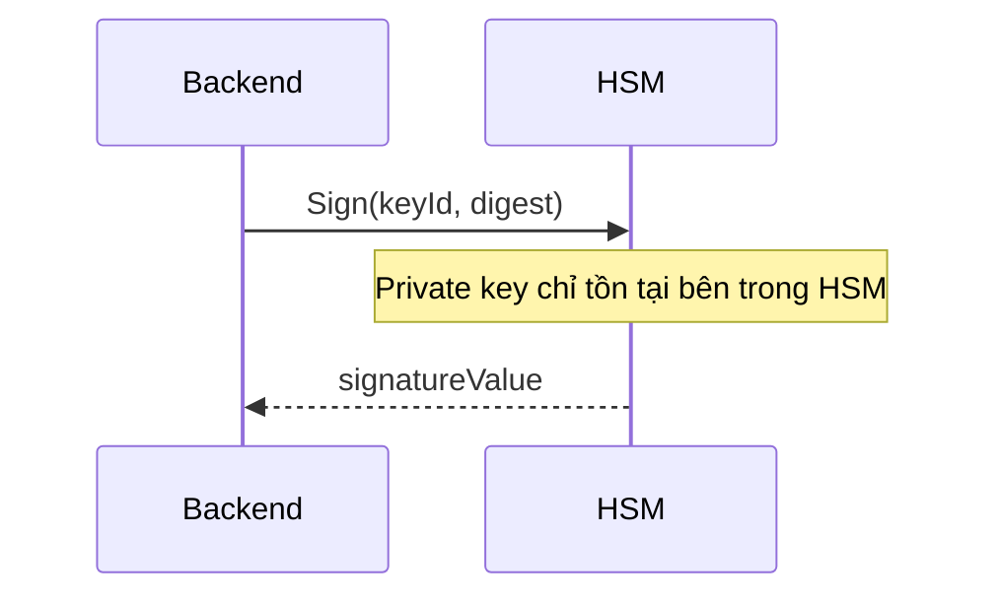
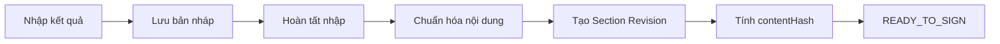
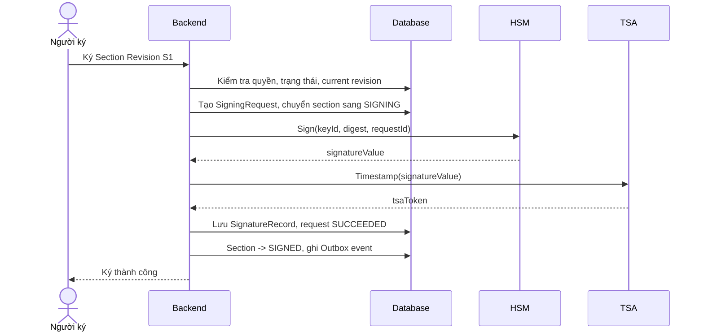
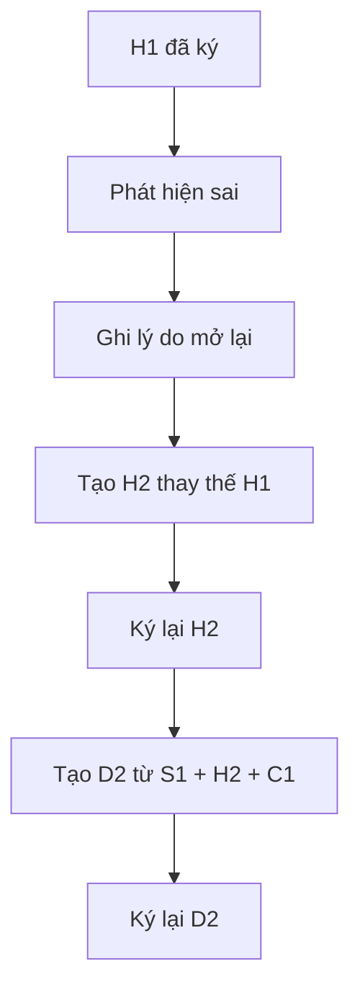
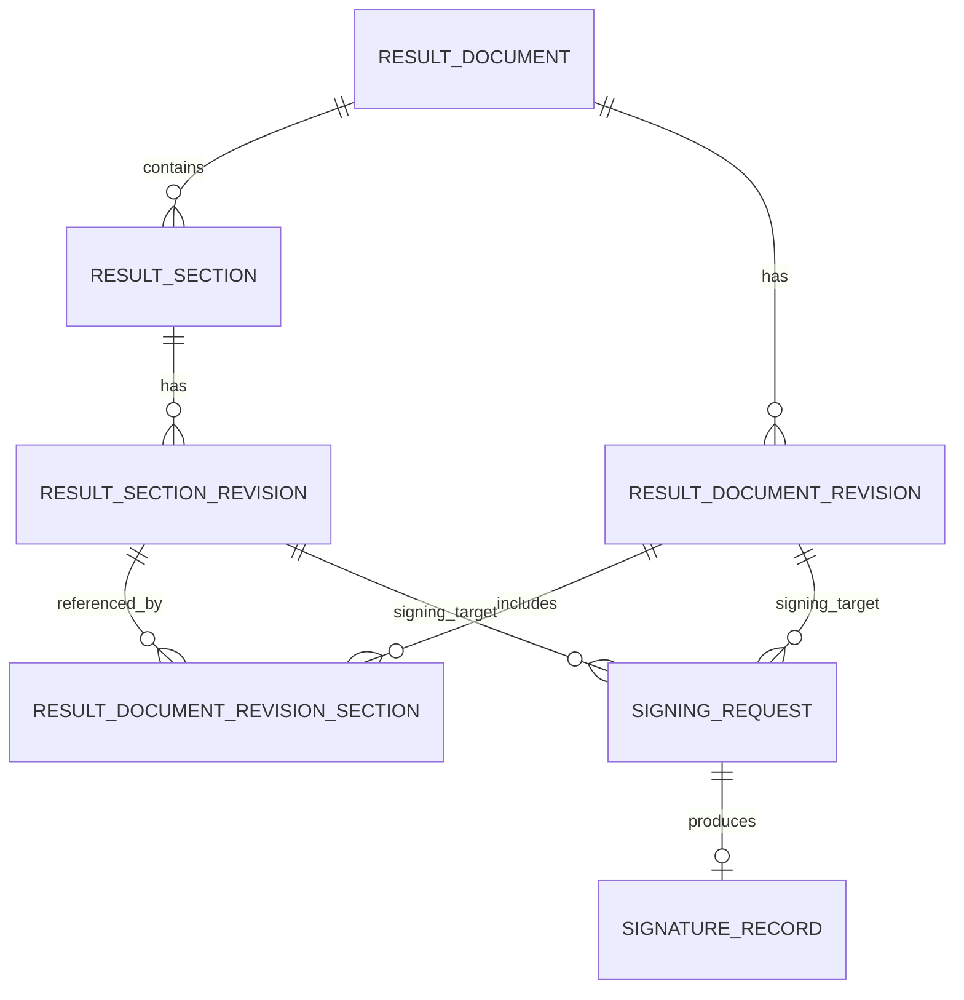
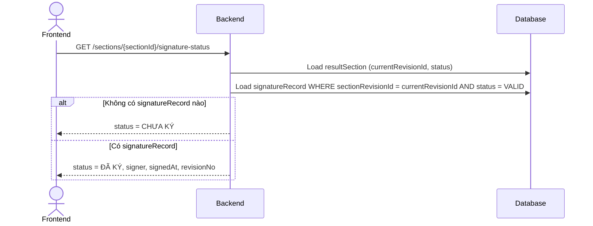

# Ký số HSM cho tài liệu kết quả nhiều phòng ban

## 1. Bài toán thực tế

Một phiếu kết quả tổng hợp có thể nhận dữ liệu từ nhiều phòng ban khác nhau. Mỗi phòng ban hoàn thành công việc ở một thời điểm riêng và chịu trách nhiệm chuyên môn cho phần nội dung của mình.

Ví dụ, phiếu kết quả của lượt khám `PK-1001` gồm:

| Phần kết quả | Phòng ban phụ trách | Người xác nhận |
|---|---|---|
| Sinh hóa | Khoa Xét nghiệm | Bác sĩ Sinh hóa |
| Huyết học | Khoa Huyết học | Bác sĩ Huyết học |
| Chẩn đoán hình ảnh | Khoa CĐHA | Bác sĩ CĐHA |
| Phiếu tổng hợp | Khoa điều trị | Bác sĩ điều trị, trưởng khoa |

Các phần không hoàn thành cùng lúc:

```text
09:00  Sinh hóa nhập kết quả
09:10  Bác sĩ A ký phần Sinh hóa
09:20  Huyết học mới bắt đầu nhập dữ liệu
09:30  CĐHA trả kết luận
09:35  Bác sĩ B ký phần Huyết học
09:50  Bác sĩ C ký phần CĐHA
10:00  Hệ thống tạo bản kết quả tổng hợp
10:05  Bác sĩ điều trị ký duyệt
10:10  Trưởng khoa đồng ký
```

Nếu coi toàn bộ phiếu là một file duy nhất và dùng một cờ `isSigned`, hệ thống sẽ gặp ngay hai mâu thuẫn:

```text
Phòng Sinh hóa đã ký
-> Có khóa toàn bộ phiếu không?

Nếu khóa toàn bộ
-> Huyết học và CĐHA chưa thể cập nhật.

Nếu không khóa
-> Nội dung file tiếp tục thay đổi sau chữ ký Sinh hóa.
```

Vấn đề cốt lõi vì thế không phải là:

```text
Gọi API HSM ở controller nào?
```

Mà là:

> Làm sao cho phép nhiều phòng ban cập nhật và ký độc lập, trong khi hệ thống vẫn chứng minh chính xác ai đã ký nội dung nào, thuộc phiên bản nào và tại thời điểm nào?

Muốn giải bài toán này, cần tách ba khái niệm:

```text
Tài liệu tổng
  ├── Các phần nội dung do từng phòng ban quản lý
  ├── Các phiên bản nội dung bất biến đã được chốt
  └── Các bằng chứng chữ ký gắn với đúng phiên bản
```

Ba nguyên tắc xuyên suốt tài liệu:

```text
1. Mỗi phòng ban chỉ sở hữu và cập nhật phần nội dung của mình.
2. Chữ ký phải gắn với một phiên bản nội dung bất biến.
3. Nội dung đã ký không bị sửa đè; thay đổi phải tạo phiên bản mới.
```

---

## 2. Hiểu đúng chữ ký số trước khi thiết kế luồng

### 2.1 Chữ ký số xác nhận nội dung nào?

Ở mức khái niệm, luồng ký diễn ra như sau:

```text
Nội dung nghiệp vụ
      ↓ chuẩn hóa
Canonical content
      ↓ SHA-256
Content hash
      ↓ HSM dùng private key để ký
Signature value
```

Hash có thể được hiểu là dấu vân tay của nội dung:

```text
Nội dung A                    -> Hash A
Nội dung A thay đổi một ký tự -> Hash B

Hash A != Hash B
```

Một chữ ký được tạo cho `Hash A` chỉ chứng minh người ký đã xác nhận nội dung sinh ra `Hash A`. Nó không còn đại diện cho nội dung đã bị sửa thành `Hash B`.

Ví dụ:

```text
Trước khi ký:
Hb = 12.0 g/dL
Hash = H1

Sau khi sửa:
Hb = 12.5 g/dL
Hash = H2

Signature(H1) không xác nhận Hb = 12.5.
```

Đây là lý do hệ thống không được cho phép sửa trực tiếp một bản nội dung đã ký rồi vẫn giữ trạng thái “đã ký”.

### 2.2 HSM thực sự làm gì?

HSM là nơi bảo vệ private key và thực hiện phép ký. Private key không được lấy ra để application tự ký.



Backend thường gửi:

```text
keyId   = khóa nào được sử dụng
digest  = hash nào cần ký
requestId = mã định danh yêu cầu ký
```

HSM trả về:

```text
signatureValue
certificate information
providerRequestId
```

HSM không chịu trách nhiệm kiểm tra:

- Người dùng hiện tại có quyền ký hay không.
- Người dùng có được phép dùng `keyId` đó hay không.
- Section có đang ở trạng thái cho phép ký hay không.
- Revision người dùng nhìn thấy có còn là revision hiện tại hay không.
- Phiếu đã đủ điều kiện để ký duyệt cuối hay chưa.

Các kiểm tra trên thuộc trách nhiệm của ứng dụng.

### 2.3 Certificate, TSA và các khái niệm liên quan

| Khái niệm | Cách hiểu ngắn gọn |
|---|---|
| Private key | Khóa bí mật dùng để tạo chữ ký, nằm trong HSM |
| Public key | Khóa dùng để kiểm tra chữ ký |
| Certificate | Chứng thư liên kết public key với danh tính cá nhân hoặc tổ chức |
| `hsmKeyId` | Mã tham chiếu đến private key trong HSM |
| CRL/OCSP | Cơ chế kiểm tra certificate có bị thu hồi hay không |
| TSA timestamp | Bằng chứng từ bên thứ ba rằng chữ ký đã tồn tại tại một thời điểm xác định |
| Signature value | Kết quả toán học do HSM tạo ra khi ký digest |

Certificate còn hạn tại thời điểm hiện tại chưa chắc đủ. Khi xác minh lâu dài, hệ thống còn cần biết certificate có hợp lệ tại thời điểm ký hay không. Vì vậy nên lưu snapshot certificate hoặc certificate chain cùng bằng chứng timestamp phù hợp.

### 2.4 Vì sao cần canonical content?

Hai JSON sau có cùng ý nghĩa nghiệp vụ nhưng byte khác nhau:

```json
{"name":"A","age":20}
```

```json
{"age":20,"name":"A"}
```

Nếu hash trực tiếp chuỗi JSON, hai dữ liệu có thể tạo hai hash khác nhau. Vì vậy trước khi hash phải áp dụng một quy tắc chuẩn hóa ổn định:

- Thứ tự field cố định.
- Định dạng ngày giờ cố định.
- Múi giờ được quy định rõ.
- Số thập phân có quy tắc biểu diễn thống nhất.
- `null`, chuỗi rỗng và field bị thiếu được phân biệt rõ.
- Encoding cố định, thường là UTF-8.
- Không đưa dữ liệu trình bày không ổn định vào business hash.

Ví dụ canonical content của section Huyết học:

```json
{
  "sectionType": "HEMATOLOGY",
  "patientId": 1001,
  "results": [
    {
      "code": "HGB",
      "value": "12.5",
      "unit": "g/dL"
    }
  ],
  "conclusion": "Trong giới hạn theo dõi"
}
```

### 2.5 Tách nội dung nghiệp vụ, bằng chứng chữ ký và file PDF

Đây là ba lớp thường bị trộn lẫn:

| Lớp | Nội dung | Vai trò |
|---|---|---|
| Business content | Kết quả, kết luận, ghi chú, mã dịch vụ | Dữ liệu người ký thực sự chịu trách nhiệm |
| Signature evidence | Hash, signature value, certificate, signer, thời điểm ký | Chứng minh ai đã ký nội dung nào |
| Presentation file | PDF, logo, font, bố cục, vị trí ô ký | Tài liệu để người dùng đọc hoặc trao đổi |

Luồng tư duy nên là:

```text
Structured business data
        ↓
Canonical content
        ↓
Business hash
        ↓
Signature evidence
        ↓
Render PDF / Embed PAdES
```

Không nên dùng PDF làm nguồn dữ liệu nghiệp vụ duy nhất. Một thay đổi nhỏ như font, logo hoặc metadata PDF có thể làm byte của file thay đổi, dù kết quả chuyên môn không đổi.

Ngược lại, khi cần một file PDF có thể được phần mềm bên ngoài xác minh chữ ký, cần ký theo chuẩn PDF phù hợp như PAdES. Khi đó hệ thống có thể cần quản lý đồng thời:

```text
contentHashAtSign   = hash nội dung nghiệp vụ
pdfRevisionDigest  = digest kỹ thuật của revision PDF
```

Hai giá trị này phục vụ hai mục tiêu khác nhau và không nên gộp thành một.

---

## 3. Cơ chế nhúng chữ ký vào PDF (PAdES)

Ở các mục trước, tài liệu đã tách nội dung nghiệp vụ, bằng chứng chữ ký và file PDF thành ba lớp riêng biệt, với hai loại hash đi kèm: một hash tính từ dữ liệu nghiệp vụ, một hash tính từ chính file PDF. Mục này giải thích cụ thể hash thứ hai đến từ đâu — cách một chữ ký số được nhúng vào file PDF theo chuẩn PAdES, và vì sao nhiều người có thể ký nối tiếp trên cùng một file mà không phá chữ ký của nhau.

### 3.1 Mô hình dễ nhớ: PDF là một cuốn sách có mục lục ở cuối

Trước khi vào `/Contents`, `/ByteRange` và CMS, một mô hình tối giản đủ dùng để nhớ cấu trúc PDF:

```text
%PDF-1.7   Header, nhận diện đây là file PDF

obj        Các object cấu thành PDF: trang, font, ảnh,
           nội dung, chữ ký...

xref       Mục lục: object nào nằm ở byte nào

trailer    Trỏ tới object gốc, cho reader biết bắt đầu đọc từ đâu

%%EOF      Kết thúc một phiên bản (revision) của PDF
```

Câu ghi nhớ: **Header nhận diện file — Object chứa dữ liệu — Xref tìm object — Trailer tìm gốc — EOF kết thúc.**

Khi chưa ký, file chỉ có một bộ `[object] [xref] [trailer] [%%EOF]`. Khi bác sĩ A ký, PDF không bị viết lại — hệ thống nối thêm một bộ mới vào cuối:

```text
[PDF gốc]
[xref cũ] [trailer cũ] [%%EOF]

[chữ ký bác sĩ A]
[xref mới] [trailer mới] [%%EOF]
```

Bác sĩ B ký tiếp thì lại nối thêm một bộ nữa, không đụng vào hai bộ trước:

```text
[PDF gốc]
[revision chữ ký A]
[revision chữ ký B]
```

Chỉ cần nhớ một câu: **mỗi lần ký là nối thêm một phiên bản vào cuối file, không sửa phần đã ký trước đó.**

Các chi tiết `Catalog`, `Pages`, `xref offset`, `generation number`... chỉ cần tra lại khi trực tiếp debug thư viện PDF. Ba ý dưới đây là đủ cho việc thiết kế hệ thống ký HSM, và các mục 3.3-3.10 sẽ đi sâu vào đúng ba ý này:

```text
1. PDF được tạo từ nhiều object.
2. Chữ ký nằm trong một object chữ ký.
3. Người ký tiếp theo append revision mới, không render lại
   và ghi đè file cũ.
```

### 3.2 Revision là gì?

`Revision` là một phiên bản của file sau một lần thay đổi. Trong PDF:

```text
Revision 0 = PDF ban đầu
Revision 1 = PDF sau khi bác sĩ A ký
Revision 2 = PDF sau khi bác sĩ B ký
```

PDF không xóa revision cũ mà nối phần thay đổi vào cuối file — revision mới giữ nguyên byte của revision cũ, nên chữ ký trước không bị phá; chữ ký sau chỉ xác nhận trên trạng thái file mới hơn tại thời điểm nó ký.

Gần giống Git (`commit 1` → file gốc, `commit 2` → thêm chữ ký A, `commit 3` → thêm chữ ký B), chỉ khác là PDF append thẳng vào cuối cùng một file thay vì lưu từng commit rời.

### 3.3 Hai loại "chữ ký" hay bị nhầm trong một file PDF

| Loại | Bản chất | Ai/cái gì đọc được |
|---|---|---|
| Hình ảnh chữ ký | Ảnh con dấu, tên người ký, ngày ký in trên trang | Con người, khi mở file xem bằng mắt |
| Chữ ký số nhúng (CMS `SignedData`) | Dữ liệu mật mã: signature value, certificate, thuật toán, signing time | Phần mềm verify (Adobe Reader, CA validator, backend tự kiểm tra) |

Một PDF có thể có ảnh chữ ký đẹp mà hoàn toàn không có chữ ký số hợp lệ — ngược lại một PDF có chữ ký số hợp lệ cũng không bắt buộc phải hiển thị gì trên trang. **Visible signature không đồng nghĩa digital signature.**

### 3.4 Vì sao không thể "ký xong rồi nối chữ ký vào cuối file"

Ký số cần hash toàn bộ nội dung cần bảo vệ. Nhưng nếu hash cả file rồi mới ghi chữ ký vào chính file đó, file đã đổi và hash cũ không còn đúng — một vòng lặp không thể tự giải quyết.

PAdES giải quyết bằng cách **chừa trước một vùng trống** cho chữ ký (`/Contents`) ngay khi tạo file, rồi loại trừ đúng vùng đó khỏi phạm vi tính hash bằng `/ByteRange`:

```text
PDF bytes

│---------- RANGE 1 ----------│--- /Contents ---│---------- RANGE 2 ----------│
        (đã ký)                  (vùng giữ chỗ,        (đã ký)
                                  không nằm trong
                                  phạm vi hash)

pdfDigest = SHA256(RANGE 1 bytes + RANGE 2 bytes)
```

Vì `/Contents` chỉ là vùng giữ chỗ (padding bằng số 0) tại thời điểm tính hash, độ dài file không đổi khi chữ ký thật được điền vào sau — nên `/ByteRange` và hash ban đầu vẫn đúng.

### 3.5 HSM ký trực tiếp hash của PDF hay ký một lớp khác?

Thông thường không ký thẳng `pdfDigest`. Chuẩn CMS yêu cầu digest được bọc thêm trong một tập `signedAttributes` (kèm certificate, thời điểm ký...), rồi mới hash tập đó thành `attributesDigest` — và đây mới là giá trị gửi cho HSM:

```text
pdfDigest        = SHA256(bytes theo ByteRange)
signedAttributes = { messageDigest: pdfDigest, signingCertificate, signingTime, ... }
attributesDigest = SHA256(DER(signedAttributes))

HSM.Sign(keyId, attributesDigest) -> signatureValue
```

Không nên giả định "cứ gửi hash file cho HSM là xong" — cần đúng lớp digest mà thư viện PDF/CMS yêu cầu, nếu không chữ ký sẽ không verify được dù HSM trả về thành công.

### 3.6 Phân chia trách nhiệm giữa PDF library và HSM

| Thành phần | Việc phải làm |
|---|---|
| PDF library | Render PDF, tạo signature field, chừa `/Contents`, tính `/ByteRange`, tạo `signedAttributes`, đóng gói CMS `SignedData`, ghi CMS vào `/Contents` |
| HSM | Giữ private key, ký `attributesDigest`, trả `signatureValue` — không biết gì về PDF |

HSM chỉ thực hiện đúng một phép toán mật mã (`Sign(keyId, digest)`); mọi phần liên quan đến cấu trúc PDF là trách nhiệm của tầng ứng dụng, đúng nguyên tắc đã nêu ở mục 2.2.

### 3.7 Nhiều người ký: incremental update, không sửa file cũ

Người ký sau không mở lại và ghi đè file — PDF cho phép **append thêm một revision mới vào cuối file**, giữ nguyên toàn bộ byte của các revision trước:

```text
Revision 0: PDF gốc
Revision 1: + chữ ký BS Dũng     (objects, xref, trailer riêng)
Revision 2: + chữ ký Trưởng khoa (objects, xref, trailer riêng, nối vào cuối)
```

Điểm mấu chốt nằm ở phạm vi `ByteRange` của từng chữ ký:

```text
ByteRange của chữ ký 1  ⊂  PDF gốc + revision 1
ByteRange của chữ ký 2  ⊃  PDF gốc + revision 1 + revision 2
```

Chữ ký 2 bao trùm luôn phần chứa chữ ký 1, nhưng chữ ký 1 không biết gì về chữ ký 2 sinh ra sau nó. Vì vậy thêm chữ ký thứ hai theo đúng incremental update **không làm chữ ký thứ nhất mất hiệu lực** — nó vẫn verify đúng trên đúng phạm vi byte đã ký ban đầu. Chữ ký chỉ thực sự invalid khi có ai đó sửa byte của một revision đã ký (rewrite nội dung cũ, hoặc compact/rebuild lại toàn bộ file thay vì append).

### 3.8 Hai rủi ro cần lường trước khi implement

```text
Vùng /Contents chừa quá nhỏ:
  Certificate chain, TSA timestamp, dữ liệu OCSP/CRL có thể làm CMS
  phình to hơn dự tính. Vùng giữ chỗ không thể mở rộng giữa chừng vì
  sẽ dịch chuyển byte và phá ByteRange đã tính — phải hủy bản nháp,
  tạo lại placeholder lớn hơn, tính lại ByteRange và ký lại từ đầu.

Rewrite/compact file có chứa chữ ký:
  Một số thao tác "dọn dẹp" PDF (gộp các incremental revision, tối ưu
  dung lượng) sẽ ghi lại byte đã ký và làm invalid mọi chữ ký nằm
  trong các revision đó. Không áp dụng các thao tác này lên file đã ký.
```

### 3.9 Liên hệ lại với `contentHashAtSign` và `pdfRevisionDigest`

Giờ có thể gọi tên rõ hai lớp hash đã dùng xuyên suốt tài liệu:

`contentHashAtSign` — hash tính từ dữ liệu nghiệp vụ đã chuẩn hóa (kết quả xét nghiệm, kết luận...). Trả lời câu hỏi: người ký đã xác nhận đúng bộ kết quả nghiệp vụ nào?

`pdfRevisionDigest` — chính là `attributesDigest` vừa nêu ở mục 3.5, tính theo `ByteRange` của đúng PDF revision mà người đó ký. Trả lời câu hỏi: những byte PDF nào đã được ký, và chúng có còn nguyên vẹn không?

Ví dụ hai người đồng ký cùng một document revision `HD1`:

| Người ký | `contentHashAtSign` | `pdfRevisionDigest` |
|---|---|---|
| Bác sĩ điều trị | `HD1` | digest theo `ByteRange` của revision 1 |
| Trưởng khoa | `HD1` | digest theo `ByteRange` của revision 2 |

`contentHashAtSign` giống nhau vì cả hai cùng xác nhận một nội dung nghiệp vụ. `pdfRevisionDigest` khác nhau vì người ký sau đang ký trên một file đã dài hơn (chứa cả chữ ký của người trước) — không phải vì nội dung nghiệp vụ thay đổi. Vì vậy không được dùng `pdfRevisionDigest` để kết luận nội dung nghiệp vụ đã đổi hay chưa; chỉ `contentHashAtSign` mới trả lời được câu hỏi đó.

### 3.10 Gợi ý tách trách nhiệm ở tầng service

```text
Document Service        lấy dữ liệu nghiệp vụ đã canonicalize
        ↓
PDF Rendering Service    render PDF chưa ký từ dữ liệu nghiệp vụ
        ↓
PDF Signing Service      tạo signature field, /Contents, /ByteRange,
                         signedAttributes, đóng gói CMS
        ↓
HSM Adapter              chỉ nhận digest, trả signatureValue
        ↓
PDF Signing Service      ghi CMS vào /Contents, hoàn tất revision
        ↓
File Storage             lưu PDF revision mới
Signature Repository     lưu signatureRecord (mục 6.7)
```

Không nên gộp toàn bộ luồng render → hash → gọi HSM → ghi byte → upload vào một hàm xử lý duy nhất ở controller. Việc tách `PDF Signing Service` thành một service riêng giúp thay HSM provider hoặc nâng cấp chuẩn PAdES sau này mà không đụng vào logic nghiệp vụ ở `Document Service`.

---

## 4. Tư duy phân tích bài toán trước khi chọn model

Không nên bắt đầu bằng việc tạo bảng. Trước tiên cần xác định phạm vi trách nhiệm, thời điểm nội dung được chốt và cách hệ thống xử lý thay đổi.

### 4.1 Ai chịu trách nhiệm cho phần nào?

Với phiếu nhiều phòng ban, trách nhiệm thường có hai tầng:

```text
Tầng 1: Trách nhiệm chuyên môn theo section
- Bác sĩ Sinh hóa ký phần Sinh hóa.
- Bác sĩ Huyết học ký phần Huyết học.
- Bác sĩ CĐHA ký phần CĐHA.

Tầng 2: Trách nhiệm duyệt bản tổng hợp
- Bác sĩ điều trị ký bản tổng hợp.
- Trưởng khoa có thể đồng ký hoặc phê duyệt tiếp.
```

Từ đây suy ra hệ thống cần phân biệt:

```text
Ký section
Ký document tổng hợp
```

Không thể chỉ có một `signature` nằm trực tiếp trên phiếu tổng.

### 4.2 Các phòng ban có làm việc độc lập không?

Các câu hỏi cần trả lời:

```text
Sinh hóa có được ký trước khi Huyết học hoàn tất không?
Một phòng ban có được sửa section của phòng ban khác không?
Khi Sinh hóa đang ký, CĐHA có tiếp tục nhập kết quả được không?
```

Trong mô hình phổ biến:

```text
Mỗi phòng ban có một section độc lập.
Mỗi section có trạng thái và phiên bản riêng.
Các section được cập nhật song song.
Không khóa toàn bộ document chỉ vì một section đang ký.
```

Ví dụ:

```text
Section Sinh hóa: SIGNED
Section Huyết học: DRAFT
Section CĐHA: READY_TO_SIGN
Document tổng: IN_PROGRESS
```

Trạng thái trên hoàn toàn hợp lệ. Một phần đã ký không có nghĩa toàn bộ phiếu đã hoàn tất.

### 4.3 Khi nào nội dung được coi là một phiên bản đã chốt?

Trong lúc nhập liệu, một section có thể được sửa nhiều lần. Không cần tạo bằng chứng chữ ký cho từng lần gõ phím.

Một revision nên được tạo khi nội dung đạt một mốc nghiệp vụ rõ ràng, ví dụ:

```text
Người nhập chọn “Hoàn tất nhập kết quả”
-> Backend chuẩn hóa dữ liệu
-> Tạo Section Revision R1
-> Tính contentHash
-> Section chuyển READY_TO_SIGN
```

Revision là snapshot bất biến. Sau khi tạo R1:

```text
R1.content không còn bị update.
```

Nếu phát hiện sai trước khi ký, có thể hủy R1 và tạo R2 tùy chính sách. Nếu R1 đã ký, bắt buộc giữ lại R1 và tạo R2 để thay thế.

### 4.4 Khi nào được tạo bản tổng hợp?

Document revision không nên được hiểu là “lấy dữ liệu mới nhất mỗi lần mở PDF”. Nó phải là một snapshot xác định, tham chiếu đúng revision của từng section.

Ví dụ:

```text
Sinh hóa S1: SIGNED
Huyết học H1: SIGNED
CĐHA C1: SIGNED

Document D1 = {S1, H1, C1}
```

Nếu sau đó Huyết học sửa thành H2:

```text
Document D1 vẫn là {S1, H1, C1}
Document D2 mới là {S1, H2, C1}
```

Không được biến D1 thành D2 bằng cách update nội dung bên trong D1. Nếu làm vậy, chữ ký đã gắn với D1 mất ý nghĩa.

### 4.5 Ký song song và đồng ký là hai bài toán khác nhau

**Ký song song theo section**:

```text
Sinh hóa ký S1
Huyết học ký H1
CĐHA ký C1
```

Mỗi người ký một nội dung khác nhau.

**Đồng ký trên cùng document revision**:

```text
Bác sĩ điều trị ký D1
Trưởng khoa ký tiếp D1
```

Hai người cùng xác nhận một business content. Nếu dùng PDF PAdES, file sẽ có thêm revision kỹ thuật sau mỗi lần ký, nhưng business content của D1 không đổi.

Không được coi chữ ký của trưởng khoa là “ký lại do chữ ký bác sĩ điều trị không còn hợp lệ”. Đây chỉ là thêm một signer mới trên cùng bản nội dung.

### 4.6 Chính sách sửa sau ký

Đây là quyết định ảnh hưởng mạnh nhất đến thiết kế.

#### Section đã ký nhưng document chưa finalized

```text
Huyết học H1 đã ký
Phát hiện sai Hb

Không update H1
-> tạo H2
-> H1 trở thành phiên bản cũ
-> H2 phải được ký lại
```

Nếu đã tồn tại document revision D1 chứa H1 nhưng chưa hoàn tất ký, D1 không còn là bản hiện hành. Hệ thống tạo D2 chứa H2.

#### Document đã finalized

```text
D1 đã đủ chữ ký và phát hành
Sau đó phát hiện sai Huyết học
```

Không được sửa trực tiếp D1. Cần tạo luồng đính chính:

```text
H2 thay thế H1
D2 = {S1, H2, C1}
D2 tham chiếu D1 là bản bị thay thế hoặc được đính chính
D2 đi qua luồng ký mới
D1 vẫn được lưu phục vụ audit
```

Vì vậy trạng thái chữ ký cũ nên được hiểu cẩn thận:

- Chữ ký trên D1 vẫn có thể hợp lệ về mặt toán học đối với D1.
- Nhưng D1 không còn là bản kết quả hiện hành.
- Không nên xóa hoặc sửa chữ ký cũ.
- Có thể đánh dấu D1 là `SUPERSEDED` hoặc `AMENDED` tùy ngữ nghĩa nghiệp vụ.

---

## 5. Luồng xử lý hoàn chỉnh

### 5.1 Nhập và chốt nội dung theo từng phòng ban



Ví dụ section Sinh hóa:

```text
Bước 1: Kỹ thuật viên nhập kết quả.
Bước 2: Nội dung nằm ở bản nháp và còn sửa được.
Bước 3: Người có quyền chọn “Hoàn tất nhập”.
Bước 4: Backend canonicalize dữ liệu.
Bước 5: Tạo revision S1 và contentHash = HS1.
Bước 6: Section chuyển READY_TO_SIGN.
```

Điểm quan trọng:

```text
Bản nháp có thể thay đổi.
Revision đã tạo để ký phải bất biến.
```

### 5.2 Ký một section



Luồng chi tiết:

```text
1. Frontend gửi sectionRevisionId, expectedVersion và idempotencyKey.
2. Backend kiểm tra revision có đúng currentRevisionId không.
3. Kiểm tra section đang ở READY_TO_SIGN.
4. Kiểm tra signer có đúng phòng ban, vai trò và key được cấp không.
5. Backend tính lại hash từ canonicalContent trong DB.
6. Tạo SigningRequest.
7. Chuyển section READY_TO_SIGN -> SIGNING bằng optimistic concurrency.
8. Commit transaction ngắn.
9. Gọi HSM ngoài transaction DB.
10. Nhận signatureValue và TSA token nếu có.
11. Mở transaction ngắn thứ hai:
    - insert SignatureRecord
    - update SigningRequest = SUCCEEDED
    - update Section = SIGNED
    - insert Outbox event SectionSigned
12. Commit.
```

### 5.3 Vì sao cần `SigningRequest` trước khi gọi HSM?

Nếu chỉ gọi HSM rồi mới insert chữ ký, hệ thống thiếu một thực thể để theo dõi các trạng thái trung gian:

```text
Người dùng đã bấm ký chưa?
Yêu cầu đang chờ HSM hay đã timeout?
Remote CA đang chờ bác sĩ xác nhận OTP không?
Request nào tương ứng với callback vừa nhận?
Có phải người dùng vừa double-click không?
```

`SigningRequest` tồn tại để mô tả **quá trình yêu cầu ký**. Nó khác với `SignatureRecord`, vốn mô tả **bằng chứng chữ ký đã được tạo thành công**.

Ví dụ:

```text
SigningRequest #101
status = UNKNOWN
providerRequestId = HSM-8891

Chưa thể tạo SignatureRecord vì backend chưa nhận được signatureValue.
```

Khi đối soát thấy HSM đã xử lý thành công:

```text
SigningRequest #101 -> SUCCEEDED
SignatureRecord #501 được tạo
```

### 5.4 Vì sao không giữ transaction DB trong lúc gọi HSM?

Không nên làm:

```text
BEGIN TRANSACTION
  Lock section
  Gọi HSM trong 3-10 giây
  Insert signature
COMMIT
```

Các vấn đề:

- Giữ connection DB trong thời gian chờ network.
- Lock kéo dài.
- Tăng nguy cơ timeout và deadlock.
- Khi số lượng ký tăng, connection pool dễ bị cạn.
- Remote signing có thể chờ người dùng xác nhận lâu hơn nhiều giây.

Thiết kế phù hợp hơn:

```text
Transaction 1
- Validate
- Tạo SigningRequest
- READY_TO_SIGN -> SIGNING
COMMIT

Gọi HSM ngoài transaction

Transaction 2
- Lưu SignatureRecord
- SigningRequest -> SUCCEEDED
- Section -> SIGNED
COMMIT
```

Đổi lại, hệ thống phải chấp nhận trạng thái trung gian và có job reconciliation.

### 5.5 Tạo document revision

Khi đủ các section bắt buộc:

```text
S1 - Sinh hóa: SIGNED
H1 - Huyết học: SIGNED
C1 - CĐHA: SIGNED
```

Hệ thống tạo:

```text
Document Revision D1
  ├── S1
  ├── H1
  └── C1
```

Luồng:

```text
1. Đọc cấu hình loại phiếu để biết section bắt buộc.
2. Kiểm tra current revision của từng section đã SIGNED.
3. Tạo snapshot các section revision được chọn.
4. Compile canonical document content.
5. Tính documentContentHash.
6. Lưu Document Revision D1.
7. Chuyển document sang READY_FOR_FINAL_SIGN.
```

Không nên chỉ lưu một JSON tổng hợp mà không lưu quan hệ D1 được tạo từ S1, H1, C1. Nếu không có quan hệ này, rất khó trả lời:

```text
D1 đã dùng revision Huyết học nào?
Khi H1 bị thay thế, document revision nào bị ảnh hưởng?
Tại sao D1 và D2 khác nhau?
```

### 5.6 Ký duyệt và đồng ký document

Ví dụ quy định:

```text
sequenceNo = 1: Bác sĩ điều trị
sequenceNo = 2: Trưởng khoa
```

Luồng:

```text
Bác sĩ điều trị ký D1
-> SignatureRecord A, contentHashAtSign = HD1

Trưởng khoa ký D1
-> kiểm tra chữ ký sequenceNo = 1 đã tồn tại
-> SignatureRecord B, contentHashAtSign = HD1

Đủ chữ ký bắt buộc
-> Document D1 = FINALIZED
```

Hai chữ ký cùng `contentHashAtSign = HD1` vì business content không đổi.

Nếu nhúng chữ ký vào PDF bằng PAdES:

```text
Lần ký 1 -> PDF Revision P1 -> pdfRevisionDigest F1
Lần ký 2 -> PDF Revision P2 -> pdfRevisionDigest F2

HD1 giống nhau
F1 khác F2
```

Đây không phải lỗi. `HD1` bảo vệ nội dung nghiệp vụ, còn `F1`, `F2` phản ánh từng revision kỹ thuật của file PDF.

### 5.7 Sửa nội dung sau khi đã ký

Ví dụ Huyết học H1 đã ký nhưng phát hiện sai:



Không update H1. Không xóa chữ ký H1. Không sửa D1 thành D2.

Kết quả lịch sử:

```text
H1: nội dung cũ, chữ ký cũ, SUPERSEDED
H2: nội dung mới, chữ ký mới, CURRENT

D1 = {S1, H1, C1}, SUPERSEDED hoặc AMENDED
D2 = {S1, H2, C1}, CURRENT
```

Cách lưu này cho phép audit đầy đủ:

```text
Ai đã ký kết quả cũ?
Sai ở điểm nào?
Ai yêu cầu sửa?
Phiên bản nào thay thế phiên bản nào?
Bản nào đang có hiệu lực hiện tại?
```

---

## 6. Từ luồng nghiệp vụ suy ra mô hình dữ liệu

Data model chỉ nên xuất hiện sau khi đã hiểu các nhu cầu phía trên. Mỗi bảng dưới đây tồn tại để giải quyết một vấn đề cụ thể, không phải để “chuẩn hóa cho đẹp”.

### 6.1 Vì sao cần `resultDocument`?

`resultDocument` đại diện cho thực thể phiếu kết quả trong suốt vòng đời nghiệp vụ.

Nó trả lời các câu hỏi:

```text
Đây là phiếu nào?
Thuộc lượt khám nào?
Loại phiếu gì?
Trạng thái tổng thể hiện tại là gì?
Document revision nào đang là bản hiện hành?
```

Không nên đặt toàn bộ nội dung từng khoa trực tiếp trong bảng này, vì các phòng ban cập nhật độc lập và có lịch sử revision riêng.

| Tên trường | Type | Ý nghĩa |
|---|---|---|
| `id` | `BIGINT` | Khóa chính của phiếu kết quả |
| `tenantId` | `BIGINT` | Đơn vị hoặc cơ sở sở hữu dữ liệu |
| `encounterId` | `BIGINT` | Lượt khám hoặc hồ sơ nghiệp vụ liên quan |
| `documentType` | `VARCHAR(50)` | Loại phiếu, ví dụ `CLS_COMBINED_RESULT` |
| `currentRevisionId` | `BIGINT NULL` | Document revision đang là bản hiện hành |
| `status` | `VARCHAR(30)` | Trạng thái tổng thể của phiếu |
| `version` | `BIGINT` | Optimistic concurrency token |
| `createdAt` | `DATETIME` | Thời điểm tạo phiếu |
| `createdBy` | `BIGINT` | Người hoặc tiến trình tạo phiếu |

Trạng thái gợi ý:

```text
DRAFT
IN_PROGRESS
READY_FOR_FINAL_SIGN
PARTIALLY_SIGNED
FINALIZED
AMENDED
SUPERSEDED
```

### 6.2 Vì sao cần `resultSection`?

`resultSection` đại diện cho phạm vi làm việc của một phòng ban trong phiếu.

Nó tồn tại để:

- Tách quyền sở hữu dữ liệu theo phòng ban.
- Cho phép các phòng ban cập nhật song song.
- Quản lý trạng thái ký riêng của từng phần.
- Biết revision nào đang là revision hiện tại.
- Tránh lock toàn document.

| Tên trường | Type | Ý nghĩa |
|---|---|---|
| `id` | `BIGINT` | Khóa chính của section |
| `documentId` | `BIGINT` | Phiếu tổng chứa section |
| `sectionType` | `VARCHAR(50)` | Loại section, ví dụ `BIOCHEMISTRY` |
| `departmentId` | `BIGINT` | Phòng ban chịu trách nhiệm |
| `currentRevisionId` | `BIGINT NULL` | Revision hiện tại của section |
| `status` | `VARCHAR(30)` | Trạng thái xử lý hiện tại |
| `version` | `BIGINT` | Optimistic concurrency token |
| `updatedAt` | `DATETIME` | Thời điểm thay đổi trạng thái gần nhất |
| `updatedBy` | `BIGINT` | Người thực hiện thay đổi gần nhất |

Ràng buộc thường cần:

```text
UNIQUE(documentId, sectionType, departmentId)
```

Trạng thái gợi ý:

```text
DRAFT
READY_TO_SIGN
SIGNING
SIGNED
REOPENED
```

### 6.3 Vì sao cần `resultSectionRevision`?

Nếu chữ ký trỏ trực tiếp vào `resultSection`, trong khi nội dung của row đó còn bị update, chữ ký sẽ mất điểm tựa bất biến.

`resultSectionRevision` tồn tại để lưu snapshot nội dung tại từng lần chốt.

Nó trả lời:

```text
Bác sĩ đã ký chính xác nội dung nào?
Hash nào đã được gửi cho HSM?
Revision hiện tại thay thế revision nào?
Ai tạo revision này và lúc nào?
```

| Tên trường | Type | Ý nghĩa |
|---|---|---|
| `id` | `BIGINT` | Khóa chính của revision |
| `sectionId` | `BIGINT` | Section sở hữu revision |
| `revisionNo` | `INT` | Số phiên bản tăng dần trong section |
| `canonicalContent` | `JSON` hoặc `LONGTEXT` | Snapshot nội dung chuẩn hóa dùng để tính hash |
| `contentHash` | `CHAR(64)` | SHA-256 của canonical content |
| `supersedesRevisionId` | `BIGINT NULL` | Revision cũ được phiên bản này thay thế |
| `createdAt` | `DATETIME` | Thời điểm tạo revision |
| `createdBy` | `BIGINT` | Người tạo revision |
| `changeReason` | `VARCHAR(500) NULL` | Lý do tạo revision thay thế nếu có |

Ví dụ:

```text
H1: Hb = 12.0, đã ký
H2: Hb = 12.5, supersedes H1, đã ký lại
```

H1 không bị update thành 12.5.

### 6.4 Vì sao cần `resultDocumentRevision`?

Document tổng cũng cần phiên bản bất biến giống section.

Nếu chỉ render PDF từ “dữ liệu mới nhất”, hệ thống không biết bản mà bác sĩ đã ký chứa tập section nào.

`resultDocumentRevision` tồn tại để mô tả một bản tổng hợp cụ thể:

```text
D1 = {S1, H1, C1}
D2 = {S1, H2, C1}
```

| Tên trường | Type | Ý nghĩa |
|---|---|---|
| `id` | `BIGINT` | Khóa chính của document revision |
| `documentId` | `BIGINT` | Phiếu tổng sở hữu revision |
| `revisionNo` | `INT` | Số phiên bản của document |
| `canonicalContent` | `JSON` hoặc `LONGTEXT` | Snapshot nội dung tổng hợp đã chuẩn hóa |
| `contentHash` | `CHAR(64)` | Business hash của bản tổng hợp |
| `pdfFileId` | `BIGINT NULL` | File PDF tương ứng nếu đã render |
| `supersedesRevisionId` | `BIGINT NULL` | Document revision cũ bị thay thế |
| `status` | `VARCHAR(30)` | Trạng thái của revision |
| `createdAt` | `DATETIME` | Thời điểm tạo |
| `createdBy` | `BIGINT` | Người hoặc tiến trình tạo |

### 6.5 Vì sao cần `resultDocumentRevisionSection`?

Chỉ lưu `canonicalContent` trong document revision chưa đủ cho việc truy vết quan hệ.

Bảng liên kết này cho biết document revision được tạo từ chính xác section revision nào. Nó hỗ trợ:

- Audit nguồn dữ liệu của document.
- Xác định document nào phụ thuộc vào revision bị thay thế.
- So sánh hai document revision.
- Render lại đúng bản cũ.

| Tên trường | Type | Ý nghĩa |
|---|---|---|
| `documentRevisionId` | `BIGINT` | Document revision |
| `sectionRevisionId` | `BIGINT` | Section revision được đưa vào bản tổng hợp |
| `sectionOrder` | `INT` | Thứ tự hiển thị hoặc tổng hợp |
| `sectionType` | `VARCHAR(50)` | Snapshot loại section để truy vấn thuận tiện |

Ràng buộc gợi ý:

```text
PRIMARY KEY(documentRevisionId, sectionRevisionId)
```

### 6.6 Vì sao cần `signingRequest`?

Một lần người dùng bấm ký không phải lúc nào cũng hoàn thành ngay.

Yêu cầu có thể:

```text
Đang gửi HSM
Chờ người dùng xác nhận remote signing
Timeout nhưng chưa biết kết quả
Thất bại
Thành công
Hết hạn
```

`signingRequest` quản lý vòng đời của **hành động yêu cầu ký**, hỗ trợ idempotency, callback và reconciliation.

| Tên trường | Type | Ý nghĩa |
|---|---|---|
| `id` | `BIGINT` | Khóa chính của yêu cầu ký |
| `idempotencyKey` | `VARCHAR(150)` | Ngăn tạo nhiều request cho cùng một hành động |
| `targetType` | `VARCHAR(30)` | `SECTION_REVISION` hoặc `DOCUMENT_REVISION` |
| `targetRevisionId` | `BIGINT` | Revision cần ký |
| `signerId` | `BIGINT` | Người thực hiện ký |
| `signerRole` | `VARCHAR(50)` | Vai trò ký |
| `signingPurpose` | `VARCHAR(50)` | Mục đích ký, ví dụ `SECTION_CONFIRMATION` |
| `sequenceNo` | `INT NULL` | Thứ tự ký nếu có quy trình tuần tự |
| `hsmKeyId` | `VARCHAR(100)` | Key được yêu cầu sử dụng |
| `digest` | `CHAR(64)` | Hash gửi đi ký |
| `providerRequestId` | `VARCHAR(150) NULL` | Correlation ID phía HSM hoặc CA |
| `status` | `VARCHAR(30)` | Trạng thái xử lý request |
| `requestedAt` | `DATETIME` | Thời điểm tạo yêu cầu |
| `completedAt` | `DATETIME NULL` | Thời điểm hoàn tất |
| `failureCode` | `VARCHAR(100) NULL` | Mã lỗi nếu thất bại |
| `failureMessage` | `VARCHAR(1000) NULL` | Chi tiết lỗi đã chuẩn hóa |

Trạng thái tối thiểu:

```text
PENDING
PROCESSING
WAITING_FOR_USER_APPROVAL
SUCCEEDED
FAILED
UNKNOWN
EXPIRED
```

### 6.7 Vì sao cần `signatureRecord`?

`signatureRecord` lưu bằng chứng chữ ký đã được tạo thành công. Nó không đại diện cho request đang xử lý.

Bảng này phải trả lời được:

```text
Ai đã ký?
Ký với vai trò nào?
Ký revision nào?
Hash tại thời điểm ký là gì?
Dùng certificate và HSM key nào?
Ký lúc nào?
Có TSA timestamp không?
Chữ ký thuộc thứ tự nào trong quy trình đồng ký?
```

| Tên trường | Type | Ý nghĩa |
|---|---|---|
| `id` | `BIGINT` | Khóa chính của bằng chứng chữ ký |
| `signingRequestId` | `BIGINT` | Request đã tạo ra chữ ký |
| `documentId` | `BIGINT` | Phiếu tổng liên quan |
| `sectionRevisionId` | `BIGINT NULL` | Revision được ký nếu phạm vi là section |
| `documentRevisionId` | `BIGINT NULL` | Revision được ký nếu phạm vi là document |
| `signatureScope` | `VARCHAR(20)` | `SECTION` hoặc `DOCUMENT` |
| `signerId` | `BIGINT` | Người ký |
| `signerRole` | `VARCHAR(50)` | Vai trò người ký |
| `departmentId` | `BIGINT NULL` | Phòng ban của người ký |
| `sequenceNo` | `INT NULL` | Thứ tự ký nếu bắt buộc tuần tự |
| `contentHashAtSign` | `CHAR(64)` | Business hash tại thời điểm ký |
| `pdfRevisionDigest` | `CHAR(64) NULL` | Digest kỹ thuật của revision PDF |
| `signatureValue` | `LONGTEXT` | Giá trị chữ ký do HSM trả về |
| `certificateSerial` | `VARCHAR(150)` | Serial của certificate |
| `certificateSubject` | `VARCHAR(500)` | Chủ thể certificate |
| `certificateSnapshot` | `LONGTEXT` | Snapshot certificate hoặc chain |
| `hsmKeyId` | `VARCHAR(100)` | Key đã dùng để ký |
| `signedAt` | `DATETIME` | Thời điểm ký |
| `tsaToken` | `LONGTEXT NULL` | Timestamp token nếu có |
| `status` | `VARCHAR(30)` | Trạng thái nghiệp vụ của bằng chứng chữ ký |

Nguyên tắc:

```text
Không update signatureValue.
Không xóa signatureRecord đã tạo.
Nội dung mới -> revision mới -> signatureRecord mới.
```

Trạng thái `SUPERSEDED` thường chính xác hơn việc nói chữ ký cũ “sai”. Chữ ký cũ vẫn có thể xác minh đúng cho nội dung cũ, nhưng không còn đại diện cho phiên bản hiện hành.

### 6.8 Quan hệ tổng thể



---

## 7. Các quy tắc hệ thống phải luôn giữ đúng

Các quy tắc này là invariant. Vi phạm một trong số chúng có thể khiến trạng thái hiển thị khác với bằng chứng chữ ký thực tế.

| Quy tắc | Lý do |
|---|---|
| Chữ ký phải trỏ tới revision bất biến | Nếu content còn update được, chữ ký mất ý nghĩa |
| Revision đã ký không được sửa | Thay đổi phải tạo revision mới để giữ audit |
| Chỉ current revision mới được phép ký | Tránh ký dữ liệu cũ do UI stale |
| Backend phải tính lại hash | Không tin hash do frontend gửi lên |
| Signer phải đúng người, role, department và key | HSM không thay ứng dụng kiểm tra authorization |
| Document chỉ được ký khi đủ section bắt buộc | Tránh ký bản thiếu nội dung |
| Thay đổi section phải tạo document revision mới | Document signature cũ chỉ bảo vệ tập revision cũ |
| Mỗi hành động ký phải idempotent | Double-click và retry không được tạo nhiều request độc lập |
| Timeout không đồng nghĩa chưa ký | Phải dùng `UNKNOWN` và reconciliation |
| Finalized revision không được sửa trực tiếp | Mọi sửa đổi phải tạo amendment hoặc revision mới |

### Kiểm tra current revision

Frontend gửi:

```text
targetRevisionId = H1
expectedVersion = 8
```

Backend kiểm tra:

```text
targetRevisionId == resultSection.currentRevisionId
resultSection.version == expectedVersion
resultSection.status == READY_TO_SIGN
```

Nếu không khớp, trả conflict và yêu cầu tải lại.

### Idempotency key

Ví dụ:

```text
sign:SECTION_REVISION:H1:doctor-25:SECTION_CONFIRMATION
```

Nếu cùng key được gửi lại, backend trả về `SigningRequest` đã tồn tại thay vì tạo request mới.

### Optimistic concurrency

```sql
UPDATE resultSection
SET status = 'SIGNING',
    version = version + 1,
    updatedAt = @now,
    updatedBy = @signerId
WHERE id = @sectionId
  AND currentRevisionId = @revisionId
  AND status = 'READY_TO_SIGN'
  AND version = @expectedVersion;
```

Nếu `affectedRows = 0`, không được gọi HSM.

---

## 8. Luồng verify khi hiển thị "đã ký"

Mục 7 định nghĩa các invariant phải luôn đúng. Mục này mô tả luồng đọc dữ liệu (read path) — nơi hệ thống chứng minh cho người dùng thấy các invariant đó thực sự đang được giữ, thay vì chỉ tin vào một field `status` lưu sẵn.

Cần tách rõ hai câu hỏi khác nhau khi hiển thị trạng thái "đã ký":

```text
1. Chữ ký có hợp lệ về mặt toán học không?
   (verify bằng public key, certificate, thuật toán ký)

2. Chữ ký đó có đang bảo vệ đúng nội dung hiện hành hay không?
   (so sánh revision mà chữ ký trỏ tới với currentRevisionId hiện tại)
```

Một `signatureRecord` có `status = VALID` chỉ trả lời được câu hỏi 1. Không kiểm tra câu hỏi 2 là nguyên nhân phổ biến nhất khiến UI hiển thị "đã ký" cho một nội dung đã bị thay thế.

### 8.1 Verify cấp section



Vì transition trạng thái luôn đi qua transaction được kiểm soát chặt theo các invariant ở mục 7, phần lớn trường hợp chỉ cần đọc lại `resultSection.currentRevisionId` rồi join sang `signatureRecord` theo đúng revision đó — không cần verify lại chữ ký bằng public key trên mỗi lần hiển thị danh sách, vì việc đó tốn CPU không cần thiết cho một thao tác đọc thông thường.

Verify crypto đầy đủ (tính lại canonical content, hash, rồi kiểm tra `signatureValue` bằng public key trong certificate) chỉ nên chạy ở các thao tác có giá trị pháp lý cao hơn: xuất bản PDF chính thức, phục vụ thanh tra/tra soát, hoặc job kiểm tra định kỳ — không chạy trên mỗi request tải trang.

### 8.2 Verify cấp document

Document phức tạp hơn vì nó phụ thuộc vào nhiều section:

```text
GET /documents/{documentId}/status

1. Load resultDocument -> currentRevisionId = D2, status = FINALIZED
2. Load resultDocumentRevisionSection WHERE documentRevisionId = D2
   -> tập {sectionRevisionId} đã được tổng hợp vào D2
3. Load signatureRecord WHERE documentRevisionId = D2 AND status = VALID
   -> danh sách signer đã ký D2
4. (tuỳ chọn) Với mỗi section trong composition của D2:
   so sánh sectionRevisionId trong composition với
   resultSection.currentRevisionId hiện tại của section đó
```

Bước 4 là bước hay bị bỏ sót nhưng quan trọng: nó phát hiện tình huống một section vừa có revision mới hơn (ví dụ đang trong luồng đính chính) nhưng document revision đang hiển thị vẫn là bản cũ. Khi phát hiện lệch, response nên trả thêm một cờ cảnh báo thay vì chỉ trả `FINALIZED` như không có gì xảy ra:

```json
{
  "documentId": "DOC-1001",
  "currentRevisionId": "D2",
  "status": "FINALIZED",
  "isCurrent": true,
  "signers": [
    { "signerId": "doctor-treating", "signedAt": "2026-07-19T10:05:00+07:00" },
    { "signerId": "department-head", "signedAt": "2026-07-19T10:10:00+07:00" }
  ]
}
```

Nếu `resultDocument.status = SUPERSEDED` (như D1 sau khi bị D2 thay thế ở mục 11), API không nên trả lỗi, mà trả rõ ràng đây là bản lịch sử và trỏ sang `supersededByRevisionId` để FE dẫn người dùng sang bản hiện hành.

### 8.3 Vì sao không thể chỉ tin `status` lưu sẵn tuyệt đối

`status` được đồng bộ đúng *miễn là* mọi thay đổi đều đi qua đúng luồng ứng dụng đã mô tả ở mục 5 và 7. Trên thực tế vẫn có những kênh có thể làm lệch dữ liệu ngoài luồng chuẩn: sửa tay trên DB để xử lý sự cố, migration dữ liệu, hoặc bug ở một phiên bản service cũ.

Vì vậy nên có thêm một lớp kiểm tra rẻ nhưng hiệu quả ở tầng đọc, không cần verify crypto đầy đủ:

```text
signatureRecord.contentHashAtSign
  ==
resultSectionRevision.contentHash (hoặc resultDocumentRevision.contentHash)
  của đúng revisionId mà signature đang trỏ tới
```

Nếu hai giá trị này lệch nhau, đó là dấu hiệu dữ liệu đã bị sửa ngoài luồng chuẩn — hệ thống nên từ chối hiển thị "đã ký" và đẩy sang hàng đợi cần rà soát thủ công, thay vì âm thầm hiển thị sai.

---

## 9. Failure handling và đối soát

### 9.1 HSM timeout

Sai lầm phổ biến:

```text
Timeout -> coi là chưa ký -> retry ngay
```

Timeout chỉ chứng minh backend chưa nhận được phản hồi. HSM có thể đã ký thành công nhưng response bị mất.

Luồng phù hợp:

```text
SigningRequest -> UNKNOWN
-> query trạng thái theo providerRequestId
-> kiểm tra callback hoặc audit log HSM
-> nếu đã thành công: lấy kết quả và tạo SignatureRecord
-> nếu chắc chắn chưa xử lý: mới retry
```

### 9.2 HSM thành công nhưng DB lưu thất bại

```text
HSM đã tạo signatureValue
DB transaction thứ hai thất bại
```

Không được ký lại ngay. Cần:

- Giữ `providerRequestId` ổn định.
- Ghi log có correlation ID.
- Đối soát HSM hoặc CA.
- Khôi phục signature result nếu provider hỗ trợ truy vấn.
- Chỉ tạo lại request khi xác định rõ request cũ không tạo chữ ký.

### 9.3 Callback đến nhiều lần

Remote CA có thể gửi callback lặp lại. Handler phải idempotent:

```text
Nếu SigningRequest đã SUCCEEDED
và SignatureRecord đã tồn tại
-> trả success, không insert thêm.
```

Nên có unique constraint phù hợp, ví dụ:

```text
UNIQUE(signingRequestId)
```

### 9.4 Hai người cùng bấm ký một revision

Optimistic concurrency tại bước `READY_TO_SIGN -> SIGNING` đảm bảo chỉ một request thắng.

Request còn lại nhận conflict trước khi gọi HSM.

### 9.5 Certificate hết hạn hoặc bị thu hồi

Trước khi ký cần kiểm tra:

- Certificate có đúng signer không.
- Còn hiệu lực tại thời điểm ký không.
- Có bị thu hồi không.
- Key có được phép dùng cho mục đích ký này không.

Không nên cho “ký tạm” rồi bổ sung certificate sau.

### 9.6 Reconciliation job

Nên có job định kỳ xử lý các request:

```text
PROCESSING quá lâu
UNKNOWN
WAITING_FOR_USER_APPROVAL quá hạn
```

Job thực hiện:

- Query trạng thái provider.
- Đồng bộ callback bị mất.
- Phát hiện signature có ở HSM nhưng thiếu local record.
- Chuyển request hết hạn.
- Cảnh báo vận hành nếu không thể kết luận.

---

## 10. Các hiểu lầm dev thường gặp

| Hiểu lầm | Vì sao sai | Cách hiểu đúng |
|---|---|---|
| Chỉ cần `isSigned = true` | Không biết section nào, revision nào hoặc ai đã ký | Chữ ký là một record gắn với revision cụ thể |
| Verify signature thành công nghĩa là nội dung hiện tại đúng | Signature có thể đúng cho nội dung cũ | Phải đối chiếu revision và `contentHashAtSign` |
| HSM tự kiểm tra quyền ký | HSM chỉ dùng key để thực hiện phép ký | Application phải kiểm tra user, role, scope và key |
| Ký trực tiếp object hiện tại là đủ | Object có thể bị update sau ký | Phải ký snapshot revision bất biến |
| Section thay đổi thì update document hiện tại | Làm thay đổi nội dung mà chữ ký cũ đã bảo vệ | Tạo document revision mới |
| Timeout nghĩa là HSM chưa ký | Response có thể bị mất sau khi HSM đã xử lý | Chuyển `UNKNOWN` và đối soát |
| Retry bằng cách tạo request mới | Có thể tạo chữ ký trùng | Dùng idempotency key và provider request ID |
| Chữ ký thứ hai là ký lại chữ ký thứ nhất | Đồng ký chỉ thêm signer trên cùng nội dung | Phân biệt co-sign với re-sign sau khi nội dung đổi |
| PDF đổi thì business content chắc chắn đổi | Logo, metadata hoặc revision chữ ký cũng làm byte PDF đổi | Tách business hash và PDF digest |
| Có thể xóa chữ ký cũ khi ký lại | Mất bằng chứng lịch sử và audit | Giữ record cũ, đánh dấu superseded nếu cần |
| Gọi HSM trong transaction giúp nhất quán | Transaction bị giữ trong lúc chờ I/O bên ngoài | Dùng trạng thái trung gian và hai transaction ngắn |
| Dùng distributed lock cho cả phiếu | Làm các phòng ban chặn nhau không cần thiết | Concurrency ở cấp section và revision |

---

## 11. Ví dụ minh họa

Giả sử phiếu `PK-1001` có ba section bắt buộc và hai người ký duyệt cuối.

### Giai đoạn 1: Các phòng ban nhập và ký song song

```text
09:00
Sinh hóa hoàn tất nhập
-> tạo S1
-> contentHash = HS1
-> section Sinh hóa = READY_TO_SIGN

09:10
Bác sĩ A ký S1
-> SigningRequest SRQ-1 = SUCCEEDED
-> Signature SIG-1 gắn với S1
-> section Sinh hóa = SIGNED

09:20
Huyết học hoàn tất nhập
-> tạo H1
-> contentHash = HH1

09:30
CĐHA hoàn tất kết luận
-> tạo C1
-> contentHash = HC1

09:35
Bác sĩ B ký H1
-> Signature SIG-2 gắn với H1

09:50
Bác sĩ C ký C1
-> Signature SIG-3 gắn với C1
```

Trạng thái lúc 09:50:

```text
S1: SIGNED
H1: SIGNED
C1: SIGNED
```

Tại thời điểm 09:50, dữ liệu trong bốn bảng liên quan trông như sau:

`resultSection`

| id | documentId | sectionType | departmentId | currentRevisionId | status | version |
|---|---|---|---|---|---|---|
| SEC-BIO | DOC-1001 | BIOCHEMISTRY | DEPT-10 | S1 | SIGNED | 2 |
| SEC-HEMA | DOC-1001 | HEMATOLOGY | DEPT-11 | H1 | SIGNED | 2 |
| SEC-CDHA | DOC-1001 | IMAGING | DEPT-12 | C1 | SIGNED | 2 |

`resultSectionRevision`

| id | sectionId | revisionNo | contentHash | supersedesRevisionId |
|---|---|---|---|---|
| S1 | SEC-BIO | 1 | HS1 | null |
| H1 | SEC-HEMA | 1 | HH1 | null |
| C1 | SEC-CDHA | 1 | HC1 | null |

`signingRequest`

| id | targetType | targetRevisionId | signerId | status | providerRequestId |
|---|---|---|---|---|---|
| SRQ-1 | SECTION_REVISION | S1 | doctor-A | SUCCEEDED | HSM-001 |
| SRQ-2 | SECTION_REVISION | H1 | doctor-B | SUCCEEDED | HSM-002 |
| SRQ-3 | SECTION_REVISION | C1 | doctor-C | SUCCEEDED | HSM-003 |

`signatureRecord`

| id | signingRequestId | sectionRevisionId | signatureScope | signerId | contentHashAtSign | status |
|---|---|---|---|---|---|---|
| SIG-1 | SRQ-1 | S1 | SECTION | doctor-A | HS1 | VALID |
| SIG-2 | SRQ-2 | H1 | SECTION | doctor-B | HH1 | VALID |
| SIG-3 | SRQ-3 | C1 | SECTION | doctor-C | HC1 | VALID |

Ba section hoàn toàn độc lập với nhau ở cấp dữ liệu: mỗi row `signatureRecord` chỉ trỏ vào đúng một `sectionRevisionId`, không có row nào phụ thuộc row khác.

### Giai đoạn 2: Tạo bản tổng hợp

```text
D1 = {S1, H1, C1}
contentHash(D1) = HD1
```

Hệ thống lưu ba liên kết:

```text
D1 -> S1
D1 -> H1
D1 -> C1
```

Phiếu chuyển `READY_FOR_FINAL_SIGN`.

Bước này tạo thêm hai bảng mới và cập nhật `resultDocument` để trỏ vào bản tổng hợp vừa tạo:

`resultDocumentRevision`

| id | documentId | revisionNo | contentHash | supersedesRevisionId | status |
|---|---|---|---|---|---|
| D1 | DOC-1001 | 1 | HD1 | null | READY_FOR_FINAL_SIGN |

`resultDocumentRevisionSection`

| documentRevisionId | sectionRevisionId | sectionOrder | sectionType |
|---|---|---|---|
| D1 | S1 | 1 | BIOCHEMISTRY |
| D1 | H1 | 2 | HEMATOLOGY |
| D1 | C1 | 3 | IMAGING |

`resultDocument` (cập nhật)

| id | currentRevisionId | status |
|---|---|---|
| DOC-1001 | D1 | READY_FOR_FINAL_SIGN |

Bảng `resultDocumentRevisionSection` chính là nơi trả lời được câu hỏi "D1 được tổng hợp từ đúng những section revision nào" — không cần đoán lại từ `canonicalContent`.

### Giai đoạn 3: Đồng ký bản tổng hợp

```text
10:05
Bác sĩ điều trị ký D1
-> SIG-4
-> sequenceNo = 1
-> contentHashAtSign = HD1

10:10
Trưởng khoa ký D1
-> kiểm tra SIG-4 tồn tại và VALID
-> SIG-5
-> sequenceNo = 2
-> contentHashAtSign = HD1

Đủ hai vai trò bắt buộc
-> D1 = FINALIZED
```

Hai bảng signing ghi nhận tương ứng:

`signingRequest`

| id | targetType | targetRevisionId | signerId | sequenceNo | status |
|---|---|---|---|---|---|
| SRQ-4 | DOCUMENT_REVISION | D1 | doctor-treating | 1 | SUCCEEDED |
| SRQ-5 | DOCUMENT_REVISION | D1 | department-head | 2 | SUCCEEDED |

`signatureRecord`

| id | signingRequestId | documentRevisionId | signatureScope | signerId | sequenceNo | contentHashAtSign | status |
|---|---|---|---|---|---|---|---|
| SIG-4 | SRQ-4 | D1 | DOCUMENT | doctor-treating | 1 | HD1 | VALID |
| SIG-5 | SRQ-5 | D1 | DOCUMENT | department-head | 2 | HD1 | VALID |

`resultDocument` (cập nhật)

| id | currentRevisionId | status |
|---|---|---|
| DOC-1001 | D1 | FINALIZED |

Chú ý: `SIG-4` và `SIG-5` có cùng `contentHashAtSign = HD1` — đúng như phân tích ở mục 4.5 và 5.6, vì đây là đồng ký trên cùng một business content, không phải hai lần ký hai nội dung khác nhau.

### Giai đoạn 4: Phát hiện sai sau khi phát hành

```text
11:00
Phát hiện Hb trong H1 sai: 12.0 -> 12.5
```

Luồng xử lý:

```text
1. Ghi nhận yêu cầu sửa và lý do.
2. Tạo H2, supersedes H1.
3. Ký H2 -> SIG-6.
4. Tạo D2 = {S1, H2, C1}.
5. D2 supersedes D1 hoặc amendmentOf = D1.
6. Bác sĩ điều trị và trưởng khoa ký lại D2.
7. D2 trở thành bản hiện hành.
8. D1 và các chữ ký của D1 vẫn được giữ nguyên trong lịch sử.
```

Luồng đính chính này chỉ **thêm row mới**, không update bất kỳ row nào đã tồn tại ở giai đoạn 1-3:

`resultSectionRevision` (thêm row H2)

| id | sectionId | revisionNo | contentHash | supersedesRevisionId |
|---|---|---|---|---|
| H1 | SEC-HEMA | 1 | HH1 | null |
| H2 | SEC-HEMA | 2 | HH2 | H1 |

`resultSection` (cập nhật)

| id | currentRevisionId | status |
|---|---|---|
| SEC-HEMA | H2 | SIGNED |

`signatureRecord` (thêm row SIG-6, các row cũ giữ nguyên)

| id | sectionRevisionId | documentRevisionId | signerId | contentHashAtSign | status |
|---|---|---|---|---|---|
| SIG-2 | H1 | null | doctor-B | HH1 | VALID |
| SIG-6 | H2 | null | doctor-B | HH2 | VALID |
| SIG-4 | null | D1 | doctor-treating | HD1 | VALID |
| SIG-5 | null | D1 | department-head | HD1 | VALID |

`resultDocumentRevision` (thêm row D2)

| id | revisionNo | contentHash | supersedesRevisionId | status |
|---|---|---|---|---|
| D1 | 1 | HD1 | null | SUPERSEDED |
| D2 | 2 | HD2 | D1 | READY_FOR_FINAL_SIGN → FINALIZED |

`resultDocumentRevisionSection` (thêm 3 row cho D2)

| documentRevisionId | sectionRevisionId | sectionType |
|---|---|---|
| D2 | S1 | BIOCHEMISTRY |
| D2 | H2 | HEMATOLOGY |
| D2 | C1 | IMAGING |

`resultDocument` (cập nhật lần cuối)

| id | currentRevisionId | status |
|---|---|---|
| DOC-1001 | D2 | FINALIZED |

Điểm cần nhìn thấy rõ từ các bảng trên: `SIG-2` (chữ ký gốc trên `H1`) không hề bị xóa hay update — nó vẫn `VALID` **đối với H1**, chỉ là `H1` không còn là `currentRevisionId` của `SEC-HEMA` nữa. Tương tự, `SIG-4`/`SIG-5` vẫn `VALID` đối với `D1`, nhưng `D1` đã `SUPERSEDED` nên UI không được hiển thị D1 như bản hiện hành.

Kết quả cuối:

```text
Current section revisions:
S1, H2, C1

Current document revision:
D2

Historical revisions:
H1, D1
```

Cách thiết kế này cho phép hệ thống trả lời rõ ràng:

```text
Bản nào bệnh nhân đang xem?
Bản cũ có nội dung gì?
Ai đã ký bản cũ?
Ai yêu cầu sửa?
Bản mới thay thế bản nào?
Tại sao phải ký lại?
```

---

## 12. Checklist review thiết kế

```text
[ ] Mỗi phòng ban có section độc lập hay chưa?
[ ] Nội dung dùng để ký đã được đóng thành revision bất biến chưa?
[ ] Backend có canonicalize và tự tính lại hash không?
[ ] Chữ ký có trỏ đúng section revision hoặc document revision không?
[ ] Có phân biệt SigningRequest và SignatureRecord không?
[ ] SigningRequest có idempotencyKey và providerRequestId không?
[ ] Có trạng thái UNKNOWN cho trường hợp không xác định kết quả không?
[ ] HSM được gọi ngoài transaction DB dài không?
[ ] Có optimistic concurrency trước khi gọi HSM không?
[ ] Document revision có lưu rõ tập section revision cấu thành không?
[ ] Có phân biệt ký section, ký document và đồng ký không?
[ ] Có tách contentHashAtSign và pdfRevisionDigest không?
[ ] Khi section đổi, hệ thống có tạo document revision mới không?
[ ] Bản finalized có được giữ nguyên khi đính chính không?
[ ] SignatureRecord cũ có được giữ lại phục vụ audit không?
[ ] Certificate có được kiểm tra hiệu lực và thu hồi không?
[ ] Có TSA khi cần chứng minh thời điểm ký không?
[ ] Callback và reconciliation có idempotent không?
[ ] Có job đối soát các request PROCESSING hoặc UNKNOWN quá lâu không?
[ ] API hiển thị trạng thái "đã ký" có join theo đúng currentRevisionId thay vì tin một field status tĩnh không?
[ ] Có phát hiện và cảnh báo khi document revision đang hiển thị không còn khớp currentRevisionId của section thành phần không?
[ ] Có đối chiếu contentHashAtSign với contentHash hiện tại của revision để phát hiện dữ liệu bị sửa ngoài luồng chuẩn không?
[ ] Nếu ký PDF theo PAdES, vùng /Contents có được tính đủ lớn cho certificate chain, TSA, OCSP/CRL trước khi ký không?
[ ] Chữ ký tiếp theo trên cùng PDF có dùng incremental update thay vì rewrite/compact file đã ký không?
```
