# Cluster in System Design

> Tài liệu định hướng Middle/Senior: hiểu Cluster từ bản chất, cách thiết kế, các vấn đề thường gặp khi chuyển từ Single Instance sang Multiple Instances, và cách tư duy khi áp dụng vào hệ thống thực tế.

> Ghi chú minh họa: Tài liệu có dùng cả sơ đồ ASCII và Mermaid. Nếu mở trên GitHub/GitLab/Obsidian/Notion có hỗ trợ Mermaid, các block `mermaid` sẽ render thành sơ đồ trực quan. Nếu không hỗ trợ Mermaid, vẫn có thể đọc phần mô tả và sơ đồ ASCII bên dưới.

---

## Phần 1. Nền tảng Cluster

### 1. Cluster là gì?

**Cluster** là một nhóm nhiều máy chủ, node, instance hoặc process cùng phối hợp để chạy một hệ thống như thể là một hệ thống thống nhất.

Nói đơn giản:

> Thay vì để một server gánh toàn bộ workload, ta dùng nhiều server cùng tham gia xử lý để chia tải, dự phòng lỗi hoặc phân tán dữ liệu.

Ví dụ Application Cluster:

```txt
Client
  |
Load Balancer
  |
+-------------+-------------+-------------+
| App Node 1  | App Node 2  | App Node 3  |
+-------------+-------------+-------------+
```

Ba app node này tạo thành một **application cluster**.

Cluster không chỉ có ở tầng application. Nó có thể tồn tại ở nhiều tầng khác nhau:

```txt
Application Cluster
Database Cluster
Cache Cluster
Message Queue Cluster
Search Cluster
Storage Cluster
```

Ở mức cơ bản, Cluster là “nhiều node cùng chạy”.

Ở mức Middle/Senior, cần hiểu thêm:

```txt
Nhiều node cùng chạy thì request được chia như nào?
Node chết thì hệ thống phản ứng ra sao?
Dữ liệu nằm ở đâu?
State có bị lệch giữa các node không?
Có phát sinh race condition không?
Deploy nhiều version cùng lúc có an toàn không?
Debug lỗi production như nào?
```

---

### 2. Tại sao cần Cluster?

Cluster thường được dùng để giải quyết ba nhóm vấn đề chính:

```txt
1. Tăng khả năng chịu tải
2. Tăng độ sẵn sàng
3. Tăng khả năng mở rộng
```

---

#### 2.1. Tăng khả năng chịu tải

Một server luôn có giới hạn:

```txt
CPU
RAM
Disk I/O
Network I/O
Connection pool
Thread pool
```

Ví dụ một app instance chịu được khoảng:

```txt
500 requests/second
```

Nếu hệ thống cần xử lý:

```txt
2.000 requests/second
```

Có thể scale ngang bằng cách chạy nhiều instance:

```txt
4 instances x 500 RPS = 2.000 RPS
```

Tuy nhiên đây chỉ là tính toán lý tưởng. Trong thực tế, khi tăng instance, cần tính thêm:

```txt
Database có chịu được số connection tăng không?
Cache có bị bottleneck không?
Message queue có đủ partition/consumer không?
Load balancer có chia tải đều không?
Có shared state nào khiến các node phải chờ nhau không?
```

---

#### 2.2. High Availability

Nếu chỉ có một server:

```txt
Client -> App Server -> Database
```

Khi App Server chết, toàn hệ thống dừng.

Nếu có Cluster:

```txt
Client
  |
Load Balancer
  |
+---------+---------+---------+
| App 1   | App 2   | App 3   |
+---------+---------+---------+
```

Khi `App 1` lỗi, Load Balancer có thể route request sang `App 2` và `App 3`.

Cluster giúp hệ thống giảm rủi ro **single point of failure** ở tầng application.

Nhưng cần lưu ý:

> Có nhiều app instance không có nghĩa là toàn hệ thống đã high availability.

Nếu database vẫn là một node duy nhất, Redis vẫn là một node duy nhất, hoặc message broker vẫn là một node duy nhất, hệ thống vẫn còn điểm lỗi tập trung.

---

#### 2.3. Scale theo chiều ngang

Có hai hướng scale phổ biến:

```txt
Vertical Scaling   = tăng cấu hình một máy
Horizontal Scaling = tăng số lượng máy
```

Ví dụ Vertical Scaling:

```txt
1 server: 4 CPU, 8GB RAM
-> nâng lên 16 CPU, 64GB RAM
```

Ví dụ Horizontal Scaling:

```txt
1 server
-> 3 servers
-> 10 servers
```

Cluster thường gắn với horizontal scaling.

Vertical scaling đơn giản hơn nhưng có giới hạn phần cứng và chi phí cao. Horizontal scaling linh hoạt hơn, nhưng làm hệ thống phức tạp hơn vì bắt đầu bước vào bài toán distributed system.

---

### 3. Single Instance vs Cluster

#### 3.1. Single Instance

```txt
Client -> App Server -> Database
```

Ưu điểm:

```txt
Đơn giản
Dễ debug
Dễ quản lý local state
Không cần xử lý nhiều vấn đề distributed system
Phù hợp giai đoạn MVP hoặc workload nhỏ
```

Nhược điểm:

```txt
Server lỗi là downtime
Khó chịu tải lớn
Không rolling deployment tốt
Tài nguyên bị giới hạn bởi một máy
Dễ trở thành bottleneck
```

---

#### 3.2. Cluster

```txt
Client
  |
Load Balancer
  |
+---------+---------+---------+
| App 1   | App 2   | App 3   |
+---------+---------+---------+
```

Ưu điểm:

```txt
Chịu tải tốt hơn
Một node lỗi vẫn còn node khác xử lý
Dễ scale ngang
Hỗ trợ rolling deployment
Giảm downtime
```

Nhược điểm:

```txt
Session local có thể lỗi
Cache local có thể lệch
Lock trong memory không còn đủ
Background job có thể chạy trùng
WebSocket cần backplane
Log phân tán khó debug
Deployment phải backward compatible
```

Một câu dễ nhớ:

> Single Instance đơn giản vì mọi thứ nằm trong một process. Cluster phức tạp vì mọi thứ có thể nằm ở nhiều process khác nhau.

---

## Phần 2. Các loại Cluster thường gặp

### 4. Các loại Cluster thường gặp

---

#### 4.1. Application Cluster

Nhiều instance của cùng một backend/app cùng chạy.

```txt
             +--------+
Client ----> |   LB   |
             +--------+
             /   |    \
        App 1  App 2  App 3
```

Mục tiêu:

```txt
Chia tải HTTP request
Tăng availability
Rolling deployment
Scale theo traffic
```

Ví dụ:

```txt
Nhiều instance .NET Core API
Nhiều Node.js process
Nhiều Java Spring Boot instance
Nhiều Kubernetes pod
```

---

#### 4.2. Database Cluster

Nhiều database node cùng tham gia lưu trữ hoặc phục vụ truy vấn.

Mô hình phổ biến:

```txt
Primary DB  -> nhận write
Replica DB1 -> phục vụ read
Replica DB2 -> phục vụ read
```

```txt
App
 |
 +---- Write ----> Primary DB
 |
 +---- Read -----> Replica DB
```

Mục tiêu:

```txt
Tăng read throughput
Dự phòng lỗi
Failover
Backup
Phân tán dữ liệu
```

Nhưng database cluster khó hơn application cluster vì liên quan đến:

```txt
Transaction
Consistency
Replication lag
Failover
Split-brain
Conflict write
Data loss
```

---

#### 4.3. Cache Cluster

Ví dụ Redis Cluster hoặc Memcached Cluster.

```txt
App
 |
Redis Cluster
+---------+---------+---------+
| Redis 1 | Redis 2 | Redis 3 |
+---------+---------+---------+
```

Mục tiêu:

```txt
Tăng dung lượng cache
Tăng throughput
Chia key ra nhiều node
Hỗ trợ failover
Giảm tải database
```

Cache cluster giúp hệ thống nhanh hơn, nhưng cần xử lý các vấn đề:

```txt
Cache stale
Cache invalidation
Cache penetration
Cache avalanche
Cache stampede
Redis down thì fallback ra sao
```

---

#### 4.4. Message Queue Cluster

Ví dụ Kafka Cluster, RabbitMQ Cluster.

```txt
Producer -> Message Queue Cluster -> Consumer Group
```

Mục tiêu:

```txt
Xử lý bất đồng bộ
Chịu tải lớn
Chống mất message
Scale consumer
Buffer khi downstream chậm
```

Với message queue, Cluster giúp hệ thống không bị phụ thuộc vào xử lý đồng bộ trực tiếp.

Nhưng cần hiểu thêm:

```txt
Message ordering
Retry
Dead-letter queue
Consumer duplicate
At-least-once delivery
Exactly-once gần như rất khó trong thực tế
```

---

#### 4.5. Search Cluster

Ví dụ Elasticsearch/OpenSearch Cluster.

```txt
App -> Search Cluster
      +--------+--------+--------+
      | Node 1 | Node 2 | Node 3 |
      +--------+--------+--------+
```

Mục tiêu:

```txt
Index dữ liệu lớn
Search nhanh
Chia shard
Replica shard để chịu lỗi
Scale query/search
```

Search cluster thường dùng eventual consistency. Dữ liệu mới ghi vào database có thể chưa xuất hiện ngay trong search index.

---

### 5. Bản chất thiết kế của Cluster

Khi thiết kế Cluster, cần trả lời ba câu hỏi lớn:

```txt
1. Request được chia như nào?
2. Node lỗi thì hệ thống phản ứng ra sao?
3. State và dữ liệu nằm ở đâu?
```

---

#### 5.1. Request được chia như nào?

Với application cluster, request thường đi qua Load Balancer.

```txt
Request 1 -> App 1
Request 2 -> App 2
Request 3 -> App 3
Request 4 -> App 1
```

Một số thuật toán load balancing phổ biến:

| Thuật toán | Ý nghĩa | Khi dùng |
|---|---|---|
| Round Robin | Chia lần lượt từng node | Node cấu hình tương đối giống nhau |
| Least Connections | Ưu tiên node ít connection hơn | Request giữ connection lâu |
| Weighted Round Robin | Node mạnh hơn nhận nhiều request hơn | Node không đồng cấu hình |
| IP Hash | Cùng IP có xu hướng về cùng node | Cần sticky tương đối |
| Random | Chọn ngẫu nhiên | Đơn giản, dễ triển khai |

Load balancer không chỉ chia tải. Nó còn thường làm:

```txt
Health check
TLS termination
Rate limiting
Routing theo path/domain
Circuit breaking ở một số hệ thống
```

---

#### 5.2. Node lỗi thì sao?

Cluster cần cơ chế phát hiện node lỗi.

Ví dụ:

```txt
App 1: healthy
App 2: unhealthy
App 3: healthy
```

Load balancer sẽ ngừng route request vào `App 2`.

Cơ chế này thường dựa vào health check:

```http
GET /health
```

Một health check tốt nên kiểm tra tối thiểu:

```txt
App còn sống không?
Có nhận request được không?
Có kết nối được dependency quan trọng không?
```

Tuy nhiên không nên biến health check thành một endpoint quá nặng. Nếu mỗi lần health check lại query nhiều database, gọi nhiều service, chính health check có thể gây tải ngược lại hệ thống.

---

#### 5.3. State và dữ liệu nằm ở đâu?

Đây là câu hỏi quan trọng nhất.

Trong Single Instance, nhiều thứ có thể lưu trong memory:

```txt
Session
Current user state
Queue number
Temporary cache
Background job state
Connection mapping
```

Nhưng trong Cluster, mỗi instance có memory riêng.

```txt
App 1 memory != App 2 memory != App 3 memory
```

Vì vậy, trạng thái nghiệp vụ dùng chung không nên phụ thuộc vào memory của một app instance.

Nên phân biệt:

```txt
Process-local state: chỉ dùng trong một process, mất cũng không sao
Shared business state: phải nằm ở nơi dùng chung và có kiểm soát
```

---

## Phần 3. Application Cluster và quản lý state

### 6. Application Cluster

Application Cluster là loại cluster dễ gặp nhất khi scale backend API.

Ví dụ:

```txt
Client
  |
API Gateway / Load Balancer
  |
+-------------+-------------+-------------+
| API Node 1  | API Node 2  | API Node 3  |
+-------------+-------------+-------------+
```

Các node thường chạy cùng một version hoặc có thể chạy nhiều version trong lúc deploy rolling.

---

#### 6.1. Điều kiện để Application Cluster hoạt động tốt

Một application cluster hoạt động tốt khi app gần như stateless.

Tức là:

```txt
Request vào App 1 hay App 2 đều xử lý được
Không phụ thuộc vào session trong memory local
Không phụ thuộc vào cache local cho dữ liệu critical
Không dùng static variable cho business state dùng chung
Không để job tự chạy trùng trên mọi node
```

---

#### 6.2. Những thứ thường bị vỡ khi scale nhiều instance

```txt
Session login lưu trong memory
Memory cache không đồng bộ
Static variable lưu số thứ tự
lock trong C# chỉ khóa được một process
Background job chạy ở tất cả instance
WebSocket connection chỉ tồn tại ở node đang connected
File tạm lưu local disk node này, request sau vào node khác không thấy
```

Ví dụ lỗi session:

```txt
User login -> request vào App 1 -> session lưu ở App 1
Request sau -> vào App 2 -> App 2 không có session
=> user bị logout hoặc unauthorized
```

Ví dụ lỗi static variable:

```csharp
public static int CurrentQueueNumber;
```

Trong cluster:

```txt
App 1 CurrentQueueNumber = 10
App 2 CurrentQueueNumber = 10
App 3 CurrentQueueNumber = 10
```

Kết quả có thể sinh trùng số thứ tự.

---

### 7. Stateless Application

**Stateless Application** là app không lưu trạng thái nghiệp vụ quan trọng trong memory local giữa các request.

Nói cách khác:

> Request nào vào node nào cũng có thể xử lý được, miễn là request mang đủ thông tin hoặc app đọc được state từ nơi dùng chung.

---

#### 7.1. Stateful vs Stateless

#### Stateful

```txt
Request 1 -> App 1: lưu session trong memory
Request 2 -> phải quay lại App 1
```

App phụ thuộc vào node cụ thể.

#### Stateless

```txt
Request 1 -> App 1
Request 2 -> App 2
Request 3 -> App 3
```

Node nào cũng xử lý được vì state nằm ở:

```txt
Client token
Database
Redis
Distributed cache
Shared storage
```

---

#### 7.2. Stateless không có nghĩa là không có state

Đây là điểm dễ hiểu nhầm.

Stateless không có nghĩa hệ thống không lưu gì. Nó có nghĩa là:

```txt
App instance không giữ state quan trọng trong local memory để request sau phải quay lại đúng instance đó.
```

State vẫn tồn tại, nhưng nằm ở nơi phù hợp hơn:

```txt
Authentication token -> client giữ hoặc auth server quản lý
Session -> Redis/database
Business data -> database
Cache dùng chung -> Redis
File -> object storage
Job state -> job storage/message queue
```

---

### 8. Session trong môi trường Cluster

Session là vấn đề đầu tiên thường gặp khi chuyển từ Single Instance sang Cluster.

---

#### 8.1. Vấn đề

Single instance:

```txt
User -> App 1
Session nằm trong memory App 1
```

Cluster:

```txt
User request 1 -> App 1
User request 2 -> App 2
User request 3 -> App 3
```

Nếu session lưu local memory, request sau có thể không tìm thấy session.

---

#### 8.2. Cách 1: Sticky Session

Sticky Session là cách cấu hình Load Balancer để cùng một user luôn về cùng một app instance.

```txt
User A -> luôn vào App 1
User B -> luôn vào App 2
```

Ưu điểm:

```txt
Dễ áp dụng
Ít phải sửa code
Phù hợp hệ thống legacy
```

Nhược điểm:

```txt
App node chết thì session mất
Load có thể lệch
Scale không linh hoạt
Không giải quyết triệt để vấn đề stateless
```

Sticky session là giải pháp tạm ổn trong một số hệ thống cũ, nhưng không nên là hướng thiết kế chính cho hệ thống cần scale lâu dài.

---

#### 8.3. Cách 2: JWT / Token-based Authentication

Client giữ token, mỗi request gửi token lên server.

```txt
Client -> Request + Access Token -> Any App Node
```

App node nào cũng verify được token.

Ưu điểm:

```txt
Scale ngang tốt
App stateless hơn
Không phụ thuộc vào memory session
Phù hợp API/mobile/microservices
```

Nhược điểm:

```txt
Revoke token khó hơn nếu thiết kế không kỹ
Token lớn làm tăng network overhead
Cần xử lý refresh token cẩn thận
Cần bảo vệ secret/private key
```

---

#### 8.4. Cách 3: Remote Session Store

Lưu session vào Redis hoặc database.

```txt
App 1 \
App 2  -> Redis Session Store
App 3 /
```

Ưu điểm:

```txt
Node nào cũng đọc được session
Dễ revoke session
Kiểm soát tập trung
Phù hợp hệ thống cần server-side session
```

Nhược điểm:

```txt
Tăng network hop
Redis trở thành dependency quan trọng
Cần HA cho Redis
Cần timeout/session cleanup
```

---

#### 8.5. Nên chọn cách nào?

| Bối cảnh | Gợi ý |
|---|---|
| Hệ thống mới, API/mobile | Token-based authentication |
| Hệ thống web cũ dùng server session | Remote session store |
| Legacy khó sửa nhanh | Sticky session tạm thời |
| Cần revoke session mạnh | Remote session hoặc token blacklist/short-lived token |

---

### 9. Cache trong môi trường Cluster

Cache giúp tăng hiệu năng, nhưng khi chạy nhiều instance, cache là nguồn gây lỗi rất phổ biến.

---

#### 9.1. Local Cache có vấn đề gì?

Ví dụ có 3 app instances:

```txt
App 1 cache Product A = 100.000
App 2 cache Product A = 100.000
App 3 cache Product A = 100.000
```

Admin sửa giá:

```txt
Product A = 120.000
```

Nếu chỉ clear cache ở `App 1`:

```txt
App 1: 120.000
App 2: 100.000
App 3: 100.000
```

Hệ thống bị inconsistent cache.

---

#### 9.2. Local Cache dùng được khi nào?

Local cache vẫn dùng được, nhưng phải hiểu rủi ro.

Phù hợp với:

```txt
Dữ liệu ít thay đổi
Dữ liệu sai tạm thời không gây hậu quả lớn
Dữ liệu có TTL ngắn
Dữ liệu chỉ phục vụ tối ưu hiệu năng, không quyết định nghiệp vụ critical
```

Ví dụ:

```txt
Danh sách tỉnh/thành ít thay đổi
Feature flag có TTL ngắn
Metadata không critical
Template text ít thay đổi
```

Không nên cache local quá lâu với:

```txt
Giá bán
Tồn kho
Phân quyền
Trạng thái thanh toán
Cấu hình nghiệp vụ thay đổi thường xuyên
```

---

#### 9.3. Distributed Cache

Dùng Redis/Memcached làm cache chung.

```txt
App 1 \
App 2  -> Redis
App 3 /
```

Ưu điểm:

```txt
Cache tập trung
Node nào cũng đọc cùng một nguồn
Dễ invalidate hơn local cache
Giảm tải database
```

Nhược điểm:

```txt
Tăng network latency
Redis cần HA
Redis down có thể ảnh hưởng hệ thống
Cần chiến lược fallback
```

---

#### 9.4. Pub/Sub để invalidate local cache

Một mô hình hay dùng là local cache kết hợp Pub/Sub.

```txt
Admin update product price
        |
        v
Publish event: ProductPriceChanged
        |
+-------+-------+-------+
| App 1 | App 2 | App 3 |
+-------+-------+-------+
Clear local cache Product A
```

Cách này phù hợp khi:

```txt
Cần tốc độ đọc rất nhanh từ memory
Dữ liệu có thể invalidate bằng event
Chấp nhận độ trễ nhỏ giữa các node
```

---

#### 9.5. Cache Stampede

Cache Stampede xảy ra khi một key hot hết hạn, nhiều request cùng lúc miss cache và cùng query database.

```txt
Cache key product:1 expired
1000 requests cùng miss
1000 requests cùng query DB
DB bị spike
```

Một số cách xử lý:

```txt
Lock khi rebuild cache
Stale-while-revalidate
Random TTL để tránh hết hạn đồng loạt
Prewarm cache
Request coalescing
```

---

## Phần 4. Data, Queue và hạ tầng dùng chung

### 10. Database Cluster

Database Cluster là tầng khó vì dữ liệu cần đúng, nhất quán và bền vững.

---

#### 10.1. Primary - Replica

Mô hình phổ biến:

```txt
Write -> Primary
Read  -> Replica
```

```txt
              +----------+
Write ------> | Primary  |
              +----------+
                  |
           Replication
           /            \
+------------+      +------------+
| Replica 1  |      | Replica 2  |
+------------+      +------------+
```

Ưu điểm:

```txt
Scale read
Giảm tải primary
Có replica để failover
Phù hợp hệ thống read-heavy
```

Nhược điểm:

```txt
Replication lag
Read-after-write có thể sai
Failover phức tạp
Write vẫn tập trung vào primary
```

---

#### 10.2. Replication Lag

Replication lag là độ trễ từ lúc dữ liệu ghi vào primary đến khi replica nhận được.

Ví dụ:

```txt
User cập nhật tên -> ghi vào Primary
Ngay sau đó đọc từ Replica
Replica chưa sync kịp
User vẫn thấy tên cũ
```

Cách xử lý:

```txt
Sau khi write, đọc lại từ Primary trong một khoảng thời gian ngắn
Route read critical vào Primary
Chấp nhận eventual consistency với dữ liệu không critical
Hiển thị trạng thái đang xử lý nếu cần
```

---

#### 10.3. Sharding

Sharding là chia dữ liệu ra nhiều database node theo key.

Ví dụ shard theo `TenantId`:

```txt
Tenant 1-1000   -> DB Shard 1
Tenant 1001-2000 -> DB Shard 2
Tenant 2001-3000 -> DB Shard 3
```

Mục tiêu:

```txt
Tăng dung lượng lưu trữ
Tăng write throughput
Giảm tải trên một database duy nhất
```

Nhược điểm:

```txt
Query cross-shard khó
Transaction cross-shard khó
Rebalancing phức tạp
Chọn shard key sai rất khó sửa
```

---

#### 10.4. Split-brain

Split-brain là tình huống nhiều node cùng nghĩ mình là primary.

```txt
DB Node A nghĩ mình là Primary
DB Node B cũng nghĩ mình là Primary
```

Nếu cả hai cùng nhận write, dữ liệu có thể conflict.

Đây là lý do database cluster cần cơ chế leader election, quorum, fencing và failover cẩn thận.

---

### 11. Message Queue Cluster

Message Queue Cluster giúp xử lý workload bất đồng bộ.

Ví dụ:

```txt
API -> Publish OrderCreated -> Queue -> Consumer xử lý
```

---

#### 11.1. Tại sao cần Message Queue trong hệ thống Cluster?

Khi traffic lớn, không phải việc gì cũng nên xử lý đồng bộ trong request.

Ví dụ tạo đơn hàng:

```txt
1. Validate đơn
2. Lưu đơn
3. Gửi email
4. Gửi SMS
5. Đồng bộ kế toán
6. Cập nhật báo cáo
```

Nếu làm tất cả đồng bộ, request lâu và dễ lỗi.

Có thể tách:

```txt
Request chính: validate + lưu đơn
Async: email, SMS, sync kế toán, báo cáo
```

---

#### 11.2. Consumer Group

Nhiều consumer cùng xử lý message.

```txt
Queue
 |
 +--> Consumer 1
 +--> Consumer 2
 +--> Consumer 3
```

Mục tiêu:

```txt
Tăng tốc xử lý
Chia tải background workload
Dễ scale worker
```

Nhưng cần chú ý:

```txt
Một message có thể được xử lý lại
Consumer có thể crash giữa chừng
Retry có thể tạo duplicate side-effect
Ordering có thể không đảm bảo toàn cục
```

---

#### 11.3. At-least-once Delivery

Nhiều message queue đảm bảo theo hướng at-least-once:

> Message sẽ được giao ít nhất một lần.

Điều đó đồng nghĩa:

```txt
Một message có thể được giao nhiều hơn một lần
```

Vì vậy consumer cần idempotent.

Ví dụ không nên xử lý kiểu:

```txt
Nhận message PaymentSucceeded
-> cộng tiền vào ví
```

Nếu message chạy lại, tiền bị cộng nhiều lần.

Nên có cơ chế:

```txt
Kiểm tra message id/event id đã xử lý chưa
Nếu rồi thì bỏ qua hoặc trả kết quả cũ
Nếu chưa thì xử lý và lưu dấu vết
```

---

## Phần 5. Correctness trong môi trường phân tán

### 12. Lock và Race Condition trong Cluster

---

#### 12.1. Local lock không đủ trong Cluster

Trong một process C#:

```csharp
lock (_lock)
{
    // critical section
}
```

Cách này chỉ khóa được các thread trong cùng một process.

Trong Cluster:

```txt
App 1 có _lock riêng
App 2 có _lock riêng
App 3 có _lock riêng
```

`lock` trong memory không chặn được process khác.

---

#### 12.2. Ví dụ lỗi

```txt
App 1 xử lý trừ tồn kho sản phẩm A
App 2 cũng xử lý trừ tồn kho sản phẩm A
```

Nếu cả hai cùng đọc tồn kho = 10:

```txt
App 1 đọc 10, trừ 7, ghi 3
App 2 đọc 10, trừ 7, ghi 3
```

Thực tế đã bán 14 nhưng tồn chỉ giảm còn 3, sai nghiệp vụ.

---

#### 12.3. Giải pháp 1: Database transaction + row lock

Ví dụ:

```sql
SELECT *
FROM Inventory
WHERE ProductId = @ProductId
FOR UPDATE;
```

Hoặc update có điều kiện:

```sql
UPDATE Inventory
SET Quantity = Quantity - @Quantity
WHERE ProductId = @ProductId
  AND Quantity >= @Quantity;
```

Sau đó kiểm tra số row affected.

Cách này thường tốt khi business rule gắn chặt với database.

---

#### 12.4. Giải pháp 2: Optimistic Concurrency

Thêm cột version hoặc row version.

```txt
Inventory
- ProductId
- Quantity
- Version
```

Update:

```sql
UPDATE Inventory
SET Quantity = @NewQuantity,
    Version = Version + 1
WHERE ProductId = @ProductId
  AND Version = @OldVersion;
```

Nếu row affected = 0, nghĩa là dữ liệu đã bị người khác sửa trước. Khi đó retry hoặc báo lỗi.

Phù hợp khi conflict không quá nhiều.

---

#### 12.5. Giải pháp 3: Distributed Lock

Dùng Redis, ZooKeeper, etcd...

```txt
App 1 -> acquire lock inventory:product:1
App 2 -> wait/fail
```

Cần chú ý:

```txt
Lock phải có TTL
Release lock đúng cách
Xử lý app chết giữa chừng
Không giữ lock quá lâu
Không dùng distributed lock bừa bãi
```

Senior thường ưu tiên database constraint/transaction nếu bài toán nằm trong database. Distributed lock chỉ nên dùng khi thật sự cần phối hợp nhiều process trên một tài nguyên không dễ khóa bằng database.

---

### 13. Idempotency trong Cluster

Idempotency là khả năng xử lý cùng một thao tác nhiều lần nhưng kết quả cuối không bị sai.

---

#### 13.1. Vì sao Cluster cần Idempotency?

Trong distributed system, retry là bình thường.

Một request có thể bị xử lý lại do:

```txt
Client retry
Gateway retry
Timeout nhưng server vẫn xử lý xong
Message queue redelivery
Consumer crash rồi chạy lại
Load balancer route sang node khác
```

Ví dụ thanh toán:

```txt
Client gửi request thanh toán
App 1 xử lý thành công nhưng response timeout
Client retry
Request mới vào App 2
App 2 xử lý thêm lần nữa
=> user bị trừ tiền 2 lần
```

---

#### 13.2. Idempotency Key

Client gửi một key duy nhất cho một thao tác nghiệp vụ.

```http
POST /payments
Idempotency-Key: abc-123
```

Server xử lý:

```txt
abc-123 đã xử lý chưa?
- Chưa: xử lý và lưu kết quả
- Rồi: trả lại kết quả cũ
```

Idempotency key không nên lưu trong memory local. Nó cần lưu ở nơi dùng chung:

```txt
Database
Redis
Distributed cache
Persistent idempotency table
```

---

#### 13.3. Thiết kế bảng Idempotency

Ví dụ:

```txt
IdempotencyRequest
- Id
- Key
- UserId
- RequestHash
- Status
- ResponseBody
- CreatedAt
- ExpiredAt
```

Luồng xử lý:

```txt
1. Nhận request + idempotency key
2. Insert key với unique constraint
3. Nếu insert thành công -> xử lý nghiệp vụ
4. Lưu response/result
5. Nếu insert lỗi do duplicate -> trả lại result cũ hoặc trạng thái đang xử lý
```

Cần lưu ý:

```txt
Key nên gắn với user/tenant để tránh key collision
Có TTL/expired để không phình dữ liệu mãi
Có request hash để tránh cùng key nhưng payload khác nhau
```

---

## Phần 6. Worker, realtime và vận hành

### 14. Background Job trong Cluster

Background job là lỗi rất hay gặp khi scale nhiều instance.

---

#### 14.1. Vấn đề chạy trùng job

Giả sử có job gửi SMS sinh nhật:

```txt
0 0 * * * SendBirthdaySms
```

Nếu deploy 3 app instances và mỗi instance đều tự schedule job:

```txt
App 1 gửi SMS
App 2 gửi SMS
App 3 gửi SMS
```

Kết quả user nhận 3 tin.

---

#### 14.2. Cách xử lý

#### Cách 1: Tách Worker riêng

```txt
App nodes: chỉ xử lý API
Worker node: chạy background job
```

Ưu điểm:

```txt
Dễ kiểm soát
API và worker scale độc lập
Tránh job chạy trùng ở app nodes
```

---

#### Cách 2: Distributed Lock cho job

```txt
Job start:
Acquire lock job:send-birthday-sms

Nếu lấy được lock -> chạy
Nếu không -> bỏ qua
```

Cần có TTL để tránh lock kẹt nếu worker chết.

---

#### Cách 3: Dùng Job Framework có storage chung

Ví dụ Hangfire dùng database/Redis làm storage để điều phối job.

Nhưng vẫn cần hiểu bản chất:

```txt
Job state phải nằm ở nơi dùng chung
Không nằm trong memory từng instance
```

---

### 15. WebSocket / SignalR trong Cluster

WebSocket giữ connection lâu dài giữa client và server.

---

#### 15.1. Vấn đề

Giả sử có 3 app instances:

```txt
Client A -> connected to App 1
Client B -> connected to App 2
Client C -> connected to App 3
```

Nếu App 1 muốn gửi notification cho Client B:

```txt
App 1 không có connection của Client B
```

Vì Client B đang connected tới App 2.

---

#### 15.2. Giải pháp Backplane

Dùng Redis Pub/Sub, RabbitMQ, Kafka hoặc SignalR backplane.

```txt
App 1 -> Pub/Sub -> App 2 -> Client B
```

Mô hình:

```txt
              +-------------+
              | Redis PubSub |
              +-------------+
              /      |      \
          App 1    App 2    App 3
            |        |        |
        Client A  Client B  Client C
```

Khi cần gửi message cho user, event được publish ra backplane. Node nào đang giữ connection của user đó sẽ gửi xuống client.

---

#### 15.3. Sticky session có đủ không?

Sticky session có thể giúp client reconnect vào cùng node, nhưng không giải quyết triệt để bài toán gửi message từ node khác.

Nếu hệ thống có nhiều service hoặc job cần gửi realtime notification, vẫn nên có backplane/message broker.

---

### 16. Deployment trong Cluster

Cluster giúp rolling deployment, nhưng cũng tạo ra vấn đề nhiều version cùng chạy.

---

#### 16.1. Rolling Deployment

Ví dụ có 3 app nodes:

```txt
App 1: v1
App 2: v1
App 3: v1
```

Deploy từng node:

```txt
Step 1: remove App 1 khỏi load balancer
Step 2: deploy App 1 lên v2
Step 3: health check pass
Step 4: đưa App 1 vào lại
Step 5: tiếp tục App 2, App 3
```

Trong quá trình deploy:

```txt
App 1: v2
App 2: v1
App 3: v1
```

Vì vậy cần đảm bảo:

```txt
v1 và v2 có thể chạy đồng thời
Database schema tương thích cả hai version
Message schema không breaking
Cache key không gây lỗi version cũ
```

---

#### 16.2. Database Migration an toàn

Sai lầm phổ biến:

```txt
Deploy code mới + migrate DB breaking change cùng lúc
```

Ví dụ:

```txt
v1 dùng cột OldStatus
v2 dùng cột NewStatus
```

Nếu xóa `OldStatus` ngay, các app v1 còn chạy sẽ lỗi.

---

#### 16.3. Expand and Contract

Cách an toàn hơn là chia migration thành nhiều phase.

#### Phase 1: Expand

Thêm field mới, chưa xóa field cũ.

```txt
DB có cả OldStatus và NewStatus
```

#### Phase 2: Dual Write / Backfill

App ghi cả hai field hoặc migrate data dần.

```txt
Write OldStatus
Write NewStatus
```

#### Phase 3: Switch Read

App mới chuyển sang đọc field mới.

#### Phase 4: Contract

Sau khi chắc chắn không còn app cũ, mới xóa field cũ.

---

### 17. Observability trong Cluster

Single instance debug tương đối đơn giản:

```txt
Xem log trên một server
```

Cluster thì khác:

```txt
App 1 có log riêng
App 2 có log riêng
App 3 có log riêng
```

Một request có thể đi qua nhiều service:

```txt
Client -> Gateway -> App 2 -> Payment Service -> DB -> Message Queue -> Worker
```

---

#### 17.1. Centralized Logging

Log nên được gom về một nơi chung.

Ví dụ:

```txt
App logs -> Log collector -> Elasticsearch/Loki/Cloud Logging
```

Mỗi log nên có các thông tin:

```txt
Timestamp
Level
ServiceName
InstanceId
RequestId
TraceId
UserId
TenantId
Endpoint
ErrorCode
```

---

#### 17.2. Correlation ID

Correlation ID giúp lần theo một request qua nhiều node/service.

```txt
RequestId=req-123
Client -> Gateway -> App -> Service -> DB
```

Tất cả log liên quan nên có `req-123`.

Nếu không có correlation ID, debug lỗi production trong cluster rất khó vì không biết request đã đi qua node nào.

---

#### 17.3. Metrics

Cần theo dõi metrics ở cả tầng node và tầng business.

Technical metrics:

```txt
CPU
RAM
RPS
Latency p50/p95/p99
Error rate
Thread pool usage
Connection pool usage
Queue lag
Cache hit ratio
DB slow query
```

Business metrics:

```txt
Số đơn tạo thành công
Số thanh toán lỗi
Số job gửi SMS thành công/thất bại
Số message pending
Số lượt lấy số khám
```

---

#### 17.4. Distributed Tracing

Tracing giúp nhìn luồng request qua nhiều service.

```txt
Trace A:
- Gateway: 10ms
- API: 50ms
- DB query: 200ms
- Redis: 5ms
- Payment service: 800ms
```

Nhờ đó biết bottleneck nằm ở đâu.

---

## Phần 7. Consistency và capacity planning

### 18. Consistency trong Cluster

Trong cluster, không phải mọi node luôn thấy dữ liệu giống nhau ngay lập tức.

---

#### 18.1. Strong Consistency

Dữ liệu đọc ra phải là dữ liệu mới nhất sau khi ghi.

Phù hợp với:

```txt
Thanh toán
Tồn kho critical
Cấp số thứ tự
Đặt lịch slot cuối
Trừ tiền
```

Ví dụ nếu user vừa thanh toán thành công, không thể để màn hình khác đọc ra trạng thái chưa thanh toán vì đọc từ replica lag.

---

#### 18.2. Eventual Consistency

Chấp nhận dữ liệu sẽ đồng bộ sau một khoảng thời gian.

Phù hợp với:

```txt
Báo cáo tổng hợp
Analytics
Search index
Notification count
Số lượt xem
```

Ví dụ đơn hàng vừa tạo có thể vài giây sau mới xuất hiện trong dashboard tổng hợp.

---

#### 18.3. Read-after-write Consistency

Sau khi user vừa ghi dữ liệu, các request đọc ngay sau đó nên thấy dữ liệu mới.

Cách xử lý:

```txt
Đọc từ primary sau write
Pin user read vào primary trong vài giây
Update cache ngay sau write
Return dữ liệu mới trong response thay vì bắt client gọi lại ngay
```

---

### 19. Capacity Planning cơ bản

Khi thiết kế Cluster, cần ước lượng tải thay vì chỉ nói “scale nhiều instance”.

---

#### 19.1. Các chỉ số cần hỏi

```txt
Peak RPS là bao nhiêu?
Average RPS là bao nhiêu?
Read/write ratio?
Request nào nặng nhất?
Latency mục tiêu p95/p99?
Số user đồng thời?
Số connection WebSocket đồng thời?
Data size hiện tại và tăng trưởng?
Queue backlog chấp nhận được bao lâu?
```

---

#### 19.2. Ví dụ tính Application Instance

Giả sử:

```txt
Peak traffic = 2.000 RPS
Một app instance chịu ổn định = 500 RPS
Target utilization = 70%
```

Số instance cần:

```txt
Effective capacity per instance = 500 * 70% = 350 RPS
Required instances = 2000 / 350 = 5.71
```

Làm tròn và thêm buffer:

```txt
Cần khoảng 6-8 instances
```

Không nên chạy node ở 100% capacity vì khi một node chết, các node còn lại phải gánh tải.

---

#### 19.3. N+1 Capacity

Nếu có 4 nodes và một node chết, 3 nodes còn lại vẫn phải chịu được tải.

```txt
Total load = 1200 RPS
Each node capacity safe = 500 RPS

3 nodes còn lại = 1500 RPS
=> vẫn ổn
```

Nếu một node chết mà hệ thống quá tải ngay, cluster chỉ giúp phát hiện lỗi chứ chưa thật sự high availability.

---

#### 19.4. Bottleneck thường chuyển xuống tầng dưới

Khi tăng app instances:

```txt
App capacity tăng
DB connections tăng
DB query tăng
Redis traffic tăng
Queue publish tăng
Log volume tăng
```

Nghĩa là bottleneck có thể chuyển từ app sang database/cache/message broker.

Vì vậy scale application không thể tách rời capacity của dependency.

---

## Phần 8. Case study và checklist thiết kế

### 20. Case Study 1: Hàng chờ khám bệnh

#### 20.1. Bài toán

Hệ thống cần cấp số thứ tự khám cho bệnh nhân theo phòng/ngày.

Single instance có thể viết đơn giản:

```csharp
lock (_lock)
{
    currentNumber++;
    return currentNumber;
}
```

Nhưng khi chạy nhiều app instances:

```txt
Patient A -> App 1
Patient B -> App 2
```

Mỗi app có `_lock` riêng, nên vẫn có thể trùng số.

---

#### 20.2. Lỗi có thể xảy ra

```txt
App 1 đọc current = 10
App 2 đọc current = 10
App 1 ghi 11
App 2 ghi 11
```

Kết quả:

```txt
Hai bệnh nhân cùng số 11
```

---

#### 20.3. Hướng thiết kế đúng

Nguồn cấp số phải nằm ở nơi tập trung và atomic.

#### Cách 1: Database sequence / auto increment

```txt
QueueTicket
- Id auto increment
- RoomId
- QueueDate
- Number
```

#### Cách 2: Atomic update trong database

```sql
UPDATE QueueCounter
SET CurrentNumber = CurrentNumber + 1
WHERE RoomId = @RoomId
  AND QueueDate = @QueueDate;
```

Sau đó đọc lại số mới trong cùng transaction.

#### Cách 3: Redis INCR

```txt
INCR queue:room:123:2026-07-04
```

Redis `INCR` là atomic, phù hợp khi cần tốc độ cao.

Nhưng với nghiệp vụ y tế, vẫn nên lưu ticket cuối vào database để audit.

---

#### 20.4. Câu hỏi Senior cần đặt ra

```txt
Số có được phép mất nếu Redis down không?
Có cần audit ai lấy số, lúc nào không?
Có reset theo ngày/phòng không?
Có nhiều quầy cấp số cùng lúc không?
Nếu cấp số xong nhưng lưu phiếu khám lỗi thì xử lý sao?
Có cần idempotency khi client retry không?
```

---

### 21. Case Study 2: Gửi thông báo realtime

#### 21.1. Bài toán

Khi trạng thái phiếu khám thay đổi, cần gửi realtime notification đến màn hình đang mở.

Cluster:

```txt
Client A connected App 1
Client B connected App 2
Client C connected App 3
```

Nếu App 1 xử lý cập nhật phiếu nhưng Client B đang connected tới App 2, App 1 không thể gửi trực tiếp cho Client B nếu chỉ dùng connection local.

---

#### 21.2. Thiết kế với backplane

```txt
App 1 update status
      |
      v
Publish event: PhieuKhamStatusChanged
      |
Redis/RabbitMQ PubSub
      |
+-----+-----+-----+
| App1| App2| App3|
+-----+-----+-----+
      |
Node giữ connection gửi xuống client
```

---

#### 21.3. Những điểm cần chú ý

```txt
Message có thể duplicate không?
Client có cần tự reload lại dữ liệu không?
Event chỉ là signal hay chứa full data?
Nếu client đang offline thì có cần lưu notification không?
Nếu gửi realtime fail thì có fallback polling không?
```

Một hướng thiết kế tốt:

```txt
Realtime event chỉ thông báo dữ liệu đã thay đổi
Client nhận event thì gọi API load lại dữ liệu chuẩn
```

Cách này tránh việc event payload quá lớn hoặc bị stale.

---

### 22. Case Study 3: Background job gửi SMS

#### 22.1. Bài toán

Hệ thống có job gửi SMS nhắc lịch khám.

Nếu mỗi app instance đều chạy job:

```txt
App 1 chạy job
App 2 chạy job
App 3 chạy job
```

User có thể nhận nhiều SMS trùng.

---

#### 22.2. Thiết kế an toàn hơn

#### Option 1: Worker riêng

```txt
API Cluster: xử lý request
Worker Cluster: xử lý job
```

Worker lấy job từ queue/storage chung.

---

#### Option 2: Job table + status

```txt
SmsJob
- Id
- PhoneNumber
- Content
- Status: Pending/Processing/Sent/Failed
- RetryCount
- IdempotencyKey
```

Worker lấy job bằng update atomic:

```sql
UPDATE SmsJob
SET Status = 'Processing'
WHERE Id = @Id
  AND Status = 'Pending';
```

Nếu row affected = 1 thì worker được xử lý. Nếu = 0 thì job đã được worker khác lấy.

---

#### Option 3: Unique constraint chống gửi trùng

Ví dụ:

```txt
Unique(UserId, CampaignId, SendDate)
```

Dù job retry hoặc chạy trùng, database vẫn chặn tạo bản ghi gửi trùng.

---

### 23. Checklist thiết kế Cluster

#### 23.1. Application

```txt
App có stateless không?
Có lưu session trong memory không?
Có dùng static variable cho business state không?
Có file tạm lưu local disk không?
Có health check chưa?
Load balancer route theo rule nào?
```

---

#### 23.2. Session/Auth

```txt
Session nằm ở đâu?
Token revoke thế nào?
Refresh token lưu ở đâu?
Có cần sticky session không?
Nếu một node chết, user có bị logout không?
```

---

#### 23.3. Cache

```txt
Cache local hay distributed?
TTL bao lâu?
Invalidate cache thế nào?
Cache stale có gây sai nghiệp vụ không?
Redis down thì hệ thống fallback thế nào?
Có cache stampede không?
```

---

#### 23.4. Data Consistency

```txt
Dữ liệu nào cần strong consistency?
Dữ liệu nào chấp nhận eventual consistency?
Read có thể đọc từ replica không?
Sau khi write, user có cần đọc thấy ngay không?
Có replication lag không?
```

---

#### 23.5. Lock/Race Condition

```txt
Có nhiều node cùng sửa một dữ liệu không?
Có dùng lock local không?
Có cần DB transaction/row lock không?
Có cần optimistic concurrency không?
Có cần distributed lock không?
Unique constraint đã đủ chưa?
```

---

#### 23.6. Idempotency

```txt
Request có thể retry không?
Message có thể consume lại không?
Có nguy cơ tạo trùng đơn/hóa đơn/thanh toán/SMS không?
Idempotency key lưu ở đâu?
Có request hash không?
Có TTL cleanup không?
```

---

#### 23.7. Background Job

```txt
Job có chạy ở nhiều node không?
Có bị duplicate không?
Job state lưu ở đâu?
Retry policy thế nào?
Có dead-letter queue không?
Có unique constraint chống side-effect trùng không?
```

---

#### 23.8. WebSocket/Realtime

```txt
Connection mapping nằm ở đâu?
Node khác có gửi được message đến client không?
Có backplane không?
Client reconnect thế nào?
Có fallback polling không?
```

---

#### 23.9. Deployment

```txt
Có rolling deployment không?
v1 và v2 có thể chạy đồng thời không?
DB migration có breaking change không?
Message schema có backward compatible không?
Cache key có versioning không?
Rollback có an toàn không?
```

---

#### 23.10. Observability

```txt
Log có tập trung không?
Có correlation ID không?
Có distributed tracing không?
Có metrics từng node không?
Có alert khi error rate tăng không?
Có dashboard latency p95/p99 không?
```

---

### 24. Các lỗi tư duy phổ biến

#### 24.1. Nghĩ thêm instance là xong

Sai lầm:

```txt
App chậm -> nhân thêm instance là xong
```

Thực tế:

```txt
1 instance chạy đúng
3 instances chưa chắc chạy đúng
```

Vì có thể phát sinh:

```txt
Session mất
Cache lệch
Job chạy trùng
Lock local mất tác dụng
Race condition
Duplicate processing
WebSocket gửi sai node
```

---

#### 24.2. Dùng memory cho state nghiệp vụ dùng chung

Ví dụ:

```csharp
public static int CurrentQueueNumber;
```

Hoặc:

```csharp
private static Dictionary<long, UserSession> Sessions;
```

Trong cluster, mỗi node có memory riêng. State dùng chung cần nằm ở nơi dùng chung.

---

#### 24.3. Không nghĩ đến retry

Trong distributed system:

```txt
Timeout không có nghĩa là xử lý thất bại
```

Server có thể đã xử lý thành công nhưng response bị mất. Client retry có thể tạo duplicate.

Vì vậy các thao tác quan trọng cần idempotency.

---

#### 24.4. Không nghĩ đến version compatibility

Rolling deployment tạo ra giai đoạn nhiều version cùng chạy.

Nếu v2 ghi dữ liệu format mới mà v1 không đọc được, lỗi production có thể xảy ra ngẫu nhiên tùy request vào node nào.

---

#### 24.5. Chỉ monitor CPU/RAM

CPU/RAM thấp không có nghĩa hệ thống khỏe.

Cần xem thêm:

```txt
Latency p95/p99
Error rate
DB connection pool
Slow query
Queue lag
Cache hit ratio
Thread pool starvation
External API latency
```

---

### 25. Tư duy phỏng vấn Middle/Senior

Khi được hỏi:

> Làm sao scale hệ thống từ một instance lên nhiều instance?

Không nên chỉ trả lời:

```txt
Đặt Load Balancer rồi chạy nhiều server.
```

Câu trả lời tốt hơn:

```txt
Đầu tiên cần làm rõ workload và bottleneck hiện tại. Nếu bottleneck nằm ở application CPU/RAM hoặc request throughput, có thể scale ngang app bằng nhiều instance sau Load Balancer. Tuy nhiên để chạy cluster an toàn, app cần stateless hoặc state phải đưa ra nơi dùng chung như Redis/DB. Cần kiểm tra session, local cache, background job, lock local, WebSocket connection, idempotency và observability. Ngoài ra, khi deploy rolling, v1 và v2 có thể chạy đồng thời nên DB migration/message schema phải backward compatible.
```

---

#### 25.1. Câu hỏi nên đặt ngược lại

```txt
Traffic hiện tại và peak là bao nhiêu?
Bottleneck đang nằm ở app, database hay external service?
App hiện có lưu session local không?
Có background job chạy trong app không?
Có WebSocket/SignalR không?
Có thao tác nào cần strong consistency không?
Có request nào có thể retry gây duplicate không?
Hiện đã có centralized logging/tracing chưa?
Deploy hiện tại là all-at-once hay rolling?
```

---

#### 25.2. Cách trả lời ngắn gọn theo cấu trúc

Có thể trả lời theo 5 lớp:

```txt
1. Traffic: cần scale vì tải/availability/deploy
2. Application: LB + multiple instances + stateless
3. State: session/cache/file/job state đưa ra nơi shared
4. Consistency: lock/idempotency/transaction cho dữ liệu critical
5. Operation: deployment compatibility + observability
```

---


## Phần 9. Phụ lục sơ đồ kiến trúc

### 26. Phụ lục minh họa kiến trúc

Phần này gom các sơ đồ trực quan để người đọc mới có thể nhìn nhanh trước khi đọc chi tiết từng mục. Khi trao đổi với dev/lead, có thể dùng các sơ đồ này để giải thích “vì sao chạy nhiều instance không đơn giản chỉ là nhân bản app”.

---

#### 26.1. Tổng quan Cluster ở nhiều tầng

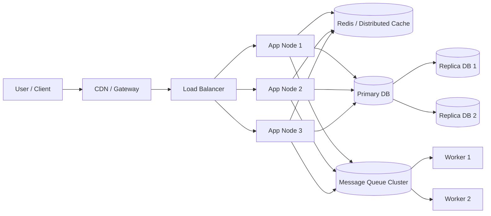

Nhìn vào sơ đồ này, Cluster không chỉ nằm ở App. Một hệ thống thực tế có thể có nhiều cluster cùng lúc: application cluster, cache cluster, database cluster, message queue cluster và worker cluster.

---

#### 26.2. Request đi qua Load Balancer

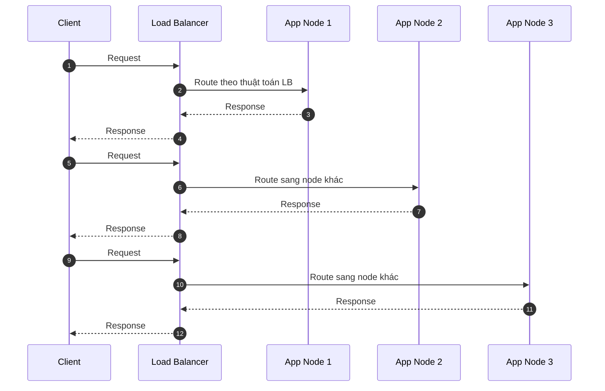

Điểm cần nhớ: Client thường không biết request thật sự vào node nào. Vì vậy App không nên phụ thuộc vào state nằm trong memory của một node cụ thể.

---

#### 26.3. Health Check và Failover

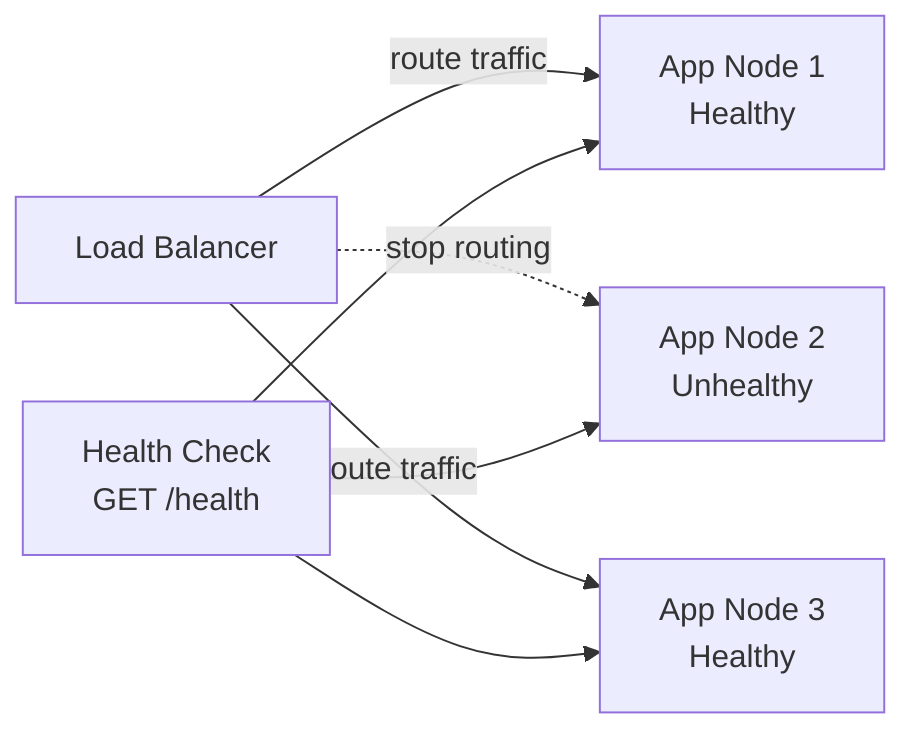

Khi `App Node 2` lỗi, Load Balancer cần loại node này khỏi pool. Nếu không có health check tốt, request vẫn có thể bị route vào node lỗi và gây lỗi ngẫu nhiên.

---

#### 26.4. Stateful App bị lỗi khi scale nhiều instance

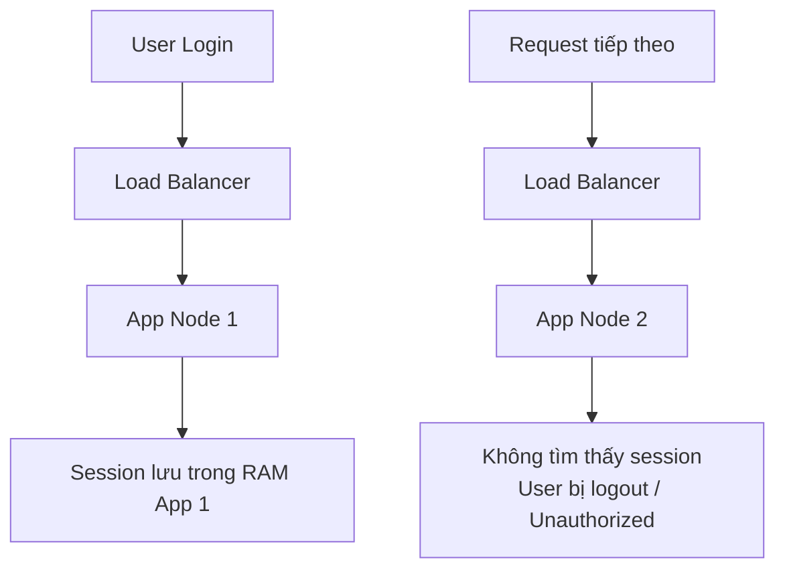

Đây là lỗi rất phổ biến khi hệ thống ban đầu chạy single instance, sau đó tăng lên nhiều instance nhưng session vẫn lưu trong memory.

---

#### 26.5. Stateless App với Token

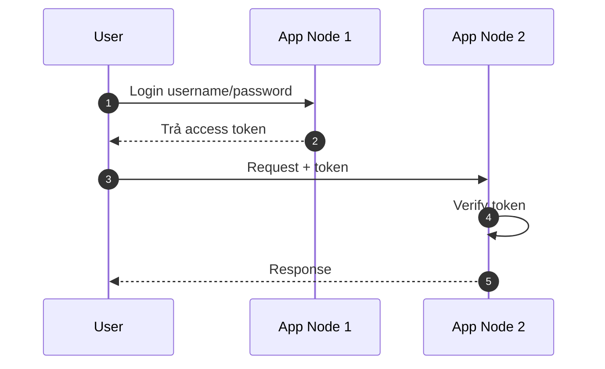

Với stateless app, node nào cũng xử lý được request miễn là nó có đủ thông tin để verify token hoặc đọc state từ nơi dùng chung.

---

#### 26.6. Remote Session Store

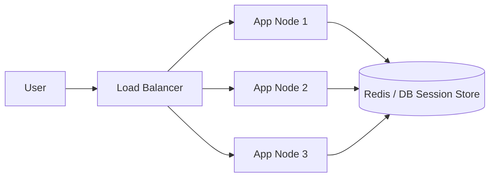

Remote session store phù hợp khi cần revoke session, quản lý đăng xuất, hoặc không muốn đưa toàn bộ state vào token.

---

#### 26.7. Local Cache bị lệch giữa các node

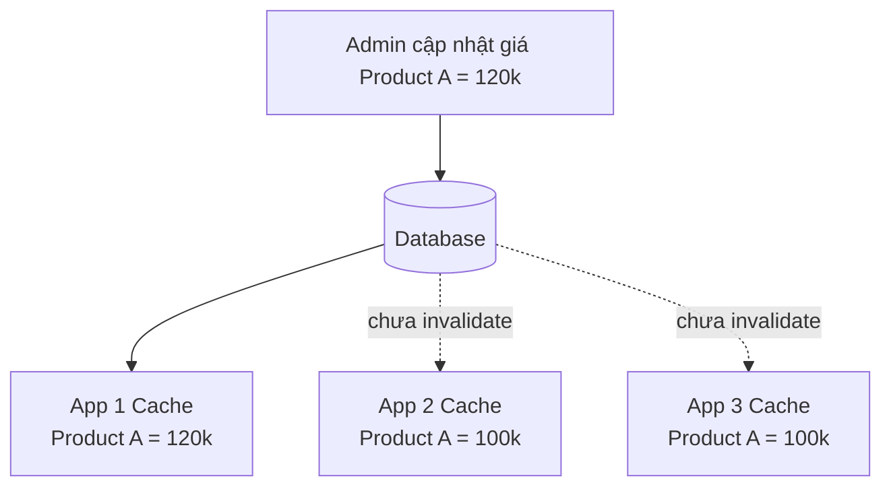

Nếu dùng local cache, mỗi node có một bản cache riêng. Update dữ liệu ở một nơi không đồng nghĩa tất cả node đều biết để clear cache.

---

#### 26.8. Distributed Cache dùng chung

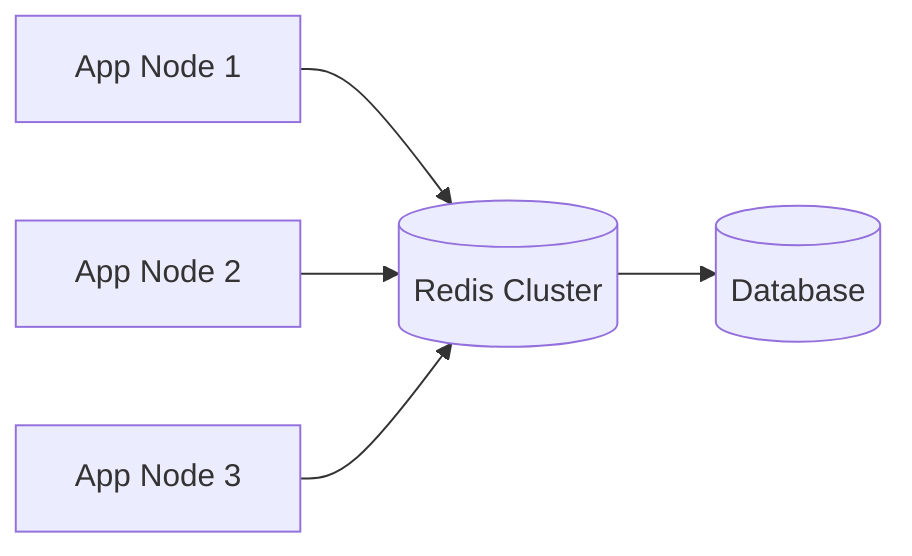

Distributed cache giúp các node đọc chung một nguồn cache. Tuy nhiên Redis cũng cần được thiết kế HA, timeout, fallback và cơ chế tránh cache stampede.

---

#### 26.9. Pub/Sub để invalidate local cache

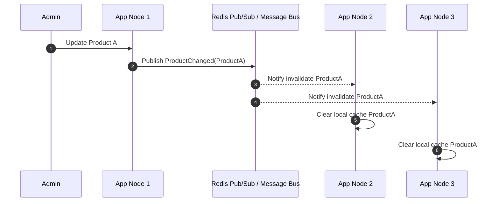

Cách này phù hợp khi vẫn muốn dùng local cache để tối ưu tốc độ, nhưng cần đồng bộ sự kiện invalidate giữa các node.

---

#### 26.10. Database Primary - Replica

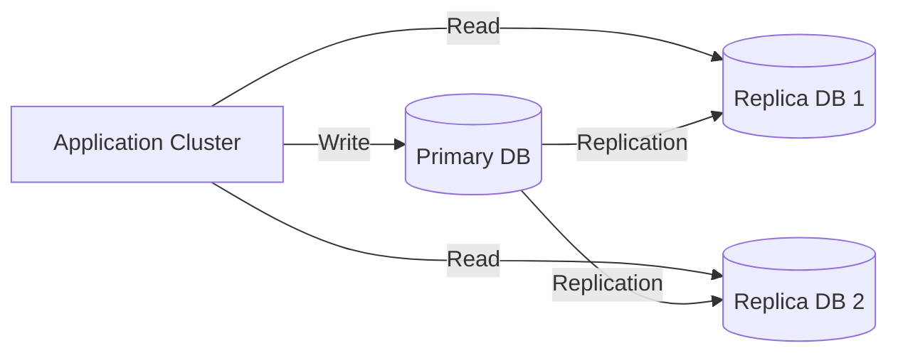

Mô hình này giúp scale read, nhưng cần chú ý replication lag. Với dữ liệu vừa ghi xong mà user cần đọc lại ngay, nên đọc từ Primary hoặc có chiến lược read-after-write.

---

#### 26.11. Sharding Database

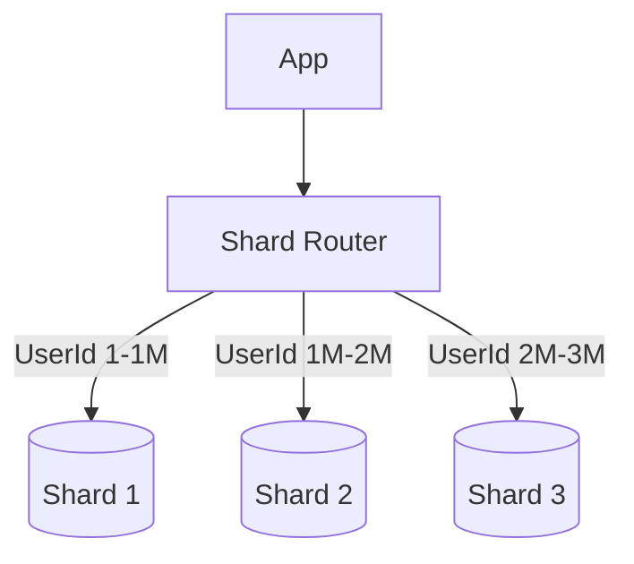

Sharding giúp chia dữ liệu ra nhiều node. Đổi lại, query cross-shard, transaction cross-shard, migrate shard và rebalancing sẽ phức tạp hơn nhiều.

---

#### 26.12. Consumer Group trong Message Queue

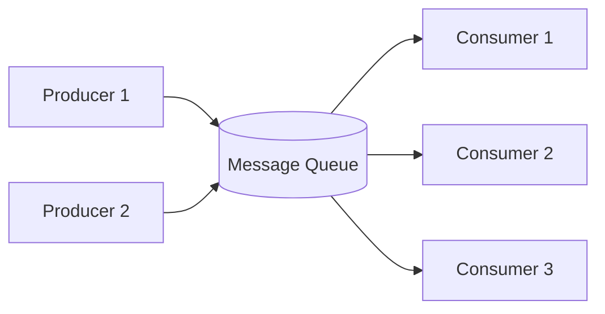

Consumer group giúp scale xử lý bất đồng bộ. Tuy nhiên cần thiết kế idempotency vì message có thể bị consume lại.

---

#### 26.13. Local Lock không đủ trong Cluster

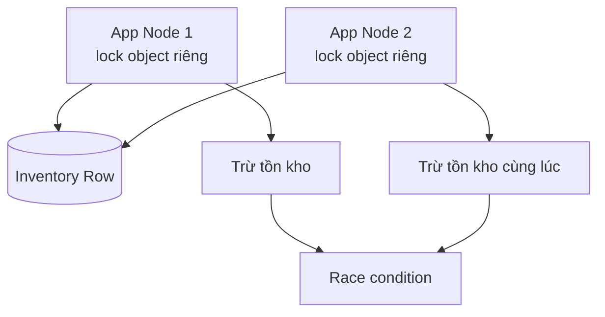

`lock`, `SemaphoreSlim`, `static object` chỉ có tác dụng trong cùng một process. Khi có nhiều app instance, mỗi instance có một lock riêng.

---

#### 26.14. Distributed Lock

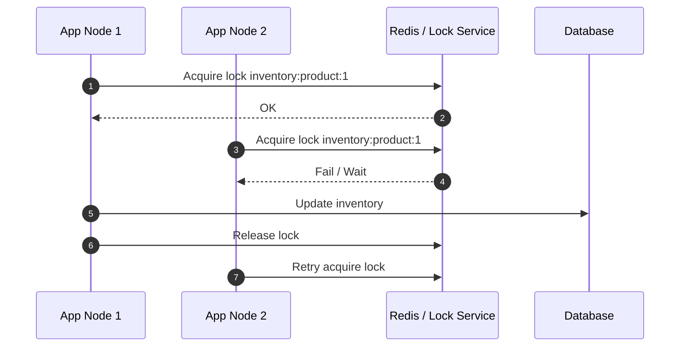

Distributed lock nên dùng có kiểm soát. Với nhiều bài toán, database transaction, row lock hoặc unique constraint có thể là lựa chọn an toàn và đơn giản hơn.

---

#### 26.15. Idempotency khi request bị retry

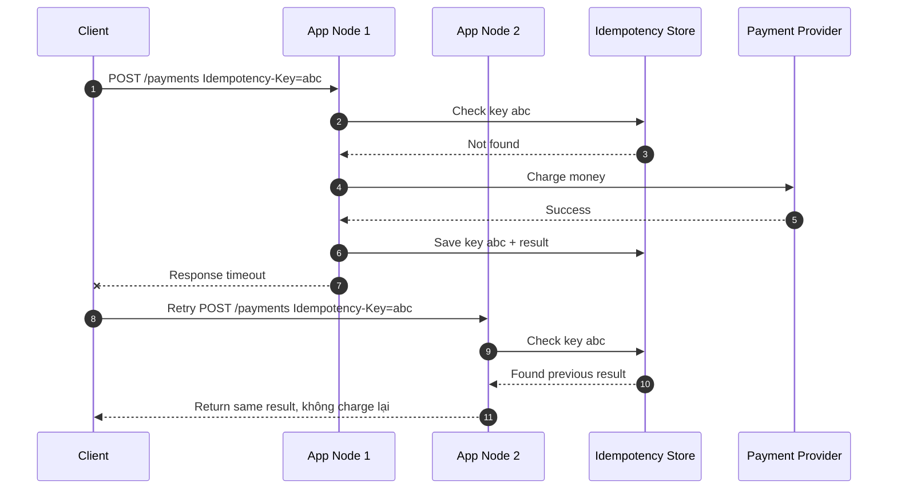

Trong cluster, idempotency key không được lưu local memory. Nó phải nằm ở storage dùng chung như database hoặc Redis.

---

#### 26.16. Background Job chạy trùng nếu mỗi app tự schedule

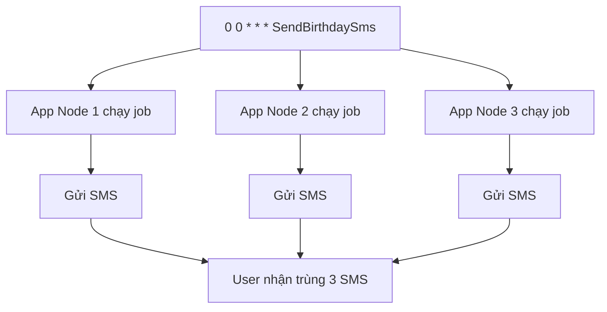

Khi scale app nhiều instance, cần đảm bảo job không bị chạy trùng. Có thể tách worker riêng, dùng distributed lock, hoặc dùng job framework có storage chung.

---

#### 26.17. Background Job an toàn hơn với lock/storage chung

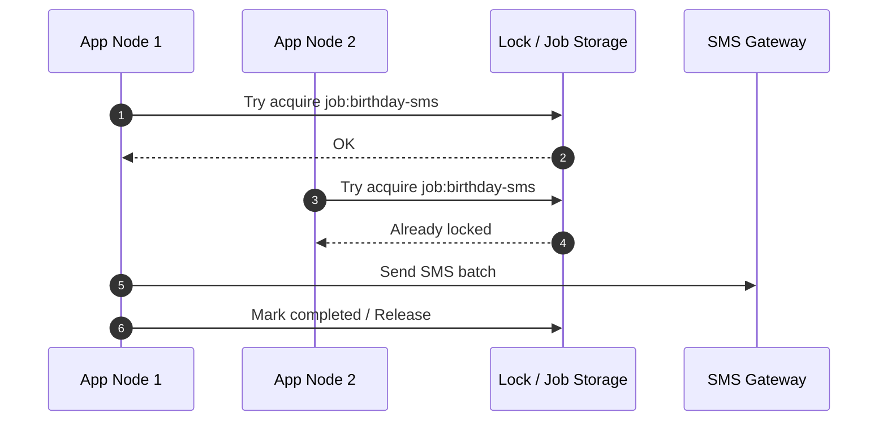

---

#### 26.18. WebSocket / SignalR khi scale nhiều node

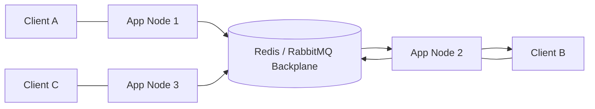

Nếu App Node 1 muốn gửi message cho Client B nhưng Client B đang connected ở App Node 2, cần backplane để chuyển thông điệp sang đúng node.

---

#### 26.19. Rolling Deployment

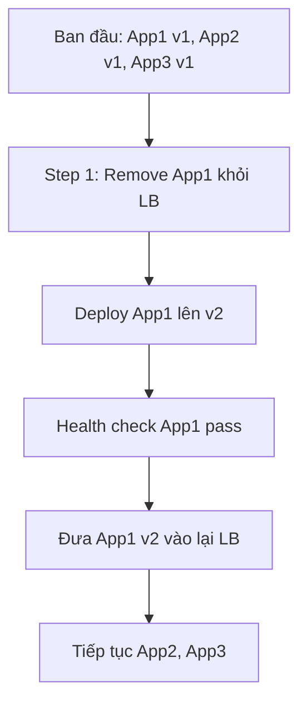

Trong rolling deployment, sẽ có thời điểm v1 và v2 cùng chạy. Vì vậy database schema, API contract và message schema cần backward compatible.

---

#### 26.20. Expand and Contract Migration

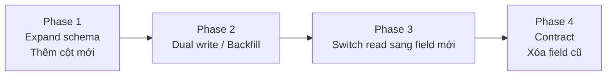

Đây là cách migrate an toàn hơn khi nhiều version app có thể cùng chạy trong cluster.

---

#### 26.21. Observability trong Cluster

```mermaid
flowchart LR
    U[Request<br/>TraceId=req-123] --> GW[Gateway]
    GW --> A2[App Node 2]
    A2 --> SVC[Payment Service]
    SVC --> DB[(Database)]

    GW --> LOG[(Centralized Logs)]
    A2 --> LOG
    SVC --> LOG
    DB --> MET[(Metrics / Alerts)]
```

Trong cluster, debug bằng cách SSH vào một server để xem log là không đủ. Cần log tập trung, trace id, metrics theo từng node và alerting.

---

#### 26.22. Case Study: Hàng chờ khám bệnh

#### Thiết kế sai khi dùng biến trong memory

```mermaid
flowchart TD
    P1[Patient A] --> A1[App Node 1<br/>currentNumber = 10]
    P2[Patient B] --> A2[App Node 2<br/>currentNumber = 10]

    A1 --> N1[Cấp số 11]
    A2 --> N2[Cấp số 11]

    N1 --> BUG[Trùng số khám]
    N2 --> BUG
```

#### Thiết kế đúng hơn với atomic counter dùng chung

```mermaid
sequenceDiagram
    autonumber
    participant P1 as Patient A
    participant P2 as Patient B
    participant A1 as App Node 1
    participant A2 as App Node 2
    participant C as Atomic Counter<br/>DB Sequence / Redis INCR
    participant DB as Database Audit

    P1->>A1: Lấy số khám
    A1->>C: INCR queue:room:1:date
    C-->>A1: 11
    A1->>DB: Lưu phiếu số 11

    P2->>A2: Lấy số khám
    A2->>C: INCR queue:room:1:date
    C-->>A2: 12
    A2->>DB: Lưu phiếu số 12
```

Với nghiệp vụ y tế, dù dùng Redis `INCR` để cấp số nhanh, vẫn nên lưu kết quả cuối vào database để audit, tra cứu và đối soát.

---

#### 26.23. Case Study: Thông báo realtime CLS / phiếu khám

```mermaid
sequenceDiagram
    autonumber
    participant Lab as Lab Service
    participant A1 as App Node 1
    participant Bus as Redis/RabbitMQ Backplane
    participant A2 as App Node 2
    participant UI as Browser của bác sĩ

    UI->>A2: WebSocket connected
    Lab->>A1: Cập nhật trạng thái CLS
    A1->>Bus: Publish PhieuKham.CanLamSang.CapNhat
    Bus-->>A2: Forward event
    A2-->>UI: Push realtime update
```

Thông điệp realtime không nên phụ thuộc vào việc user đang connected đúng node phát sinh event.

---

#### 26.24. Mô phỏng Load Balancer bằng Angular/X6

Ngoài sơ đồ tĩnh, trang này có thêm phần minh họa tương tác bên dưới, dựng bằng Angular và thư viện vẽ graph X6 để giải thích trực quan cho team.

Ý tưởng mô phỏng:

```txt
Client -> Load Balancer -> Node 1 / Node 2 / Node 3
```

Các thao tác trong mô phỏng:

```txt
Gửi nhiều request
Thêm node
Xóa node
Phá hỏng node ngẫu nhiên
Phục hồi node
Quan sát request được route sang node còn sống
```

Phần này giúp người mới hiểu nhanh: Load Balancer không xử lý business chính, mà điều phối request sang các node phía sau và bỏ qua node unhealthy.


## Phần 10. Kết luận

### 27. Kết luận

Cluster là nền tảng quan trọng trong System Design, nhưng không nên hiểu đơn giản là “nhiều server”.

Cluster giúp hệ thống:

```txt
Chịu tải tốt hơn
Sẵn sàng hơn
Scale linh hoạt hơn
Deploy ít downtime hơn
```

Nhưng đổi lại, hệ thống phải xử lý các vấn đề:

```txt
Session
Cache
Lock
Race condition
Idempotency
Background job
WebSocket
Database consistency
Deployment compatibility
Observability
```

Một câu tổng kết:

> Cluster giúp hệ thống chịu tải và chịu lỗi tốt hơn, nhưng mọi thứ từng đơn giản trong một process sẽ trở thành bài toán distributed system.

Khi thiết kế ở level Middle/Senior, điều quan trọng không phải chỉ là biết thêm node, mà là biết những phần nào sẽ vỡ khi thêm node và thiết kế lại chúng một cách an toàn.
