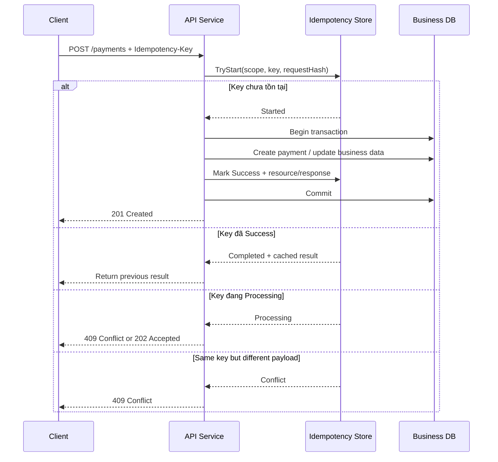
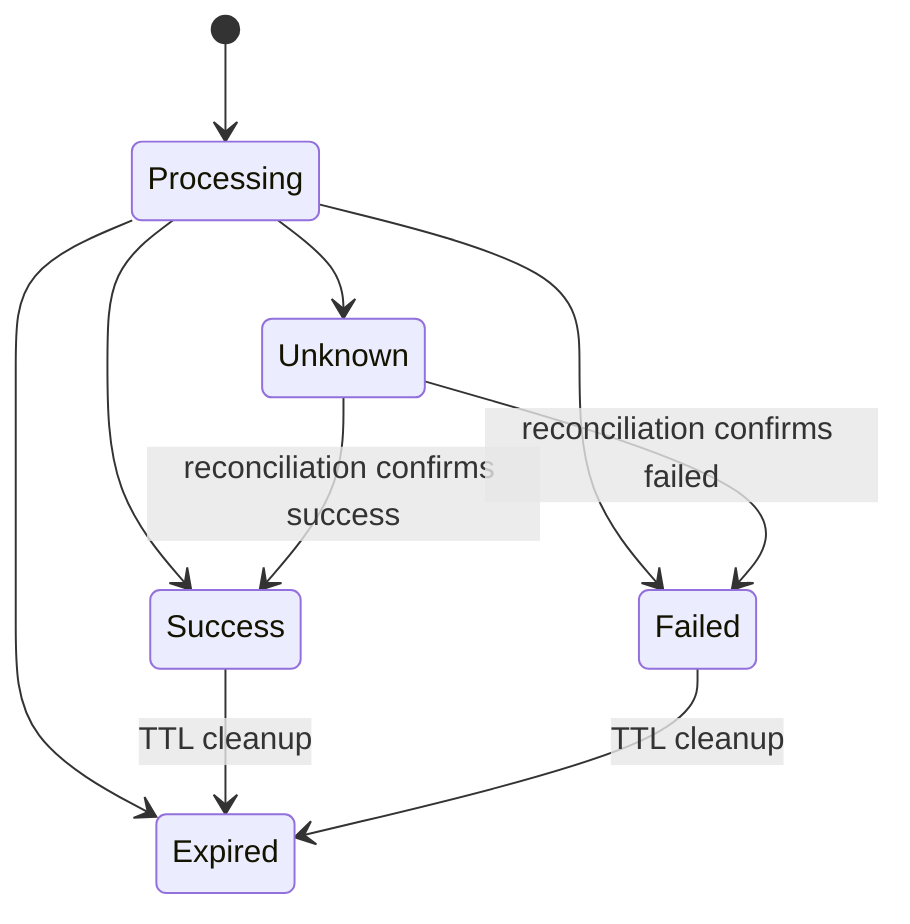
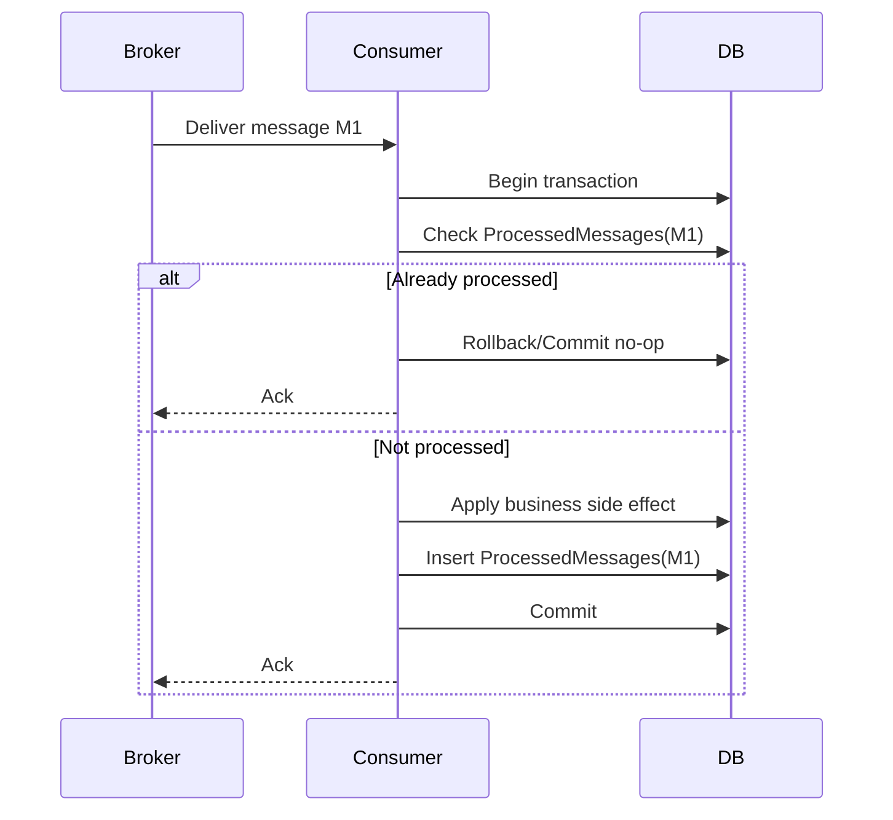
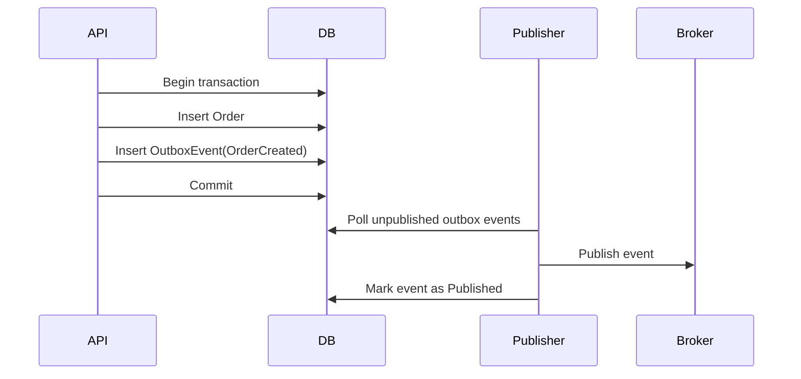

# Idempotency in System Design

> Xem [diagram HTTP retry và Kafka redelivery](/system-design/idempotency/demo) để theo dõi idempotency record trong database, Redis fast-path, Kafka offset và Inbox qua từng bước.
 
> Thiết kế thao tác an toàn khi retry, timeout, duplicate request, duplicate message, webhook resend và background job chạy lại.

---

## 1. Idempotency là gì?

**Idempotency** là tính chất của một thao tác mà khi thực hiện nhiều lần với cùng một ý định nghiệp vụ, kết quả cuối cùng của hệ thống vẫn giống như khi thực hiện một lần.

Nói đơn giản:

```text
Cùng một request/message/command bị chạy lại nhiều lần
=> hệ thống không tạo thêm tác dụng phụ ngoài ý muốn.
```

Ví dụ dễ hiểu:

```text
Client gọi API tạo thanh toán.
Server đã charge tiền thành công.
Response bị timeout trước khi client nhận được.
Client retry cùng request.

Nếu API không idempotent:
  user có thể bị charge 2 lần.

Nếu API idempotent:
  server nhận ra đây là cùng một intent thanh toán,
  không charge lại,
  trả lại kết quả thanh toán đã tạo trước đó.
```

Idempotency không chỉ là vấn đề kỹ thuật nhỏ ở API. Trong System Design, đây là một cơ chế bảo vệ dữ liệu khi hệ thống có:

- Retry từ client, gateway, SDK, load balancer.
- Timeout nhưng server vẫn xử lý thành công.
- Queue/message broker giao message theo kiểu at-least-once.
- Webhook provider gửi lại callback.
- Background job chạy lại sau lỗi.
- Nhiều instance API xử lý song song.
- Distributed system có network failure, partial failure hoặc race condition.

---

## 2. Vì sao Idempotency quan trọng trong System Design?

Trong hệ thống thật, failure không chỉ có dạng “thành công” hoặc “thất bại”. Rất nhiều lỗi nằm ở vùng mập mờ:

```text
Client không nhận được response.
Nhưng server có thể đã xử lý xong.
```

Ví dụ:

```text
Client -> API: Create Order
API -> DB: Insert order thành công
API -> Client: Response bị timeout
Client retry Create Order
```

Ở góc nhìn client, request lần đầu “thất bại”. Nhưng ở góc nhìn server, request đó có thể đã thành công. Nếu retry không an toàn, hệ thống sẽ tạo duplicate order.

Idempotency giúp hệ thống có thể nói:

```text
Retry là hành vi bình thường và an toàn.
```

Không có idempotency, các cơ chế như retry, queue, webhook, background job rất dễ làm sai dữ liệu.

Các lỗi production thường gặp nếu thiếu idempotency:

| Tình huống | Hậu quả |
|---|---|
| Retry tạo đơn hàng | Duplicate order |
| Retry thanh toán | Charge tiền nhiều lần |
| Webhook payment gửi lại | Cộng tiền/cập nhật paid nhiều lần |
| Consumer nhận duplicate message | Trừ kho nhiều lần |
| Job gửi SMS chạy lại | Gửi nhiều SMS cho cùng user |
| API nhiều instance cùng xử lý | Race condition, duplicate record |
| Timeout sau khi ghi DB | Client retry gây side effect lặp |

---

## 3. Tư duy cốt lõi: same intent, same final state

Khi nói về idempotency, điều quan trọng nhất không phải là “cùng request body” mà là **cùng intent nghiệp vụ**.

```text
Same intent => same final state.
```

Ví dụ:

```text
Ý định nghiệp vụ: khách hàng A thanh toán đơn hàng O123 số tiền 500.000 bằng giao dịch T789.
```

Nếu request này bị gửi lại 3 lần, hệ thống vẫn chỉ nên ghi nhận một thanh toán hợp lệ cho intent đó.

### 3.1. Operation idempotent tự nhiên

Một số thao tác tự nhiên đã idempotent vì nó “set trạng thái về một giá trị cụ thể”.

```text
Set user status = Active
Set order status = Cancelled
Mark notification = Read
Set profile name = Nguyen Van A
```

Gọi nhiều lần vẫn ra cùng trạng thái cuối.

### 3.2. Operation không idempotent tự nhiên

Một số thao tác không idempotent vì nó “tăng/giảm/tạo mới”.

```text
Create order
Add balance 100.000
Deduct inventory 2 items
Send email
Generate invoice number
Charge card
```

Gọi nhiều lần sẽ tạo nhiều side effect.

### 3.3. Chuyển từ non-idempotent sang idempotent

Thường có 3 cách:

| Cách | Ý tưởng | Ví dụ |
|---|---|---|
| Dùng idempotency key | Gắn request với một intent duy nhất | `Idempotency-Key` khi tạo payment |
| Dùng business unique key | Dựa vào khóa nghiệp vụ tự nhiên | `OrderId + PaymentProviderTxnId` |
| Đổi operation từ increment sang set | Chuyển từ cộng dồn sang set trạng thái cụ thể | `SetBalance(100000)` thay vì `AddBalance(100000)` |

---

## 4. Phân biệt Idempotency, Deduplication, Exactly-once, Retry-safe

Các khái niệm này gần nhau nhưng không giống nhau.

### 4.1. Idempotency

Tập trung vào kết quả cuối cùng:

```text
Chạy nhiều lần cùng intent => kết quả cuối cùng như chạy một lần.
```

Ví dụ:

```text
ConfirmOrder(orderId = O123)
```

Nếu order đã confirmed, gọi lại không tạo thêm tác dụng phụ.

### 4.2. Deduplication

Tập trung vào việc phát hiện và bỏ qua bản trùng.

```text
MessageId đã xử lý rồi => bỏ qua.
```

Deduplication thường là kỹ thuật để đạt idempotency, nhưng không phải lúc nào cũng đủ.

Ví dụ:

```text
Nếu chỉ dedup theo MessageId,
nhưng cùng nghiệp vụ lại phát sinh qua message khác ID,
thì vẫn có thể duplicate side effect.
```

### 4.3. Exactly-once

Trong distributed system, “exactly-once” thường rất khó đạt theo nghĩa tuyệt đối end-to-end.

Thực tế hay dùng:

```text
At-least-once delivery + idempotent consumer
```

Tức là message có thể được giao nhiều lần, nhưng consumer xử lý sao cho không làm sai dữ liệu.

### 4.4. Retry-safe

Một operation retry-safe nghĩa là client có thể retry mà không sợ tạo side effect sai.

Retry-safe thường đạt được bằng idempotency.

```text
Retry-safe API = API có thể được gọi lại an toàn sau timeout/network failure.
```

---

## 5. HTTP method và idempotency

| Method | Idempotent mặc định? | Ghi chú |
|---|---:|---|
| GET | Có | Nên chỉ đọc dữ liệu, không thay đổi state nghiệp vụ |
| PUT | Có | Set resource về trạng thái cụ thể |
| DELETE | Thường có | Xóa lần đầu thành công, gọi lại vẫn là đã xóa |
| PATCH | Tùy thiết kế | `set status = Done` idempotent, `increment count` thì không |
| POST | Không | Thường tạo mới hoặc thực hiện command |

Cần nhớ: HTTP method chỉ là gợi ý. Idempotency thật sự nằm ở **ý nghĩa nghiệp vụ**.

Ví dụ:

```text
PUT /users/123/status
Body: { "status": "Active" }
```

Thao tác này idempotent vì gọi nhiều lần user vẫn là Active.

Ngược lại:

```text
PATCH /wallets/123
Body: { "increment": 100000 }
```

Không idempotent vì gọi nhiều lần sẽ cộng tiền nhiều lần.

---

## 6. Khi nào bắt buộc phải thiết kế idempotency?

Hãy nghĩ tới idempotency nếu operation có một trong các dấu hiệu sau:

- Tạo dữ liệu quan trọng: order, payment, booking, invoice, contract, ticket.
- Thay đổi tiền, công nợ, hạn mức, điểm thưởng, tồn kho.
- Có gọi 3rd-party có side effect: payment gateway, SMS, email, shipping provider.
- Client/gateway/SDK có retry.
- API có thể timeout.
- Dùng queue hoặc event-driven architecture.
- Consumer có thể nhận message trùng.
- Webhook provider có cơ chế resend.
- Background job có thể retry.
- Có nhiều instance service cùng xử lý.
- Có khả năng user double-click hoặc submit form nhiều lần.

Câu hỏi quan trọng khi design:

```text
Nếu command này chạy lại lần nữa thì chuyện gì sai có thể xảy ra?
```

Nếu câu trả lời là “có thể tạo sai tiền, sai tồn, duplicate dữ liệu, gửi trùng notification”, cần thiết kế idempotency.

---

## 7. Idempotency-Key

`Idempotency-Key` là định danh duy nhất cho một intent nghiệp vụ.

Client gửi key trong header:

```http
POST /api/payments
Idempotency-Key: 8f6c7f0a-9c11-4a2a-8c91-5a3d4e7b8c20
Content-Type: application/json
```

Body:

```json
{
  "orderId": "ORD-1001",
  "amount": 500000,
  "method": "BankTransfer"
}
```

Server xử lý theo logic:

```text
Key chưa tồn tại:
  tạo record idempotency trạng thái Processing
  xử lý nghiệp vụ
  lưu kết quả Success/Failed
  trả response

Key đã Success:
  trả lại response cũ hoặc resource hiện tại

Key đang Processing:
  trả 409 Conflict / 202 Accepted / retry-after

Key đã tồn tại nhưng payload khác:
  reject 409 Conflict
```

### 7.1. Key nên do ai tạo?

| Nguồn tạo key | Khi nào dùng | Ghi chú |
|---|---|---|
| Client tạo | Form submit, mobile app, frontend create command | Tốt cho retry từ client |
| Server tạo trước | Tạo payment intent/session trước khi submit | Tốt cho flow nhiều bước |
| Business key | Webhook, payment callback, order transition | Ví dụ provider transaction id |
| Message/Event ID | Queue consumer | Dedup message/event |

### 7.2. Key nên đại diện cho cái gì?

Key nên đại diện cho **một intent duy nhất**.

Ví dụ tốt:

```text
Create payment cho Order O123, amount 500.000, user U01
```

Ví dụ không tốt:

```text
Dùng cùng key cho mọi request của user trong 1 ngày.
```

Vì một user có thể tạo nhiều thanh toán khác nhau trong ngày.

### 7.3. Cần Scope

Không nên unique chỉ theo `IdempotencyKey`. Nên unique theo:

```text
Scope + IdempotencyKey
```

Ví dụ scope:

```text
orders:create
payments:create
payments:capture
bookings:confirm
webhook:vnpay
inventory:reserve
```

Vì cùng một key có thể vô tình được dùng ở endpoint khác. Scope giúp key không va chạm sai ngữ cảnh.

---

## 8. Thiết kế Idempotency Store

Idempotency store là nơi lưu trạng thái xử lý của key.

### 8.1. Schema cơ bản

```sql
CREATE TABLE IdempotencyRequests (
    Id UNIQUEIDENTIFIER NOT NULL PRIMARY KEY,
    Scope NVARCHAR(100) NOT NULL,
    IdempotencyKey NVARCHAR(200) NOT NULL,
    RequestHash NVARCHAR(128) NOT NULL,
    Status NVARCHAR(30) NOT NULL,
    ResponseStatusCode INT NULL,
    ResponseBody NVARCHAR(MAX) NULL,
    ResourceType NVARCHAR(100) NULL,
    ResourceId NVARCHAR(100) NULL,
    ErrorCode NVARCHAR(100) NULL,
    CreatedAtUtc DATETIME2 NOT NULL,
    CompletedAtUtc DATETIME2 NULL,
    ExpiresAtUtc DATETIME2 NOT NULL,
    LockedUntilUtc DATETIME2 NULL,
    RetryCount INT NOT NULL DEFAULT 0
);

CREATE UNIQUE INDEX UX_IdempotencyRequests_Scope_Key
ON IdempotencyRequests(Scope, IdempotencyKey);

CREATE INDEX IX_IdempotencyRequests_ExpiresAtUtc
ON IdempotencyRequests(ExpiresAtUtc);
```

### 8.2. Ý nghĩa các field

| Field | Ý nghĩa |
|---|---|
| `Scope` | Phạm vi nghiệp vụ của key |
| `IdempotencyKey` | Key đại diện cho intent |
| `RequestHash` | Hash của payload để chống reuse key sai |
| `Status` | Processing, Success, Failed, Expired |
| `ResponseStatusCode` | HTTP status trả lại cho retry |
| `ResponseBody` | Response cũ, nếu muốn cache response |
| `ResourceType` | Loại resource đã tạo, ví dụ Payment |
| `ResourceId` | ID resource đã tạo |
| `ErrorCode` | Mã lỗi nếu failed có thể cache |
| `ExpiresAtUtc` | TTL để cleanup |
| `LockedUntilUtc` | Hỗ trợ xử lý stuck processing |
| `RetryCount` | Theo dõi retry/duplicate |

### 8.3. Nên lưu response hay chỉ lưu resource id?

Có 2 cách phổ biến.

#### Cách 1: Lưu response body

```text
Retry => trả lại y nguyên response cũ.
```

Ưu điểm:

- Đơn giản.
- Client nhận response nhất quán.
- Hữu ích cho API public.

Nhược điểm:

- Response có thể lớn.
- Có thể chứa dữ liệu nhạy cảm.
- Response schema thay đổi thì dữ liệu cũ có thể khó đọc.

#### Cách 2: Lưu resource id

```text
Retry => query lại resource hiện tại rồi build response.
```

Ưu điểm:

- Không lưu body lớn.
- Giảm rủi ro lưu dữ liệu nhạy cảm.
- Dữ liệu trả về có thể phản ánh trạng thái mới nhất.

Nhược điểm:

- Response retry có thể không giống 100% lần đầu.
- Cần thêm query.
- Nếu resource bị xóa/sửa, cần rule rõ.

Gợi ý thực tế:

| Nghiệp vụ | Nên lưu gì? |
|---|---|
| Payment | ResourceId + provider transaction id + status quan trọng |
| Order create | ResourceId, có thể lưu response ngắn |
| Booking | ResourceId + slot id |
| API public yêu cầu response y nguyên | ResponseBody |
| Dữ liệu nhạy cảm | Hạn chế lưu body, ưu tiên ResourceId |

---

## 9. Flow xử lý API idempotent

Flow tổng quát:



### 9.1. Processing thì trả gì?

Có vài lựa chọn:

| Response | Khi nào dùng | Ý nghĩa |
|---|---|---|
| `409 Conflict` | Client nên dừng và retry sau | Request cùng key đang được xử lý |
| `202 Accepted` | Operation async | Server đã nhận, client poll status |
| `425 Too Early` | Một số hệ thống muốn tránh replay sớm | Ít phổ biến |
| `429 Too Many Requests` | Retry quá nhiều | Có thể kèm `Retry-After` |

Gợi ý dễ dùng:

```text
Nếu command xử lý đồng bộ ngắn:
  Processing => 409 Conflict + message "Request is still processing"

Nếu command xử lý async dài:
  Processing => 202 Accepted + operationId/statusUrl
```

### 9.2. Failed thì có cache không?

Không phải lỗi nào cũng nên cache.

| Loại lỗi | Có nên cache? | Lý do |
|---|---:|---|
| Validation error 400 | Có thể | Cùng payload retry vẫn lỗi |
| Business rule conflict | Có thể | Ví dụ slot đã hết |
| Timeout gọi 3rd-party | Cẩn thận | Có thể side effect đã xảy ra |
| Internal server error 500 trước khi side effect | Không nhất thiết | Retry có thể thành công |
| Internal server error sau khi side effect | Cần reconciliation | Không được xử lý mù |

Khi thiết kế thực tế cần tách rõ:

```text
Failed before side effect
Failed after side effect
Unknown after side effect
```

`Unknown` là trạng thái nguy hiểm nhất, thường cần query lại provider hoặc chạy reconciliation job.

---

## 10. Transaction boundary và bài toán half-success

Idempotency khó nhất không phải là lưu key. Khó nhất là tránh trạng thái:

```text
Business data đã ghi thành công
nhưng idempotency record chưa được mark Success.
```

Khi đó retry có thể thấy key vẫn Processing và bị kẹt, hoặc tệ hơn là xử lý lại.

### 10.1. Cách tốt nhất khi cùng database

Nếu business data và idempotency record nằm cùng database, hãy commit trong cùng transaction.

```text
Begin transaction
  insert/update business data
  update idempotency status = Success
Commit
```

Nếu transaction rollback, cả business data và idempotency result rollback.

### 10.2. Khi có 3rd-party side effect

Ví dụ payment gateway:

```text
Begin transaction
  create local payment status = Pending
Commit

Call payment provider charge

Begin transaction
  update local payment status = Paid/Failed/Unknown
  update idempotency result
Commit
```

Vấn đề:

```text
Call provider charge thành công
nhưng API chết trước khi update local DB.
```

Lúc này không thể chỉ retry charge lại. Cần dùng provider transaction id/idempotency key bên provider hoặc query lại provider.

Thiết kế an toàn:

```text
Local idempotency key
+ Provider idempotency key
+ Payment status Pending/Paid/Failed/Unknown
+ Reconciliation job
```

### 10.3. Tư duy khi đưa lên production

Với operation có external side effect, phải luôn hỏi:

```text
Nếu service chết ngay sau khi gọi 3rd-party thành công thì khôi phục bằng cách nào?
```

Nếu không trả lời được câu này, flow chưa production-ready.

---

## 11. Request hash và chống reuse key sai intent

Nếu client dùng cùng key nhưng payload khác, server phải reject.

Ví dụ nguy hiểm:

```text
Lần 1:
Idempotency-Key: abc
amount = 500.000

Lần 2:
Idempotency-Key: abc
amount = 700.000
```

Nếu server chỉ dựa vào key, có thể trả lại kết quả cũ hoặc xử lý sai intent.

Cần tính `RequestHash` từ payload canonical.

```text
RequestHash = SHA256(method + path + normalized body + important headers)
```

### 11.1. Cần canonicalize body

JSON có thể khác thứ tự field nhưng cùng ý nghĩa:

```json
{ "amount": 500000, "orderId": "O1" }
```

và

```json
{ "orderId": "O1", "amount": 500000 }
```

Nếu hash raw string, hai body này có thể ra hash khác nhau. Nên normalize/canonicalize JSON trước khi hash.

### 11.2. Nên hash những gì?

Tùy endpoint, nhưng thường gồm:

- HTTP method.
- Route/path hoặc scope.
- Body đã normalize.
- Tenant/User nếu cần phân tách.
- Các header ảnh hưởng nghiệp vụ, ví dụ currency, locale nếu có.

Không nên hash các header không ổn định như:

- TraceId.
- Request timestamp.
- User-Agent.

---

## 12. Trạng thái Processing, Success, Failed, Expired

Một idempotency record thường có state machine.



### 12.1. Processing

Request đầu tiên đang xử lý.

Retry trong lúc này không nên chạy lại business logic.

Response thường là:

```text
409 Conflict hoặc 202 Accepted
```

### 12.2. Success

Business operation đã thành công. Retry trả lại kết quả cũ hoặc resource hiện tại.

### 12.3. Failed

Operation thất bại rõ ràng. Cần phân biệt lỗi có cache và lỗi không cache.

### 12.4. Unknown

Trạng thái không chắc chắn. Thường xảy ra khi gọi external service:

```text
Timeout khi gọi payment provider.
Không biết provider đã charge hay chưa.
```

Không được charge lại ngay. Cần query provider hoặc reconciliation.

### 12.5. Expired

Key hết hạn. TTL giúp bảng không phình vô hạn.

Nếu client retry sau TTL, hệ thống có thể xem như request mới. Vì vậy TTL phải phù hợp nghiệp vụ.

Gợi ý TTL:

| Nghiệp vụ | TTL tham khảo |
|---|---:|
| Payment API | 24h - 7 ngày |
| Order create | 24h - vài ngày |
| Booking/slot | Theo vòng đời booking |
| Webhook | Theo retention/resend window của provider |
| Queue processed message | Theo retention message + audit |
| SMS/email job | Theo campaign hoặc ngày gửi |

---

## 13. Idempotency với database constraint

Một lớp bảo vệ rất quan trọng là unique constraint.

Không nên chỉ làm:

```csharp
var existed = await db.Orders.AnyAsync(x => x.ClientRequestId == requestId);
if (!existed)
{
    db.Orders.Add(order);
    await db.SaveChangesAsync();
}
```

Vì hai request song song có thể cùng thấy chưa tồn tại rồi cùng insert.

Cần có unique constraint ở DB:

```sql
CREATE UNIQUE INDEX UX_Orders_ClientRequestId
ON Orders(TenantId, ClientRequestId);
```

Hoặc với idempotency table:

```sql
CREATE UNIQUE INDEX UX_IdempotencyRequests_Scope_Key
ON IdempotencyRequests(Scope, IdempotencyKey);
```

### 13.1. Unique constraint là chốt chặn cuối

Code check chỉ là tối ưu UX. DB constraint mới là lớp chống race condition đáng tin.

Tư duy:

```text
Application code giúp flow rõ ràng.
Database constraint đảm bảo invariant.
```

### 13.2. Business unique key

Đôi khi không cần idempotency table riêng nếu nghiệp vụ đã có unique key tự nhiên.

Ví dụ:

```text
PaymentProvider = VNPay
ProviderTransactionId = 123456
```

Có thể tạo unique:

```sql
CREATE UNIQUE INDEX UX_Payments_Provider_ProviderTxn
ON Payments(Provider, ProviderTransactionId);
```

Webhook gửi lại cùng transaction id sẽ không tạo payment trùng.

---

## 14. Idempotency với Redis

Redis thường được dùng khi cần tốc độ cao hoặc TTL tự nhiên.

Ví dụ flow đơn giản:

```text
SET idempotency:{scope}:{key} Processing NX EX 86400
```

- `NX`: chỉ set nếu key chưa tồn tại.
- `EX`: TTL.

Nếu set thành công: request đầu tiên được xử lý.
Nếu set thất bại: key đã tồn tại.

### 14.1. Khi nào dùng Redis?

| Phù hợp | Không phù hợp |
|---|---|
| API traffic lớn, operation nhẹ | Tiền/tài chính cần audit mạnh |
| Chống double click ngắn hạn | Cần transaction cùng business DB |
| Rate limit/dedup tạm thời | Cần lưu lịch sử dài hạn |
| Cache idempotency response ngắn hạn | Cần query/reconciliation phức tạp |

### 14.2. Rủi ro khi dùng Redis

- Redis mất dữ liệu nếu cấu hình persistence không phù hợp.
- Không dễ transaction cùng business DB.
- Nếu set Processing thành công nhưng service chết, key có thể kẹt đến hết TTL.
- Nếu TTL quá ngắn, retry muộn có thể bị xử lý lại.

### 14.3. Gợi ý lựa chọn

```text
Payment/order/inventory quan trọng:
  ưu tiên SQL + unique constraint + transaction.

Dedup ngắn hạn, traffic cao, không quá critical:
  Redis có thể phù hợp.

Có thể kết hợp:
  Redis làm fast-path cache,
  SQL làm source of truth.
```

---

## 15. Idempotency với Queue/Message Consumer

Message broker như RabbitMQ, Kafka, SQS thường dùng mô hình at-least-once.

Nghĩa là:

```text
Message có thể được giao lại.
Consumer phải xử lý duplicate an toàn.
```

### 15.1. Flow idempotent consumer



### 15.2. Bảng ProcessedMessages/Inbox

```sql
CREATE TABLE ProcessedMessages (
    Id UNIQUEIDENTIFIER NOT NULL PRIMARY KEY,
    ConsumerName NVARCHAR(200) NOT NULL,
    MessageId NVARCHAR(200) NOT NULL,
    AggregateId NVARCHAR(200) NULL,
    ProcessedAtUtc DATETIME2 NOT NULL
);

CREATE UNIQUE INDEX UX_ProcessedMessages_Consumer_Message
ON ProcessedMessages(ConsumerName, MessageId);
```

### 15.3. Thứ tự xử lý đúng

Sai:

```text
Insert ProcessedMessage
Commit
Apply business side effect
Ack
```

Nếu service chết sau khi insert ProcessedMessage nhưng trước side effect, message retry sẽ bị bỏ qua dù chưa xử lý nghiệp vụ.

Đúng hơn:

```text
Begin transaction
  Check/insert ProcessedMessage
  Apply business side effect
Commit
Ack
```

### 15.4. Ack sau commit

Consumer nên ack message sau khi transaction commit thành công.

```text
Commit DB thành công rồi mới Ack broker.
```

Nếu ack trước commit, service chết có thể làm mất message.

---

## 16. Outbox/Inbox Pattern

Trong distributed system, không nên vừa update DB vừa publish message trực tiếp mà không có cơ chế bảo vệ.

Bài toán:

```text
Service tạo order thành công trong DB.
Sau đó publish OrderCreatedEvent thất bại.
```

Kết quả:

```text
Order đã tồn tại nhưng service khác không biết.
```

### 16.1. Outbox Pattern

Ý tưởng:

```text
Trong cùng transaction:
  ghi business data
  ghi OutboxEvent

Background publisher:
  đọc OutboxEvent chưa gửi
  publish message
  mark published
```



Outbox không loại bỏ duplicate publish hoàn toàn. Vì publisher có thể publish xong nhưng chết trước khi mark Published. Do đó consumer vẫn phải idempotent.

### 16.2. Inbox Pattern

Inbox/ProcessedMessages giúp consumer không xử lý duplicate message nhiều lần.

Kết hợp thực tế:

```text
Producer: Transactional Outbox
Consumer: Idempotent Inbox
```

Đây là pattern rất quan trọng cho hệ thống event-driven.

---

## 17. Webhook Idempotency

Webhook gần như luôn phải idempotent vì provider có thể gửi lại cùng event nhiều lần.

Ví dụ payment provider gửi:

```json
{
  "eventId": "evt_123",
  "type": "payment.succeeded",
  "paymentId": "pay_789",
  "orderId": "ORD-1001",
  "amount": 500000
}
```

### 17.1. Dedup theo event id

```sql
CREATE UNIQUE INDEX UX_WebhookEvents_Provider_EventId
ON WebhookEvents(Provider, EventId);
```

Nếu nhận lại `evt_123`, bỏ qua hoặc trả 200.

### 17.2. Dedup theo business id

Không phải provider nào cũng đảm bảo event id ổn định. Nên có thêm unique theo business transaction:

```sql
CREATE UNIQUE INDEX UX_Payments_Provider_PaymentId
ON Payments(Provider, ProviderPaymentId);
```

### 17.3. Trả 200 cho duplicate hợp lệ

Nếu webhook duplicate nhưng event đã xử lý thành công, thường nên trả `200 OK` để provider ngừng resend.

```text
Duplicate event hợp lệ => 200 OK, no-op.
Invalid signature => 401/403.
Payload conflict => 409 hoặc log manual review.
```

### 17.4. Webhook có thể đến sai thứ tự

Ví dụ:

```text
payment.succeeded đến trước payment.created
```

Hoặc:

```text
order.cancelled đến trước order.created event ở service khác
```

Vì vậy webhook handler nên:

- Verify signature.
- Dedup event.
- Dựa vào state machine để update an toàn.
- Không assume event luôn đúng thứ tự.
- Có reconciliation job nếu thiếu dữ liệu.

---

## 18. Background Job Idempotency

Background job thường retry khi lỗi. Vì vậy job phải được thiết kế để chạy lại an toàn.

Ví dụ job gửi SMS:

```text
Job: gửi SMS nhắc lịch khám cho bệnh nhân ngày mai.
```

Nếu job chạy lại, không được gửi trùng SMS.

### 18.1. Dùng send log

```sql
CREATE TABLE NotificationSendLogs (
    Id UNIQUEIDENTIFIER NOT NULL PRIMARY KEY,
    Channel NVARCHAR(50) NOT NULL,
    TemplateCode NVARCHAR(100) NOT NULL,
    Recipient NVARCHAR(200) NOT NULL,
    BusinessKey NVARCHAR(200) NOT NULL,
    SentAtUtc DATETIME2 NOT NULL
);

CREATE UNIQUE INDEX UX_NotificationSendLogs_UniqueSend
ON NotificationSendLogs(Channel, TemplateCode, Recipient, BusinessKey);
```

BusinessKey có thể là:

```text
AppointmentId
InvoiceId
CampaignId + UserId
OrderId + NotificationType
```

### 18.2. Job nên xử lý theo từng item

Không nên job lớn làm tất cả rồi chết giữa chừng mà không biết item nào xong.

Nên thiết kế:

```text
Query danh sách item cần xử lý
For each item:
  check idempotency/send log
  xử lý item
  mark item processed
```

### 18.3. Re-runnable job

Một job tốt nên có tính chất:

```text
Chạy lại không làm sai dữ liệu.
Chạy lại chỉ xử lý phần còn thiếu.
```

---

## 19. Idempotency trong Distributed System

Trong distributed system, idempotency cần được nhìn theo nhiều lớp.

```text
Client retry
API gateway retry
Service retry
Message broker redelivery
Webhook resend
DB transaction retry
External provider retry
```

Một request có thể bị duplicate ở bất kỳ lớp nào.

### 19.1. Không có exactly-once end-to-end dễ dàng

Ngay cả khi broker hỗ trợ exactly-once trong phạm vi nào đó, side effect bên ngoài như DB, email, SMS, payment provider vẫn có thể bị duplicate nếu consumer không idempotent.

Tư duy thực tế:

```text
Assume duplicate can happen.
Design side effect to be idempotent.
```

### 19.2. Idempotency theo aggregate

Với domain-driven design, nhiều command có thể idempotent theo aggregate state.

Ví dụ order state machine:

```text
Pending -> Paid -> Fulfilled
Pending -> Cancelled
```

Command:

```text
MarkOrderAsPaid(orderId, paymentId)
```

Nếu order đã Paid với cùng paymentId, gọi lại là no-op.
Nếu order đã Paid với paymentId khác, đó là conflict.
Nếu order đã Cancelled, đó là invalid transition.

### 19.3. Idempotency không thay thế concurrency control

Idempotency xử lý duplicate intent. Nhưng concurrency control xử lý nhiều intent khác nhau cạnh tranh cùng tài nguyên.

Ví dụ:

```text
Hai user khác nhau cùng đặt slot cuối cùng.
```

Đây không phải duplicate request. Cần lock/unique constraint/optimistic concurrency.

---

## 20. Case studies thực tế

### Case 1: Double-click tạo đơn hàng

#### Bối cảnh

Frontend có nút “Đặt hàng”. User double-click hoặc mạng lag làm request gửi 2 lần.

#### Rủi ro

```text
Tạo 2 đơn hàng giống nhau.
```

#### Giải pháp cơ bản

Frontend tạo `Idempotency-Key` cho lần submit.

```http
POST /api/orders
Idempotency-Key: 4a8d6c7e-...
```

Backend lưu:

```text
Scope = orders:create
Key = 4a8d6c7e
RequestHash = hash(order payload)
```

Unique:

```sql
UNIQUE(Scope, IdempotencyKey)
```

#### Flow

```text
Request 1:
  key chưa có -> tạo order ORD-001 -> mark Success

Request 2:
  key đã Success -> trả lại ORD-001
```

#### Ghi chú thiết kế

Nếu order tạo xong còn publish event `OrderCreated`, nên dùng Outbox để tránh tạo order xong nhưng event không phát ra.

---

### Case 2: Payment timeout sau khi charge thành công

#### Bối cảnh

API gọi payment gateway để charge tiền. Gateway charge thành công nhưng API timeout hoặc service chết.

#### Rủi ro

```text
Client retry.
Server charge lại lần nữa.
```

#### Giải pháp

Thiết kế nhiều lớp idempotency:

1. Local `Idempotency-Key` cho API.
2. Provider idempotency key nếu gateway hỗ trợ.
3. Unique business key: `OrderId + PaymentAttemptNo` hoặc `ProviderTransactionId`.
4. Payment status: `Pending`, `Paid`, `Failed`, `Unknown`.
5. Reconciliation job query gateway khi Unknown.

#### Flow an toàn

```text
Client -> API: Create payment with Idempotency-Key K1
API: tạo PaymentAttempt local status Pending
API -> Gateway: charge với provider idempotency key K1

Nếu gateway success:
  update PaymentAttempt = Paid
  mark idempotency Success

Nếu timeout/unknown:
  update PaymentAttempt = Unknown
  mark idempotency Unknown/Processing
  reconciliation job query gateway
```

#### Không nên làm

```text
Timeout thì gọi charge lại ngay bằng transaction mới không có provider idempotency key.
```

Vì có thể double charge.

---

### Case 3: Webhook payment gửi lại nhiều lần

#### Bối cảnh

Payment provider gửi webhook `payment.succeeded`. Vì không nhận được 200 hoặc theo chính sách retry, provider gửi lại event.

#### Rủi ro

```text
Cập nhật đơn paid nhiều lần.
Cộng ví nhiều lần.
Gửi email paid nhiều lần.
```

#### Giải pháp

- Verify signature trước.
- Lưu webhook event id.
- Unique theo `Provider + EventId`.
- Unique theo `Provider + ProviderPaymentId`.
- State transition idempotent.

#### Flow

```text
Webhook evt_123 đến lần 1:
  verify signature
  insert WebhookEvent evt_123
  mark payment paid
  create outbox event PaymentSucceeded
  commit
  return 200

Webhook evt_123 đến lần 2:
  event existed
  return 200 no-op
```

#### Ghi chú thiết kế

Nếu event id khác nhưng cùng provider payment id, vẫn không được cộng tiền lại. Cần idempotency ở mức nghiệp vụ, không chỉ dedup ở mức event.

---

### Case 4: Consumer trừ kho nhận duplicate message

#### Bối cảnh

Order service publish `OrderPaidEvent`. Inventory consumer nhận event để reserve/trừ kho. Broker có thể redeliver.

#### Rủi ro

```text
Message duplicate => trừ kho nhiều lần.
```

#### Giải pháp

Consumer dùng Inbox/ProcessedMessages.

```text
ConsumerName = InventoryConsumer
MessageId = event.MessageId
```

Trong cùng transaction:

```text
check processed
reserve inventory
insert processed message
commit
ack
```

#### Ghi chú thiết kế

Nếu cùng một order có thể phát nhiều event khác nhau, cần thêm business constraint:

```sql
UNIQUE(OrderId, ReservationType)
```

Vì dedup theo MessageId không đủ nếu producer phát 2 message khác id cho cùng nghiệp vụ.

---

### Case 5: Gửi SMS/Email bị trùng do job retry

#### Bối cảnh

Job gửi SMS nhắc lịch chạy lúc 7h. Job gửi được một nửa thì lỗi. Scheduler retry job.

#### Rủi ro

```text
Những người đã nhận SMS lần đầu bị gửi lại.
```

#### Giải pháp

Dùng send log unique theo business key:

```text
Channel = SMS
TemplateCode = APPOINTMENT_REMINDER
Recipient = phone
BusinessKey = AppointmentId
```

Unique:

```sql
UNIQUE(Channel, TemplateCode, Recipient, BusinessKey)
```

#### Flow

```text
For each appointment:
  try insert send log status Processing/Sent
  nếu duplicate => skip
  gửi SMS
  mark sent
```

#### Ghi chú thiết kế

Nếu gửi SMS thành công nhưng update log fail, có thể retry gửi lại. Với hệ thống rất nhạy cảm, cần provider message id hoặc thiết kế log trước với trạng thái `Sending`, sau đó reconciliation nếu cần.

---

### Case 6: Booking slot cuối cùng

#### Bối cảnh

Nhiều user cùng đặt một slot khám/lịch hẹn.

#### Rủi ro

```text
Overbooking.
Duplicate booking do retry.
```

#### Cần phân biệt

Có 2 vấn đề khác nhau:

1. Retry cùng user cùng intent => idempotency.
2. Nhiều user khác nhau tranh slot => concurrency control.

#### Giải pháp

Idempotency:

```text
Idempotency-Key cho CreateBooking
```

Concurrency:

```sql
UNIQUE(SlotId, BookingStatusActive)
```

Hoặc optimistic concurrency:

```text
Slot version = 3
Update slot where version = 3 and remaining > 0
```

#### Ghi chú thiết kế

Idempotency không thay thế lock/constraint cho tài nguyên dùng chung.

---

### Case 7: Tạo invoice number

#### Bối cảnh

API tạo hóa đơn và sinh số hóa đơn. Client retry sau timeout.

#### Rủi ro

```text
Sinh nhiều số hóa đơn.
Tạo nhiều invoice.
Khoảng trống số hoặc duplicate invoice.
```

#### Giải pháp

- Idempotency key cho command tạo invoice.
- Unique theo business reference, ví dụ `OrderId + InvoiceType`.
- Sinh invoice number trong transaction.
- Nếu retry, trả lại invoice đã tạo.

#### Flow

```text
CreateInvoice(orderId=O123, key=K1)

Lần 1:
  create invoice INV-001
  mark Success resourceId=INV-001

Lần 2:
  return INV-001
```

#### Ghi chú thiết kế

Không nên sinh số hóa đơn ở frontend hoặc trước transaction nếu không có rule rõ về số bị bỏ trống.

---

### Case 8: Hoàn tiền/refund

#### Bối cảnh

User yêu cầu refund payment. API gọi provider. Timeout xảy ra.

#### Rủi ro

```text
Refund nhiều lần.
```

#### Giải pháp

- Mỗi refund intent có `RefundRequestId` hoặc `Idempotency-Key`.
- Unique theo `PaymentId + RefundRequestId`.
- Nếu partial refund, key phải đại diện cho amount cụ thể.
- Provider idempotency key nếu có.

#### Conflict cần bắt

```text
Cùng key nhưng amount khác => reject.
```

---

### Case 9: Import Excel chạy lại

#### Bối cảnh

Người dùng import file Excel danh mục sản phẩm. Lần đầu timeout, user import lại.

#### Rủi ro

```text
Tạo duplicate sản phẩm/dòng dữ liệu.
```

#### Giải pháp

Tùy nghiệp vụ:

1. Dùng file hash + import batch id.
2. Dùng unique business key trên từng dòng, ví dụ `ProductCode`.
3. Import theo kiểu upsert nếu phù hợp.
4. Lưu ImportBatch và ImportRowResult.

#### Ghi chú thiết kế

Import thường nên idempotent theo từng dòng, không chỉ theo toàn file. Vì file có thể import lại sau khi sửa một vài dòng.

---

### Case 10: Saga tạo đơn hàng nhiều bước

#### Bối cảnh

Tạo order gồm nhiều bước:

```text
Create order
Reserve inventory
Create payment intent
Send confirmation
```

#### Rủi ro

Một bước thành công, bước sau fail. Retry toàn bộ có thể tạo side effect trùng.

#### Giải pháp

Mỗi step cần idempotent riêng:

| Step | Idempotency key/business key |
|---|---|
| Create order | Client idempotency key |
| Reserve inventory | OrderId + ReservationType |
| Create payment intent | OrderId + PaymentAttemptNo |
| Send confirmation | OrderId + NotificationType |

#### Ghi chú thiết kế

Trong Saga, không nên chỉ có một key ở API entrypoint rồi bỏ qua idempotency ở downstream services. Retry có thể xảy ra ở từng service.

---

## 21. Cách phân tích một bài toán Idempotency khi phỏng vấn/System Design

Khi gặp một bài toán, có thể note theo khung sau.

### 21.1. Bước 1: Liệt kê command có side effect

Ví dụ hệ thống đặt hàng:

```text
CreateOrder
ReserveInventory
CreatePayment
ConfirmPayment
GenerateInvoice
SendEmail
```

Không phải endpoint nào cũng cần idempotency mạnh. Tập trung vào command quan trọng.

### 21.2. Bước 2: Xác định duplicate có thể đến từ đâu

```text
Client retry?
User double-click?
Gateway retry?
Queue redelivery?
Webhook resend?
Job retry?
Service timeout?
```

### 21.3. Bước 3: Xác định intent key

```text
API command: Idempotency-Key
Webhook: Provider + EventId / ProviderTransactionId
Message: ConsumerName + MessageId
Business transition: AggregateId + TransitionType
Notification: Recipient + Template + BusinessKey
```

### 21.4. Bước 4: Chọn storage

```text
SQL nếu cần transaction/audit/critical data.
Redis nếu dedup ngắn hạn/high throughput.
Business unique constraint nếu có natural key.
```

### 21.5. Bước 5: Thiết kế conflict rule

```text
Same key + same payload => return previous result
Same key + different payload => 409 Conflict
Same business transaction different event id => no-op or conflict tùy case
```

### 21.6. Bước 6: Thiết kế transaction boundary

```text
Business data và idempotency result có commit cùng nhau không?
Nếu có external side effect, trạng thái Unknown xử lý thế nào?
```

### 21.7. Bước 7: Thiết kế cleanup và monitoring

```text
TTL bao lâu?
Cleanup job thế nào?
Alert key Processing quá lâu?
Metric duplicate/conflict ra sao?
```

---

## 22. Checklist thiết kế

Khi review một design, có thể dùng checklist này.

### 22.1. API Idempotency Checklist

```text
[ ] Endpoint nào yêu cầu Idempotency-Key?
[ ] Key do client hay server tạo?
[ ] Scope của key là gì?
[ ] Có request hash không?
[ ] Same key + different payload xử lý thế nào?
[ ] Key lưu ở SQL, Redis hay business table?
[ ] Có unique constraint không?
[ ] Trạng thái Processing xử lý thế nào?
[ ] Retry sau Success trả response cũ hay query resource?
[ ] Failed có cache không?
[ ] TTL bao lâu?
[ ] Có cleanup job không?
[ ] Có metric duplicate/conflict/stuck không?
```

### 22.2. Consumer Idempotency Checklist

```text
[ ] Message có MessageId/EventId ổn định không?
[ ] Consumer lưu ProcessedMessages theo ConsumerName + MessageId chưa?
[ ] Check processed và side effect có nằm trong cùng transaction không?
[ ] Ack broker sau commit chưa?
[ ] Duplicate message trả ack/no-op chưa?
[ ] Có business unique key bổ sung không?
[ ] Consumer xử lý event out-of-order thế nào?
```

### 22.3. External Provider Checklist

```text
[ ] Provider có hỗ trợ idempotency key không?
[ ] Có provider transaction id không?
[ ] Timeout sau external call xử lý Unknown thế nào?
[ ] Có reconciliation job không?
[ ] Có webhook dedup không?
[ ] Có verify signature không?
[ ] Duplicate webhook trả 200 hay lỗi?
```

---

## 23. Anti-patterns thường gặp

### 23.1. Lưu key trong memory local

Sai khi hệ thống có nhiều instance.

```text
Request lần 1 vào instance A.
Retry lần 2 vào instance B.
B không biết key đã xử lý.
```

### 23.2. Check rồi insert nhưng không có unique constraint

```text
if not exists then insert
```

Dễ race condition khi concurrent request.

### 23.3. Không kiểm tra request hash

Same key nhưng payload khác vẫn xử lý hoặc trả response cũ. Đây là lỗi nguy hiểm.

### 23.4. TTL quá ngắn

Client retry muộn sau TTL có thể tạo side effect mới.

### 23.5. TTL quá dài nhưng không cleanup

Bảng idempotency phình to, query chậm, tốn storage.

### 23.6. Mark processed trước khi xử lý nghiệp vụ

Consumer có thể bỏ qua message dù side effect chưa chạy.

### 23.7. Ack message trước commit DB

Nếu service chết sau ack nhưng trước commit, message mất và data chưa được xử lý.

### 23.8. Chỉ dedup theo technical event id

Nếu producer phát hai event id khác nhau cho cùng business transaction, vẫn có thể duplicate side effect.

### 23.9. Retry external side effect mù

Timeout payment/refund mà gọi lại ngay không có provider idempotency key có thể double charge/double refund.

### 23.10. Idempotency key quá rộng

Dùng một key cho nhiều operation khác nhau gây conflict sai.

### 23.11. Idempotency key quá hẹp

Mỗi retry lại tạo key mới thì idempotency mất tác dụng.

---

## 24. Monitoring, Metrics và Alert

Idempotency không chỉ là code. Production cần quan sát được hành vi duplicate/retry.

### 24.1. Metrics nên có

| Metric | Ý nghĩa |
|---|---|
| `idempotency.started.count` | Số request key mới |
| `idempotency.completed_replay.count` | Số retry trả lại kết quả cũ |
| `idempotency.processing.count` | Số request gặp key đang processing |
| `idempotency.conflict.count` | Same key nhưng payload khác |
| `idempotency.expired.count` | Key hết hạn |
| `idempotency.stuck_processing.count` | Key processing quá lâu |
| `consumer.duplicate_message.count` | Message duplicate theo consumer |
| `webhook.duplicate_event.count` | Webhook duplicate |
| `reconciliation.unknown_payment.count` | Payment/refund unknown cần đối soát |

### 24.2. Alert nên có

```text
Conflict tăng đột biến:
  Có thể client dùng key sai.

Processing stuck tăng:
  Có thể service chết giữa flow hoặc transaction lỗi.

Duplicate webhook tăng:
  Có thể webhook endpoint trả lỗi/timeout.

Unknown payment tăng:
  Có thể provider chậm/lỗi mạng.
```

### 24.3. Log nên có

Log cần đủ để trace nhưng không lộ dữ liệu nhạy cảm.

```text
scope
idempotencyKey hash/masked
requestHash
status
resourceType/resourceId
tenantId/userId nếu cần
traceId
```

Không nên log full card info, token, password, payload nhạy cảm.

---

## 25. Code mẫu .NET/EF Core

> Code dưới đây mang tính minh họa kiến trúc. Khi áp dụng thực tế cần điều chỉnh theo framework, transaction management, exception handling và database provider.

### 25.1. Entity

```csharp
public sealed class IdempotencyRequest
{
    public Guid Id { get; private set; }
    public string Scope { get; private set; } = default!;
    public string IdempotencyKey { get; private set; } = default!;
    public string RequestHash { get; private set; } = default!;
    public string Status { get; private set; } = default!;
    public int? ResponseStatusCode { get; private set; }
    public string? ResponseBody { get; private set; }
    public string? ResourceType { get; private set; }
    public string? ResourceId { get; private set; }
    public DateTime CreatedAtUtc { get; private set; }
    public DateTime? CompletedAtUtc { get; private set; }
    public DateTime ExpiresAtUtc { get; private set; }

    private IdempotencyRequest() { }

    public static IdempotencyRequest Start(
        string scope,
        string key,
        string requestHash,
        TimeSpan ttl)
    {
        var now = DateTime.UtcNow;

        return new IdempotencyRequest
        {
            Id = Guid.NewGuid(),
            Scope = scope,
            IdempotencyKey = key,
            RequestHash = requestHash,
            Status = "Processing",
            CreatedAtUtc = now,
            ExpiresAtUtc = now.Add(ttl)
        };
    }

    public void MarkSuccess(
        int statusCode,
        string? responseBody,
        string? resourceType,
        string? resourceId)
    {
        Status = "Success";
        ResponseStatusCode = statusCode;
        ResponseBody = responseBody;
        ResourceType = resourceType;
        ResourceId = resourceId;
        CompletedAtUtc = DateTime.UtcNow;
    }

    public void MarkFailed(int statusCode, string? responseBody)
    {
        Status = "Failed";
        ResponseStatusCode = statusCode;
        ResponseBody = responseBody;
        CompletedAtUtc = DateTime.UtcNow;
    }
}
```

### 25.2. EF Core mapping

```csharp
modelBuilder.Entity<IdempotencyRequest>(builder =>
{
    builder.ToTable("IdempotencyRequests");

    builder.HasKey(x => x.Id);

    builder.Property(x => x.Scope)
        .HasMaxLength(100)
        .IsRequired();

    builder.Property(x => x.IdempotencyKey)
        .HasMaxLength(200)
        .IsRequired();

    builder.Property(x => x.RequestHash)
        .HasMaxLength(128)
        .IsRequired();

    builder.Property(x => x.Status)
        .HasMaxLength(30)
        .IsRequired();

    builder.HasIndex(x => new { x.Scope, x.IdempotencyKey })
        .IsUnique();

    builder.HasIndex(x => x.ExpiresAtUtc);
});
```

### 25.3. Start result

```csharp
public enum IdempotencyStartStatus
{
    Started,
    Completed,
    Processing,
    Conflict
}

public sealed record IdempotencyStartResult(
    IdempotencyStartStatus Status,
    int? ResponseStatusCode = null,
    string? ResponseBody = null,
    string? ResourceType = null,
    string? ResourceId = null);
```

### 25.4. Service pseudo-code

```csharp
public sealed class IdempotencyService
{
    private readonly AppDbContext _db;

    public IdempotencyService(AppDbContext db)
    {
        _db = db;
    }

    public async Task<IdempotencyStartResult> StartAsync(
        string scope,
        string key,
        string requestHash,
        CancellationToken cancellationToken)
    {
        var existed = await _db.IdempotencyRequests
            .SingleOrDefaultAsync(
                x => x.Scope == scope && x.IdempotencyKey == key,
                cancellationToken);

        if (existed is null)
        {
            _db.IdempotencyRequests.Add(
                IdempotencyRequest.Start(scope, key, requestHash, TimeSpan.FromDays(1)));

            try
            {
                await _db.SaveChangesAsync(cancellationToken);
                return new IdempotencyStartResult(IdempotencyStartStatus.Started);
            }
            catch (DbUpdateException ex) when (IsUniqueConstraintViolation(ex))
            {
                return new IdempotencyStartResult(IdempotencyStartStatus.Processing);
            }
        }

        if (existed.RequestHash != requestHash)
        {
            return new IdempotencyStartResult(IdempotencyStartStatus.Conflict);
        }

        if (existed.Status == "Success" || existed.Status == "Failed")
        {
            return new IdempotencyStartResult(
                IdempotencyStartStatus.Completed,
                existed.ResponseStatusCode,
                existed.ResponseBody,
                existed.ResourceType,
                existed.ResourceId);
        }

        return new IdempotencyStartResult(IdempotencyStartStatus.Processing);
    }

    private static bool IsUniqueConstraintViolation(DbUpdateException ex)
    {
        // Implement theo DB provider: SQL Server, PostgreSQL, MySQL...
        return true;
    }
}
```

### 25.5. Application service flow

```csharp
public async Task<CreateOrderResponse> CreateOrderAsync(
    CreateOrderRequest request,
    string idempotencyKey,
    CancellationToken cancellationToken)
{
    var scope = "orders:create";
    var requestHash = RequestHasher.Hash(request);

    var start = await _idempotencyService.StartAsync(
        scope,
        idempotencyKey,
        requestHash,
        cancellationToken);

    if (start.Status == IdempotencyStartStatus.Completed)
    {
        return JsonSerializer.Deserialize<CreateOrderResponse>(start.ResponseBody!)!;
    }

    if (start.Status == IdempotencyStartStatus.Processing)
    {
        throw new RequestStillProcessingException();
    }

    if (start.Status == IdempotencyStartStatus.Conflict)
    {
        throw new IdempotencyConflictException();
    }

    await using var transaction = await _db.Database.BeginTransactionAsync(cancellationToken);

    var order = Order.Create(request.CustomerId, request.Items);
    _db.Orders.Add(order);

    var response = new CreateOrderResponse(order.Id, order.Code);
    var responseBody = JsonSerializer.Serialize(response);

    var idem = await _db.IdempotencyRequests.SingleAsync(
        x => x.Scope == scope && x.IdempotencyKey == idempotencyKey,
        cancellationToken);

    idem.MarkSuccess(
        statusCode: 201,
        responseBody: responseBody,
        resourceType: "Order",
        resourceId: order.Id.ToString());

    await _db.SaveChangesAsync(cancellationToken);
    await transaction.CommitAsync(cancellationToken);

    return response;
}
```

### 25.6. Processed message pseudo-code

```csharp
public async Task HandleAsync(OrderPaidEvent message, CancellationToken cancellationToken)
{
    await using var transaction = await _db.Database.BeginTransactionAsync(cancellationToken);

    var alreadyProcessed = await _db.ProcessedMessages.AnyAsync(
        x => x.ConsumerName == "InventoryConsumer"
          && x.MessageId == message.MessageId,
        cancellationToken);

    if (alreadyProcessed)
    {
        await transaction.CommitAsync(cancellationToken);
        return;
    }

    await ReserveInventoryAsync(message.OrderId, cancellationToken);

    _db.ProcessedMessages.Add(new ProcessedMessage(
        consumerName: "InventoryConsumer",
        messageId: message.MessageId,
        processedAtUtc: DateTime.UtcNow));

    await _db.SaveChangesAsync(cancellationToken);
    await transaction.CommitAsync(cancellationToken);
}
```

---

## 26. Keyword nên học tiếp

### 26.1. Nền tảng bắt buộc

```text
Idempotency-Key
Retry-safe API
HTTP idempotent methods
Request hash / payload hash
Unique constraint
Optimistic concurrency
Pessimistic locking
Transaction boundary
Race condition
Compare-and-swap
```

### 26.2. Message/Queue/Event-driven

```text
At-least-once delivery
At-most-once delivery
Exactly-once semantics
Idempotent consumer
Inbox pattern
Outbox pattern
Transactional outbox
Message deduplication
Message ordering
Poison message
Dead-letter queue
Consumer offset
Kafka consumer group
RabbitMQ ack/nack/requeue
SQS visibility timeout
```

### 26.3. Distributed system

```text
Partial failure
Network timeout
Retry with exponential backoff
Jitter
Circuit breaker
Bulkhead
Saga pattern
Compensating transaction
Distributed transaction
Two-phase commit
Eventual consistency
Reconciliation job
Read your writes
Causal consistency
```

### 26.4. Database design

```text
Natural key vs surrogate key
Business invariant
Unique index
Upsert
Insert-on-conflict
Serializable isolation
Repeatable read
Read committed
Lost update
Write skew
Row version
```

### 26.5. Payment/Webhook

```text
Payment intent
Payment attempt
Provider transaction id
Webhook signature verification
Webhook replay attack
Webhook event deduplication
Refund idempotency
Charge idempotency
Payment reconciliation
Unknown payment state
```

### 26.6. Background job

```text
Re-runnable job
Job checkpoint
Job deduplication
Job locking
Distributed lock
Cron retry
Idempotent scheduled task
Notification send log
```

### 26.7. Observability

```text
Idempotency conflict rate
Duplicate message rate
Stuck processing key
TraceId / CorrelationId
Structured logging
Audit log
Metrics and alerting
```

---

## 27. Tóm tắt theo mức độ nắm vững

### 27.1. Nền tảng cần nắm

```text
Idempotency là chạy lại không làm sai dữ liệu.
POST tạo dữ liệu thường không idempotent.
Muốn retry an toàn thì cần Idempotency-Key.
Cần unique constraint để chống duplicate.
```

### 27.2. Khi bắt đầu áp dụng vào hệ thống thực tế

```text
Phân biệt same intent và same request.
Biết thiết kế bảng IdempotencyRequests.
Biết dùng request hash để chống reuse key sai payload.
Biết xử lý Processing, Success, Failed.
Biết áp dụng cho queue consumer bằng ProcessedMessages.
Biết dùng transaction để commit business data và idempotency result cùng nhau.
```

### 27.3. Khi thiết kế hệ thống production/distributed system

```text
Biết phân tích failure ở vùng mập mờ: timeout nhưng side effect có thể đã xảy ra.
Biết thiết kế với external provider: provider idempotency key, Unknown state, reconciliation.
Biết kết hợp Outbox/Inbox cho event-driven system.
Biết trade-off SQL vs Redis vs business unique constraint.
Biết phân biệt idempotency với concurrency control.
Biết thiết kế metrics/alert để phát hiện duplicate, conflict, stuck processing.
Biết giải thích tại sao exactly-once end-to-end rất khó và thực tế thường dùng at-least-once + idempotent consumer.
```

Một câu cần nhớ:

```text
Retry chỉ an toàn khi toàn bộ side effect phía sau được thiết kế idempotent.
```

---

## Phụ lục: Câu hỏi tự review nhanh

Khi review một pull request hoặc tài liệu design, hãy hỏi:

```text
1. Operation này có thể bị retry không?
2. Nếu retry thì side effect nào bị lặp?
3. Intent key là gì?
4. Key lưu ở đâu?
5. Có unique constraint không?
6. Same key khác payload xử lý thế nào?
7. Business data và idempotency status có commit cùng transaction không?
8. Nếu service chết giữa flow thì khôi phục thế nào?
9. Nếu message/webhook duplicate thì no-op ở đâu?
10. Có metric để biết duplicate/conflict/stuck không?
```

Nếu trả lời được 10 câu này, design idempotency đã khá chắc.
